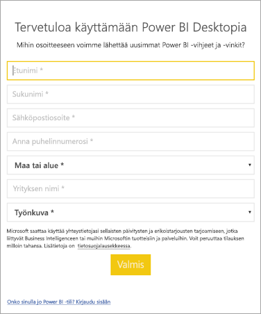

# <a name="administrators-manage-the-power-bi-desktop-sign-in-form"></a>Järjestelmänvalvojat: Power BI Desktopin kirjautumislomakkeen halinta
Kun Power BI Desktop käynnistetään ensimmäisen kerran, näyttöön tulee kirjautumislomake. Tiedot voidaan täyttää, tai voit jatkaa kirjautumalla Power BI:hin. Järjestelmänvalvojat hallitsevat tätä lomaketta rekisteriavaimen avulla. 



Järjestelmänvalvojat poistavat kirjautumislomakkeen käytöstä seuraavalla rekisteriavaimella. Tämä voidaan poistaa myös koko organisaatiosta globaaleilla käytännöillä.

```
Key: HKEY_CURRENT_USER\SOFTWARE\Policies\Microsoft\Microsoft Power BI Desktop
valueName: ShowLeadGenDialog
```
Voit myös kokeilla seuraavaa avainta, joka on toiminut joidenkin asiakkaiden kohdalla heidän määritystensä perusteella:

```
Key: HKEY_CURRENT_USER\SOFTWARE\Microsoft\Microsoft Power BI Desktop
valueName: ShowLeadGenDialog
```

Arvo 0 poistaa valintaikkunan käytöstä.


Onko sinulla kysyttävää? [Voit esittää kysymyksiä Power BI -yhteisössä](https://community.powerbi.com/)

