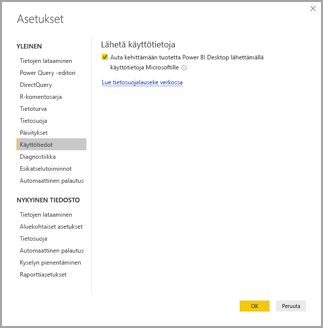
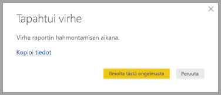

# Power BI Desktopin tietosuoja

Microsoft pyrkii parhaansa mukaan suojaamaan käyttäjien yksityisyyttä ja tarjoamaan suorituskykyisiä, tehokkaita ja helppokäyttöisiä tuotteita. Microsoft kerää tiettyjä Power BI Desktopin käyttötietoja ongelmien diagnosoimista ja tuotteen parantamista varten. Jos haluat lisätietoja Microsoftin tietosuojakäytännöistä, lue Microsoftin tietosuojatiedot. Tietosuojatietoja sovelletaan keräämiimme **Power BI Desktopin** käyttötietoihin.
 
**Power BI Desktopin** käyttäjiltä keräämämme tiedot voivat sisältää tietoja käyttöjärjestelmästä, Power BI Desktopista ja Internet Explorerin versioista. 
 
Jos haluat estää tietojen keräämisen, valitse **Tiedosto > Asetukset ja vaihtoehdot > Asetukset** ja poista **Käyttötiedot**-välilehden **Lähetä käyttötietoja** -valintaruudun valinta seuraavan kuvan mukaisesti.

## Lisätietojen lähettäminen

Jos ohjelmassa esiintyy virheitä, voit halutessasi lähettää Microsoftille virheraportteja ja lisätietoja, joiden avulla voimme korjata ongelman tulevissa versioissa. Keräämme myös tietoja käsiteltävän **Power BI Desktop** -tiedoston tilasta, kuten tiedoston kielestä, käytössä olevista esikatseluominaisuuksista ja tallennustilan tilasta. Nämä voivat olla näyttökuvia, virhesanomia ja mallin kaavoja. Kyseiset kohteet voivat sisältää virheen tapahtumisen aikana käyttämäsi tiedoston sisältöä, joten ne kannattaa tarkistaa ennen lähettämistä. Muistutamme sinua ennen tietojen lähettämistä, että voit valita, mitä tietoja Microsoftille lähetetään.  
 
Jos et halua lähettää näitä tietoja, voit valita **Sulje**, kun virhe tapahtuu, tai estää käyttötietojen lähettämisen edellä mainittujen ohjeiden mukaisesti. 

