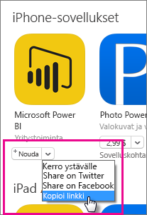
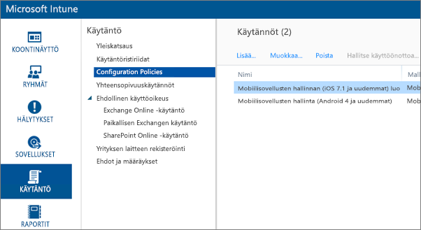
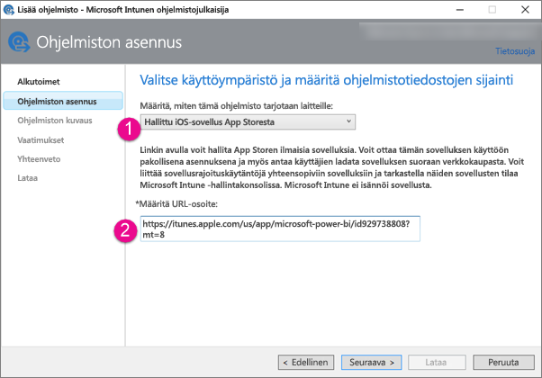
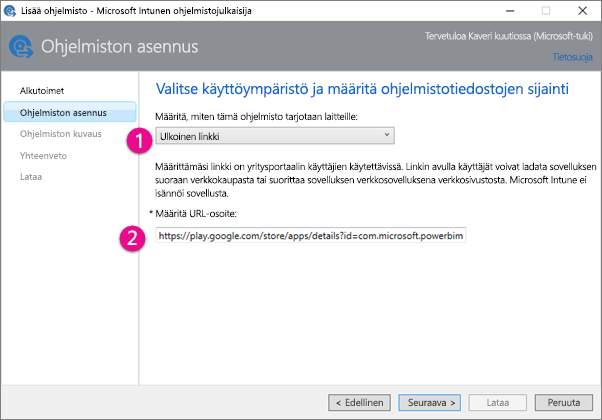
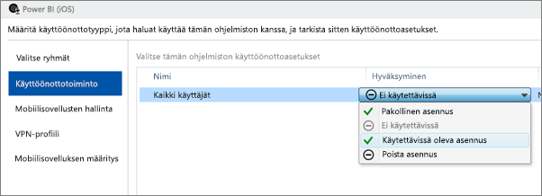
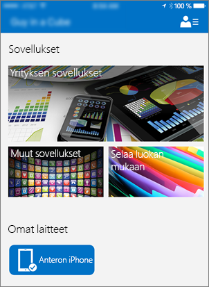
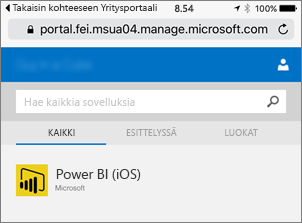
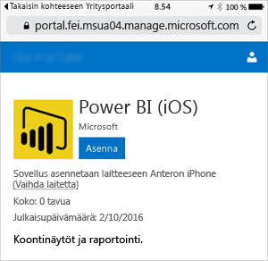
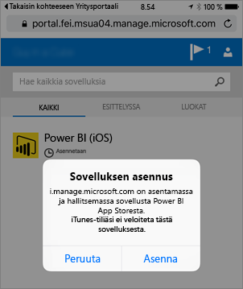
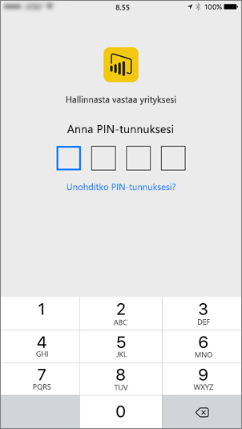

# Mobiilisovellusten määrittäminen Microsoft Intunella

Microsoft Intunen avulla organisaatiot voivat hallita laitteita ja sovelluksia. Power BI -mobiilisovellukset iOS:lle ja Androidille integroituvat Intuneen. Tämän integroinnin avulla voit hallita laitteisiisi asennettua sovellusta ja suojausta. Määrityskäytäntöjen avulla voit hallita tietoyksiköitä kuten pikakäytön kiinnittämisen edellyttämistä, sovelluksen tietojenkäyttöä ja sovellustietojen salaamista myös silloin, kun sovellus ei ole käytössä.

## Yleisen mobiililaitteiden hallinnan määritys

Tässä artikkelissa oletetaan, että Intune on määritetty oikein ja että laitteet on rekisteröity Intuneen. Tätä artikkelia ei ole tarkoitettu Microsoft Intunen täydelliseksi määritysoppaaksi. Lisätietoja Intunesta saat artikkelista [Mikä on Intune?](/intune/introduction-intune/).

Microsoft Intune voi olla käytössä Mobiililaitteiden hallinnan (MDM) kanssa Office 365:ssä. Jos käytät MDM:ää, laite näkyy rekisteröitynä MDM:ssä, mutta se on hallittavissa myös Intunessa.

> [!NOTE]
> Kun olet määrittänyt Intunen, tietojen päivittäminen taustalla on poistettu käytöstä iOS- tai Android-laitteen Power BI -mobiilisovelluksessa. Power BI päivittää tiedot verkossa olevasta Power BI -palvelusta, kun avaat sovelluksen.

## Vaihe 1: Sovelluksen URL-osoitteen hankkiminen

Tarvitsemme sovellusten URL-osoitteet, jotta voimme luoda sovelluksen Intunessa. Osoitteet saadaan iOS:ssä iTunesista. Androidissa ne saadaan Power BI -mobiilisivulta.

Tallenna URL-osoite, sillä tarvitset sitä, kun luomme sovelluksen.

### iOS:n URL-osoite

Jotta saamme sovelluksen URL-osoitteen iOS:ssä, se on noudettava iTunesista.

1. Avaa iTunes.

1. Hae *Power BI*.

1. **Microsoft Power BI** pitäisi näkyä luettelon kohdissa **iPhone-sovellukset** ja **iPad-sovellukset**. Voit käyttää jompaakumpaa niistä, sillä tuloksena on sama URL-osoite.

1. Valitse avattava **Nouda**-luettelo ja valitse **Kopioi linkki**.

    

Näkymän kuuluu näyttää seuraavankaltaiselta: *https://itunes.apple.com/us/app/microsoft-power-bi/id929738808?mt=8* .

### Androidin URL-osoitteen hankkiminen

Saat Google Play -kaupan URL-osoitteen [Power BI -mobiilisivulta](https://powerbi.microsoft.com/mobile/). Kun napsautat **Lataa Google Play -kaupasta** -kuvaketta, pääset sovelluksen sivulle. Voit kopioida URL-osoitteen selaimen osoiteriviltä. Näkymän kuuluu näyttää seuraavankaltaiselta: *https://play.google.com/store/apps/details?id=com.microsoft.powerbim* .

## Vaihe 2: Mobiilisovellusten hallintakäytännön luominen

Mobiilisovellusten hallintakäytännön avulla voit pakottaa kohteita, kuten käytön PIN-koodin. Voit luoda sellaisen Intune-portaalissa.

Voit luoda sovelluksen tai käytännön ensin. Lisäysjärjestyksellä ei ole merkitystä. Niiden kummankin on oltava olemassa käyttöönottovaihetta varten.

1. Valitse Intune-portaalissa **Käytäntö** > **Määrityskäytännöt**.

    

1. Valitse **Lisää...** .

1. Voit valita **Ohjelmisto**-kohdasta mobiilisovellusten hallinnan joko Androidille tai iOS:lle. Jos haluat päästä alkuun nopeasti, valitse **Luo käytäntö käyttäen suositeltuja asetuksia**. Voit vaihtoehtoisesti luoda mukautetun käytännön.

1. Muokkaa käytäntöä ja määritä sovelluksessa haluamasi rajoitukset.

## Vaihe 3: Sovelluksen luominen

Sovellus on viittaus tai paketti, joka on tallennettu Intuneen käyttöönottoa varten. Meidän on luotava sovellus ja viittaus sovelluksen URL-osoitteeseen, jonka saimme joko Google Play -kaupasta tai iTunesista.

Voit luoda sovelluksen tai käytännön ensin. Lisäysjärjestyksellä ei ole merkitystä. Niiden kummankin on oltava olemassa käyttöönottovaihetta varten.

1. Siirry Intune-portaaliin ja valitse **Sovellukset** vasemmanpuoleisesta valikosta.

1. Valitse **Lisää sovellus**. Tämä käynnistää **Lisää ohjelmisto** -sovelluksen.

### Luominen iOS:lle

1. Valitse avattavasta luettelosta **Hallittu iOS-sovellus App Storesta**.

1. Anna sovelluksen URL-osoite, jonka haimme [vaiheessa 1](#step-1-get-the-url-for-the-application), ja valitse **Seuraava**.

    

1. Anna **Julkaisija**, **Nimi** ja **Kuvaus**. Voit halutessasi lisätä **kuvakkeen**. **Luokka** on Yritysportaali-sovellus. Kun olet valmis, valitse **Seuraava**.

1. Voit päättää, missä muodossa sovellus julkaistaan (**Mikä tahansa** (oletus), **iPad** tai **iPhone**). Oletusarvon mukaan se näkyy **missä tahansa** ja toimii kummassakin laitetyypissä. Power BI -sovelluksella on sama URL-osoite iPhonessa ja iPadissa. Valitse **Seuraava**.

1. Valitse **Lataa**.

1. Jos et näe sovellusta luettelossa, päivitä sivu: siirry kohtaan **Yleistä** ja palaa sitten takaisin kohtaan **Sovellukset**.

    

### Luominen Androidille

1. Valitse avattavasta luettelosta **Ulkoinen linkki**.

1. Anna sovelluksen URL-osoite, jonka haimme [vaiheessa 1](#step-1-get-the-url-for-the-application), ja valitse **Seuraava**.

    

1. Anna **Julkaisija**, **Nimi** ja **Kuvaus**. Voit halutessasi lisätä **kuvakkeen**. **Luokka** on Yritysportaali-sovellus. Kun olet valmis, valitse **Seuraava**.

1. Valitse **Lataa**.

1. Jos et näe sovellusta luettelossa, päivitä sivu: siirry kohtaan **Yleistä** ja palaa sitten takaisin kohtaan **Sovellukset**.

    

## Vaihe 4: Sovelluksen käyttöönotto

Kun sovellus on lisätty, se on otettava käyttöön, jotta se on loppukäyttäjien käytettävissä. Tässä vaiheessa velvoitat käyttäjät noudattamaan sovelluksen kanssa luomaasi käytäntöä.

### Käyttöönotto iOS:lle

1. Valitse luomasi sovellus sovellusten näytössä. Valitse sitten **Hallitse käyttöönottoa...** -linkki.

    

1. Voit valita **Valitse ryhmät** -ruudussa, mille ryhmille tämä sovellus otetaan käyttöön. Valitse **Seuraava**.

1. Voit valita **Käyttöönottotoiminto**-ruudussa, miten tämä sovellus otetaan käyttöön. Jos valitset **Käytettävissä oleva asennus** tai **Pakollinen asennus**, sovellus on yritysportaalissa käyttäjien asennettavissa tarvittaessa. Kun olet tehnyt valintasi, valitse **Seuraava**.

    

1. Voit valita **Mobiilisovellusten hallinta** -ruudussa mobiilisovellusten hallintakäytännön, joka luotiin [vaiheessa 2](#step-2-create-a-mobile-application-management-policy). Oletuksena on luomasi käytäntö, mikäli se on ainoa käytettävissä oleva iOS-käytäntö. Valitse **Seuraava**.

    

1. Voit valita **VPN-profiili**-ruudussa käytännön, jos sinulla on sellainen organisaatiollesi. Oletusarvo on **Ei mitään**. Valitse **Seuraava**.

1. Valitse **Mobiilisovelluksen määritys** -ruudussa **Sovellusten määrityskäytäntö**, jos olet luonut sellaisen. Oletusarvo on **Ei mitään**. Tämä ei ole pakollista. Valitse **Valmis**.

Kun olet ottanut sovelluksen käyttöön, sen käyttöönoton kohdalla pitäisi näkyä **Kyllä** sovellusten sivulla.

### Käyttöönotto Androidille

1. Valitse luomasi sovellus sovellusten näytössä. Valitse sitten **Hallitse käyttöönottoa...** -linkki.

    
1. Voit valita **Valitse ryhmät** -ruudussa, mille ryhmille tämä sovellus otetaan käyttöön. Valitse **Seuraava**.

1. Voit valita **Käyttöönottotoiminto**-ruudussa, miten tämä sovellus otetaan käyttöön. Jos valitset **Käytettävissä oleva asennus** tai **Pakollinen asennus**, sovellus on yritysportaalissa käyttäjien asennettavissa tarvittaessa. Kun olet tehnyt valintasi, valitse **Seuraava**.

    

1. Voit valita **Mobiilisovellusten hallinta** -ruudussa mobiilisovellusten hallintakäytännön, joka luotiin [vaiheessa 2](#step-2-create-a-mobile-application-management-policy). Oletuksena on luomasi käytäntö, mikäli se on ainoa käytettävissä oleva Android-käytäntö. Valitse **Valmis**.

    

Kun olet ottanut sovelluksen käyttöön, sen käyttöönoton kohdalla pitäisi näkyä **Kyllä** sovellusten sivulla.

## Vaihe 5: Sovelluksen asentaminen laitteeseen

Sovellus asennetaan *Yritysportaali*-sovelluksen kautta. Jos et ole vielä asentanut Yritysportaalia, saat sen sovelluskaupasta iOS- tai Android-ympäristössä. Kirjaudu yritysportaaliin organisaation kirjautumistunnuksella.

1. Avaa Yritysportaali-sovellus.

1. Jos et näe Power BI -sovellusta esiteltyjen sovellusten luettelossa, valitse **Yrityksen sovellukset**.

    

1. Valitse Power BI -sovellus, jonka olet ottanut käyttöön.

    

1. Valitse **Asenna**.

    

1. Jos käytössäsi on iOS, sovellus työnnetään sinulle. Valitse **Asenna** työntövalintaikkunassa.

    

1. Kun sovellus on asennettu, näet, että se on **yrityksesi hallitsema**. Jos olet ottanut PIN-koodin käyttöön käytännössä, näet sen seuraavaksi.

    

## Seuraavat vaiheet

[Mobiilisovellusten hallintakäytäntöjen määrittäminen ja ottaminen käyttöön Microsoft Intune -konsolissa](/intune/app-protection-policies/)  

[Power BI -sovellukset mobiililaitteille](../consumer/mobile/mobile-apps-for-mobile-devices.md)  

Onko sinulla kysyttävää? [Voit esittää kysymyksiä Power BI -yhteisössä](https://community.powerbi.com/)  
