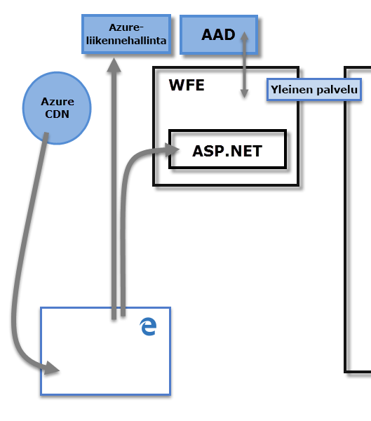
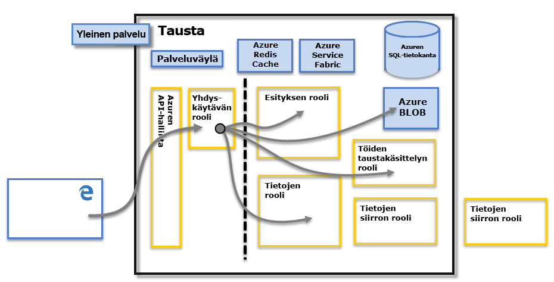

# Power BI:n suojaus

Saat yksityiskohtaisen kuvauksen Power BI:n suojauksesta [lukemalla Power BI:n suojauksen teknisen raportin](../guidance/whitepaper-powerbi-security.md).

Power BI -palvelu perustuu **Azureen**, joka on Microsoftin pilvitietojenkäsittelyinfrastruktuuri ja -alusta. Power BI -palveluarkkitehtuuri perustuu kahteen klusteriin – Web Front End (**WFE**) -klusteriin ja **Back End** -klusteriin. WFE-klusteri vastaa Power BI -palvelun ensiyhteydenotosta ja todentamisesta. Todennuksen jälkeen Back End -klusteri käsittelee kaiken käyttäjien vuorovaikutuksen. Power BI käyttää Azure Active Directorya (AAD) käyttäjätietojen tallentamiseen ja hallitsemiseen. Se hallitsee tietoja ja metatietoja Azure BLOB- ja Azure SQL -tietokantojen avulla (vastaavassa järjestyksessä).

## Power BI -arkkitehtuuri

Kukin Power BI -käyttöönotto koostuu kahdesta klusterista – Web Front End (**WFE**) -klusterista ja **Back End** -klusterista.

**WFE**-klusteri vastaa Power BI:n ensiyhteydenotosta ja todentamisesta. Se todentaa asiakkaat AAD:n avulla ja tarjoaa tunnukset asiakkaiden myöhemmille Power BI -palvelun yhteyksille. Power BI käyttää myös **Azure Traffic Manageria** (ATM) ohjaamaan käyttäjät lähimpään palvelinkeskukseen, mikä perustuu yhdistämistä yrittävän asiakkaan DNS-tietueeseen. Näin käyttäjä voidaan todentaa ja staattinen sisältö ja tiedostot ladata. Power BI käyttää **Azure Content Delivery Networkia** (CDN) tarpeellisen staattisen sisällön ja tiedostojen jakamiseen käyttäjille aluekohtaisten asetusten perusteella.

Todennetut asiakkaat vuorovaikuttavat Power BI -palvelun kanssa **Back End** -klusterin kautta. **Back End** -klusteri hallitsee visualisointeja, käyttäjien koontinäyttöjä, tietojoukkoja, raportteja, tiedon tallennusta, tietoyhteyksiä, tietojen päivittämistä ja muita Power BI -palvelun vuorovaikutusominaisuuksia. **Yhdyskäytävän rooli** toimii yhdyskäytävänä käyttäjäpyyntöjen ja Power BI -palvelun välillä. Käyttäjät eivät ole suorassa vuorovaikutuksessa muun roolin kuin **yhdyskäytävän roolin** kanssa. **Azure API Management** käsittelee **yhdyskäytävän roolin** lopuksi.

> [!IMPORTANT]
> On ehdottoman tärkeää huomata, että vain **Azure API Management** (APIM) ja **yhdyskäytävän** (GW) roolit ovat helppokäyttöisiä julkisen Internetin kautta. Ne tarjoavat todennus-, valtuutus-, SSoS-suojaus-, rajoittamis-, kuormituksen tasaus-, reititys- ja muut ominaisuudet.

## Tallennustilan tietoturva

Power BI käyttää kahta ensisijaista säilöä tietojen tallentamiseen ja hallintaan: käyttäjien lataamat tiedot lähetetään tavallisesti **Azure BLOB** -tallennustilaan, ja kaikki metatiedot sekä järjestelmän kohteet tallennetaan  **Azure SQL -tietokantaan**.

Pisteviiva **Back End** -klusterin kuvassa yllä osoittaa käyttäjien käytettävissä olevan kahden osion rajan (pisteviivan vasemmalla puolella) ja roolit, joita vain järjestelmä voi käyttää. Kun todennettu käyttäjä muodostaa yhteyden Power BI -palveluun, **yhdyskäytävän rooli** hyväksyy yhteyden ja asiakkaan pyynnön ja hallitsee sitä (siirtyy myöhemmin **Azure API Managementille**). Yhdyskäytävän rooli vuorovaikuttaa muun Power BI -palvelun kanssa käyttäjän puolesta. Kun asiakas esimerkiksi yrittää tarkastella koontinäyttöä, **yhdyskäytävän rooli** hyväksyy pyynnön ja lähettää pyynnön erikseen **esityksen roolille**, joka noutaa selaimen koontinäytön hahmontamiseen tarvitsemat tiedot.

## Käyttäjän todennus

Power BI käyttää Azure Active Directorya ([AAD](https://azure.microsoft.com/services/active-directory/)) Power BI -palveluun kirjautuvien käyttäjien todentamiseen, joka puolestaan käyttää Power BI -kirjautumistunnuksia aina, kun käyttäjä yrittää käyttää resursseja, jotka edellyttävät todennusta. Käyttäjät kirjautuvat Power BI -palveluun käyttämällä Power BI -tilinsä luomiseen käyttämäänsä sähköpostiosoitetta; Power BI käyttää kyseistä kirjautumissähköpostia *käytössä olevana käyttäjänimenä*, joka välitetään resursseille aina, kun käyttäjä yrittää muodostaa yhteyden tietoihin. *Käytössä oleva käyttäjänimi* yhdistetään sitten *täydelliseen käyttäjätunnukseen* ([UPN](https://msdn.microsoft.com/library/windows/desktop/aa380525\(v=vs.85\).aspx) ja ratkaistaan siihen liittyvään Windows-toimialuetilin, jota vastaan todennusta käytetään.

Organisaatioissa, joissa käytetään työsähköpostiosoitteita Power BI:hin kirjautumiseen (esim. <em>david@contoso.com</em>), *käytössä oleva käyttäjänimi* on helppo yhdistää UPN:ään. Organisaatioissa, joissa ei käytetä työsähköpostiosoitteita Power BI:hin kirjautumiseen (esim. <em>david@contoso.onmicrosoft.com</em>), AAD:n ja paikallisten tunnistetietojen yhdistäminen edellyttää, että [hakemistosynkronointi](https://technet.microsoft.com/library/jj573653.aspx) toimii oikein.

Power BI -alustan suojaus sisältää myös usean palveltavan kohteen ympäristön suojauksen, verkon suojauksen ja mahdollisuuden lisätä AAD-pohjaisia suojausominaisuuksia.

## Tietojen ja palvelun suojaus

Lisätietoja on [Microsoft Trust Centerissa](https://www.microsoft.com/trustcenter).

Kuten edellä kuvattiin, paikalliset Active Directory -palvelimet käyttävät käyttäjän Power BI -kirjautumista kirjautumistunnuksille suunniteltuun UPN:ään yhdistämiseen. **Tärkeää:** Huomaa, että käyttäjät ovat vastuussa jakamistaan tiedoista: jos käyttäjä muodostaa yhteyden tietoihin kirjautumistunnuksillaan ja jakaa sitten tietoihin perustuvan raportin (tai koontinäytön tai tietojoukon), käyttäjiä, joille koontinäyttö on jaettu, ei ole todennettu alkuperäiseen tietolähteeseen, ja heille myönnetään raportin käyttöoikeudet.

Poikkeuksen muodostavat yhteydet **SQL Server Analysis Services** -palveluun **paikallisen yhdyskäytävän kautta**; koontinäytöt tallennetaan Power BI:n välimuistiin, mutta pohjalla olevien raporttien tai tietojoukkojen käyttö käynnistää todennuksen käyttäjälle, joka yrittää käyttää raporttia tai tietojoukkoa. Käyttöoikeus myönnetään vain, jos käyttäjällä on riittävät valtuudet. Lisätietoja on ohjeaiheessa [Paikallinen tietoyhdyskäytävä perinpohjaisesti](../connect-data/service-gateway-onprem-indepth.md).

## TLS-salauksen käytön pakottaminen

Verkonvalvojat ja IT-järjestelmänvalvojat voivat pakottaa nykyisen TLS-salauksen (Transport Layer Security) käytön verkkonsa suojatussa tietoliikenteessä. Windows tukee TLS-salausta Microsoft Schannel -palvelussa [TLS Schannel SSP -artikkelissa](https://docs.microsoft.com/windows/desktop/SecAuthN/protocols-in-tls-ssl--schannel-ssp-) kuvatulla tavalla.

Järjestelmänvalvoja voi pakottaa käytön rekisteriavainten avulla. Lisätietoja pakottamisesta on [SSL-protokollien hallinta AD FS:ssä -artikkelissa](https://docs.microsoft.com/windows-server/identity/ad-fs/operations/manage-ssl-protocols-in-ad-fs). 

**Power BI Desktop** noudattaa artikkeleissa kuvattuja rekisteriavainasetuksia ja luo vain kyseisiin rekisteriasetuksiin perustuvia, hyväksyttyä TLS-salausta käyttäviä yhteyksiä.

Katso lisätietoja rekisteriavainten määrittämisestä [TLS-rekisteriasetukset](https://docs.microsoft.com/windows-server/security/tls/tls-registry-settings)-artikkelista.

