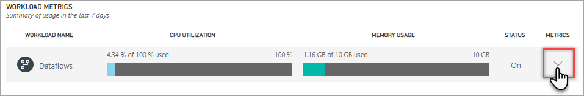

# Kapasiteettien valvonta hallintaportaalissa

**Kunto**-välilehti **Kapasiteettiasetusten** alueella hallintaportaalissa antaa yhteenvedon omasta kapasiteetistasi ja käytössä olevista kuormituksista.  

Jos tarvitset kattavampia mittareita, käytä [Power BI Premium Capacity Metrics](service-admin-premium-monitor-capacity.md)-sovellusta. Sovellus tarjoaa porautumisen ja suodatuksen sekä yksityiskohtaisimmat mittarit kapasiteetin suorituskykyyn vaikuttavista kaikista seikoista. Lue lisää kohdasta[Premium-kapasiteettien valvonta sovelluksen avulla](service-admin-premium-monitor-capacity.md).

> [!IMPORTANT]
> Jos Power BI Premium -kapasiteetissasi on resurssien runsaan käytön aiheuttamia suorituskyky- tai luotettavuusongelmia, voit saada sähköpostiviesteinä ilmoituksia, joiden avulla voit tunnistaa ja ratkaista ongelmat. Tämä voi olla yksinkertainen tapa ratkaista kapasiteettien ylikuormitus. Lisätietoja on artikkelissa [Kapasiteetin ja luotettavuuden ilmoitukset](service-interruption-notifications.md#capacity-and-reliability-notifications).

## Järjestelmän mittarit

**Kunto**-välilehdellä korkeimmalla tasolla suorittimen ja muistin käyttö tarjoavat nopean näkymän kapasiteetin tärkeimpiin mittareihin. Nämä mittarit ovat kumulatiivisia kaikki kapasiteetin käytössä olevissa kuormitukset huomioiden.

| **Mittausarvo** | **Kuvaus** |
| --- | --- |
| SUORITTIMEN KÄYTTÖ | Suorittimen keskimääräinen käyttöaste prosentteina käytettävissä olevista suorittimista. |
| MUISTIN KÄYTTÖ | Keskimääräinen muistin käyttö gigatavuina (Gt).|

## Kuormituksen mittarit

Jokaiselle kuormitukselle, joka on käytössä kapasiteettia varten. Suorittimen ja muistin käyttö tulevat näkyviin.

| **Mittausarvo** | **Kuvaus** |
| --- | --- |
| SUORITTIMEN KÄYTTÖ | Suorittimen keskimääräinen käyttöaste prosentteina käytettävissä olevista suorittimista. |
| MUISTIN KÄYTTÖ | Keskimääräinen muistin käyttö gigatavuina (Gt).|

### Kuormituksen mittareiden yksityiskohtaiset tiedot

Jokainen kuormitus sisältää lisämittareita. Näytettävien mittarien tyyppi riippuu kuormituksesta. Jos haluat tarkastella kuormituksen yksityiskohtaisia mittareita, napsauta Laajenna-nuolta (alas).

#### Tietovuot

##### Tietovuotoiminnot

| **Mittausarvo** | **Kuvaus** |
| --- | --- |
| Kokonaismäärä | Kunkin tietovuon päivitysten kokonaismäärä. |
| Onnistumisten määrä | Kunkin tietovuon onnistuneiden päivitysten kokonaismäärä.|
| Keskimääräinen kesto (min.) | tietovuon päivityksen keskimääräinen kesto minuutteina |
| Enimmäiskesto (min.) | Tietovuon pitkäkestoisimman päivityksen kesto minuutteina. |
| Keskimääräinen odotusaika (min.) | Keskimääräinen viive ajoitetun ajankohdan ja tietovuon päivityksen alkamisen välillä minuutteina. |
| Enimmäisodotusaika (min.) | Tietovuon enimmäisodotusaika minuutteina.  |

#### Tietojoukot

##### Päivitä

| **Mittausarvo** | **Kuvaus** |
| --- | --- |
| Kokonaismäärä | Kunkin tietojoukon päivitysten kokonaismäärä. |
| Onnistumisten määrä | Kunkin tietojoukon onnistuneiden päivitysten kokonaismäärä. |
| Virheiden määrä | Kunkin tietojoukon epäonnistuneiden päivitysten kokonaismäärä. |
| Onnistumisprosentti  | Onnistuneiden päivitysten määrä jaettuna päivitysten kokonaismäärällä luotettavuuden mittaamiseksi. |
| Keskimääräinen kesto (min.) | Tietojoukon päivityksen keskimääräinen kesto minuutteina.  |
| Enimmäiskesto (min.) | Tietojoukon pitkäkestoisimman päivityksen kesto minuutteina. |
| Keskimääräinen odotusaika (min.) | Keskimääräinen viive ajoitetun ajankohdan ja tietojoukon päivityksen alkamisen välillä minuutteina. |
| Enimmäisodotusaika (min.) | Tietojoukon enimmäisodotusaika minuutteina. |

##### Kysely

| **Mittausarvo** | **Kuvaus** |
| --- | --- |
| Kokonaismäärä | Tietojoukolle suoritettavien kyselyjen kokonaismäärä. |
| Keskimääräinen kesto (ms) |tietojoukon kyselyn keskimääräinen kesto millisekunteina|
| Enimmäiskesto (ms) |Tietojoukon pitkäkestoisimman kyselyn kesto millisekunteina. |
| Keskimääräinen odotusaika (ms) |Tietojoukon kyselyn keskimääräinen odotusaika millisekunteina. |
| Enimmäisodotusaika (ms) |Tietojoukon pisimpään odottaneen kyselyn kesto millisekunteina. |

##### Häätäminen

| **Mittausarvo** | **Kuvaus** |
| --- | --- |
| Mallin laskenta | Häädettävien tietojoukkojen kokonaismäärä tälle kapasiteetille. Kun kapasiteetti kohtaa muistipainetta, solmu häätää yhden tai useamman tietojoukon muistista. Passiiviset tietojoukot (joihin ei kyseisellä hetkellä kohdistu kysely- tai uudelleenlataustoimintoja) häädetään ensin. Seuraavaksi häätöjärjestyksessä sovelletaan ”viimeiseksi käytetyt ensin” -mittaria. |

#### Sivutetut raportit

##### Raportin suorittaminen

| **Mittausarvo** | **Kuvaus** |
| --- | --- |
| Suorituslaskenta  | Kuinka monta kertaa käyttäjät ovat katselleet ja suorittaneet raportin.|

##### Raportin käyttö

| **Mittausarvo** | **Kuvaus** |
| --- | --- |
| Onnistumisten määrä | Kuinka monta kertaa käyttäjät ovat katselleet raporttia. |
| Virheiden määrä |Kuinka monta kertaa käyttäjät ovat katselleet raporttia.|
| Rivimäärä |Raportin tietorivien määrä. |
| Tietojen noutamisen kesto (ms) |raportin tietojen noutamiseen keskimääräisesti kuluva aika millisekunteina. Pitkä kesto voi olla osoitus kyselyjen hitaasta suorittamisesta tai muista tietolähteeseen liittyvistä ongelmista.  |
| Prosessin kesto (ms) |Raportin tietojen käsittelemiseen keskimääräisesti kuluva aika millisekunteina. |
| Hahmonnuksen kesto (ms) |Raportin hahmontamiseen selaimessa keskimääräisesti kuluva aika millisekunteina. |

> [!NOTE]
> **AI**-kuormituksen yksityiskohtaiset mittarit eivät ole vielä käytettävissä.

## Seuraavat vaiheet

Nyt kun tiedät, miten voit valvoa Power BI Premium -kapasiteetteja, lue lisätietoja kapasiteettien optimoinnista.

> [!div class="nextstepaction"]
> [Power BI Premium -kapasiteettien optimointi](service-premium-capacity-optimize.md)
