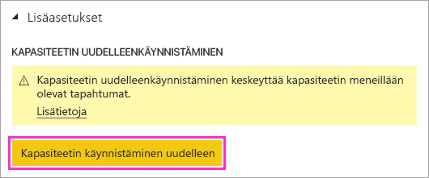

# Power BI Premium -kapasiteetin uudelleenkäynnistäminen

Power BI -järjestelmänvalvojana saatat joutua käynnistämään Premium-kapasiteetin uudelleen. Tässä artikkelissa kerrotaan, miten voit käynnistää kapasiteetin uudelleen ja käsitellä useita uudelleenkäynnistystä ja suorituskykyä koskevia kysymyksiä.

## Miksi Power BI tarjoaa tämän asetuksen?

Power BI tarjoaa käyttäjille mahdollisuuden suorittaa monimutkaisia analyysejä valtavista tietomääristä. Valitettavasti käyttäjät voivat aiheuttaa suorituskykyongelmia ylikuormittamalla Power BI -palvelun töillä, kirjoittamalla liian monimutkaisia kyselyjä, luomalla kehäviittauksia jne.

Power BI:n jaettu kapasiteetti suojaa osaksi tällaisilta tapauksilta asettamalla rajoituksia, jotka koskevat tiedostokokoja, päivitysaikatauluja ja palvelun muita näkökohtia. Sitä vastoin Power BI Premium -kapasiteetissa useimpia näistä rajoituksista on nostettu. Siten yksi raportti, jossa on virheellinen DAX-lauseke tai hyvin monimutkainen malli, voi aiheuttaa merkittäviä suorituskykyongelmia. Kun raporttia käsitellään, se voi kuluttaa kapasiteetissa saatavilla olevat kaikki resurssit. 

Power BI parantaa jatkuvasti sitä, miten se suojaa Premium-kapasiteetin käyttäjiä tällaisilta ongelmilta. Järjestelmänvalvojille tarjotaan myös työkaluja, joiden avulla he voivat analysoida, milloin ja miksi kapasiteetit ovat ylikuormitettuja. Katso lisätietoja Microsoftin [lyhyestä koulutusistunnosta](https://www.youtube.com/watch?v=UgsjMbhi_Bk&feature=youtu.be) ja [pidemmästä koulutusistunnosta](https://powerbi.tips/2018/07/). Sinun on myös samaan aikaan pystyttävä lieventämään merkittäviä ongelmia niiden ilmaantuessa. Nopein keino lieventää näitä ongelmia on käynnistää kapasiteetti uudelleen.

## Onko uudelleenkäynnistysprosessi turvallinen? Menetänkö joitakin tietoja?

Kaikki kapasiteetin tallennetut tiedot, määritykset, raportit ja koontinäytöt säilyvät täysin samoina uudelleenkäynnistyksen jälkeen. Kun käynnistät kapasiteetin uudelleen, päivitysmoduuli useimmiten pysäyttää käynnissä olevat ajoitetut ja tilapäiset päivitykset väliaikaisesti. Tämän jälkeen ne käynnistetään uudelleen Power BI:n oman päivitysten uudelleenyrityslogiikan mukaisesti. Palvelu yrittää uudelleen kaikkia vaikutuksen kohteina olleita päivityksiä, kun kapasiteetti on taas käytettävissä. Päivitysten tila käyttöliittymässä ei ehkä muutu uudelleenkäynnistysprosessin aikana. 

Kapasiteettia käsittelevät käyttäjät menettävät tallentamattomat työt uudelleenkäynnistysprosessin aikana. Käyttäjien on päivitettävä selaimensa, kun uudelleenkäynnistys on suoritettu loppuun.

## Miten kapasiteetti voidaan käynnistää uudelleen?

Voit käynnistää kapasiteetin uudelleen seuraavien vaiheiden mukaisesti.

1. Siirry Power BI -hallintaportaalin **Kapasiteetin asetukset** -välilehdessä haluamaasi kapasiteettiin. 

1. Lisää **CapacityRestart** *-toimintomerkintä* kapasiteetin URL-osoitteeseen: `https://app.powerbi.com/admin-portal/capacities/<YourCapacityId>?capacityRestartButton=true`.

1. Valitse **Lisäasetukset** > **KAPASITEETIN UUDELLEENKÄYNNISTYS**, valitse **Käynnistä kapasiteetti uudelleen**.

    

1. Valitse **Kapasiteetin uudelleenkäynnistys** -valintaikkunasta **Kyllä, käynnistä kapasiteetti uudelleen**.

    

## Miten voin estää ongelmia tapahtumasta tulevaisuudessa?

Paras keino ehkäistä ongelmia on kouluttaa käyttäjiä hyödyntämään tehokasta tietomallinnusta. Katso lisätietoja Microsoftin [koulutusistunnosta](https://powerbi.tips/2018/07/).

Suosittelemme myös [valvomaan kapasiteetteja](service-admin-premium-monitor-capacity.md) säännöllisesti, jotta voit löytää trendejä, jotka ilmoittavat pohjana olevista ongelmista. Suunnittelemme valvontasovelluksia ja muita työkaluja koskevia säännöllisiä julkaisuja, jotta voit valvoa ja hallita kapasiteetteja tehokkaammin.

## Seuraavat vaiheet

[Mikä on Power BI Premium?](service-premium-what-is.md)

Onko sinulla kysyttävää? [Voit esittää kysymyksiä Power BI -yhteisössä](https://community.powerbi.com/)
