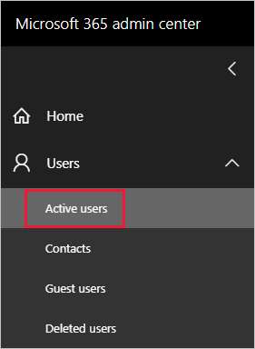

# <a name="understanding-power-bi-service-administrator-roles"></a>Tietoja Power BI -palvelun järjestelmänvalvojan rooleista

Jos haluat hallita Power BI -vuokraajaa, sinulla on oltava jokin seuraavista rooleista: Power BI -järjestelmänvalvoja, Power Platform -järjestelmänvalvoja tai Microsoft 365:n yleinen järjestelmänvalvoja. Microsoft 365:n käyttäjähallinnan järjestelmänvalvojat määrittävät käyttäjiä Power BI- tai Power Platform -järjestelmänvalvojarooleihin Microsoft 365 -hallintakeskuksessa tai PowerShell-komentosarjan avulla. Katso lisätietoja kohdasta [Roolien määrittäminen käyttäjätileille Office 365 PowerShellin avulla](/office365/enterprise/powershell/assign-roles-to-user-accounts-with-office-365-powershell).

Power BI -järjestelmänvalvojan tai Power Platform -järjestelmänvalvojan rooleissa olevilla käyttäjillä on käyttöoikeuksien myöntämistä lukuun ottamatta täydet Power BI -vuokraajan ja sen hallintaominaisuuksien oikeudet. Kun käyttäjä on määritetty, hän voi käyttää [Power BI -hallintaportaalia](service-admin-portal.md). Portaalissa käyttäjä voi käyttää koko vuokraajan laatuisia käyttömittareita ja hallita Power BI -ominaisuuksien käyttöä koko vuokraajan laajuudelta. Nämä järjestelmänvalvojan roolit sopivat erinomaisesti käyttäjille, joilla on oltava Power BI -hallintaportaalin käyttöoikeus, antamatta heille muita Microsoft 365:n järjestelmänvalvojan käyttöoikeuksia.

> [!NOTE]
> Power BI:n ohjeissa Power BI -järjestelmänvalvojalla tarkoitetaan käyttäjiä, joilla voi olla kumpi tahansa Power BI -järjestelmänvalvojan tai Power Platform -järjestelmänvalvojan rooli. Ohjeissa tehdään selväksi, milloin tehtävään vaaditaan Microsoft 365:n yleisen järjestelmänvalvojan rooli.

## <a name="limitations-and-considerations"></a>Rajoitukset ja huomioitavat asiat

Power BI -palvelun järjestelmänvalvojan ja Power Platform -järjestelmänvalvojan roolit eivät anna seuraavia ominaisuuksia:

* Mahdollisuus muokata käyttäjiä ja käyttöoikeuksia Microsoft 365 -hallintakeskuksessa.

* Valvontalokien käyttö. Lisätietoja on kohdassa [Käyttäjien toiminnan seuraaminen Power BI:ssä](service-admin-auditing.md).

Näihin toimintoihin tarvitaan Microsoft 365:n yleisen järjestelmänvalvojan rooli.

## <a name="assign-users-to-an-admin-role-in-the-microsoft-365-admin-center"></a>Käyttäjien lisääminen järjestelmänvalvojan rooliin Microsoft 365 -hallintakeskuksessa

Voit määrittää käyttäjiä järjestelmänvalvojan rooliin Microsoft 365 -hallintakeskuksessa seuraavasti.

1. Valitse [Microsoft 365 -hallintakeskuksessa](https://portal.office.com/adminportal/home#/homepage)**Käyttäjät** > **Aktiiviset käyttäjät**.

    

1. Valitse käyttäjä, jolle haluat määrittää roolin.

1. Valitse **Roolit**-kohdasta **Roolien hallinta**.

    

1. Laajenna **Näytä kaikki luokan mukaan** ja valitse sitten **Power BI -järjestelmänvalvoja** tai **Power Platform -järjestelmänvalvoja**.

    

1. Valitse **Tallenna muutokset**.

## <a name="assign-users-to-the-admin-role-with-powershell"></a>Käyttäjien määrittäminen järjestelmänvalvojan rooliin PowerShellin avulla

Voit määrittää käyttäjiä rooleihin myös PowerShellin avulla. Käyttäjiä hallitaan Azure Active Directoryn (Azure AD) avulla. Jos sinulla ei vielä ole Azure AD:n PowerShell-moduulia, [lataa ja asenna uusin versio](https://www.powershellgallery.com/packages/AzureAD/).

1. Muodosta ensin yhteys Azure AD:hen:
   ```
   PS C:\Windows\system32> Connect-AzureAD
   ```

1. Hae sitten **ObjectId**-tunnus **Power BI -palvelun järjestelmänvalvojan** roolille. Saat **ObjectId**-tunnuksen suorittamalla komennon [Get-AzureADDirectoryRole](/powershell/module/azuread/get-azureaddirectoryrole).

    ```
    PS C:\Windows\system32> Get-AzureADDirectoryRole

    ObjectId                             DisplayName                        Description
    --------                             -----------                        -----------
    00f79122-c45d-436d-8d4a-2c0c6ca246bf Power BI Service Administrator     Full access in the Power BI Service.
    250d1222-4bc0-4b4b-8466-5d5765d14af9 Helpdesk Administrator             Helpdesk Administrator has access to perform..
    3ddec257-efdc-423d-9d24-b7cf29e0c86b Directory Synchronization Accounts Directory Synchronization Accounts
    50daa576-896c-4bf3-a84e-1d9d1875c7a7 Company Administrator              Company Administrator role has full access t..
    6a452384-6eb9-4793-8782-f4e7313b4dfd Device Administrators              Device Administrators
    9900b7db-35d9-4e56-a8e3-c5026cac3a11 AdHoc License Administrator        Allows access manage AdHoc license.
    a3631cce-16ce-47a3-bbe1-79b9774a0570 Directory Readers                  Allows access to various read only tasks in ..
    f727e2f3-0829-41a7-8c5c-5af83c37f57b Email Verified User Creator        Allows creation of new email verified users.
    ```

    Tässä tapauksessa roolin **ObjectId** on 00f79122-c45d-436d-8d4a-2c0c6ca246bf.

1. Hae seuraavaksi käyttäjän **ObjectId**. Saat sen selville suorittamalla komennon [Get-AzureADUser](/powershell/module/azuread/get-azureaduser).

    ```
    PS C:\Windows\system32> Get-AzureADUser -ObjectId 'tim@contoso.com'

    ObjectId                             DisplayName UserPrincipalName      UserType
    --------                             ----------- -----------------      --------
    6a2bfca2-98ba-413a-be61-6e4bbb8b8a4c Tim         tim@contoso.com        Member
    ```

1. Lisää jäsen rooliin suorittamalla komento [Add-AzureADDirectoryRoleMember](/powershell/module/azuread/add-azureaddirectoryrolemember).

    | Parametri | Kuvaus |
    | --- | --- |
    | ObjectId |Roolin ObjectId-tunnus. |
    | RefObjectId |Jäsenten ObjectId-tunnus. |

    ```powershell
    Add-AzureADDirectoryRoleMember -ObjectId 00f79122-c45d-436d-8d4a-2c0c6ca246bf -RefObjectId 6a2bfca2-98ba-413a-be61-6e4bbb8b8a4c
    ```

## <a name="next-steps"></a>Seuraavat vaiheet

[Power BI:n hallinta organisaatiossa](service-admin-administering-power-bi-in-your-organization.md)  
[Power BI -hallintaportaali](service-admin-portal.md)  

Onko sinulla kysyttävää? [Voit esittää kysymyksiä Power BI -yhteisössä](https://community.powerbi.com/)