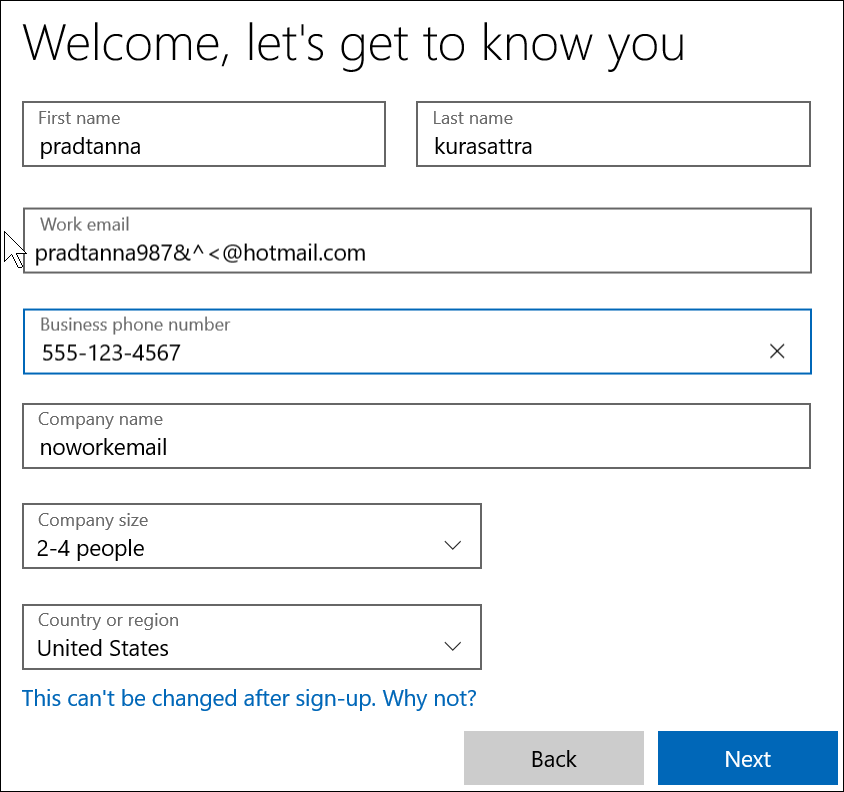

# Power BI:n rekisteröinti uudessa Microsoft 365 -kokeilussa

Tässä artikkelissa kuvataan vaihtoehtoinen tapa rekisteröityä Power BI:hin, jos sinulla ei vielä ole työpaikan tai oppilaitoksen sähköpostitiliä. 

Jos sinulla on ongelmia rekisteröitymisessä Power BI:n käyttäjäksi sähköpostiosoitteellasi, varmista ensin, että tätä [sähköpostiosoitetta voi käyttää Power BI:n kanssa](../fundamentals/service-self-service-signup-for-power-bi.md#supported-email-addresses). Jos tämä ei onnistu, rekisteröidy Microsoft 365 -kokeiluversioon ja luo työpaikan tili. Rekisteröidy sitten Power BI -palveluun kyseisen uuden työtilin avulla. Voit käyttää Power BI:tä jopa Microsoft 365 -kokeilujakson päättymisen jälkeen.

> [!NOTE]
> Office 365 on hiljattain nimetty uudelleen Microsoft 365:ksi. Siihen saatetaan edelleen viitata nimellä Office 365, kunnes kaikki artikkelimme on päivitetty.

1. Rekisteröidy Microsoft 365 -kokeiluversioon [Microsoft 365 -sivustossa](https://www.microsoft.com/en-us/microsoft-365/business/compare-more-office-365-for-business-plans).

    

    

    

    

    

    

1. Luo uusi työpaikan kirjautumisnimesi, joka on muodossa you@yourcompany.onmicrosoft.com. Tämä on kirjautumisnimi, jota käytät Power BI:n kanssa.

    

        

1. Saatat joutua odottamaan uuden vuokraajasi luomista. 

Siinä kaikki!  Sinulla on nyt sähköpostiosoite, jonka avulla voit rekisteröityä Power BI:hin. Siirry artikkeliin [Rekisteröityminen Power BI:hin yksityishenkilönä](../fundamentals/service-self-service-signup-for-power-bi.md)

## Huomioitavaa
Jos sinulla on ongelmia kirjautua sisään uudella tilillä, kokeile yksityistä selainistuntoa.    

Kun käytät tätä kirjautumismenetelmää, luot uuden organisaation vuokraajan ja sinusta tulee vuokraajan järjestelmänvalvoja. Katso lisätietoja artikkelista [Mitä on Power BI:n hallinta?](service-admin-administering-power-bi-in-your-organization.md). Voit lisätä uusia käyttäjiä vuokraajaan ja jakaa sitten heidän kanssaan [Microsoft 365:n järjestelmänvalvojan ohjeissa](https://support.office.com/en-sg/article/Add-users-individually-to-Office-365---Admin-Help-1970f7d6-03b5-442f-b385-5880b9c256ec) kuvatulla tavalla.

## Seuraavat vaiheet

[Mitä on Power BI:n hallinta?](service-admin-administering-power-bi-in-your-organization.md)  
[Power BI -käyttöoikeudet organisaatiossasi](service-admin-licensing-organization.md)  
[Rekisteröityminen Power BI:hin yksityishenkilönä](../fundamentals/service-self-service-signup-for-power-bi.md)

Onko sinulla kysyttävää? [Voit esittää kysymyksiä Power BI -yhteisössä](https://community.powerbi.com/)