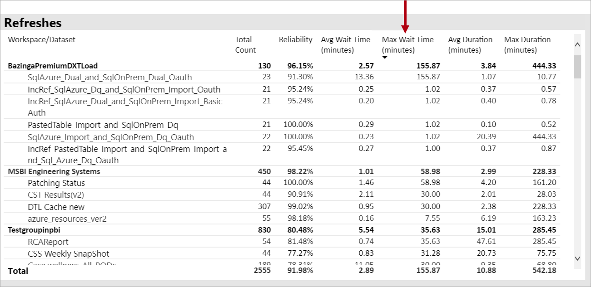
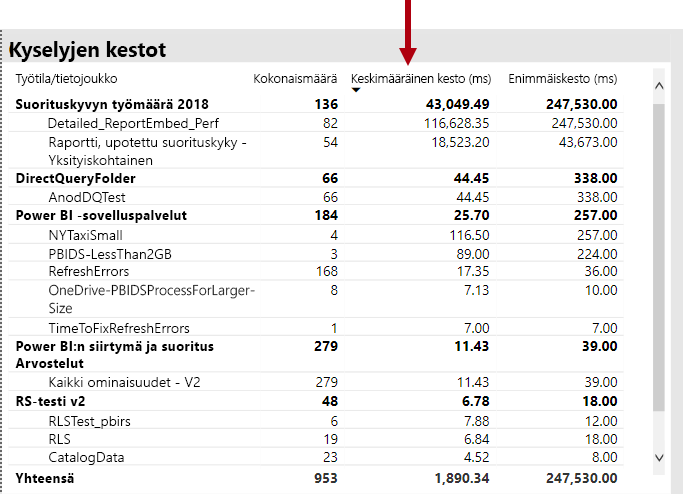
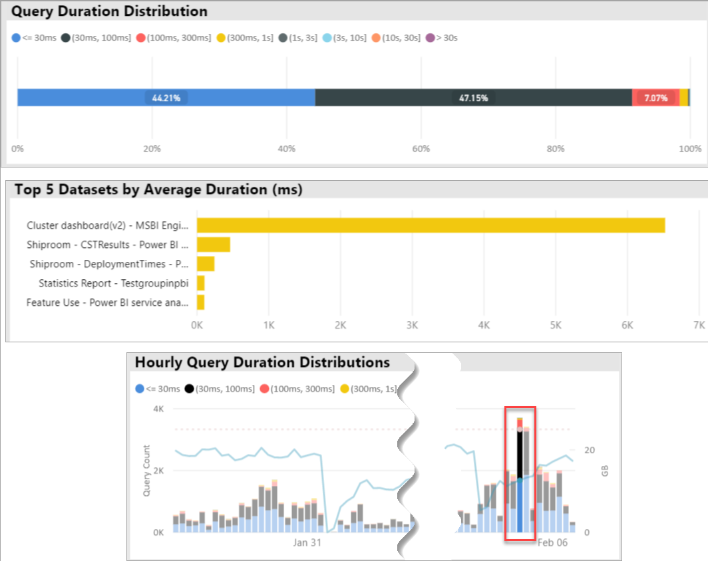
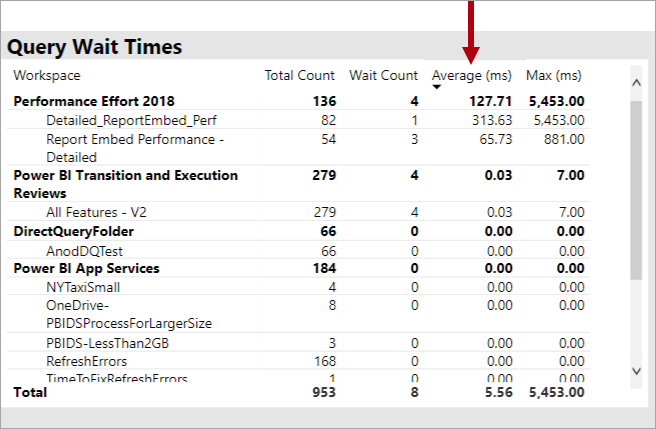
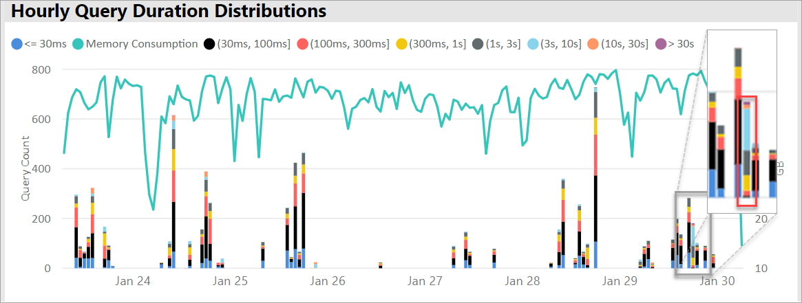

# Premium-kapasiteettitilanteet

Tässä artikkelissa kuvataan reaalimaailman tilanteita, joissa Power BI Premium -kapasiteetti on otettu käyttöön. Kuvataan yleisiä ongelmia ja haasteita sekä kerrotaan, miten ne voidaan tunnistaa, ja autetaan ratkaisemaan niitä:

- [Tietojoukkojen pitäminen ajan tasalla](#keeping-datasets-up-to-date)
- [Hitaasti vastaavien tietojoukkojen tunnistaminen](#identifying-slow-responding-datasets)
- [Tietojoukkojen satunnaisen hitaan vastaamisen syiden tunnistaminen](#identifying-causes-for-sporadically-slow-responding-datasets)
- [Muistin riittävyyden selvittäminen](#determining-whether-there-is-enough-memory)
- [Suorittimen riittävyyden selvittäminen](#determining-whether-there-is-enough-cpu)

Nämä toimenpiteet sekä kaavio- ja taulukkoesimerkit ovat **Power BI Premium -kapasiteettiarvosovelluksesta**, johon Power BI -järjestelmänvalvojalla on käyttöoikeus.

## Tietojoukkojen pitäminen ajan tasalla

Tässä tilanteessa tutkimus käynnistettiin, kun käyttäjät valittivat, että raporttitiedot vaikuttivat joskus vanhoilta tai vanhentuneilta.

Sovelluksessa järjestelmänvalvoja on yhteydessä **Päivitykset**-visualisointiin ja lajittelee tietojoukkoja **Suurin odotusaika** -tilaston mukaan laskevassa järjestyksessä. Tämä visualisointi auttaa paljastamaan ne tietojoukot, joilla on pisin odotusaika, työtilan nimen mukaan ryhmiteltyinä.

**Päivityksen keskimääräinen odotusaika tunneittain** -visualisoinneissa huomataan, että päivitysten odotusajat ovat johdonmukaisesti huipussaan kunakin päivänä klo 16.

Näille tuloksille on useita mahdollisia selityksiä:

- Liian monta päivitysyritystä samanaikaisesti, niin että kapasiteettisolmun määrittämät rajat ylittyvät. Tässä tapauksessa kuusi yhtaikaista päivitystä P1:llä, jossa on oletusmuistivaraus.

- Päivitettävät tietojoukot voivat olla liian suuria mahtuakseen saatavilla olevaan muistiin (vaativat ainakin 2x niin paljon muistia, jotta päivitys onnistuisi).
- Tehoton Power Query -logiikka voi aiheuttaa muistin käytössä piikin tietojoukon päivityksen aikana. Kun kapasiteettiin kohdistuu paljon käyttötarvetta, tämä piikki voi joskus nousta fyysiseen ylärajaansa, jolloin päivitys epäonnistuu ja muut kapasiteettia tarvitsevat raporttinäkymätoiminnot voivat kärsiä.
- Usein kyselyn kohteena olevat tietojoukot, joiden on pysyttävä saatavilla muistissa, voivat vaikuttaa muiden tietojoukkojen päivittymiskykyyn saatavilla olevan muistin rajallisuuden vuoksi.

Tutkimuksen tueksi Power BI -järjestelmänvalvoja voi etsiä seuraavia asioita:

- Saatavilla olevan muistin vähäisyyttä tietojen päivitysaikana, kun muistia on käytettävissä alle 2x päivitettävän tietojoukon koosta.
- Tietojoukkoja, joita ei päivitetty ja jotka eivät olleet muistissa ennen päivittämistä, mutta jotka alkoivat näyttää merkkejä vuorovaikutteisesta liikenteestä vilkkaina päivitysaikoina. Kun Power BI -järjestelmänvalvoja haluaa tietää, mitkä tietojoukot ladataan muistiin tietyllä hetkellä, hän voi tarkastella sovelluksen **Tietojoukot**-välilehden tietojoukkoaluetta. Järjestelmänvalvoja voi sitten tehdä ristiinsuodatuksen haluamallaan hetkellä napsauttamalla yhtä palkeista kohdassa **Tunneittain ladattujen tietojoukkojen määrä**. Alla kuvatun kaltainen paikallinen piikki viittaa ajankohtaan, jolloin muistiin ladattiin useita tietojoukkoja. Tämä voi viivyttää ajoitettujen päivitysten käynnistämistä.
- Lisääntyneet tietojoukkohäädöt juuri sinä aikana, kun tietopäivitykset on ajoitettu käynnistymään. Häädöt voivat viitata siihen, että ennen päivityshetkeä muistiin kohdistui suuri paine, koska se palveli liian monia vuorovaikutteisia raportteja. **Tietojoukkojen häätö ja muistin käyttö tunneittain** -visualisointi voi selvästi ilmaista häätöpiikkejä.

Seuraava kuva näyttää ladatuissa tietojoukoissa paikallisen piikin, joka antaa ymmärtää, että vuorovaikutteiset kyselyt viivyttivät päivitysten käynnistämistä. Aikajakson valitseminen visualisoinnissa **Tunneittain ladattujen tietojoukkojen määrä** ristiinsuodattaa visualisoinnin **Tietojoukkojen koot**.

Power BI -järjestelmänvalvoja voi seuraavilla tavoilla yrittää ratkaista ongelman varmistamalla, että tietojen päivityksille on saatavilla riittävästi muistia:

- Ottamalla yhteyttä tietojoukon omistajiin ja pyytämällä heitä porrastamaan ja harventamaan tietojen päivittämisen ajastuksia.
- Vähentämällä tietojoukkokyselyjen kuormitusta poistamalla tarpeettomia koontinäyttöjä ja koontinäyttöjen ruutuja, erityisesti sellaisia, jotka vaativat rivitason suojausta.
- Nopeuttamalla tietojen päivityksiä Power Query -logiikan optimoinnilla. Parantamalla mallinnuksen laskettuja sarakkeita tai taulukoita. Pienentämällä tietojoukkojen kokoja tai määrittämällä suurempia tietojoukkoja suorittamaan asteittaista tietojen päivitystä.

## Hitaasti vastaavien tietojoukkojen tunnistaminen

Tässä tilanteessa aloitettiin tutkinta, kun käyttäjät valittivat, että tiettyjen raporttien avaaminen kesti liian kauan ja että ne jäivät joskus jumiin.

Sovelluksessa Power BI -järjestelmänvalvoja voi käyttää visualisointia **Kyselyjen kestot** suorituskyvyltään huonoimpien tietojoukkojen määrittämiseen lajittelemalla tietojoukot laskevaan järjestykseen **Keston keskiarvon** mukaan. Tämä visualisointi näyttää myös tietojoukkokyselyjen määrät, joten pääset näkemään, kuinka usein tietojoukoista tehdään kyselyjä.

Järjestelmänvalvoja voi viitata **Kyselyjen keston jakauman** visualisointiin, joka näyttää yleisjakauman säilöttyjen kyselyjen suorituskyvylle (<= 30 ms, 0-100 ms) suodatetun aikajakson ajalta. Yleensä kyselyt, joihin menee aikaa sekunti tai vähemmän, ovat useimpien käyttäjien mielestä hyvin reagoivia kyselyjä, kauemmin kestävät synnyttävät mielikuvan huonosta suorituskyvystä.

**Kyselyjen keston jakauma tunneittain** -visualisoinnin avulla Power BI -järjestelmänvalvoja voi tunnistaa sellaiset tunnin mittaiset jaksot, joiden aikana kapasiteettisuorituskyky on voitu mieltää heikoksi. Mitä pitempiä ovat ne palkkisegmentit, jotka edustavat yli sekunnin kestäviä kyselyjä, sitä todennäköisempää on, että käyttäjät ovat mieltäneet suorituskyvyn huonoksi.

Visualisointi on vuorovaikutteinen, ja kun valitset palkin segmentin, sitä vastaava **Kyselyjen kestot**-taulukkovisualisointi raporttisivulla ristiinsuodatetaan näyttämään sen edustamat tietojoukot. Tämän ristiinsuodatuksen avulla Power BI -järjestelmänvalvoja voi helposti tunnistaa, mitkä tietojoukot reagoivat hitaasti.

Seuraavassa kuvassa näkyy visualisointi, jonka suodatuksen perustana toimii **Kyselyn keston jakauma tunneittain** ja joka keskittyy yhden tunnin säilöjen huonoimmin toimiviin tietojoukkoihin. 

Kun tietyssä tunnin aikavälissä on tunnistettu huonosti toimiva tietojoukko, Power BI -järjestelmänvalvoja voi tutkia, johtuuko huono suorituskyky kapasiteetin ylikuormituksesta vai huonosti suunnitellusta tietojoukosta tai raportista. Voidaan viitata **Kyselyn odotusajat** -visualisointiin ja lajitella tietojoukot keskimääräisen kyselyn odotusajan mukaan laskevassa järjestyksessä. Jos suuri prosenttiosuus kyselyistä odottaa, kyselyjen liiallisiin odotusaikoihin ovat luultavasti syynä tietojoukkoon kohdistetut suuret vaatimukset. Jos kyselyjen keskimääräinen odotusaika on huomattavan pitkä (> 100 ms), voi olla vaivan arvoista tarkastella tietojoukkoa ja raporttia siltä varalta, että optimointeja voi tehdä. Esimerkkejä ovat tiettyjen raporttisivujen visualisointien vähentäminen tai DAX-lausekkeen optimoiminen.

On useita mahdollisia syitä siihen, miksi kyselyn odotusaika kasvaa tietojoukoissa:

- Optimaalista huonompi mallin rakenne, mittauslausekkeet tai myös raportin rakenne ovat kaikki sellaisia tekijöitä, jotka voivat aiheuttaa pitkäkestoisia, suoritinta rasittavia kyselyjä. Tämä pakottaa uudet kyselyt odottamaan, kunnes suoritinsäikeet tulevat ulottuville, ja voi aiheuttaa ruuhkautumista erityisesti silloin, kun liikennettä on paljon. **Kyselyn odotusajat** -sivu on pääasiallinen resurssi selvitettäessä, ovatko tietojoukkojen odotusajat keskimäärin hyvin pitkiä.
- Suuri määrä kapasiteetin samanaikaisia käyttäjiä (satoja tai tuhansia), jotka käyttävät samaa raporttia tai tietojoukkoa. Jopa hyvin suunnitellut tietojoukot voivat osoittaa huonoa suorituskykyä, jos samanaikaisuuskynnys ylittyy. Tämän ilmaisee yleensä yksittäinen tietojoukko, joka antaa merkittävästi korkeamman arvon kyselyjen määrälle kuin muut tietojoukot (esim. 300 000 kyselyä yhdelle tietojoukolle, kun kaikkien muiden kyselyjen numerot ovat alle 30 000). Jossain kohdassa tämän tietojoukon kyselyjen odotusajat alkavat horjua, mikä näkyy **Kyselyjen kestot** -visualisoinnissa.
- Moneen eri tietojoukkoon tehdään samanaikaisia kyselyjä, mikä ylirasittaa muistia, kun tietojoukot kiertävät yhtä mittaa muistiin ja muistista ulos. Käyttäjät kokevat suorituskyvyn heikentyvän, kun tietojoukkoa ladataan muistiin. Asian vahvistamiseksi Power BI -järjestelmänvalvoja voi käyttää visualisointia **Tietojoukkojen häätö ja muistin käyttö tunneittain**, josta voi ilmetä, että suuri määrä muistiin ladattuja tietojoukkoja häädetään toistuvasti.

## Tietojoukkojen satunnaisen hitaan vastaamisen syiden tunnistaminen

Tässä tilanteessa tutkimus alkoi, kun käyttäjät kertoivat, että raporttien visualisoinnit olivat joskus hitaita reagoimaan tai jumittuivat, vaikka ne muina aikoina reagoivat hyväksyttävän nopeasti.

Sovelluksen sisällä käytettiin **Kyselyjen kestot** -osaa syyllisen tietojoukon löytämiseen seuraavalla tavalla:

- **Kyselyjen kestot** -visualisoinnissa järjestelmänvalvoja suodatti tietojoukon kerrallaan (aloittaen useimpien kyselyjen kohteena olleista tietojoukoista) ja tarkasteli ristiinsuodatettuja palkkeja **Kyselyjakaumat tunneittain** -visualisoinnissa.
- Kun yksittäisessä yhden tunnin palkissa ilmeni merkittäviä muutoksia kaikkien kyselynkestoryhmien suhteessa tietojoukon muihin yhden tunnin palkkeihin (esimerkiksi värien suhteet muuttuivat huomattavasti), tämä tarkoittaa, että tässä tietojoukossa ilmeni satunnainen suorituskyvyn muutos.
- Yhden tunnin palkit, joissa näkyi epäsäännöllinen osuus huonosti toimivia kyselyjä, osoittivat aikavälin, jossa muiden tietojoukkojen aktiivisuuden aiheuttama ns. meluisan naapurin ilmiö kohdistui kyseiseen tietojoukkoon.

Alla oleva kuva näyttää tammikuun 30. päivältä yhden tunnin jakson, jonka aikana tietojoukon suorituskyvyssä ilmeni huomattava heikkeneminen, joka näkyy suorituskestosäilön “(3,10 s]” koossa. Kyseisen yhden tunnin palkin napsauttaminen paljastaa kaikki sinä aikana muistiin ladatut tietojoukot, jotka aiheuttavat meluisan naapurin ilmiön.

Kun ongelmallinen aikajakso on tunnistettu (esimerkiksi yllä olevassa kuvassa tammikuun 30. päivänä), Power BI -järjestelmänvalvoja voi poistaa kaikki tietojoukkosuodattimet ja suodattaa sitten vain kyseisen aikajakson perusteella sen selvittämiseksi, mitkä tietojoukot olivat tähän aikaan aktiivisen kyselyn kohteena. Meluisan naapurin ilmiöön syyllinen tietojoukko on yleensä se, johon kohdistuu eniten kyselyjä, tai se, johon kohdistuneet kyselyt kestävät keskimäärin kauimmin.

Tämän ongelman ratkaisu voi olla se, että ongelmia aiheuttavat tietojoukot jaetaan eri työtiloille ja eri Premium-kapasiteeteille tai jaetulle kapasiteetille, jos tietojoukon kokoa, kulutustarpeita ja tietojen päivityskuvioita tuetaan.

Asiassa voi käydä myös päinvastoin. Power BI -järjestelmänvalvoja voi tunnistaa ajankohdat, jolloin tietojoukkokyselyn suorituskyky yllättäen paranee, ja etsiä sitten, mikä taustatekijä tällöin on kadonnut. Jos jokin tieto puuttuu tässä kohdassa, se voi auttaa tunnistamaan ongelman syyn.

## Muistin riittävyyden selvittäminen

Sen selvittämiseksi, onko kapasiteetilla riittävästi muistia työkuormiensa suorittamiseen, Power BI -järjestelmänvalvoja voi käyttää visualisointia **Kulutetut muistin prosenttiosuudet** sovelluksen välilehdessä **Tietojoukot**. **Kaikki** muisti (yhteensä) tarkoittaa muistiin tallennettujen tietojoukkojen kokonaisuudessaan kuluttamaa muistia riippumatta siitä, ovatko tietojoukot aktiivisten kyselyjen tai käsittelyn kohteena. **Aktiivinen** muisti tarkoittaa aktiivisessa käsittelyssä olevien tietojoukkojen kuluttamaa muistia.

Hyväkuntoisessa kapasiteetissa visualisointi näyttää tältä, niin että kaiken (yhteensä) ja aktiivisen muistin välillä on aukko:

Jos kapasiteettiin kohdistuu muistipainetta, sama visualisointi näyttää selkeästi aktiivisen muistin ja kokonaismuistin lähestyvän toisiaan niin, että muistiin on mahdotonta ladata lisää tietojoukkoja. Tässä tapauksessa Power BI -järjestelmänvalvoja voi napsauttaa **Käynnistä kapasiteetti uudelleen** (hallintaportaalin kapasiteettiasetusten alueen **Lisäasetuksissa**). Kapasiteetin uudelleenkäynnistäminen tarkoittaa, että kaikki tietojoukot pyyhitään muistista ja niiden annetaan latautua uudelleen tarpeen mukaan (kyselyjen tai tietojen päivittämisen mukaan).

## Suorittimen riittävyyden selvittäminen

Yleensä kapasiteetin keskimääräisen suorittimen käyttötarpeen pitäisi pysyä alle 80 %:ssa. Jos arvo ylittyy, kapasiteetti lähestyy suorittimen kylläisyyttä.

Suorittimen kylläisyys ilmenee siten, että toiminnot kestävät kauemmin kuin niiden pitäisi, koska kapasiteetti suorittaa useita suoritinkontekstin vaihtoja yrittäessään käsitellä kaikkia toimintoja. Premium-kapasiteetissa, jossa on paljon samanaikaisia kyselyjä, tämä ilmenee siten, että kyselyjen odotusajat pitenevät. Kyselyjen odotusaikojen piteneminen merkitsee reagoinnin hidastumisesta tavanomaiseen verrattuna. Power BI -järjestelmänvalvoja voi helposti tunnistaa, milloin suoritin on kylläinen, tarkastelemalla visualisointia **Kyselyiden odotusajan jakaumat tunneittain**. Kyselyjen odotusaikamäärien kausihuiput ilmaisevat mahdollisen suorittimen kylläisyyden.

Samanlainen kuvio voidaan joskus havaita taustatoiminnoissa, jos ne myötävaikuttavat suorittimen kylläisyyteen. Power BI -järjestelmänvalvoja voi etsiä kausihuippua tietyn tietojoukon päivitysajoissa, koska tämä voi viitata senhetkiseen suorittimen kylläisyyteen (mahdollisesti muiden käynnissä olevien tietojoukkopäivitysten ja/tai vuorovaikutteisten kyselyjen vuoksi). Tässä tapauksessa sovelluksen **Järjestelmä**-näkymä ei välttämättä paljasta suorittimen käytön olevan 100 %:ssa. **Järjestelmä**-näkymä näyttää keskiarvoja tunneittain, mutta suoritin voi tulla kylläiseksi useiden minuuttien ajaksi raskaiden toimintojen aikana, mikä näkyy odotusaikapiikkeinä.

Suorittimen kylläisyyden näkymiseen liittyy enemmänkin sävyeroja. Vaikka odottavien kyselyjen lukumäärä onkin tärkeä, kyselyjä joutuu aina jossain määrin odottamaan, eikä se välttämättä merkitse havaittavaa suorituskyvyn huononemista. Eräät tietojoukot (joiden keskimääräinen kyselyaika on pitempi kompleksisuuden tai koon takia) ovat herkempiä suorittimen kylläisyyden vaikutuksille kuin toiset. Tällaisten tietojoukkojen helpoksi tunnistamiseksi Power BI -järjestelmänvalvoja voi etsiä muutoksia visualisoinnin **Odotusajan jakauma tunneittain** -palkkien värikoostumuksessa. Havaittuaan poikkeavan palkin järjestelmänvalvoja voi etsiä tietojoukkoja, joiden kyselyt ovat odotuttaneet itseään kyseisenä aikana, ja tarkastella samalla keskimääräistä kyselyn odotusaikaa verrattuna keskimääräiseen kyselyn kestoon. Kun nämä kaksi mittausarvoa ovat samansuuruisia ja tietojoukon kyselyn työkuorma on vähäpätöistä suurempi, on todennäköistä, että suorittimen riittämättömyys vaikuttaa tietojoukkoon.

Tämä vaikutus voi olla erityisen näkyvä silloin, kun joukko käyttäjiä esimerkiksi koulutustilaisuuden yhteydessä suuntaa tietojoukkoon useita lyhyitä suurtaajuisten kyselyjen purskeita, jotka johtavat suorittimen kylläisyyteen kunkin purskeen aikana. Tässä tapauksessa tämän tietojoukon merkittävät kyselyodotusajat voidaan havaita myös vaikutuksena muihin tietojoukkoihin (meluisan naapurin ilmiö).

Eräissä tapauksissa Power BI -järjestelmänvalvojat voivat vaatia tietojoukkojen omistajia ryhdistämään kyselykuormitustaan luomalla kokoomanäytön (joka tekee säännöllisesti kyselyjä aina kun tietojoukko päivitetään välimuistiruutujen osalta) raportin sijasta. Tämä voi auttaa estämään kuormituspiikkejä koontinäytön lataamisen yhteydessä. Tämä ratkaisu ei ehkä ole aina mahdollinen annettujen toimeliaisuusedellytysten puitteissa, mutta se voi olla tehokas tapa välttää suorittimen kylläisyyttä joutumatta tekemään muutoksia tietojoukkoon.

## Kiitokset

Tämän artikkelin on kirjoittanut Peter Myers, joka on Data Platform MVP ja itsenäinen BI-asiantuntija, yhdessä [Bitwise Solutionsin](https://www.bitwisesolutions.com.au/) kanssa.

## Seuraavat vaiheet

> [!div class="nextstepaction"]
> [Premium-kapasiteettien valvonta sovelluksen avulla](service-admin-premium-monitor-capacity.md)    
> [!div class="nextstepaction"]
> [Kapasiteettien valvonta hallintaportaalissa](service-admin-premium-monitor-portal.md)   

Onko sinulla kysyttävää? [Voit esittää kysymyksiä Power BI -yhteisössä](https://community.powerbi.com/)

||||||