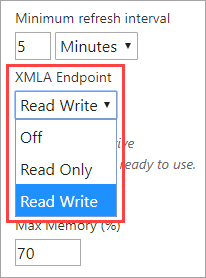
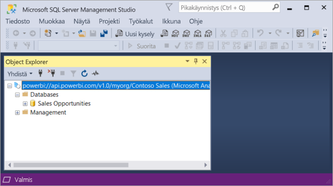

# Tietojoukon liitettävyys XMLA-päätepisteeseen (esikatselu)

Power BI Premiumin työtilat ja tietojoukot, joiden yhteensopivuustaso on 1500 tai korkeampi taso, tukevat avoimen alustan yhteyttä Microsoftin ja kolmannen osapuolen asiakassovelluksista ja työkaluista *XMLA-päätepisteen* avulla.

> [!NOTE]
> Tämä ominaisuus on **esiversiotilassa**. Esikatselun ominaisuuksia ei pidä käyttää tuotantoympäristössä. Jotkin toiminnot, tuki ja dokumentaatio ovat rajoitettuja.  Jos haluat lisätietoja, lue [Microsoftin verkkopalvelujen ehdot](https://www.microsoft.com/licensing/product-licensing/products?rtc=1).

## Mikä on XMLA-päätepiste?

Power BI Premium käyttää [XML for Analysis](https://docs.microsoft.com/analysis-services/xmla/xml-for-analysis-xmla-reference?view=power-bi-premium-current) (XMLA) -protokollaa viestinnässä asiakassovellusten välillä ja moduulissa, joka hallitsee Power BI -työtilojasi ja -tietojoukkojasi. Tämä viestintä kulkee niin sanottujen XMLA-päätepisteiden välillä. XMLA on sama viestintäprotokolla, jota käytetään Microsoft Analysis Services -moduulissa. Se perustuu Power BI:n semanttiseen mallinnukseen, valvontaan, elinkaareen ja tiedonhallintaan.

Oletusarvoisesti *vain luku* -yhteys päätepisteen avulla on käytössä kapasiteetin **tietojoukkojen kuormituksessa**. Vain luku -käyttöoikeudella tietojen visualisoinnin sovellukset ja työkalut voivat tehdä kyselyn tietojoukon mallitietoihin, metatietoihin, tapahtumiin ja rakenteeseen. Päätepistettä käyttävät *luku/kirjoitus*toiminnot voidaan ottaa käyttöön. Ne lisäävät tietojoukkojen hallinnan, hallinnoimisen, kehittyneen semanttisen mallinnuksen, vianetsinnän ja valvonnan ominaisuuksia. Kun luku/kirjoitus on käytössä, Power BI Premiumin tietojoukoissa on enemmän vastaavuutta Azure Analysis Servicesin ja SQL Server Analysis Servicesin suuryritystason taulukkomallinnustyökaluihin ja prosesseihin.

## Tietojen mallinnus- ja hallintatyökalut

Nämä ovat yleisimpiä Azure Analysis Servicesin ja SQL Server Analysis Servicesin kanssa käytettäviä työkaluja, ja nyt myös Power BI Premiumin tietojoukot tukevat niitä:

**Visual Studio Analysis Servicesin projekteissa**  – Tunnetaan myös nimellä SQL Server Data Tools tai **SSDT**. Se on suuryritysluokan mallienluontityökalu Analysis Servicesin taulukkomalleja varten. Analysis Services -projektilaajennuksia tuetaan kaikissa Visual Studio 2017 -versioissa ja uudemmissa versioissa, mukaan lukien maksuton Community-versio. Taulukkomallien käyttöönotto Premium-työtilassa edellyttää laajennuksen versiota 2.9.6 tai uudempaa versiota. Kun teet käyttöönoton Premium-työtilassa, mallin on oltava yhteensopivuustasolla 1500 tai korkeammalla tasolla. XMLA:n luku/kirjoitusoikeus vaaditaan tietojoukkojen kuormituksessa. Lisätietoja on artikkelissa [Analysis Servicesin työkalut](https://docs.microsoft.com/analysis-services/tools-and-applications-used-in-analysis-services?view=power-bi-premium-current).

**SQL Server Management Studio (SSMS)**  : Tukee DAX-, MDX- ja XMLA-kyselyitä. Suorita hienojakoisia tietojoukkojen metatietojen päivitystoimintoja ja komentosarjoja käyttämällä [TMSL-kieltä](https://docs.microsoft.com/analysis-services/tmsl/tabular-model-scripting-language-tmsl-reference) (Tabular Model Scripting Language). Vain luku -oikeus vaaditaan kyselytoiminnoille. Luku/kirjoitusoikeus vaaditaan metatietojen komentosarjoille. Vaatii SSMS-version 18.4 tai uudemman version. Lataa [tästä](https://docs.microsoft.com/sql/ssms/download-sql-server-management-studio-ssms).

**SQL Server Profiler** : Tämä SSMS:n mukana asennettava työkalu tarjoaa tietojoukkotapahtumien seurannan ja virheenkorjauksen. Vaikka Profiler on virallisesti poistettu käytöstä SQL Serverille, se on kuitenkin edelleen mukana SSMS:ssä ja sitä tuetaan edelleen Analysis Servicesille ja Power BI Premiumille. XMLA:n vain luku -oikeus vaaditaan. Lisätietoja on artikkelissa  [SQL Serverin profilointi Analysis Servicesiin](https://docs.microsoft.com/analysis-services/instances/use-sql-server-profiler-to-monitor-analysis-services?view=power-bi-premium-current).

**Analysis Servicesin ohjattu käyttöönotto**  – Asennetaan SSMS:N kanssa, tämä työkalu mahdollistaa Visual Studio luomien taulukko malli projektien käyttöönoton Analysis Services ja Power BI Premium työtiloihin. Se voidaan suorittaa vuorovaikutteisesti tai automaattisesti komentoriviltä. XMLA:n luku/kirjoitusoikeus vaaditaan. Lisätietoja on artikkelissa [Analysis Servicesin ohjattu käyttöönotto](https://docs.microsoft.com/analysis-services/deployment/deploy-model-solutions-using-the-deployment-wizard?view=power-bi-premium-current).

**PowerShellin cmdlet-komennot**   – Analysis Servicesin cmdlet-komennoilla voidaan automatisoida tietojoukkojen hallintatehtäviä, kuten päivitystoimintoja. XMLA:n luku/kirjoitusoikeus vaaditaan. Versio **21.1.18221** tai uudempi versio [SqlServer PowerShell -moduulista](https://www.powershellgallery.com/packages/SqlServer/) vaaditaan. Az.AnalysisServices-moduulin sisältämiä Azure Analysis Servicesin cmdlet-komentoja ei tueta Power BI Premiumissa. Lisätietoja on artikkelissa [Analysis Servicesin PowerShell-opas](https://docs.microsoft.com/analysis-services/powershell/analysis-services-powershell-reference?view=power-bi-premium-current).

**Power BI:n Raportin muodostin** : erillinen työkalu sivutettujen raporttien luomiseen. Luo raportille määritys, joka määrää, mitä tietoja haetaan, mistä ne haetaan ja miten ne näytetään. Voit esikatsella raporttiasi Raportin muodostimessa ja sitten julkaista sen Power BI -palveluun. XMLA:n vain luku -oikeus vaaditaan. Lisätietoja on artikkelissa  [Power BI:n Raportin muodostin](https://docs.microsoft.com/power-bi/report-builder-power-bi).

**Tabular Editor** – Avoimen lähdekoodin työkalu taulukkomallien luontiin, ylläpitoon ja hallintaan intuitiivisessa ja kevyessä editorissa. Taulukkomallin kaikki objektit näkyvät hierarkkisessa näkymässä. Objektit järjestetään näyttökansioittain, ja ne tukevat monivalintaista ominaisuusmuokkausta ja DAX-syntaksin korostusta. XMLA:n vain luku -oikeus vaaditaan kyselytoiminnoille. Luku/kirjoitusoikeus vaaditaan metatietotoiminnoille. Lisätietoja on osoitteessa [tabulareditor.github.io](https://tabulareditor.github.io/).

**DAX Studio**  – Avoimen lähdekoodin työkalu DAX-sisällön tuottamiseen, diagnosointiin, suorituskyvyn virittämiseen ja analysointiin. Ominaisuuksia ovat objektien selaaminen, sisäinen seuranta, kyselyjen suorittamisen erittely ja yksityiskohtaiset tilastotiedot, DAX-syntaksin korostus ja muotoilu. XMLA:n vain luku -oikeus vaaditaan kyselytoiminnoille. Lisätietoja on osoitteessa  [daxstudio.org](https://daxstudio.org/).

**ALM Toolkit** – Avoimen lähdekoodin rakenteenvertailutyökalu Power BI:n tietojoukoille, joita käytetään useimmiten sovelluksen elinkaaren hallinnan (ALM) skenaarioissa. Suorita käyttöönotto kaikissa ympäristöissä ja säilytä lisäävän päivityksen historiatiedot. Vertaa ja yhdistä metatietotiedostoja, haaroja ja säilöjä. Käytä uudelleen yleisiä määritelmiä tietojoukkojen välillä. Vain luku -oikeus vaaditaan kyselytoiminnoille. Luku/kirjoitusoikeus vaaditaan metatietotoiminnoille. Lisätietoja on osoitteessa  [alm-toolkit.com](http://alm-toolkit.com/).

**Microsoft Excel**  – Excelin pivot-taulukoita ovat yksi yleisimmistä työkaluista, joilla voidaan tiivistää, analysoida, tutkia ja esittää Power BI:n tietojoukkojen yhteenvetotietoja. Vain luku -oikeus vaaditaan kyselytoiminnoille. Officen pika-asennuksen versio 16.0.11326.10000 tai uudempi versio vaaditaan.

**Muut ohjelmistovalmistajat** : tarjolla on esimerkiksi tietojen visualisoinnin asiakassovelluksia ja työkaluja, joilla voit muodostaa yhteyden Power BI Premiumin tietojoukkoihin, tehdä kyselyitä niihin ja käyttää niitä. Useimmat työkalut edellyttävät MSOLAP-asiakaskirjastojen uusimpia versioita, mutta jotkin saattavat käyttää ADOMD-kirjastoja. XMLA-päätepiste, johon on vain luku- tai luku/kirjoitusoikeus on riippuvainen toiminnoista.

### Asiakaskirjastot

Asiakassovellukset eivät vaihda tietoja suoraan XMLA-päätepisteen kanssa. Sen sijaan ne käyttävät *asiakaskirjastoja* abstrahointikerroksena. Nämä ovat samoja asiakaskirjastoja, joiden avulla sovellukset muodostavat yhteyden Azure Analysis Servicesiin ja SQL Server Analysis Servicesiin. Microsoftin asiakassovellukset, kuten Excel, SQL Server Management Studio (SSMS) ja Analysis Services -projektilaajennus Visual Studioon, asentavat kaikki kolme asiakaskirjastoa ja päivittävät niitä säännöllisesti sovellus- ja laajennuspäivitysten yhteydessä. Kehittäjät voivat käyttää asiakaskirjastoja myös mukautettujen sovellusten luomiseen. Joissain tapauksissa, etenkin kolmannen osapuolen sovelluksia käytettäessä, sinun on ehkä asennettava asiakaskirjastojen uudemmat versiot, ellei niitä asenneta sovelluksen mukana. Asiakaskirjastoja päivitetään kuukausittain. Lisätietoja on artikkelissa  [Asiakaskirjastot Analysis Servicesiin yhdistämiseksi](https://docs.microsoft.com/azure/analysis-services/analysis-services-data-providers).

## Tuetut kirjoitustoiminnot

Tietojoukon metatiedot näkyvät asiakaskirjastojen kautta sen perusteella, mikä taulukko-objektimalli (TOM) on tarkoitettu kehittäjille mukautettujen sovellusten luomista varten. Tämän avulla Visual Studio ja avoimen lähdekoodin yhteisötyökalut, kuten Tabular Editor, voivat tarjota Analysis Services -moduulin tukemia tietojen mallinnuksen ja käyttöönoton lisäominaisuuksia, joita ei vielä tueta Power BI Desktopissa. Tietojen mallinnuksen lisätoimintoihin sisältyvät seuraavat:

- [Laskentaryhmät](https://docs.microsoft.com/analysis-services/tabular-models/calculation-groups?view=power-bi-premium-current) laskutoimitusten uudelleenkäytettävyyttä ja monimutkaisten mallien yksinkertaistettua kulutusta varten.

- [Metatietokäännökset](https://docs.microsoft.com/analysis-services/tabular-models/translations-in-tabular-models-analysis-services?view=power-bi-premium-current) monikielisten raporttien ja tietojoukkojen tukemiseen.

- [Perspektiivit](https://docs.microsoft.com/analysis-services/tabular-models/perspectives-ssas-tabular?view=power-bi-premium-current) kohdennettujen yritystoimialuekohtaisten näkymien määrittämiseen tietojoukkojen metatietoja varten.

Objektitason suojausta (OLS) ei vielä tueta vielä Power BI Premiumin tietojoukoissa.

## Tietojoukkojen optimoiminen kirjoitustoimintoja varten

Kun käytät XMLA-päätepistettä tietojoukon hallintaan kirjoitustoiminnoilla, on suositeltavaa ottaa tietojoukko käyttöön suurissa malleissa. Tämä vähentää kirjoitustoimintoihin liittyvää kuormitusta ja voi nopeuttaa niitä huomattavasti. Yli yhden gigatavun kokoisia (pakkauksen jälkeen) tietojoukkoja käytettäessä ero voi olla merkitsevä. Lisätietoja on artikkelissa [Suuret mallit Power BI Premiumissa](service-premium-large-models.md).

## XMLA:n luku/kirjoitusoikeuden ottaminen käyttöön

Oletusarvoisesti Premium-kapasiteetissa XMLA-päätepiste-ominaisuusasetus on käytössä vain luku -oikeuksin. Tämä tarkoittaa sitä, että sovellukset voivat vain tehdä kyselyn tietojoukkoon. Jotta sovellukset voisivat tehdä kirjoitustoimintoja, XMLA-päätepiste-ominaisuudelle on otettava käyttöön luku/kirjoitusoikeus. Kapasiteetin XMLA-päätepiste-ominaisuusasetus määritetään **tietojoukkojen kuormituksessa**. XMLA-päätepiste-asetus koskee *kaikkia työtiloja ja tietojoukkoja*, jotka kapasiteetille on määritetty.

### Kapasiteetin luku/kirjoitusoikeuden ottaminen käyttöön

1. Valitse hallintaportaalissa **Kapasiteettiasetukset** > **Power BI Premium** > kapasiteetin nimi.
2. Laajenna **Kuormitukset**. Valitse **XMLA-pääte piste** asetukseksi **Luku ja kirjoitus**.

    

## Premium-työtilaan yhdistäminen

Työtiloilla, jotka on määritetty omalle kapasiteetilleen, on yhteysmerkkijono URL-muodossa, kuten `powerbi://api.powerbi.com/v1.0/[tenant name]/[workspace name]`.

Työtilaan yhdistävät sovellukset käyttävät URL-osoitetta samoin kuin se olisi Analysis Services .palvelimen nimi. Esimerkki: `powerbi://api.powerbi.com/v1.0/contoso.com/Sales Workspace`.

Käyttäjät, joilla on täydellinen käyttäjätunnus samassa vuokraajassa (ei B2B), voivat korvata vuokraajan nimen nimellä `myorg`. Esimerkki:  `powerbi://api.powerbi.com/v1.0/myorg/Sales Workspace`.

### Työtilan URL-yhteysosoitteen hankkiminen

Valitse työtilassa **Asetukset** > **Premium** > **Työtilayhteys** ja napsauta **Kopioi**.

## Yhteysvaatimukset

### Alkuperäinen luettelo

Jotkin työkalut, esimerkiksi SQL Server Profiler, saattavat edellyttää, että määrität *alkuperäisen luettelon*. Määritä tietojoukko (tietokanta) työtilaasi. Napsauta **Yhdistä palvelimeen** -valintaikkunassa **Asetukset** > **Yhteyden ominaisuudet** > **Yhdistä tietokantaan** ja anna tietojoukon nimi.

### Päällekkäiset työtilan nimet

Power BI:n [uusissa työtiloissa](../collaborate-share/service-new-workspaces.md) (luodaan käyttämällä uuden työtilan luontitoiminnolla) päällekkäistä nimeä käyttävien työtilojen luominen ja uudelleennimeäminen estetään vahvistamisen avulla. Työtilat, joita ei ole siirretty, voivat aiheuttaa nimien kaksoiskappaleita. Kun yhdistät työtilaan, jolla on sama nimi kuin toisella työtilalla, saatat saada seuraavan virheilmoituksen:

**Cannot connect to powerbi://api.powerbi.com/v1.0/[vuokraajan nimi]/[työtilan nimi].**

Voit kiertää tämän ongelman määrittämällä työtilan nimen lisäksi myös ObjectIDGuid-arvon, jonka voit kopioida työtilan URL-osoitteesta objectID-kohdasta. Liitä objectID yhteyden URL-osoitteen loppuun. Esimerkiksi,  
'powerbi://api.powerbi.com/v1.0/myorg/Contoso Sales - 9d83d204-82a9-4b36-98f2-a40099093830'.

### Päällekkäinen tietojoukon nimi

Kun yhdistät tietojoukkoon, jolla on sama nimi kuin toisella tietojoukolla samassa työtilassa, liitä tietojoukon GUID-tunnus tietojoukon nimeen. Voit hakea sekä tietojoukon nimen että GUID-tunnuksen, kun olet yhteydessä työtilaan SSMS:ssä.

### Viive näytetyissä tietojoukoissa

Kun yhdistät työtilaan, muutokset uusista, poistetuista ja uudelleennimetyistä tietojoukoista saattavat näkyä muutaman minuutin viiveellä.

### Tietojoukot, joita ei tueta

Seuraavia tietojoukkoja ei voi käyttää XMLA-päätepisteillä. Näitä tietojoukkoja ei näytetä työtilassa SSMS:ssä tai muissa työkaluissa:

- reaaliaikaiseen Azure Analysis Services- tai SQL Server Analysis Services -yhteyteen perustuvat tietojoukot. 
- Reaaliaikaiseen Power BI -tietojoukkoyhteyteen perustuvat tietojoukot toisessa työtilassa. Lisätietoja on artikkelissa [Johdanto tietojoukkojen käyttöön eri työtiloissa](../connect-data/service-datasets-across-workspaces.md).
- tietojoukot, jotka lähettävät tietoja REST API:n avulla
- Excel-työkirjojen tietojoukot.

## Suojaus

Sen lisäksi, että kapasiteetin järjestelmänvalvoja ottaa käyttöön XMLA-päätepiste-ominaisuuden luku/kirjoitusoikeuden, Power BI hallintaportaalissa on otettava käyttöön vuokraajatason **Vie tiedot** -asetus, joka tarvitaan myös Analysoi Excelissä -toiminnossa.

Käyttö XMLA-päätepisteen kautta noudattaa käyttöoikeusryhmän jäsenyyttä, joka on määritetty työtila- tai sovellustasolla.

Työtilan osallistujilla ja heitä hierarkiassa ylempänä olevilla käyttäjillä on kirjoitusoikeus tietojoukkoon, joten he vastaavat Analysis Services -tietokannan järjestelmänvalvojia. He voivat ottaa käyttöön käyttää uusia tietojoukkoja Visual Studiosta ja suorittaa TMSL-komentosarjoja SSMS:ssä.

Toiminnot, jotka edellyttävät Analysis Services -palvelimen järjestelmänvalvojan käyttöoikeuksia (tietokannan järjestelmänvalvojan käyttöoikeuksien sijaan), kuten palvelintason jäljitykset ja käyttäjäksi tekeytyminen käyttäen [EffectiveUserName](https://docs.microsoft.com/analysis-services/instances/connection-string-properties-analysis-services?view=power-bi-premium-current#bkmk_auth)-yhteysmerkkijono-ominaisuutta, eivät ole tuettuja Power BI Premiumissa tällä hetkellä.

Muut käyttäjät, joilla on [muodostamisen käyttöoikeus](../connect-data/service-datasets-build-permissions.md) tietojoukkoon, vastaavat Analysis Services -tietokannan lukijoita. He voivat muodostaa yhteyden ja selata tietojoukkoja tietojen kulutusta ja visualisointia varten. Rivitason suojauksen sääntöjä noudatetaan, eivätkä he näe sisäisiä tietojoukon metatietoja.

### Malliroolit

Tietojoukon metatiedot voivat XMLA-päätepisteen kautta luoda, muokata tai poistaa tietojoukon mallirooleja, mukaan lukien rivitason suojauksen suodattimien määrittäminen. Power BI:n mallirooleja käytetään vain rivitason suojauksessa. Power BI:n suojausmallin avulla voit hallita käyttöoikeuksia rivitason suojauksen yli.

Seuraavat rajoitukset koskevat tietojoukkojen roolien käyttämistä XMLA-päätepisteen kautta:

- **Julkisen esikatselun aikana tietojoukolle ei voi määrittää roolin jäsenyyttä XMLA-päätepisteen** avulla. Määritä sen sijaan roolin jäsenet Power BI -palvelun tietojoukon Rivitason suojaus -sivulla.
- Ainoa roolin käyttöoikeus, joka voidaan määrittää Power BI -tietojoukoille, on lukuoikeus. Tietojoukon muodostamisen käyttöoikeus vaaditaan lukuoikeuteen XMLA-päätepisteen kautta riippumatta tietojoukkoroolien olemassaolosta. Power BI:n suojausmallin avulla voit hallita käyttöoikeuksia rivitason suojauksen yli.
- Objektitasonsuojauksen sääntöjä ei tällä hetkellä tueta Power BI:ssä.

### Tietolähteen tunnistetietojen määrittäminen

XMLA-päätepisteen kautta määritetyt metatiedot voivat luoda yhteyksiä tietolähteisiin, mutta ne eivät voi määrittää tietolähteen tunnistetietoja. Sen sijaan tunnistetiedot voidaan määrittää Power BI -palvelun Tietojoukon asetukset -sivulla.

### Palvelun päänimet

Julkisen esikatselun aikana ei vielä tueta yhdistämistä XMLA-päätepisteeseen [palvelun päänimen](https://docs.microsoft.com/azure/active-directory/develop/app-objects-and-service-principals) avulla automaatioskenaarioissa.

## Malliprojektien käyttöönotto Visual Studiosta (SSDT)

Taulukkomalliprojektin käyttöönotto Power BI Premium -työtilalle Visual Studiossa on paljolti samanlaista kuin käyttöönotto Azuressa tai SQL Server Analysis Servicesissä. Ainoat erot ovat projektille määritetyssä Käyttöönottopalvelin-ominaisuudessa ja tietolähteen tunnistetietojen määrittämisessä, joten käsittelytoiminnot voivat tuoda tietoja tietolähteistä uuteen tietojoukkoon työtilassa.

> [!IMPORTANT]
> Julkisen esikatselun aikana roolien jäsenyyksiä ei voi määrittää työkaluilla XMLA-päätepisteen avulla. Jos malliprojektin käyttöönotto epäonnistuu, varmista, ettei mihinkään rooliin ole määritetty käyttäjiä. Kun malli on otettu onnistuneesti käyttöön, määritä käyttäjät tietojoukon rooleihin Power BI -palvelussa. Lisätietoja on edellä tämän artikkelin kohdassa [Malliroolit](#model-roles).

Jos haluat ottaa käyttöön Visual Studiossa luomasi taulukkomalliprojektin, määitä ensin työtilan URL-yhteysosoite projektin **Käyttöönottopalvelin**-ominaisuudessa. Napsauta Visual Studiossa **Ratkaisunhallinta**-kohdassa hiiren kakkospainikkeella projektia > **Ominaisuudet**. Liitä **Palvelin**-ominaisuudessa työtilan URL-yhteysosoite.

Kun Käyttöönottopalvelin-ominaisuus on määritetty, projekti voidaan ottaa käyttöön.

**Ensimmäisessä käyttöönotossa** tietojoukko luodaan työtilaan käyttämällä metatietoja tiedostosta model.bim. Kun tietojoukko on luotu työtilassa mallin metatiedoista, tietojen lataaminen tietolähteistä tietojoukkoon epäonnistuu osana käyttöönottotoimintoa.

Käsitteleminen epäonnistuu, koska käyttöönotossa Premium-tilaan ei tunnistetietoja voida määrittää osana käyttöönottotoimintoa. Tämä poikkeaa Azure-tai SQL Server Analysis Server -esiintymän käyttöönotosta, jossa tietolähteen tunnistetietoja kysytään osana käyttöönottotoimintoa. Kun metatietojen käyttöönotto on onnistunut ja tietojoukko luotu, tietolähteen tunnistetiedot sen sijaan määritetään Power BI -palvelussa tietojoukon asetuksissa. Napsauta työtilassa **Tietojoukot** > **Asetukset** > **Tietolähteen tunnistetiedot** > **Muokkaa tunnistetietoja**.

Kun tietolähteen tunnistetiedot on määritetty, voit päivittää tietojoukon Power BI -palvelussa ja määrittää ajoitetun päivityksen tai prosessin (päivittämisen) SQL Server Management Studiosta tietojen tietojoukkoon lataamista varten.

Visual Studiossa määritettyä käyttöönoton **Käsittelyasetus**-ominaisuutta noudatetaan. Jos tietolähteelle ei ole vielä määritetty tunnistetietoja Power BI -palvelussa, käsittely epäonnistuu, vaikka metatietojen käyttöönotto onnistuisi. Voit määrittää ominaisuuden **Älä käsittele**, jolloin käsittely käyttöönoton osana estetään. Voit kuitenkin halutessasi palauttaa ominaisuuden asetukseksi **Oletus**-vaihtoehdon siksi, että kun tietolähteen tunnistetiedot tällöin määritetään uuden tietojoukon tietolähdeasetuksissa, käsittely osana myöhempiä käyttöönottotoimintoja onnistuu.

## Yhdistäminen SSMS:ään

Yhteyden muodostaminen työtilaan SSMS:n avulla on samanlaista kuin yhteyden muodostaminen Azure- tai SQL Server Analysis Services -palvelimeen. Ainoa ero on, että sinä määrität työtilan URL-osoitteen palvelimen nimessä, ja sinun on käytettävä **Active Directory – yleinen ja monimenetelmäinen** -todentamista.

### Yhdistäminen työtilaan SSMS:n avulla

1. Napsauta SQL Server Management Studiossa **Yhdistä** > **Yhdistä palvelimeen**.

2. Valitse **Analyysipalvelut**-kohdassa **Palvelintyyppi**. Anna työtilan URL-osoite **Palvelimen nimi** -kenttään. Valitse **Todentaminen**-kohdassa **Active Directory – yleinen ja monimenetelmäinen**. Anna sitten **Käyttäjänimi**-kenttään organisaation käyttäjätunnuksesi.

    

Kun yhteys on muodostettu, työtila näytetään Analysis Services -palvelimensa ja työtilan tietojoukot tietokantoina.  

Jos haluat lisätietoja SSMS:n käyttämisestä komentosarjojen metatietoihin, katso [Analysis Services -komentosarjojen luominen](https://docs.microsoft.com/analysis-services/instances/create-analysis-services-scripts-in-management-studio?view=power-bi-premium-current) ja [TMSL (Tabular Model Scripting Language)](https://docs.microsoft.com/analysis-services/tmsl/tabular-model-scripting-language-tmsl-reference?view=power-bi-premium-current).

## Tietojoukon päivitys

XMLA-päätepiste mahdollistaa laajan skenaariovalikoiman hienojakoisten päivitysominaisuuksien käyttöön SSMS:n avulla, automatisointiin PowerShellin, [Azure Automationin](https://docs.microsoft.com/azure/automation/automation-intro) ja [Azure-funktioiden](https://docs.microsoft.com/azure/azure-functions/functions-overview) sekä taulukko-objektimallin avulla. Voit esimerkiksi päivittää tietyn [lisäävän päivityksen](service-premium-incremental-refresh.md) historiaosiot lataamatta kaikkia historiatietoja.

Päivityksen määrittämisestä Power BI -palvelussa poiketen XMLA-päätepisteen kautta suoritettuja päivitystoimintoja ei ole rajoitettu [48 päivitykseen päivässä](../connect-data/refresh-troubleshooting-refresh-scenarios.md#scheduled-refresh-timeout) eikä ajoitettujen päivitysten aikakatkaisua käytetä.

## Dynamic Management Views (DMV)

Analysis Services [DMV](https://docs.microsoft.com/analysis-services/instances/use-dynamic-management-views-dmvs-to-monitor-analysis-services) -näkymät tarjoavat näkyvyyden tietojoukon metatietoihin, siirtymään ja resurssien käyttöön. DMV-näkymät, joita käytetään Power BI:ssä kyselyihin XMLA-päätepisteen kautta, vaativat useimmiten tietokannan järjestelmänvalvojan käyttöoikeuksia. Jotkin DMV-näkymät eivät ole käytettävissä esimerkiksi siksi, että ne vaativat Analysis Services Server -palvelimen järjestelmänvalvojan käyttöoikeuksia.

## Power BI Desktopissa luodut tietojoukot

### Parannetut metatiedot

Power BI Desktopissa luodut ja Premium-työtilaan julkaistut tietojoukkojen XMLA-kirjoitustoiminnot vaativat parannettujen metatietojen käyttöönottoa. Lisätietoja on artikkelissa [Parannetut tietojoukon metatiedot](../connect-data/desktop-enhanced-dataset-metadata.md).

> [!CAUTION]
> Tällä hetkellä Power BI Desktopissa luotu tietojoukon kirjoitustoiminto estää sen lataamisen takaisin PBIX-tiedostona. Säilytä alkuperäinen PBIX-tiedostosi.

### Tietolähteen määritys

Kun muodostat yhteyden tietolähteisiin ja teet tietokyselyjä, Power BI Desktop käyttää Power Query M -lausekkeita sisäisissä tietolähdemäärityksissä. Vaikka sisäinen Power Query M -tietolähdemääritys on tuettu Power BI Premium -työtiloissa, se ei ole tuettu Azure Analysis Servicesissä eikä SQL Server Analysis Servicesissä. Sen sijaan Analysis Servicesin tietojen mallinnustyökalut, kuten Visual Studio, luovat metatietoja *jäsennettyjen* tietolähdemääritysten ja/tai *palveluntarjoajan* tietolähdemääritysten avulla. XMLA-päätepisteen avulla Power BI Premium tukee myös jäsennettyjä tietolähteitä ja palveluntarjoajan tietolähteitä, mutta ei osana sisäisiä Power Query M -tietolähdemäärityksiä Power BI Desktop -malleissa. Lisätietoja on artikkelissa [Palvelutoimintojen ymmärtäminen](https://docs.microsoft.com/azure/analysis-services/analysis-services-datasource#understanding-providers).

### Power BI Desktop Live Connect -tilassa

Power BI Desktop voi muodostaa yhteyden Power BI -palvelun tietojoukkoon reaaliaikaisen yhteyden avulla. Kun käytät reaaliaikaista yhteyden muodostamista, tietoja ei tarvitse replikoida paikallisesti, minkä ansiosta käyttäjien on helpompi käyttää semanttisia malleja. Käyttäjät voivat muodostaa yhteyden kahdella tavalla:

Valitsemalla **Power BI tietojoukot** ja valitsemalla sitten tietojoukko raportin luomiseksi. Tämä on **suositeltu** tapa, jolla käyttäjät voivat yhdistää reaaliaikaisesti tietojoukkoihin. Tämä menetelmä tarjoaa parannetun käyttökokemuksen, joka näyttää tietojoukkojen käyttöönotto tason. Käyttäjien ei tarvitse etsiä ja pitää kirjaa työtilan URL-osoitteista. Tietojoukon löytämiseksi käyttäjät voivat vain kirjoittaa tietojoukon nimen tai siirtyä etsimään tietojoukkoa, jota he etsivät.

Toinen tapa, jolla käyttäjät voivat muodostaa yhteyden, on valita **Nouda tiedot** > **Analysis Services**, määrittää Power BI Premium työtilan nimen URL-osoitteena, valita **Connect Live**ja valita sitten tietojoukko siirtymistoiminnosta. Tässä tapauksessa Power BI Desktop käyttää XMLA-päätepistettä reaaliaikaisen yhteyden muodostamiseen tietojoukkoon ikään kuin se olisi Analysis Services -tietomalli. 

Organisaatioiden, joilla on aiemmin luotuja raportteja, jotka on yhdistetty Liveen Analysis Services tietomalleihin ja jotka aikovat siirtyä Power BI Premium -tietojoukkoihin, tarvitsee vain muuttaa palvelimen nimen URL-osoite kohdassa **Muunna tiedot** > **Tietolähdeasetukset**.

> [!NOTE]
> Jos käytät Power BI Desktopia yhteyden muodostamiseen Power BI Premium DataSet -tietojoukkoon käyttämällä XMLAN read-write Public Preview -toimintoa kohdassa **Nouda tiedot** > **Analysis Services**ja **Connect Live** raportin julkaisemista Power BI -palvelussa ei vielä tueta.

## Valvontalokit

Kun sovellukset muodostavat yhteyden työtilaan, käyttö XMLA-päätepisteiden kautta kirjataan Power BI -valvontalokeihin seuraavilla toiminnolla:

|Toiminnon kutsumanimi   |Toiminnon nimi   |
|---------|---------|
|Yhdistetty Power BI -tietojoukkoon ulkoisesta sovelluksesta      |  ConnectFromExternalApplication        |
|Pyydetty Power BI -tietojoukon päivitystä ulkoisesta sovelluksesta      | RefreshDatasetFromExternalApplication        |
|Luotu Power BI -tietojoukko ulkoisesta sovelluksesta      |  CreateDatasetFromExternalApplication        |
|Muokattu Power BI -tietojoukkoa ulkoisesta sovelluksesta     |  EditDatasetFromExternalApplication        |
|Poistettu Power BI -tietojoukko ulkoisesta sovelluksesta      |  DeleteDatasetFromExternalApplication        |

Lisätietoja on artikkelissa  [Power BI:n valvonta](service-admin-auditing.md).

## Muuta aiheeseen liittyvää

Onko sinulla kysyttävää? [Voit esittää kysymyksiä Power BI -yhteisössä](https://community.powerbi.com/)

