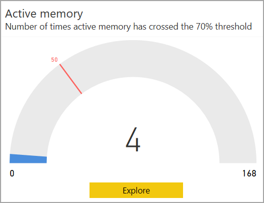
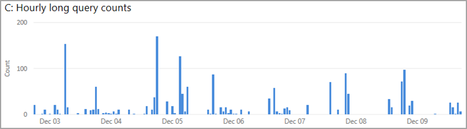
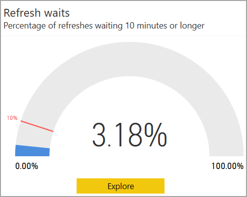

# Power BI Premium Metrics -sovellus

Voit käyttää **Power BI Premium Metrics -sovellusta** Power BI Premium -tilauksesi kunnon ja kapasiteetin hallitsemiseen. Sovelluksen avulla järjestelmänvalvojat käyttävät sovelluksen **Kapasiteettikuntokeskusta** tarkastellakseen ja käsitelläkseen ilmaisimia, jotka seuraavat heidän premium-kapasiteettinsa kuntoa. Metrics-sovellus koostuu aloitussivusta, jonka nimi on **Kapasiteettikuntokeskus**, ja kolmea tärkeää mittaria koskevista tiedoista:

* Aktiivinen muisti
* Kyselyn odotusajat
* Päivityksen odotusajat

Seuraavat osat kuvaavat yksityiskohtaisesti aloitussivua ja kolmea mittariraporttisivua. 

> [!IMPORTANT]
> Jos Power BI Premium -kapasiteetissasi on resurssien runsaan käytön aiheuttamia suorituskyky- tai luotettavuusongelmia, voit saada sähköpostiviesteinä ilmoituksia, joiden avulla voit tunnistaa ja ratkaista ongelmat. Tämä voi olla yksinkertainen tapa ratkaista kapasiteettien ylikuormitus. Lisätietoja on artikkelissa [Kapasiteetin ja luotettavuuden ilmoitukset](service-interruption-notifications.md#capacity-and-reliability-notifications).

## Premium-kapasiteettikuntokeskus

Kun avaat **Power BI Premium Metrics -sovelluksen**, näkyviin tulee **Kapasiteettikuntokeskus**, joka tarjoaa yleiskatsauksen Power BI Premium -kapasiteettisi kuntoon.

Aloitussivulta voit valita tarkasteltavaksesi minkä tahansa haluamasi Power BI Premium -kapasiteetin siinä tapauksessa, että organisaatiollasi on useita Premium-tilauksia. Kun haluat tarkastella Premium-kapasiteettia, valitse läheltä sivun yläreunaa avattava valikko **Valitse kapasiteetti, jotta näet sen mittarit**.

Nyt kolme suorituskykyilmaisinta näyttävät valitun Premium-kapasiteetin nykyisen kunnon kuhunkin suorituskykyilmaisimeen sovellettujen asetusten mukaan. 

Jos haluat tarkastella kutakin suorituskykyilmaisinta koskevia yksityiskohtaisia tietoja, valitse **Tutki**-painike kunkin suorituskykyilmaisimen visualisoinnin alareunasta, ja näyttöön tulee sen yksityiskohtaisten tietojen sivu. Seuraavissa osissa kuvataan kukin suorituskykyilmaisin ja sen sivun tarjoamat yksityiskohtaiset tiedot.

## Aktiivisen muistin mittari

**Aktiivisen muistin** mittari on osa *kapasiteetin suunnittelun* kategoriaa, joka on hyvä kunnon ilmaisin, kun tarkoituksena on arvioida kapasiteettisi käytön resurssitarve niin, että voit säätää kapasiteettia sen mukaisesti kuin kapasiteetin mittakaavan suunnittelu edellyttää. 

**Aktiivinen muisti** on muistia, jota käytetään parhaillaan käytössä olevien tietojoukkojen käsittelemiseen ja jota ei siksi häädetä, kun muistia tarvitaan. Aktiivisen muistin arvo ilmaisee, pystyykö kapasiteettisi selviytymään lisäkuormituksesta vai onko se nykykuormituksella jo lähestymässä rajojaan tai jopa ylittänyt ne. Parhaillaan kulutuksessa olevan aktiivisen muistin määrä tarkoittaa vähemmän muistia käytettäväksi lisäpäivityksiin ja kyselyihin. 

**Aktiivisen muistin** suorituskykyilmaisin mittaa, monestiko kapasiteetin aktiivinen muisti on ylittänyt 70 % kynnysarvon 50 kertaa (merkki on asetettu 30 %:iin viimeisten seitsemän päivän ajaksi), mikä tarkoittaa, että kapasiteetti on lähestymässä sitä kohtaa, jossa käyttäjät alkavat havaita suorituskykyongelmia kyselyjen yhteydessä.

Tässä osassa näkyvä mittarivisualisointi paljastaa, että viimeisten seitsemän päivän kuluttua raportin viime päivityskerrasta kapasiteetti on ylittänyt 70 % kynnyksen neljä kertaa, tuntikohtaisiin säilöihin jaettuna. Mittarin maksimiarvo, 168, edustaa viimeisiä seitsemää päivää tunteina.

Saat yksityiskohtaiset tiedot aktiivisen muistin suorituskykyilmaisimesta napsauttamalla **Tutki**-painiketta. Tällöin saat nähdä raporttisivun, joka tarjoaa erityisiä visualisointeja sen yksityiskohtaisista mittausarvoista sekä vianmääritysohjeen, joka näkyy sivun oikeanpuoleisessa sarakkeessa. 

Selitetään kaksi skenaariota, jotka voit näyttää raporttisivulla valitsemalla **Skenaario 1** tai **Skenaario 2** ao. sivulla. 

Kumpaankin skenaarioon liittyvät vianmääritysoppaat antavat yksityiskohtaisia tietoja mittarien merkityksestä, jotta voit paremmin ymmärtää kapasiteetin tilan, ja kertovat, mitä eri ongelmien lievittämiseksi voidaan tehdä. 

Nämä kaksi skenaariota kuvataan seuraavissa osissa.

### Skenaario 1 – nykyinen kuormitus on liian suuri 

Sen määrittämiseksi, onko kapasiteetilla riittävästi muistia kuormitusten valmiiksi saamiseksi, tarkastele sivun ensimmäistä visualisointia: **A: Kulutetun muistin prosenttiosuudet**. Tämä näyttää niiden tietojoukkojen kuluttaman muistin, jotka ovat aktiivisessa käsittelyssä ja joita ei siksi voi häätää.

Hälytyskynnysarvo, joka on merkitty punaisella pisteviivalla, merkitsee tapauksia, joissa muistin kulutus on saavuttanut 90 %.

Varoituskynnysarvo, joka on merkitty keltaisella pisteviivalla, merkitsee tapauksia, joissa muistin kulutus on saavuttanut 70 %. 

Musta pisteviiva on muistin käytön trendiviiva, joka perustuu nykyisen kapasiteetin muistitarpeeseen käyrän aikajanan matkalla.

Jos aktiivisen muistin arvot ovat usein hälytyskynnysarvon (punaisen pisteviivan) ja muistin trendiviivan (mustan pisteviivan) yläpuolella, tämä tarkoittaa, että muistikapasiteettiin kohdistuu paine, joka saattaa estää lisätietojoukkojen lataamiseen muistiin tänä aikana. 

Sellaisia tapauksia nähdessäsi sinun tulisi tarkastella huolella sivun muita kaavioita sen paremmaksi määrittämiseksi, miksi ja miten muistia kuluu niin paljon ja niin usein ja miten voisit tasapainottaa tai optimoida kuormituksen tai tarvittaessa skaalata kapasiteettia suuremmaksi. 

Toinen sivulla näkyvä visualisointi, **B: Tunneittain ladatut aktiiviset tietojoukot**, näyttää tunnin säilöissä muistiin ladattujen tietojoukkojen maksimimäärät. 

Kolmas visualisointi, **C: Miksi tietojoukot ovat muistissa** on taulukko, joka luetteloi tietojoukot työtilan nimellä, tietojoukon nimellä, tietojoukon pakkaamattomalla muistikoolla ja selittää miksi se on ladattu muistiin (kuten päivittämisen, kyselyn tai molempien vuoksi).

#### Skenaarion 1 vianmääritys

Jatkuva suuri muistin käyttö voi johtaa siihen, että aktiivisesti käytössä olevat tietojoukot häädetään pakolla tai uusia tietojoukkoja ei voida ladata. Seuraavat vaiheet voivat auttaa ongelmien diagnosoinnissa

1. Tarkastele kaaviota *A: Kulutetun muistin prosenttiosuudet*

    **a.** Jos kaavio A näyttää, että hälytyskynnysarvo (90 %) on ylitetty monta kertaa ja/tai yhtäjaksoisesti tuntien ajan, kapasiteetissasi esiintyy liian usein muistipulaa. Seuraavassa kaaviossa näemme, että varoituskynnysarvo (70 %) on ylitetty neljästi.

    

    **b.** Kaavio *B: Tunneittain ladatut aktiiviset tietojoukot* näyttää tunnin säilöissä muistiin ladattujen yksilöllisten tietojoukkojen suurimman määrän. Valitsemalla palkin visualisoinnista ristiinsuodatat syyt, miksi tietojoukot ovat muistin visualisoinnissa.  

         

    **c.** Taulukosta **Miksi tietojoukot ovat muistissa** löydät luettelon tietojoukoista, jotka on ladattu muistiin. Lajittelemalla *tietojoukon koon (Mt)* mukaan korostat niitä tietojoukkoja, jotka kuluttavat muistia eniten. Kapasiteetin toiminnot luokitellaan joko *vuorovaikutteisiksi* tai *taustaksi*. Vuorovaikutteisiin toimintoihin kuuluvat kyselyjen hahmontaminen ja käyttäjien toimintaan reagoiminen (suodatus, Q&A-kyselyt jne). Kyselyjen kokonaismäärä ja päivitysten kokonaismäärä antavat osviittaa siitä, kohdistuuko tietojoukkoon raskaammin vuorovaikutteisia (kyselyt) vai taustatoimintoja (päivitykset). On tärkeää ymmärtää, että vuorovaikutteisia toimintoja priorisoidaan aina suhteessa taustatoimintoihin parhaan mahdollisen käyttökokemuksen varmistamiseksi. Jos resursseja ei ole riittävästi, taustatoiminnot lisätään jonoon ja suoritetaan sitä mukaa kuin resursseja vapautuu. Power BI -palvelu voi keskeyttää taustatoiminnot, kuten tietojoukon päivitykset ja tekoälytoiminnot, kesken käsittelyn ja lisätä ne jonoon.
    
      

#### Korjaustoimenpiteitä skenaarioon 1

Voit suorittaa seuraavat vaiheet skenaarioon 1 liittyvien ongelmien korjaamiseksi:

1. **Skaalaa kapasiteettia suuremmaksi** – kapasiteetin skaalaaminen ylös seuraavaan SKU:hun vapauttaa kaksi kertaa nykyistä SKU:ta suuremman määrän muistia ja lievittää kapasiteettiin nyt kohdistuvaa muistipainetta.

2. **Siirrä tietojoukkoja toiseen kapasiteettiin** – jos sinulla on enemmän muistia saatavilla toisessa kapasiteetissa, voit siirtää siihen suuremmat tietojoukot sisältäviä työtiloja.

### Skenaario 2 – tuleva kuormitus ylittää rajoitukset

Sen määrittämiseksi,onko kapasiteetilla riittävästi muistia työkuormitusten loppuun saamiseksi, voit tarkastella visualisointia **A: Kulutetun muistin prosenttiosuudet** sivun yläosassa. Tämä näyttää niiden tietojoukkojen kuluttaman muistin, jotka ovat aktiivisessa käsittelyssä ja joita ei siksi voi häätää. Musta pisteviiva korostaa kehitystrendejä. Jos kapasiteettiin kohdistuu muistipainetta, sama visualisointi näyttää selvästi muistin kehityssuunnan (mustan pisteviivan) olevan ylöspäin, mikä tarkoittaa, että siinä ajankohdassa kapasiteetti saattaa estää lisätietojoukkojen lataamisen muistiin. Trendiviiva, musta katkoviiva, näyttää kasvun kehitystrendin seitsemän päivän tietojen perusteella. 

#### Skenaarion 2 vianmääritys

Skenaarioon 2 liittyvien vianmääritysten tekemiseksi on määritettävä, onko trendiviiva nousemassa kohti varoitus- tai hälytyskynnysarvoa. 

1. Tarkastele **kaaviota A:**

    

    **a.** Jos kaavio näyttää ylöspäin suuntautuvan rinteen, tämä tarkoittaa, että muistin kulutus on kasvanut viimeisten seitsemän päivän aikana.

    **b.** Oletetaan, että nykyinen kasvu jatkuu, ja ennustetaan, milloin trendiviiva ylittää varoituskynnysarvon (keltaisen katkoviivan).

    **c.** Tarkista trendiviiva ainakin joka toinen päivä siltä varalta että trendi jatkuu entisellään.

#### Korjaustoimenpiteitä skenaarioon 2

Voit suorittaa seuraavat vaiheet skenaarioon 2 liittyvien ongelmien korjaamiseksi:

1. **Skaalaa kapasiteettia suuremmaksi** – kapasiteetin skaalaaminen ylös seuraavaan SKU:hun vapauttaa kaksi kertaa nykyistä SKU:ta suuremman määrän muistia ja lievittää kapasiteettiin nyt kohdistuvaa muistipainetta.

2. **Siirrä tietojoukkoja toiseen kapasiteettiin** – jos sinulla on enemmän muistia saatavilla toisessa kapasiteetissa, voit siirtää siihen suuremmat tietojoukot sisältäviä työtiloja.

## Kyselyn odotusajan arvo

**Kyselyt**-luokka ilmaisee, kokevatko käyttäjät mahdollisesti raporttivisualisointien reagoivan hitaasti tai lakkaavan vastaamasta. **Kyselyn odotusaika** on aika, jonka kuluttua kyselyn käynnistämisestä kyselyn suorittaminen alkaa. Tämä suorituskykyilmaisin mittaa, odottaako 25 % tai suurempi määrä valitun kapasiteetin kyselyistä suorittamistaan 100 millisekunnin ajan tai kauemmin. Kyselyn viivästyksiä esiintyy, jos saatavilla oleva suoritin ei kykene suorittamaan kaikkia odottavia kyselyjä. 

Tämän visualisoinnin mittariasteikko näyttää, että raportin viime päivityksestä kuluneiden seitsemän päivän aikana 17,32 % kyselyistä viivästyi enemmän kuin 100 millisekuntia. 

Saat lisätietoja kyselyn odotusajan suorituskykyilmaisimesta napsauttamalla **Tutki**-painiketta. Näin saat näkyviin raporttisivun, jossa on asiaan liittyvien arvojen visualisointi sekä sivun oikeanpuoleisessa sarakkeessa vianmääritysohje. Vianmääritysohjeessa on kaksi skenaariota, jotka kumpikin antavat yksityiskohtaisia selityksiä mittarista, kapasiteetin tilasta ja siitä, miten voit lievittää ongelmaa.

Tarkastelemme seuraavissa osissa kumpaakin kyselyn viivästymiseen liittyvää skenaariota.

### Skenaario 1 – pitkäkestoiset kyselyt kuluttavat suoritinta

Skenaariossa 1 pitkäkestoiset kyselyt vievät liikaa suorittimen suorituskykyä. 

Voit tutkia, johtuuko huono raporttisuorituskyky kapasiteetin ylikuormituksesta vai puutteellisesti suunnitellusta tietojoukosta tai raportista. On useita syitä, miksi kysely voi kestää liian pitkään, mikä tarkoittaa, että sen suorittamiseen kuluu enemmän kuin 10 sekuntia. Tietojoukon koko ja mutkikkuus sekä kyselyn monimutkaisuus ovat vain esimerkkejä syistä, jotka aiheuttavat pitkäkestoisen kyselyn. 

Raporttisivulla näkyvät seuraavat visualisoinnit: 

* Yläosan taulukko **A: Pitkät odotusajat** luetteloi ne tietojoukot, joiden kyselyt ovat viivästyneet. 
* **B: Tuntikohtaiset pitkien odotusaikojen jakaumat** näyttää pitkien odotusaikojen jakauman. 
* Kaavio **C: Tuntikohtaiset pitkien kyselyjen määrät** näyttää suoritettujen pitkäkestoisten kyselyjen määrät eroteltuina tuntikohtaisiin säilöihin.
* Viimeinen visualisointi, taulukko **D: Pitkäkestoiset kyselyt**, luetteloi pitkäkestoiset kyselyt ja niiden tilastotiedot.

Seuraavassa on kuvattu vaiheet, jotka suorittamalla voit diagnosoida ja korjata kyselyjen odotusaikoihin liittyviä ongelmia.

#### Skenaarion 1 vianmääritys

Ensin voit selvittää, esiintyykö pitkäkestoisia kyselyjä silloin, kun kyselyt odottavat. 

Katso **kaaviota B**, joka näyttää pitempään kuin 100 ms odottavien kyselyjen määrän. Valitse yksi niistä sarakkeista, joissa näkyy suuri määrä odottavia kyselyjä.

Kun napsautat pitkiä odotusaikoja sisältävää saraketta, **kaavio C** suodattuu näyttämään kyseisen ajan kuluessa suoritetut pitkäkestoiset kyselyt seuraavassa kuvassa esitetyllä tavalla:

Lisäksi myös **kaavio D** suodatetaan niin, että se näyttää kyselyt, jotka valittuna aikana olivat pitkäkestoisia.

#### Korjaustoimenpiteitä skenaarioon 1

Seuraavia vaiheita suorittamalla voit korjata skenaarioon 1 liittyviä ongelmia:

1. **Suorita PerfAnalyzer raporttien ja tietojoukkojen optimoimiseksi** – tämä suorituskyvyn analysointityökalu näyttää sivun kaikkien vuorovaikutusten vaikutukset, myös sen, kuinka kauan kunkin visualisoinnin päivittäminen kestää ja mihin aika kuluu.

2. **Skaalaa kapasiteettia suuremmaksi** – kapasiteetin skaalaaminen ylös seuraavaan SKU:hun vapauttaa kaksi kertaa nykyistä SKU:ta suuremman määrän suoritintehoa ja lievittää suoritinpainetta, joka voi olla syynä kyselyjen pitkittymiseen.

3. **Siirrä tietojoukkoja toiseen kapasiteettiin** – jos sinulla on enemmän suoritintehoa saatavilla toisessa kapasiteetissa, voit siirtää ne työtilat, joihin sisältyvät tietojoukot sisältävät toisessa kapasiteetissa odottavat kyselyt.

### Skenaario 2 – liian monta kyselyä

Skenaariossa 2 käynnissä on liian monta kyselyä.

Kun suoritettavien kyselyjen määrä ylittää kapasiteetin rajat, kyselyt sijoitetaan jonoon, kunnes niiden suorittamiseen avautuu resursseja. Jos jono kasvaa liian pitkäksi, jonon kyselyt voivat viivästyä enemmän kuin 100 millisekuntia.

#### Skenaarion 2 vianmääritys

Valitse **taulukosta A** tietojoukko, jolla on suuri prosenttimäärä odotusaikaa.

Kun olet valinnut tietojoukon, jonka odotusaika on pitkä, **kaavio B** suodatetaan niin, että se näyttää kyseisen tietojoukon kyselyjen odotusaikajakauman viimeisten seitsemän päivän ajalta. Valitse seuraavaksi yksi **kaavion B** sarakkeista.

**Kaavio C** suodattuu sitten näyttämään jonon pituuden kaaviosta B valittuna aikana.

Jos jonon pituus on ylittänyt kynnysarvon 20, on todennäköistä, että valitun tietojoukon kyselyt ovat viivästyneet, koska liian monta kyselyä yritetään suorittaa samanaikaisesti.

#### Korjaustoimenpiteitä skenaarioon 2

Voit suorittaa seuraavat vaiheet skenaarioon 2 liittyvien ongelmien korjaamiseksi:

1. **Skaalaa kapasiteettia suuremmaksi** – kapasiteetin skaalaaminen ylös seuraavaan SKU:hun vapauttaa kaksi kertaa nykyistä SKU:ta suuremman määrän muistia ja lievittää kapasiteettiin nyt kohdistuvaa muistipainetta.

2. **Siirrä tietojoukkoja toiseen kapasiteettiin** – jos sinulla on enemmän muistia saatavilla toisessa kapasiteetissa, voit siirtää siihen suuremmat tietojoukot sisältäviä työtiloja.

## Päivityksen odotusaikamittari

**Päivityksen odotusajan** arvo auttaa ymmärtämään, milloin käyttäjät voivat saada käyttöönsä vanhaa tai vanhentunutta raporttitietoa. **Päivityksen odotusaika** tarkoittaa aikaa, jonka verran annettu aika on joutunut odottamaan suorituksen alkamista vaaditusta tai ajoitetusta suorituksen käynnistyshetkestä alkaen. Tämä suorituskykymittari mittaa, viivästyykö 10 % tai suurempi määrä odottavista päivityspyynnöistä 10 minuuttia tai kauemmin. Viivästymistä esiintyy yleensä silloin, kun muistia tai suoritintehoa ei ole saatavilla riittävästi.

Asteikko näyttää, että seitsemän päivän kuluessa viimeisestä raporttipäivityksestä 3,18% päivityksistä on viivästynyt yli 10 minuuttia. 

Saat lisätietoja **päivityksen odotusaikojen** suorituskykyilmaisimesta napsauttamalla **Tutki**-painiketta, jolloin raporttisivun oikeanpuoleisessa sarakkeessa näkyy mittarit sisältävä sivu sekä vianmääritysopas. Opas tarjoaa yksityiskohtaista tietoa sivun mittareista ja auttaa sinua ymmärtämään kapasiteetin tilaa sekä ongelmien lieventämismahdollisuuksia.

Selitetään kaksi skenaariota, jotka voit näyttää raporttisivulla valitsemalla ao. sivulta Skenaario 1 tai Skenaario 2. Seuraavissa osissa tarkastelemme kumpaakin skenaariota vuorollaan.

### Skenaario 1 – muisti ei riitä

Skenaariossa 1 saatavilla oleva muisti ei riitä tietojoukon lataamiseen. On kaksi tilannetta, joissa päivitys voi jäädä kiinni muistin ollessa niukalla:

1. Muisti ei riitä tietojoukon lataamiseen.
2. Päivitys on peruutettu prioriteetiltaan etusijalla olevan toiminnon vuoksi. 

Tietojoukkojen prioriteettijärjestys on seuraava:

1. Vuorovaikutteinen kysely
2. Pyydettäessä suoritettava päivitys
3. Ajoitettu päivitys

Jos vuorovaikutteisen kyselyn tietojoukon lataamiseen ei ole riittävästi muistia, ajoitetut päivitykset pysäytetään ja niiden tietojoukkojen lataus puretaan, kunnes muistia tulee riittävästi käytettäväksi. Jos tämä ei vapauta riittävästi muistia, pyydettäessä suoritettavat päivitykset keskeytetään ja niiden tietojoukkojen lataus puretaan.

#### Skenaarion 1 vianmääritys

Skenaarion 1 vianmäärityksessä tulee ensin määrittää, johtuuko rajoittaminen muistin riittämättömyydestä. Voit tehdä sen suorittamalla seuraavat vaiheet.

1.    Valitse sinua kiinnostava tietojoukko **taulukosta A** napsauttamalla sitä: 

    

    a. Kun tietojoukko valitaan **taulukosta A**, **kaavio B** suodattuu näyttämään, milloin odotus tapahtui.

    

    b. **Kaavio C** suodattuu sitten näyttämään kaikki rajoittamistapaukset, kuten seuraavassa vaiheessa selitetään. 

2. Tarkastele tuloksia nyt suodatetussa **kaaviossa C**. Jos kaavio näyttää, että muistipulan aiheuttamaa rajoittamista ilmeni tietojoukon odottaessa, tietojoukko viivästyi muistin loppumisen vuoksi.

    

3. Tarkista lopuksi **kaavio D**, joka näyttää esiintyneiden päivitysten tyypin, ajoitetut tai pyydettäessä tehdyt. Kaikki samanaikaiset pyydettäessä tehdyt päivitykset voivat aiheuttaa rajoittamista.

    

#### Korjaustoimenpiteitä skenaarioon 1

Voit suorittaa seuraavat vaiheet skenaarioon 1 liittyvien ongelmien korjaamiseksi:

1. **Skaalaa kapasiteettia suuremmaksi** – kapasiteetin skaalaaminen ylös seuraavaan SKU:hun vapauttaa kaksi kertaa nykyistä SKU:ta suuremman määrän muistia ja lievittää kapasiteettiin nyt kohdistuvaa muisti- ja suoritintehopainetta.

2. **Siirrä tietojoukkoja toiseen kapasiteettiin** – jos viivästyksesi johtuu muistipaineesta ja sinulla on enemmän muistia saatavilla toisessa kapasiteetissa, voit siirtää ne työtilat, jotka sisältävät toisessa kapasiteetissa odottavat tietojoukot.

3. **Harvenna ajoitettuja päivityksiä** – päivityksiä harventamalla vältät liian monien päivitysten yhtaikaiset suoritusyritykset.

### Skenaario 2 – ei tarpeeksi suoritintehoa päivitystä varten

Skenaariossa 2 käytettävissä ei ole tarpeeksi suoritintehoa päivityksen suorittamiseen. 

Erillisillä kapasiteeteilla Power BI rajoittaa samanaikaisten päivitysten määrää. Tämä luku on sama kuin taustaytimien määrä kertaa 1,5. Esimerkiksi erillinen P1-kapasiteetti, jolla on neljä taustaydintä, voi suorittaa 6 päivitystä samanaikaisesti. Kun samanaikaisten päivitysten suurin määrä on saavutettu, muut päivitykset odottavat, kunnes suoritettavana oleva päivitys on valmis.

#### Skenaarion 2 vianmääritys

Skenaarion 2 diagnosoimiseksi on ensin määritettävä, johtuuko rajoittaminen siitä, että päivitysten suurin sallittu samanaikaisuus on saavutettu. Voit tehdä sen suorittamalla seuraavat vaiheet.

1.    Valitse sinua kiinnostava tietojoukko **taulukosta A** napsauttamalla sitä: 

    

    a. Kun tietojoukko valitaan **taulukosta A**, **kaavio B** suodattuu näyttämään, milloin odotus tapahtui.

    

    b. **Kaavio C** suodattuu sitten näyttämään kaikki rajoittamistapaukset, kuten seuraavassa vaiheessa selitetään. 

2. Tarkastele tuloksia nyt suodatetussa **kaaviossa C**. Jos kaaviossa näytetään, että *suurin mahdollinen samanaikaisuus* ilmeni tietojoukon odotusaikoina, se tarkoittaa, että tietojoukko viivästyi, koska saatavilla ei ollut riittävää suoritintehoa.

    

3. Tarkista lopuksi **kaavio D**, joka näyttää esiintyneiden päivitysten tyypin, ajoitetut tai pyydettäessä tehdyt. Kaikki samanaikaiset pyydettäessä tehdyt päivitykset voivat aiheuttaa rajoittamista.

    

#### Korjaustoimenpiteitä skenaarioon 2

1. **Skaalaa kapasiteettia suuremmaksi** – kapasiteetin skaalaaminen ylös seuraavaan SKU:hun vapauttaa kaksi kertaa nykyistä SKU:ta suuremman määrän muistia ja nykyistä SKU:ta kaksi kertaa enemmän samanaikaisia päivityksiä lievittäen kapasiteettiin nyt kohdistuvaa muisti- ja suoritintehopainetta.

2. **Siirrä tietojoukkoja toiseen kapasiteettiin** – jos viivästyksesi johtuu siitä, että suurin mahdollinen samanaikaisuus on saavutettu, ja sinulla on enemmän samanaikaisuutta saatavilla toisessa kapasiteetissa, voit siirtää ne työtilat, jotka sisältävät toisessa kapasiteetissa odottavat tietojoukot.

3. **Harvenna ajoitettuja päivityksiä** – päivityksiä harventamalla vältät liian monien päivitysten yhtaikaiset suoritusyritykset.

## Seuraavat vaiheet

* [Mikä on Power BI Premium?](service-premium-what-is.md)
* [Power BI Premiumin julkaisutiedot](../service-premium-release-notes.md)
* [Microsoft Power BI Premiumin tekninen raportti](https://aka.ms/pbipremiumwhitepaper)
* [Power BI:n yrityskäyttöönoton suunnittelemisen tekninen raportti](https://aka.ms/pbienterprisedeploy)
* [Laajennetun Pro-kokeiluversion aktivointi](../service-extended-pro-trial.md)
* [Power BI Embedded: usein kysytyt kysymykset](../developer/embedded/embedded-faq.md)

Onko sinulla kysyttävää? [Voit esittää kysymyksiä Power BI -yhteisössä](https://community.powerbi.com/)