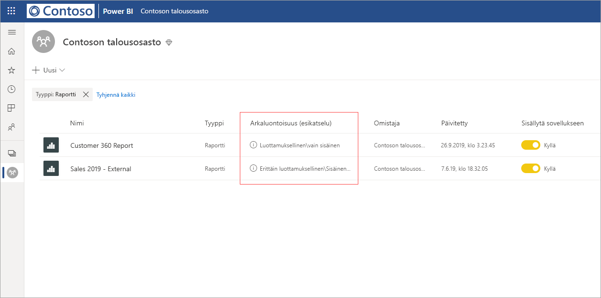
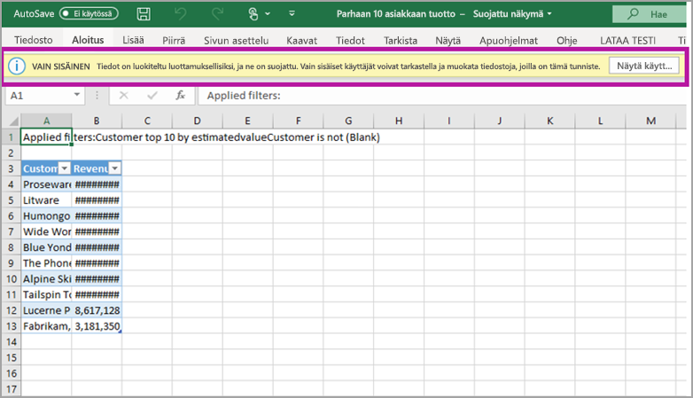

# Tietojen suojaus Power BI:ssä (esiversio)

Nykyajan yrityksillä on tiukat määräykset ja vaatimukset arkaluontoisten tietojen käsittelemiseen ja suojaamiseen. Power BI:hin voidaan integroida Microsoft Information Protection ja Microsoft Cloud App Security, mikä helpottaa arkaluontoisten tietojen hallintaa ja näkyvyyttä Power BI:ssä. 

Power BI:n tietojen suojauksessa voit tehdä seuraavaa:

* Microsoft-luottamuksellisuustunnisteiden avulla voit luokitella ja merkitä sisältöä Power BI -palvelussa (raporttinäkymät, raportit, tietojoukot ja tietovuot) käyttämällä samaa taksonomiaa, jota käytetään tiedostojen luokittelemiseen ja suojaamiseen Office 365:ssä. 

* Pakota suojausasetuksia, kuten salausta tai vesileimoja, kun viet tietoja Power BI -palvelusta tiedostoihin, käyttämällä sisällön luottamuksellisuustunnistetta ja suojausta (Excel, PowerPoint ja PDF). 

  Käyttäjät voivat esimerkiksi lisätä Power BI -raporttiin luottamuksellisuustunnisteen Luottamuksellinen. Kun tiedot tämän jälkeen viedään Excel-tiedostoon, Power BI käyttää tiedostoon Luottamuksellinen-tunnistetta. Tunniste voi salata sisällön ja lisätä Luottamuksellinen-vesileiman.

* Microsoft Cloud App Securityn avulla voit tarkkailla toimintoja Power BI:ssä, tutkia tietoturvaongelmia ja suojata Power BI -sisältöä Microsoft Cloud App Securityn ehdollisten käyttöoikeuksien sovellusten hallinnalla. 

## Luottamuksellisuustunnisteet Power BI:ssä

Luottamuksellisuustunnisteita voi luoda ja hallita joko [Microsoft 365 -tietoturvakeskuksessa](https://security.microsoft.com/) tai [Microsoft 365 -yhteensopivuuskeskuksessa](https://compliance.microsoft.com/).

Jos haluat käyttää luottamuksellisuustunnisteita jommassakummassa näistä keskuksista, siirry kohtaan **Luokittelu > Luottamuksellisuustunnisteet**. Näitä luottamuksellisuustunnisteita voidaan käyttää useissa Microsoft-palveluissa, kuten Azure Information Protectionissa, Office-sovelluksissa ja Office 365 -palveluissa.

> [!IMPORTANT]
> Azure Information Protection -asiakkaiden on siirrettävä tunnisteet johonkin aiemmin listatuista palveluista, jotta luottamuksellisuustunnisteita voidaan käyttää Power BI:ssä. Lisäksi luottamuksellisuustunnisteita tuetaan vain julkisissa pilvipalveluissa, eikä niitä tueta itsenäisissä pilvipalveluissa.
>
> Lue lisätietoja siitä, miten [siirtää luottamuksellisuustunnisteita Microsoft Information Protectioniin](https://docs.microsoft.com/azure/information-protection/configure-policy-migrate-labels).

## Miten luottamuksellisuustunnisteet toimivat

Kun käytät luottamuksellisuustunnistetta Power BI -raporttinäkymässä, raportissa, tietojoukossa tai tietovuossa, se toimii samaan tapaan kuin *tunnisteen* käyttö kyseisessä resurssissa. Se tuo mukanaan seuraavat edut:
* **Mukautettavuus** – voit luoda luokkia, jotka koskevat organisaatiosi arkaluontoisten sisältöjen, kuten henkilökohtaisten, julkisten, yleisten, luottamuksellisten ja erittäin luottamuksellisten tietojen, eri tasoja.
* **Selkeä teksti** – koska tunniste on selkeässä tekstimuodossa, käyttäjien on helppo ymmärtää, miten sisältöä tulee käsitellä luottamuksellisuustunnisteen ohjeiden mukaisesti.
* **Pysyvä** – kun luottamuksellisuustunniste on otettu käyttöön sisällössä, se siirtyy kyseisen sisällön mukana, kun se viedään seuraaviin tuettuihin tiedostotyyppeihin: Excel, PowerPoint ja PDF. 

  Tämä tarkoittaa sitä, että luottamuksellisuustunniste sekä siihen liittyvät suojausasetukset kulkevat sisällön mukana, ja nämä toimivat perustana käytäntöjen soveltamiselle ja valvomiselle. 

## Esimerkki luottamuksellisuustunnisteesta 

Seuraavassa on lyhyt esimerkki siitä, miten luottamuksellisuustunniste toimii Power BI:ssä.

1. Raporttiin lisätään luottamuksellisuustunniste **Erittäin luottamuksellinen – vain sisäiseen käyttöön** Power BI -palvelussa.

   

2. Kun tästä raportista viedään tietoja Excel-tiedostoon, luottamuksellisuustunniste ja suojaus otetaan käyttöön viedyssä Excel-tiedostossa.

   

Microsoft Office -sovelluksissa luottamuksellisuustunniste näkyy sähköpostiviestin tai asiakirjan tunnisteessa, joka on samankaltainen kuin yllä olevassa kuvassa.

Voit myös määrittää sisällölle luokituksen (kuin tarran), joka on pysyvä ja kulkee sisällön mukana, kun sitä käytetään ja jaetaan. Tämän luokituksen avulla voit luoda käyttöraportteja ja tarkastella arkaluontoisen sisältösi toimintatietoja. Näiden tietojen perusteella voit halutessasi myöhemmin ottaa suojausasetukset käyttöön.

## Luottamuksellisuustunnisteiden käyttö Power BI:ssä

Ennen kuin luottamuksellisuustunnisteet voidaan ottaa käyttöön Power BI:ssä, sinun on ensin täytettävä seuraavat edellytykset: 

* Varmista, että luottamuksellisuustunnisteet on määritetty joko [Microsoft 365 -tietoturvakeskuksessa](https://security.microsoft.com/) tai [Microsoft 365 -yhteensopivuuskeskuksessa](https://compliance.microsoft.com/). 
* [Ota luottamuksellisuustunnisteet käyttöön](service-security-enable-data-sensitivity-labels.md) (esiversio) Power BI:ssä.
* Varmista, että käyttäjillä on asianmukaiset käyttöoikeudet;
  * Jos haluat ottaa käyttöön tai tarkastella tunnisteita Power BI:ssä, käyttäjillä on oltava Azure Information Protection Premium P1- tai Premium P2 -käyttöoikeus. Microsoft Azure Information Protectionin voi ostaa joko erillisenä tuotteena tai jonkin Microsoftin käyttöoikeuspaketin kautta. Lisätietoja on artikkelissa [Azure Information Protectionin hinnoittelu](https://azure.microsoft.com/pricing/details/information-protection/).
  * Käyttääkseen otsikoita Power BI -resursseihin käyttäjällä on jonkin yllä mainitun Azure Information Protection -käyttöoikeuden lisäksi oltava Power BI Pro -käyttöoikeus. 

## Sisällön suojaaminen Microsoft Cloud App Securityn avulla

Voit suojata Power BI -sisältöä tahattomien vuotojen tai tietomurtojen varalta Microsoft Cloud App Securityn avulla. Kun Microsoft Cloud App Security on määritetty, tietoturvasta vastaavat järjestelmänvalvojat voivat valvoa käyttäjien käyttöoikeuksia ja toimintaa, tehdä reaaliaikaisia riskianalyyseja ja määrittää otsikkokohtaisia ohjausobjekteja.

Organisaatiot voivat esimerkiksi määrittää Microsoft Cloud App Securityn avulla käytännön, joka estää käyttäjiä lataamasta arkaluontoisia tietoja Power BI:stä hallitsemattomiin laitteisiin. Tällaisen määrityksen avulla käyttäjät voivat pysyä tuottavina ja muodostaa yhteyden Power BI:hin mistä tahansa, mutta samalla Microsoft Cloud App Securityn avulla voidaan reaaliaikaisesti estää käyttäjiä vaarantamasta tietoturvaa toiminnallaan. 

### Vaatimukset

Jotta voit käyttää Microsoft Cloud App Securitya luottamuksellisuustunnisteissasi, sinun on täytettävä seuraavat vaatimukset: 

* Cloud App Security ja Azure Information Protection [on oltava vuokraajan käytössä](https://docs.microsoft.com/cloud-app-security/azip-integration).
* Sovelluksen [on oltava yhdistetty Microsoft Cloud App Securityyn](https://docs.microsoft.com/cloud-app-security/enable-instant-visibility-protection-and-governance-actions-for-your-apps).

## Huomioitavat asiat ja rajoitukset

Seuraavassa on lueteltu joitakin luottamuksellisuustunnisteiden rajoituksia Power BI:ssä:

* Microsoft Information Protectionin luottamuksellisuustunnisteiden käyttö ja tarkastelu Power BI:ssä edellyttää Azure Information Protection Premium P1- tai Premium P2 -käyttöoikeutta. Microsoft Azure Information Protectionin voi ostaa joko erillisenä tuotteena tai jonkin Microsoftin käyttöoikeuspaketin kautta. Lisätietoja on artikkelissa [Azure Information Protectionin hinnoittelu](https://azure.microsoft.com/pricing/details/information-protection/).
* Luottamuksellisuustunnisteita voi käyttää vain koontinäytöissä, raporteissa, tietojoukoissa ja tietovoissa.
* Tunnisteiden ja suojausten pakotus vietäviin tiedostoihin on tuettu vain Excel-, PowerPoint- ja PDF-tiedostoille. Tunnisteita ja suojausta ei pakoteta, kun tietoja viedään .CSV-tiedostoihin, tilataan sähköpostiin,upotetaan visualisointeihin tai tulostetaan.
* Käyttäjällä, joka vie tiedoston Power BI:stä, on oikeus käyttää ja muokata tiedostoa luottamuksellisuustunnisteasetusten mukaisesti. Tiedot vienyt käyttäjä ei saa omistajan käyttöoikeuksia tiedostoon. 
* Luottamuksellisuustunnisteet eivät ole tällä hetkellä käytettävissä [sivutetuille raporteille]( https://docs.microsoft.com/power-bi/paginated-reports-report-builder-power-bi) tai työkirjoille.
* Power BI -resurssien luottamuksellisuustunnisteet näkyvät vain työtilan luettelo- ja historiatiedot-näkymissä. Tunnisteet eivät tällä hetkellä näy näkymissä suosikit, jaettu kanssani, viimeaikaiset tai sovellukset. Huomaathan kuitenkin, että Power BI -resurssissa käytetty tunniste säilyy aina Excel-, PowerPoint- ja PDF-tiedostoihin viedyissä tiedoissa, vaikka se ei olisikaan näkyvissä.
* Luottamuksellisuustunnisteen *tiedoston salausasetukset*, jotka on määritetty joko [Microsoft 365 -tietoturvakeskusessa](https://security.microsoft.com/) tai [Microsoft 365 -yhteensopivuuskeskuksessa](https://compliance.microsoft.com/), ovat käytössä vain tiedostoissa, jotka *viedään* Power BI:stä; eivät Power BI:n *sisällä*.
* [HYOK-suojausta](https://docs.microsoft.com/azure/information-protection/configure-adrms-restrictions) ei tueta Power BI:ssä käytetyille luottamuksellisuustunnisteille.
* Tunnisteiden tarkastelu ja käyttö Office-sovelluksissa vaatii tiettyjä [käyttöoikeuksia](https://docs.microsoft.com/microsoft-365/compliance/sensitivity-labels-office-apps#subscription-and-licensing-requirements-for-sensitivity-labels).
* Luottamuksellisuustunnisteita tuetaan vain yleisten (julkisten) pilvipalveluiden vuokraajille. Luottamuksellisuustunnisteita ei tueta muiden pilvipalveluiden vuokraajille.
* Tietojen luottamuksellisuustunnisteita ei tueta mallisovellusten tapauksessa.
* Power BI ei tue luottamuksellisuustunnisteita **Ei lähetetä edelleen**- ja**Ad-Hoc**-suojaustyyppien tapauksessa.

## Seuraavat vaiheet

Tässä artikkelissa annetaan yleiskatsaus tietojen suojaamisesta Power BI:ssä. Seuraavissa artikkeleissa annetaan lisätietoja tietojen suojaamisesta Power BI:ssä. 

* [Luottamuksellisuustunnisteiden käyttöönotto Power BI:ssä](service-security-enable-data-sensitivity-labels.md)
* [Luottamuksellisuustunnisteiden käyttö Power BI:ssä](../designer/service-security-apply-data-sensitivity-labels.md)
* [Microsoft Cloud App Securityn hallinnan käyttö Power BI:ssä](service-security-using-microsoft-cloud-app-security-controls.md)
* [Tietojen suojauksen tulosraportti](service-security-data-protection-metrics-report.md)