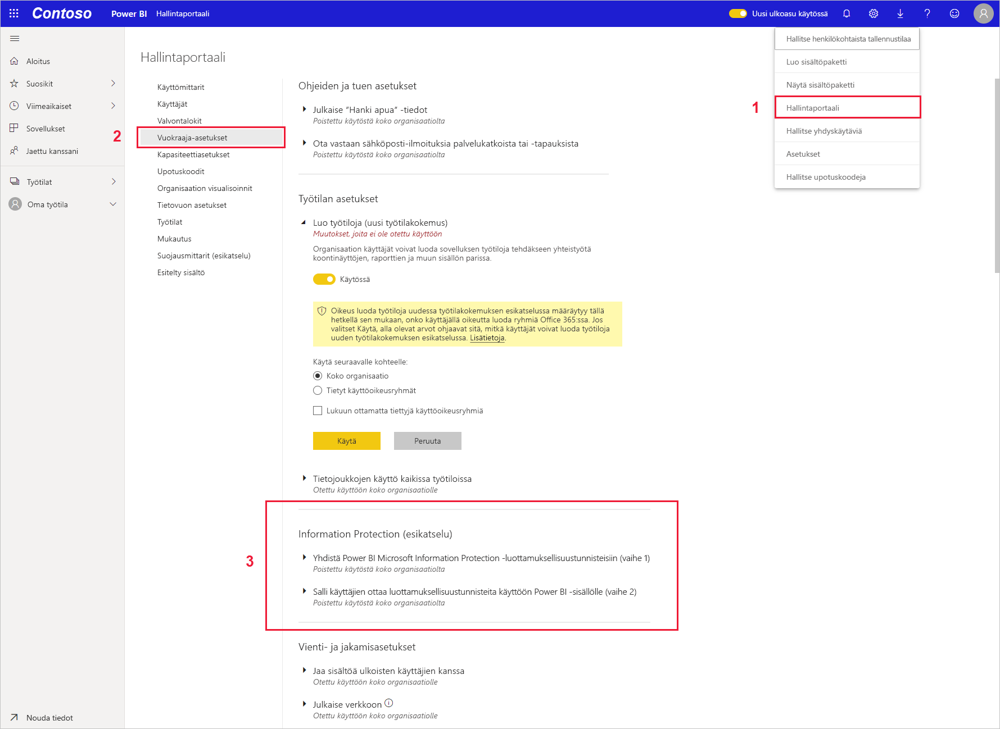

# Luottamuksellisuustunnisteiden käyttöönotto Power BI:ssä (esiversio)

Kun [Microsoft Information Protectionin tietojen luottamuksellisuustunnisteet](https://docs.microsoft.com/microsoft-365/compliance/sensitivity-labels) ovat käytössä Power BI:ssä, sovelletaan seuraavaa:

* Jotkin organisaation käyttäjät ja käyttöoikeusryhmät voivat luokitella ja [käyttää luottamuksellisuustunnisteita](../collaborate-share/service-security-apply-data-sensitivity-labels.md) Power BI -koontinäyttöihin, raportteihin, tietojoukkoihin ja tietovoihin (jäljempänä *resurssit*).
* Kaikki organisaation jäsenet näkevät nämä tunnisteet.

Tietojen luottamuksellisuustunnisteet edistävät tietojen suojausta antamalla Power BI:n tekijöille ja käyttäjille tietoa tietojen arkaluonteisuudesta. Samalla he saavat tietoja siitä, mitä luokitus tarkoittaa ja miten tietoja, joilla on kyseinen luokitus, käsitellään.

Kun Power BI:n tietoja, joilla on tietojen luottamuksellisuustunniste, viedään Excel-, PowerPoint- tai PDF-tiedostoon, tietojen luottamuksellisuustunniste siirtyy tietojen mukana. Tämä tarkoittaa sitä, että käyttäjä, jolla ei ole luottamuksellisuustunnistekäytäntöjen mukaisia oikeuksia käyttää merkittyjä tietoja, ei pysty avaamaan tiedostoja Power BI:n *ulkopuolella* (Excel-, PowerPoint- tai PDF-sovelluksissa).

Tietojen luottamuksellisuustunnisteiden käyttöönottoon vaaditaan Azure Information Protection -käyttöoikeus. Lisätietoja on artikkelissa [Käyttöoikeudet](#licensing).

## Tietojen luottamuksellisuustunnisteiden ottaminen käyttöön

Jos haluat ottaa käyttöön Microsoft Information Protectionin tietojen luottamuksellisuustunnisteet Power BI:ssä, siirry Power BI -hallintaportaaliin, avaa Vuokraaja-asetukset-ruutu ja etsi Tietojen suojaus -osio.

Tee **Tietojen suojaus** -osiossa seuraavat vaiheet:
1.  Valitse **Ota käyttöön Microsoft Information Protectionin luottamuksellisuustunnisteet** ja valitse **Käytä**. Tämä vaihe *ainoastaan* tekee luottamuksellisuustunnisteista näkyviä koko organisaatiolle. Se ei vielä määritä tunnisteita tiedoille. Määrittääksesi, ketkä voivat käyttää näitä tunnisteita Power BI:ssä, sinun on suoritettava vaihe 2.
2.  Määritä, ketkä voivat ottaa käyttöön ja muuttaa luottamuksellisuustunnisteita Power BI -resursseissa. Tämä vaihe sisältää kolme toimintoa:
    1.  Valitse **Aseta Power BI -sisällön ja -tietojen luottamuksellisuusotsikot**.
    2.  Valitse haluamasi käyttöoikeusryhmät. Oletusarvoisesti kaikki organisaatiossasi voivat käyttää luottamuksellisuustunnisteita. Voit kuitenkin halutessasi ottaa luottamuksellisuustunnisteet käyttöön vain tietyille käyttäjille tai käyttöoikeusryhmille. Kun valittuna on joko koko organisaatio tai tietyt käyttöoikeusryhmät, voit jättää pois tiettyjä käyttäjien tai käyttöoikeusryhmien alijoukkoja.
    * Kun luottamuksellisuustunnisteet otetaan käyttöön koko organisaatiolle, poikkeukset ovat yleensä käyttöoikeusryhmiä.
    * Kun luottamuksellisuustunnisteet ovat käytössä vain tietyille käyttäjille tai käyttöoikeusryhmille, poikkeukset ovat yleensä tiettyjä käyttäjiä.  
    Tämän lähestymistavan avulla on mahdollista estää joitakin käyttäjiä käyttämästä luottamuksellisuustunnisteita Power BI:ssä, vaikka he kuuluisivat ryhmään, jolla on siihen oikeudet.
    
    3. Valitse **Käytä**.

> [!IMPORTANT]
> Vain Power BI Pro -käyttäjät, joilla on oikeudet *luoda* ja *muokata* resurssia, ja jotka kuuluvat tässä osiossa määritettyyn käyttöoikeusryhmään, voivat määrittää ja muokata luottamuksellisuustunnisteita. Ryhmään kuulumattomat käyttäjät eivät pysty määrittämään tai muokkaamaan tunnisteita. 

## Huomioitavat asiat ja rajoitukset

Power BI käyttää Microsoft Information Protectionin luottamuksellisuustunnisteita. Jos siis kohtaat virhesanoman, kun yrität ottaa luottamuksellisuustunnisteita käyttöön, syynä voi olla jokin seuraavista:

* Sinulla ei ole Azure Information Protection [-käyttöoikeutta](#licensing).
* Luottamuksellisuustunnisteita ei ole siirretty Power BI:n tukemaan Microsoft Information Protection -versioon. Lue lisää [luottamuksellisuustunnisteiden siirtämisestä](https://docs.microsoft.com/azure/information-protection/configure-policy-migrate-labels).
* Microsoft Information Protectionin luottamuksellisuustunnisteita ei ole määritetty organisaatiossa. Lisäksi tunnisteen tulee olla osa julkaistua käytäntöä, jotta se on käyttökelpoinen. [Lue lisää luottamuksellisuustunnisteista](https://docs.microsoft.com/Office365/SecurityCompliance/sensitivity-labels) tai käy [Microsoftin tietoturva- ja yhteensopivuuskeskuksessa](https://sip.protection.office.com/sensitivity?flight=EnableMIPLabels) ja lue lisää siitä, miten voit määrittää tunnisteita ja julkaista käytäntöjä organisaatiollesi.

## Käyttöoikeudet

* Jos haluat tarkastella tai käyttää Microsoft Information Protection -tunnisteita Power BI:ssä, käyttäjillä on oltava Azure Information Protection Premium P1- tai Premium P2 -käyttöoikeus. Microsoft Azure Information Protectionin voi ostaa joko erillisenä tuotteena tai jonkin Microsoftin käyttöoikeuspaketin kautta. Lisätietoja on artikkelissa [Azure Information Protectionin hinnoittelu](https://azure.microsoft.com/pricing/details/information-protection/).
* Käyttäjillä, joiden pitää lisätä tunnisteita Power BI -resursseihin, on oltava Power BI Pro -käyttöoikeus.

## Seuraavat vaiheet

Tässä artikkelissa kerrottiin luottamuksellisuustunnisteiden käyttöönotosta Power BI:ssä. Seuraavissa artikkeleissa annetaan lisätietoja tietojen suojaamisesta Power BI:ssä. 

* [Power BI:n tietojen suojauksen yleiskatsaus](service-security-data-protection-overview.md)
* [Luottamuksellisuustunnisteiden käyttö Power BI:ssä](../collaborate-share/service-security-apply-data-sensitivity-labels.md)
* [Microsoft Cloud App Securityn hallinnan käyttö Power BI:ssä](service-security-using-microsoft-cloud-app-security-controls.md)
* [Tietojen suojauksen tulosraportti](service-security-data-protection-metrics-report.md)