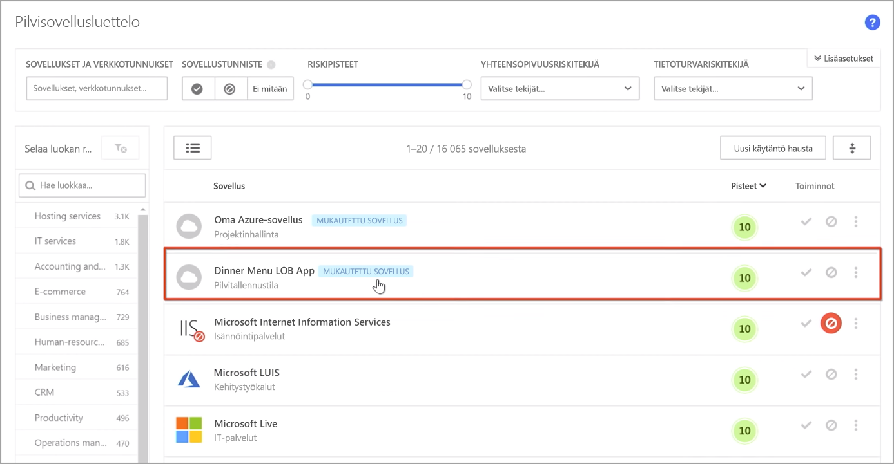
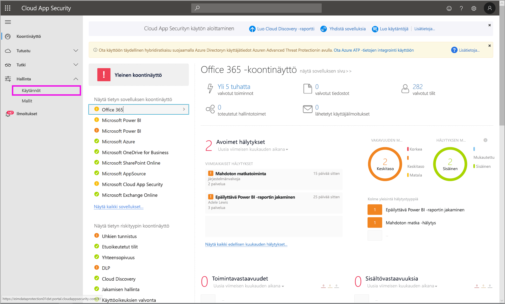
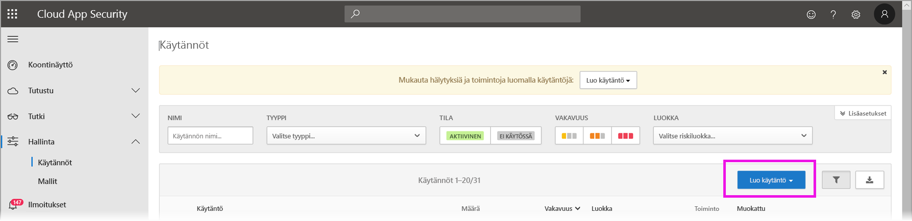
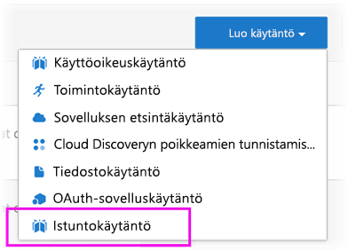
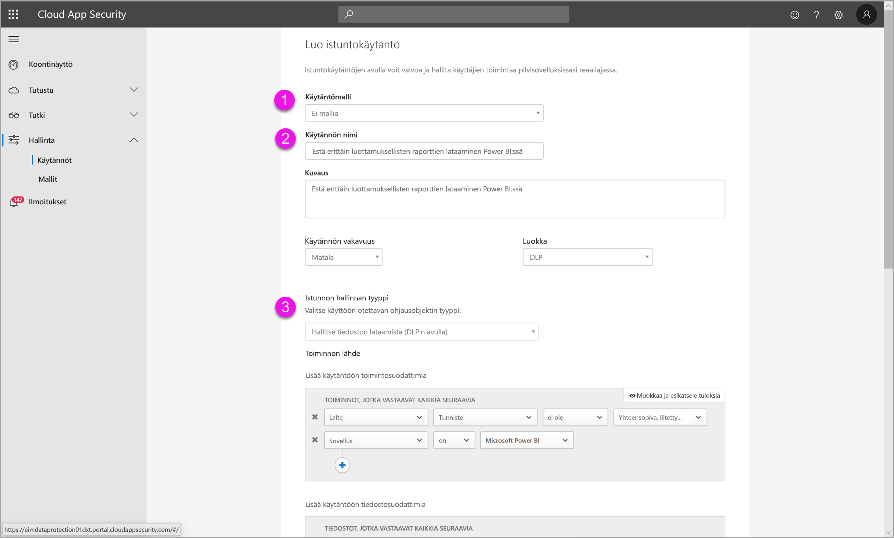
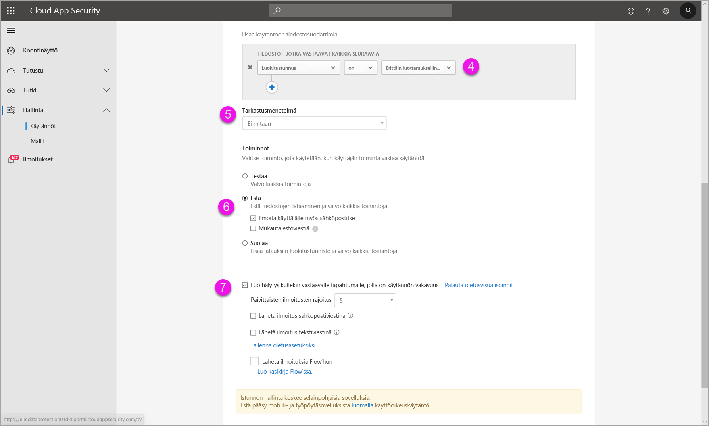
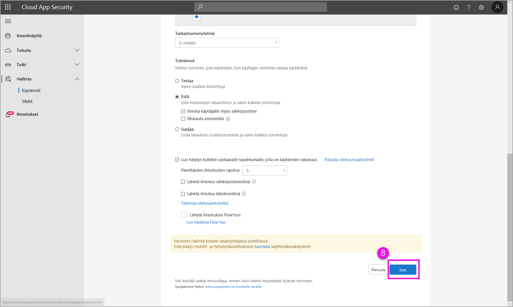

# Microsoft Cloud App Securityn hallinnan käyttäminen Power BI:ssä (esikatselu)

Käyttämällä Microsoft Cloud App Securitya Power BI:n kanssa voit suojata Power BI -raportteja, tietoja ja palveluita tahattomilta vuodoilta tai rikkomuksilta. Cloud App Security avulla luot ehdollisia käyttöoikeuskäytäntöjä organisaatiosi tiedoille Azure Active Directoryn (Azure AD:n) reaaliaikaisilla istuntosäätimillä, jotka auttavat varmistamaan, että Power BI:n analytiikkasi on suojattu. Kun nämä käytännöt on määritetty, järjestelmänvalvojat voivat valvoa käyttäjien käyttöoikeuksia ja toimintaa, tehdä reaaliaikaisia riskianalyyseja ja määrittää otsikkokohtaisia ohjausobjekteja. 

Voit määrittää Microsoft Cloud App Securityn kaikenlaisille sovelluksille ja palveluille, et vain Power BI:lle. Cloud App Security on Microsoftin palvelu, joka suojaa sovelluksia ja laitteita ja jota hallitaan sen oman koontinäytön kautta. Sinun on määritettävä Cloud App Security toimimaan Power BI:ssa, jotta voit hyötyä Power BI -tietojesi ja -analytiikan suojauksesta Cloud App Securityn avulla. Jos haluat lisätietoja Cloud App Securitysta, kuten yleiskatsauksen sen toiminnasta, koontinäytöstä ja sovelluksen riskeistä, tutustu [Microsoft Cloud App Security](https://docs.microsoft.com/cloud-app-security/) -dokumentaatioon.

## Microsoft Cloud App Securityn käyttäminen Power BI:n kanssa

Jos haluat käyttää Microsoft Cloud App Securitya Power BI kanssa, sinun on käytettävä asianmukaisia Microsoftin tietoturvapalveluja ja määritettävä ne. Osa määrityksistä tehdään Power BI:n ulkopuolella.

### Microsoft Cloud App Securityn käyttöoikeudet

Jotta voit saada Microsoft Cloud App Securityn vuokraajaasi, sinulla on oltava jokin seuraavista käyttöoikeuksista:
* MCAS: Tarjoaa OCAS-ominaisuuksia kaikille tuetuille sovelluksille, osa EMS E5- ja M365 E5 -paketteja.
* CAS-D: Tarjoaa vain MCAS Discoveryn.
* OCAS: Tarjoaa MCAS-ominaisuuksia vain Office 365:lle, osa Office E5 -pakettia.
* Valinnainen: AAD P1 ja AIP P1, jotta voit hyötyä tärkeistä Microsoft Cloud App Security -toiminnoista.

Alla olevissa osissa kuvataan vaiheet Microsoft Cloud App Securityn käyttämiseen Power BI:ssä.

### Istuntojen käytäntöjen määrittäminen Azure Active Directoryssa (pakollinen)
Istunnonsäätimien määrittämiseen vaadittavat vaiheet suoritetaan Azure AD- ja Microsoft Cloud App Security -portaaleissa. Azure AD -portaalissa luot ehdollisen käyttöoikeuskäytännön Power BI:lle ja reitität Power BI:ssä käytettyjä istuntoja Microsoft Cloud App Security -palvelun kautta. 

Microsoft Cloud App Security käyttää käänteistä välityspalvelinarkkitehtuuria, ja se on integroitu Azure AD:n ehdollisen käyttöoikeuden kanssa valvomaan Power BI -käyttäjien toimintaa reaaliaikaisesti. Seuraavat vaiheet auttavat sinua ymmärtämään prosessia, ja yksityiskohtaiset vaiheittaiset ohjeet on annettu kunkin alla olevan vaiheen linkitetyssä sisällössä. Voit myös lukea tämän [Cloud App Security -artikkelin](https://docs.microsoft.com/cloud-app-security/proxy-deployment-aad), joka kuvaa prosessia kokonaisuudessaan.

1.  [Luo Azure AD:n ehdollisen käyttöoikeuden testikäytäntö](https://docs.microsoft.com/cloud-app-security/proxy-deployment-aad#add-azure-ad)
2.  [Kirjaudu kuhunkin sovellukseen käyttämällä käytäntöön kohdennettua käyttäjää](https://docs.microsoft.com/cloud-app-security/proxy-deployment-aad#sign-in-scoped)
3.  [Varmista, että sovellukset on määritetty käyttämään käyttöoikeuksien valvontaa ja istuntosäätimiä](https://docs.microsoft.com/cloud-app-security/proxy-deployment-aad#portal)
4.  [Testaa käyttöönottoa](https://docs.microsoft.com/cloud-app-security/proxy-deployment-aad#step-4-test-the-deployment)

Istuntokäytäntöjen määrittämisprosessi on kuvattu tarkasti [Istuntokäytännöt](https://docs.microsoft.com/cloud-app-security/session-policy-aad)-artikkelissa. 

### Poikkeamien tunnistamiskäytäntöjen määritys PBI-toimintojen seurantaa varten (suositus)
Voit määrittää erikseen kohdennettavia Power BI:n poikkeamien tunnistuskäytäntöjä, jotka koskevat vain niitä käyttäjiä ja ryhmiä, jotka haluat sisällyttää käytäntöön tai jättää pois käytännöstä. [Lue lisää](https://docs.microsoft.com/cloud-app-security/anomaly-detection-policy#scope-anomaly-detection-policies).

Cloud App Securityssa on myös kaksi erillistä, sisäistä tunnistusta Power BI:lle. [Lisätietoja on tämän asiakirjan myöhemmässä osiossa](#built-in-microsoft-cloud-app-security-detections-for-power-bi).

### Käytä Microsoft Information Protectionin luottamuksellisuustunnisteita (suositus)

Luottamuksellisuustunnisteiden avulla voit luokitella ja auttaa suojaamaan arkaluontoista sisältöä, jolloin organisaatiosi käyttäjät voivat tehdä yhteistyötä organisaation ulkopuolisten kumppanien kanssa mutta silti olla huolellisia ja tietoisia arkaluonteisesta sisällöstä ja tiedosta. 

Voit lukea artikkelin [Luottamuksellisuustunnisteet Power BI:ssä](../designer/service-security-apply-data-sensitivity-labels.md), jossa käsitellään Power BI:n luottamuksellisuustunnisteiden käyttämistä. Alla on [esimerkki Power BI -käytännöstä, joka perustuu luottamuksellisuustunnisteisiin](#example).

## Power BI:n sisäiset Microsoft Cloud App Security -tunnistukset

Microsoft Cloud App Security -tunnistuksien avulla järjestelmänvalvojat voivat seurata valvotun sovelluksen tiettyjä toimintoja. Power BI:lle on tällä hetkellä kaksi erillistä, sisäistä Cloud App Security -tunnistusta: 

* **Epäilyttävä jako** – havaitsee, kun käyttäjä jakaa arkaluontoisen raportin tuntemattoman (organisaation ulkopuolisen) sähköpostiosoitteen kanssa. Arkaluontoinen raportti on raportti, jonka luottamuksellisuustunnisteeksi on määritetty **VAIN SISÄISET** tai tätä korkeampi. 

* **Raporttien joukkojako** – havaitsee, kun käyttäjä jakaa useita eri raportteja yksittäisessä istunnossa.

Näiden tunnistusten asetukset määritetään Cloud App Security -portaalissa. [Lue lisää](https://docs.microsoft.com/cloud-app-security/anomaly-detection-policy#unusual-activities-by-user). 

## Power BI:n järjestelmänvalvojan rooli Microsoft Cloud App Securityssa

Power BI -järjestelmänvalvojille luodaan uusi rooli, kun Microsoft Cloud App Securitya käytetään Power BI:n kanssa. Kun kirjaudut sisään [Cloud App Security -portaaliin](https://portal.cloudappsecurity.com/) Power BI -järjestelmänvalvojana, sinulla on rajoitettu pääsy Power BI:n kannalta merkityksellisiin tietoihin, hälytyksiin, riskialttiisiin käyttäjiin, toimintalokeihin ja muihin tietoihin.

## Huomioitavat asiat ja rajoitukset 
Cloud App Securityn käyttäminen Power BI:n avulla on suunniteltu suojaamaan organisaatiosi sisältöä ja tietoja sekä tunnistuksia, jotka valvovat käyttäjien istuntoja ja niiden toimintaa. Kun käytät Cloud App Securitya Power BI:n kanssa, sinun kannattaa pitää mielessäsi muutama rajoitus:

* Microsoft Cloud App Security voi toimia vain Excel-, PowerPoint- ja PDF-tiedostoissa.
* Jos haluat käyttää luottamuksellisuustunnisteiden ominaisuuksia Power BI:n istuntokäytännöissä, sinulla on oltava Azure Information Protection Premium P1- tai Premium P2 -käyttöoikeus. Microsoft Azure Information Protectionin voi ostaa joko erillisenä tuotteena tai jonkin Microsoftin käyttöoikeuspaketin kautta. Lisätietoja on artikkelissa [Azure Information Protectionin hinnoittelu](https://azure.microsoft.com/pricing/details/information-protection/). Lisäksi luottamuksellisuustunnisteiden on oltava käytössä Power BI -resursseissasi.

> [!CAUTION]
> * Microsoft Cloud App Securityn *Sisällön tarkastus* -käytäntö ei ole tällä hetkellä käytettävissä Power BI:ssä, kun Excel-tiedoston käytäntö on käytössä, joten älä määritä tätä käytäntöä Power BI:hin.
> * Istuntokäytännön ”Toiminto”-osan ”suojaa”-toiminto toimii vain, jos kohteella ei ole tunnistetta. Jos tunniste on jo olemassa, ”suojaa”-toimintoa ei oteta käyttöön. Et voi ohittaa aiemmin luotua tunnistetta, joka on jo lisätty kohteelle Power BI:ssä.

## Esimerkki

Seuraavassa esimerkissä näytetään, miten voit luoda uuden istuntokäytännön käyttämällä Microsoft Cloud App Securitya Power BI:n kanssa.

Luo ensin uusi istuntokäytäntö. Valitse **Käytännöt** **Cloud App Security** -portaalin vasemmasta valikosta.

Valitse näyttöön tulevasta ikkunasta avattava **Luo käytäntö** -valikko.

Valitse avattavan valikon vaihtoehtoluettelosta **Istuntokäytäntö**.

Luo istuntokäytäntö näyttöön tulevassa ikkunassa. Numeroiduissa vaiheissa kuvataan seuraavan kuvan asetukset.

  1. Valitse avattavasta **Käytäntömalli**-valikosta *Ei mallia*.
  2. Anna istuntokäytännöllesi asianmukainen nimi **Käytännön nimi** -ruutuun.
  3. Valitse **istuntosäätimen tyypiksi** *Ohjaustiedosto ladattu (DLP:n kanssa)* .

      Valitse **Aktiviteetin lähde** -osiolle tarvittavat estokäytännöt. Suosittelemme estämään hallitsemattomat ja yhteensopimattomat laitteet. Valitse latausten esto, kun istunto on Power BI:ssä.

        

        Kun vierität alaspäin, näet enemmän vaihtoehtoja. Vaihtoehdot näkyvät seuraavassa kuvassa lisäesimerkkien kera. 

  4. Valitse *luottamuksellisuustunnisteeksi* *Erittäin luottamuksellinen* tai parhaiten organisaatiollesi sopiva vaihtoehto.
  5. Muuta **tarkastusmenetelmäksi** *Ei mikään*.
  6. Valitse **Estä**-asetus, joka sopii tarpeisiisi.
  7. Varmista, että luot tällaista toimintoa varten hälytyksen.

        

        

  8. Varmista lopuksi, että valitset **Luo**-painikkeen istuntokäytännön luomiseksi.

        

> [!CAUTION]
> Varmista, ettet luo **Sisällön tarkastus** -käytäntöä Power BI:n Excel-tiedostoille. Se on tunnettu rajoitus tässä *esiversiossa*.

## Seuraavat vaiheet
Tässä artikkelissa kerrotaan, miten Microsoft Cloud App Security voi tarjota Power BI:lle tietoja ja sisällön suojauksia. Saatat olla kiinnostunut myös seuraavista artikkeleista, joissa kerrotaan Power BI:n tietojen suojaamisesta ja sen mahdollistavien Azure-palvelujen tuesta.

* [Power BI:n tietojen suojauksen yleiskatsaus](service-security-data-protection-overview.md)
* [Luottamuksellisuustunnisteiden käyttöönotto Power BI:ssä](service-security-enable-data-sensitivity-labels.md)
* [Luottamuksellisuustunnisteiden käyttö Power BI:ssä](../designer/service-security-apply-data-sensitivity-labels.md)

Voit olla kiinnostunut myös seuraavista Azure- ja tietoturva-artikkeleista:

* [Suojaa sovelluksia Microsoft Cloud App Securityn ehdollisten käyttöoikeuksien sovellusten hallinnalla](https://docs.microsoft.com/cloud-app-security/proxy-intro-aad)
* [Ota ehdollisten käyttöoikeuksien sovellusten hallinta käyttöön esitellyille sovelluksille](https://docs.microsoft.com/cloud-app-security/proxy-deployment-aad)
* [Istuntokäytännöt](https://docs.microsoft.com/cloud-app-security/session-policy-aad)
* [Luottamuksellisuustunnisteiden yleiskatsaus](https://docs.microsoft.com/microsoft-365/compliance/sensitivity-labels)