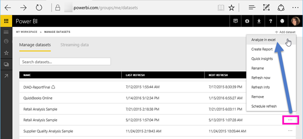
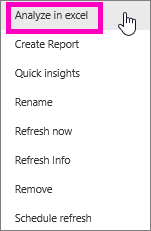
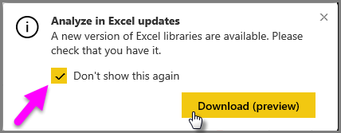
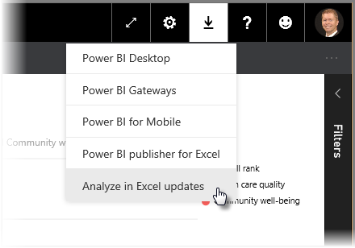
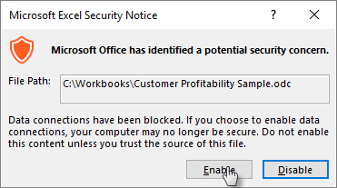

# Analysoi Excelissä
Joskus saatat haluta tarkastella ja käsitellä Power BI:ssä olevaa tietojoukkoa Excelillä. **Analysoi Excelissä** -toiminnon avulla voit tehdä niin ja käyttää pivot-taulukko-, kaavio- ja osittajaominaisuuksia Excelissä Power BI:ssä olevan tietojoukon perusteella.

## Kaksi aloittamistapaa
Voit tutustua Power BI:n tietojoukkoihin Excelissä kahdella eri tavalla – jos olet aloittamassa Power BI:stä, noudata tässä asiakirjassa kuvattuja vaiheita.  Käyttäjien, joilla on tietyt Office SKU:t, on nyt mahdollista käyttää tietojoukkoaan suoraan Excel-työkirjan sisällä olevasta Nouda tiedot -kokemuksesta.  He voivat selata tietojoukkoja, joihin heillä on käyttöoikeus, ja tarkistaa, onko tietojoukot sertifioitu tai ylennetty ja onko niissä käytetty tietosuojaotsikoita.  Lisätietoja tästä kokemuksesta on Excel-ohjeiden artikkelissa [Pivot-taulukon luominen Power BI:n tietojoukoista](https://support.office.com/article/31444a04-9c38-4dd7-9a45-22848c666884).

## Vaatimukset
**Analysoi Excelissä** -toiminnon käyttöön liittyy joitakin vaatimuksia:

* **Analysoi Excelissä** -toimintoa tuetaan Microsoft Excel 2010 SP1:ssä ja sitä uudemmissa versioissa.

* Excelin pivot-taulukot eivät tue numeeristen kenttien koostamista vetämällä ja pudottamalla. Power BI -tietojoukossasi *on oltava ennalta määritetyt mittarit*. Lue lisää [mittareiden luomisesta](../transform-model/desktop-measures.md).
* Joissakin organisaatioissa voi olla ryhmäkäytäntösääntöjä, jotka estävät vaadittujen **Analysoi Excelissä** -päivitysten asentamisen Exceliin. Jos et pysty asentamaan päivityksiä, ota yhteyttä järjestelmänvalvojaan.
* **Analysoi Excelissä** -toiminto edellyttää, että tietojoukko on Power BI Premiumissa tai että käyttäjällä on Power BI Pro -käyttöoikeus. Jos haluat lisätietoja käyttöoikeustyyppien toimintojen eroista, katso _Power BI:n ominaisuuksien vertailu_ -osa [Power BI:n hinnoittelusta](https://powerbi.microsoft.com/pricing/).
* Käyttäjät voivat muodostaa yhteyden tietojoukkoihin Analysoi Excelissä -toiminnon kautta, jos heillä on pohjana olevan tietojoukon käyttöoikeudet.  Käyttäjällä voi olla tämä käyttöoikeus usealla eri tavalla. Hän voi esimerkiksi olla tietojoukon sisältävän työtilan jäsen, hänelle on voitu jakaa tietojoukkoa käyttävä raportti tai raporttinäkymä tai hänellä voi olla tietojoukon muodostamisoikeus kyseisen tietojoukon sisältävän työtilan tai sovelluksen kautta. Lue lisää [tietojoukkojen muodostamisoikeuksista](../connect-data/service-datasets-build-permissions.md).
* Vieraskäyttäjät eivät voi käyttää **Analysoi Excelissä** -toimintoa toisesta vuokraajasta lähetettyihin tietojoukkoihin. 
* **Analysoi Excelissä** on Power BI -palvelun toiminto. Se ei ole käytettävissä Power BI -raporttipalvelimella tai Power BI Embeddedissä. 
* **Analysoi Excelissä** on tuettu vain Microsoft Windows ‑tietokoneissa.

## Toimintaperiaate
Kun valitset **Analysoi Excelissä** **Enemmän vaihtoehtoja** ‑valikosta (...), joka liittyy tietojoukkoon tai raporttiin **Power BI:ssä**, Power BI luo .ODC-tiedoston ja lataa sen selaimesta tietokoneeseesi.

Kun avaat tiedoston Excelissä, näkyviin tulee tyhjä **pivot-taulukko** ja **Kentät**-luettelo, joka sisältää Power BI -tietojoukosta peräisin olevat taulukot, kentät ja mittarit. Voit luoda pivot-taulukoita ja kaavioita ja analysoida kyseistä tietojoukkoa samaan tapaan kuin paikallista tietojoukkoa Excelissä.

. ODC-tiedostossa on MSOLAP-yhteysmerkkijono, joka muodostaa yhteyden tietojoukkoosi Power BI:ssä. Kun analysoit tai käsittelet tietoja, Excel tekee kyselyjä kyseisestä tietojoukosta Power BI:ssä ja palauttaa tulokset Exceliin. Jos tietojoukko muodostaa yhteyden reaaliaikaiseen tietolähteeseen DirectQueryn avulla, Power BI tekee kyselyjä tietolähteestä ja palauttaa tuloksen Exceliin.

**Analysoi Excelissä** on erittäin hyödyllinen toiminto tietojoukoille ja raporteille, jotka muodostavat yhteyden *Analysis Services* -taulukkomuotoon tai *moniulotteisiin* tietokantoihin tai Power BI Desktop -tiedostoista tai Excel-työkirjoista tietomalleihin, joissa on Data Analysis Expressions (DAX) -kielellä luotuja mittarimalleja.

## Analysoi Excelissä -toiminnon käytön aloittaminen Power BI:ssä
Valitse Power BI:ssä raportin tai tietojoukon vieressä oleva **Enemmän vaihtoehtoja** ‑valikko (... raportin tai tietojoukon nimen vieressä) ja valitse näyttöön tulevasta valikosta **Analysoi Excelissä**.

### Excel-päivitysten asentaminen
Kun käytät **Analysoi Excelissä** -toimintoa ensimmäistä kertaa, sinun on asennettava päivityksiä Excel-kirjastoihin. Sinua pyydetään lataamaan ja suorittamaan Excel-päivitykset (tämä käynnistää Windows-asennusohjelmapaketin *SQL_AS_OLEDDB.msi* asennuksen). Paketti asentaa **SQL Server 2016 RC0:n Microsoft AS OLE DB -palvelun (esiversio)** .

> [!NOTE]
> Muista valita **Älä näytä tätä uudelleen** **Asenna Excel-päivitykset** -valintaikkunassa. Sinun tarvitsee asentaa päivitys vain kerran.
> 
> 

Jos sinun on asennettava **Analysoi Excelissä** -toiminnon Excel-päivitykset uudelleen, voit ladata päivityksen Power BI:n **Lataa**-kuvakkeesta seuraavassa kuvassa esitetyllä tavalla.

### Kirjautuminen Power BI:hin
Vaikka olet kirjautunut sisään Power BI:hin selaimessa, ensimmäisellä kerralla, kun avaat uuden .ODC-tiedoston Excelissä, sinua saatetaan pyytää kirjautumaan Power BI:hin Power BI -tililläsi. Tämä todentaa yhteyden Excelistä Power BI:hin.

### Käyttäjät, joilla on useita Power BI -tilejä
Joillakin käyttäjillä on useita Power BI -tilejä, ja tällaiset käyttäjät saattavat kohdata tilanteen, jossa he ovat kirjautuneet Power BI:hin yhdellä tilillä mutta tili, jolla on Analysoi Excelissä -toiminnossa käytettävän tietojoukon käyttöoikeudet, on eri tili. Saatat näissä tilanteissa saada **Kielletty**-virheen tai kirjautumisvirheen, kun yrität käyttää Analysoi Excelissä -työkirjassa käytettävää tietojoukkoa.

Saat mahdollisuuden kirjautua sisään uudelleen, jolloin voit kirjautua sisään Power BI -tilillä, jolla voidaan käyttää Analysoi Excelissä -toiminnon käyttämää tietojoukkoa. Voit myös valita nimesi Excelin ylimmässä valintanauhassa, jossa näytetään tili, johon olet parhaillaan kirjautuneena. Kirjaudu ulos ja kirjaudu sisään eri tilillä.

### Tietoyhteyksien käyttöönotto
Jotta voit analysoida Power BI -tietojasi Excelissä, sinua kehotetaan vahvistamaan .odc-tiedoston tiedostonimi ja polku. Valitse sitten **Ota käyttöön**.

> [!NOTE]
> Power BI -vuokraajien järjestelmänvalvojat voivat *Power BI -hallintaportaalissa* poistaa käytöstä **Analysoi Excelissä** -toiminnon käyttämisen Analysis Services (AS) -tietokannoissa säilytettävissä paikallisissa tietojoukoissa. Kun asetus on poistettu käytöstä, **Analysoi Excelissä** on poistettu käytöstä AS-tietokannoista, mutta se on edelleen käytettävissä muissa tietojoukoissa.
> 
> 

## Analysoiminen
Nyt kun Excel on avattu ja sinulla on tyhjä pivot-taulukko, voit tehdä kaikenlaisia analyyseja Power BI -tietojoukon avulla. Samoin kuin muissa paikallisissa työkirjoissa, Analysoi Excelissä -toiminnon avulla voit luoda pivot-taulukoita ja kaavioita, lisätä tietoja muista lähteistä ja niin edelleen. Tietysti voit luoda myös erilaisia laskentataulukoita, jotka tarjoavat monenlaisia näkymiä tietoihisi.

> [!NOTE]
> On tärkeää tietää, että **Analysoi Excelissä** -toiminnon käyttäminen paljastaa kaikki yksityiskohtaiset tiedot jokaiselle käyttäjälle, jolla on tietojoukon käyttöoikeus.
> 
> 

## Tallenna
Voit tallentaa tämän työkirjaan yhdistetyn Power BI -tietojoukon samalla tavalla kuin minkä tahansa muun työkirjan. Et voi kuitenkaan julkaista tai tuoda työkirjaa takaisin Power BI:hin, koska voit julkaista tai tuoda Power BI:hin vain työkirjoja, joiden taulukot sisältävät tietoja tai joissa on tietomalli. Koska uudella työkirjalla on yhteys Power BI:n tietojoukkoon, sen julkaiseminen tai tuominen Power BI:hin kiertäisi kehää.

## Jaa
Kun työkirja on tallennettu, voit jakaa sen muiden Power BI -käyttäjien kanssa organisaatiossasi.

Kun käyttäjä, jonka kanssa olet jakanut työkirjan, avaa työkirjan, hän näkee pivot-taulukot ja tiedot sellaisina kuin ne näkyivät työkirjan viimeisen tallennuksen yhteydessä, joten kyseessä ei välttämättä ole tietojen uusin versio. Saadakseen uusimmat tiedot käyttäjien on käytettävä **Tiedot**-valintanauhan **Päivitä**-painiketta. Koska työkirja on yhdistetty Power BI:n tietojoukkoon, työkirjaa päivittävien käyttäjien on kirjauduttava Power BI:hin ja asennettava Excel-päivitykset, kun he yrittävät päivittää ensimmäistä kertaa tällä tavalla.

Koska käyttäjien on päivitettävä tietojoukko, eikä ulkoisten yhteyksien päivittämistä tueta Excel Onlinessa, on suositeltavaa, että käyttäjät avaavat työkirjan Excelin työpöytäversiossa tietokoneellaan.

## Vianmääritys
Analysoi Excelissä -toiminto voi ajoittain antaa odottamattomia tuloksia tai toimia odottamattomalla tavalla. [Tämä sivu sisältää ratkaisuja yleisiin ongelmiin käytettäessä Analysoi Excelissä -toimintoa](desktop-troubleshooting-analyze-in-excel.md)

## Seuraavat vaiheet

Voit olla kiinnostunut myös seuraavista artikkeleista:

* [Raporttien välillä porautumisen käyttäminen Power BI Desktopissa](../create-reports/desktop-cross-report-drill-through.md)
* [Osittajien käyttäminen Power BI Desktopissa](../visuals/power-bi-visualization-slicers.md)

