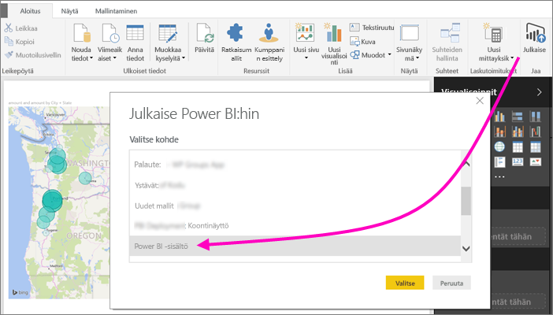
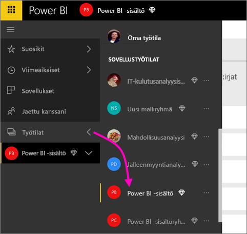
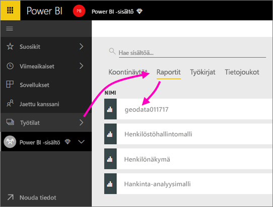
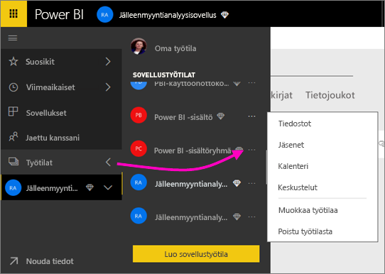
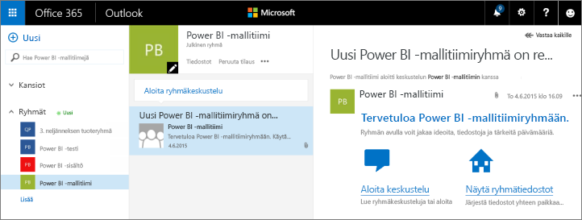
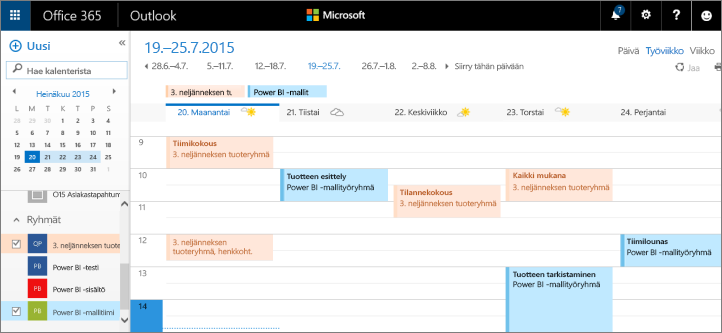

# Yhteistyö perinteisessä työtilassa
Power BI -työtilat on käteviä paikkoja tehdä yhteistyötä työtovereidesi kanssa raporttinäkymässä, raporteissa ja tietojoukoissa *sovellusten* luomiseksi. Tämä artikkeli koskee alkuperäisiä, *perinteisiä* työtiloja.  

Yhteiskäyttö ei pääty Power BI:n työtiloihin. Kun luot yhden klassisista työtiloista Power BI:ssa, luot automaattisesti Office 365 -ryhmän taustalla. Office 365 tarjoaa muita ryhmäpalveluita kuten tiedostojen jakaminen OneDrive for Business -palvelussa, keskustelut Exchangessa, jaetun kalenterin, tehtävät ja niin edelleen. Lue lisää [Office 365-ryhmistä](https://support.office.com/article/Create-a-group-in-Office-365-7124dc4c-1de9-40d4-b096-e8add19209e9).

> [!NOTE]
> Uusi työtilakokemus muuttaa Power BI -työtilojen ja Office 365:n ryhmien välistä suhdetta. Kun luot yhden uusista työtiloista Power BI:ssa, et enää automaattisesti luo Office 365 -ryhmää taustalla. Katso lisätietoja artikkelista [Uusien työtilojen luominen Power BI:ssä](service-create-the-new-workspaces.md).

Työtilojen luomiseen tarvitaan [Power BI Pro](../fundamentals/service-features-license-type.md) -käyttöoikeus.

## Power BI Desktop -tiedostojen yhteiskäyttö työtilassa
Kun olet luonut Power BI Desktop -tiedoston, voit julkaista sen työtilassa, jolloin jokainen työtilassasi voi yhteiskäyttää sitä.

1. Valitse Power BI Desktopissa **Julkaise** **Koti**-valintanauhassa ja sitten valitse työtila **Valitse kohde** -ruudusta.
   
    
2. Valitse Power BI -palvelussa kohdan **Työtilat** vieressä oleva nuoli > valitse työtila.
   
    
3. Valitse **Raportit**-välilehti ja valitse sitten raportti.
   
    
   
    Täältä katsoen se on kuin mikä tahansa raporttia Power BI:ssa. Sinä ja muut työtilassasi voitte muokata raporttia ja tallentaa ruudut haluamaasi koontinäyttöön.

## Tee yhteistyötä Office 365:ssa
Yhteiskäyttö Office 365:ssa alkaa klassisesta työtilasta Power BI:ssa.

1. Valitse Power BI -palvelun **Työtilat**-kohdan vieressä oleva nuoli ja valitse **Lisää vaihtoehtoja** (...) työtilan nimen vieressä. 
   
   
2. Tästä valikosta voit tehdä yhteistyötä ryhmän kanssa muutamalla eri tavalla: 
   
   * [Ryhmäkeskustelu Office 365:ssa](#have-a-group-conversation-in-office-365).
   * [Tapahtuman ajoittaminen](#schedule-an-event-on-the-group-workspace-calendar) ryhmän työtilan kalenteriin.
   
   Kun siirryt ryhmän työtilaan Office 365:ssa ensimmäistä kertaa, se saattaa kestää jonkin aikaa. Odota 15-30 minuuttia ja sitten päivitä selaimen sivu.

## Ryhmäkeskustelu Office 365:ssa
1. Valitse **Lisää vaihtoehtoja** (...) työtilan nimen vierestä \> **Keskustelut**. 
   
    
   
   Ryhmän työtilan sähköpostin ja keskustelun sivusto avautuu Outlook for Office 365:ssa.
   
   
2. Lue lisää [ryhmäkeskusteluista Outlook for Office 365:ssa](https://support.office.com/Article/Have-a-group-conversation-a0482e24-a769-4e39-a5ba-a7c56e828b22).

## Tapahtuman ajoittaminen ryhmän työtilan kalenteriin
1. Valitse **Lisää vaihtoehtoja** (...) työtilan nimen vierestä \> **Kalenteri**. 
   
   
   
   Tämä avaa kalenterin ryhmätyötilaan Outlook for Office 365:ssa.
   
   
2. Lue lisää [ryhmän kalentereista Outlook in Office 365:ssa](https://support.office.com/Article/Add-edit-and-subscribe-to-group-events-0cf1ad68-1034-4306-b367-d75e9818376a).

## Klassisen työtilan hallinta
Jos olet omistaja tai järjestelmänvalvoja työtilassa, voit myös lisätä tai poistaa työtilan jäseniä. Lue lisää [Power BI -työtilan hallinnasta](service-manage-app-workspace-in-power-bi-and-office-365.md).

## Seuraavat vaiheet
* [Sovellusten julkaiseminen Power BI:ssä](service-create-distribute-apps.md).
* Onko sinulla kysyttävää? [Kokeile Power BI -yhteisöä](https://community.powerbi.com/).
* Haluatko antaa palautetta? Siirry [Power BI:n ideasivulle](https://ideas.powerbi.com/forums/265200-power-bi).
