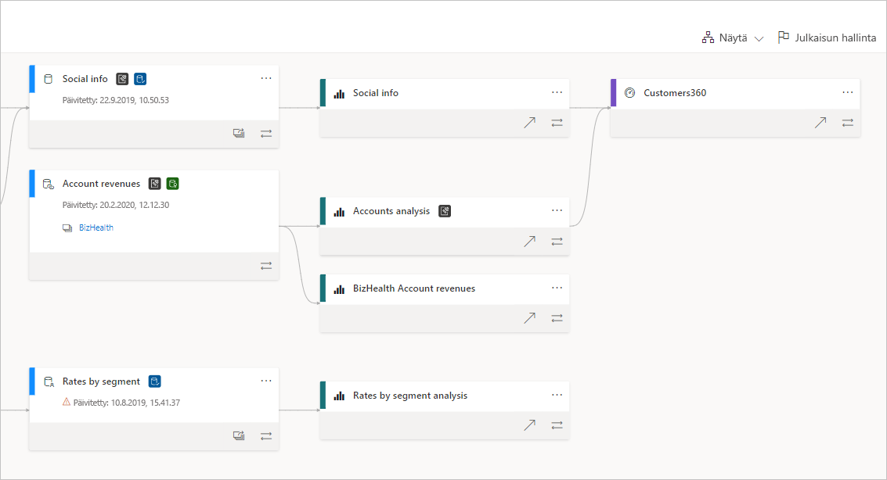
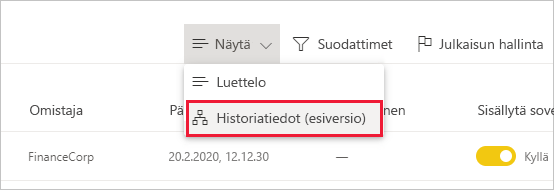
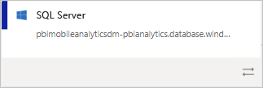
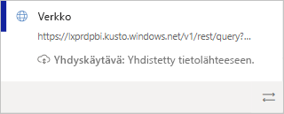
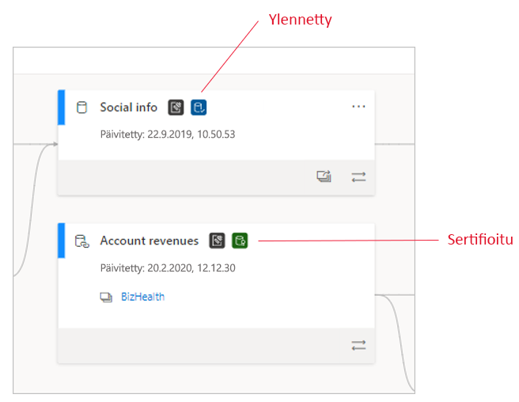
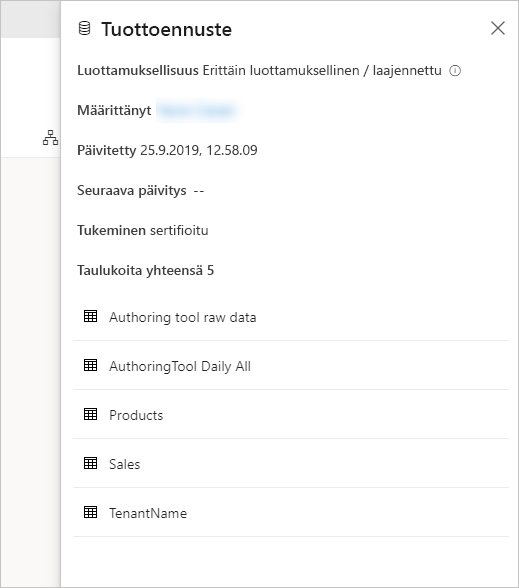
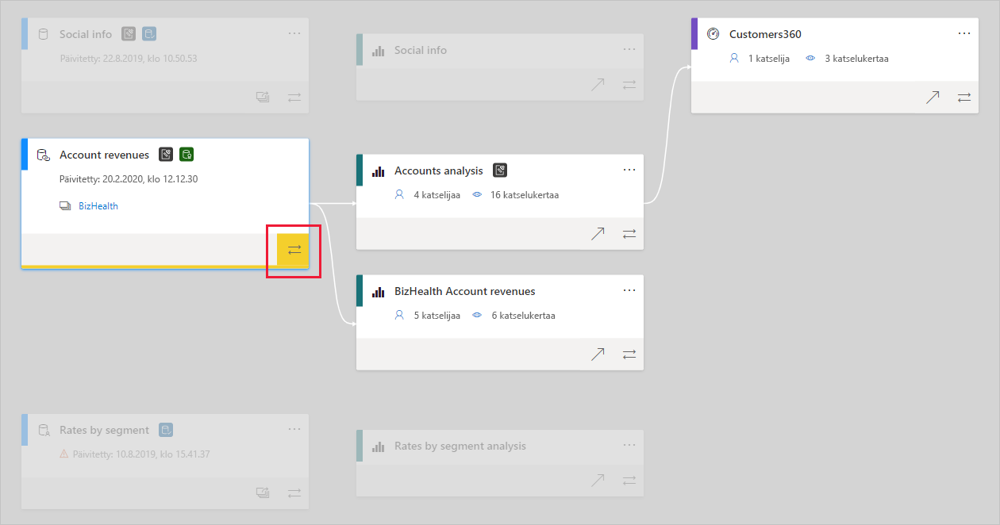

# Tietojen historiatiedot
Moderneissa liiketoimintatietojen projekteissa tietovirran ymmärtäminen tietolähteestä kohteeseen voi olla haastavaa. Haaste on vieläkin suurempi, jos olet luonut edistyneitä analyysiprojekteja, jotka kattavat useita tietolähteitä, artefakteja ja riippuvuuksia. Esimerkiksi kysymyksiin ”Mitä tapahtuu, jos muutan näitä tietoja?” Miksi tämä raportti ei ole ajan tasalla? voi olla vaikea vastata. Niiden ymmärtäminen voi vaatia asiantuntijaryhmän tai syvällistä tutkintaa. Olemme suunnitelleet historiatietonäkymän, jonka avulla näihin kysymyksiin voi vastata.

 
Power BI sisältää useita artefaktityyppejä, kuten koontinäyttöjä, raportteja, tietojoukkoja ja tietovoita. Monet tietojoukot ja tietovuot muodostavat yhteyden ulkoisiin tietolähteisiin, kuten SQL Serveriin, ja muissa työtiloissa oleviin ulkoisiin tietojoukkoihin. Kun tietojoukko on ulkoinen työtilassasi olevaan työtilaan nähden, se saattaa olla IT:n työntekijän tai toisen analyytikon omistamassa työtilassa. Ulkoisten tietolähteiden ja tietojoukkojen takia on vaikeampi tietää, mistä tiedot ovat lopulta peräisin. Esittelemme monimutkaisia ja yksinkertaisiakin projekteja varten tietojen historiatietojen näkymän.

Tietojen historiatietojen näkymässä näet kaikkien työtilassa olevien artefaktien väliset historiatiedot ja kaikki sen ulkoiset riippuvuudet. Se näyttää yhteydet kaikkien työtilan artefaktien välillä, mukaan lukien yhteydet tietovoihin sekä ennen että jälkeen.

## Tutki tietojen historiatietojen näkymää

Jokaisessa työtilassa riippumatta siitä, onko se uusi vai perinteinen, on automaattisesti tietojen historiatietonäkymä. Sen tarkastelemiseen työtilassa tarvitaan vähintään osallistujan rooli. Katso lisätietoja tämän artikkelin kohdasta [Oikeudet](#permissions).

* Jos haluat käyttää tietojen historiatietojen näkymää, siirry työtilan luettelonäkymään. Napauta **Luettelonäkymä**-kohdan vieressä olevaa nuolta ja valitse **Tietojen historiatietojen näkymä**.

   

Tässä näkymässä näkyvät kaikki työtilan artefaktit ja tiedon kulku artefaktista toiseen.

**Tietolähteet**

Näet tietolähteet, joista tietojoukot ja tietovuot saavat tietonsa. Tietolähteen korteista näet lisää tietoja, joiden avulla voit tunnistaa lähteen. Esimerkiksi Azuren SQL-palvelimesta näet myös tietokannan nimen.

 
**Yhdyskäytävät**

Jos tietolähde on yhdistetty paikallisen yhdyskäytävän kautta, yhdyskäytävän tiedot lisätään tietolähteen korttiin. Jos sinulla on oikeudet joko yhdyskäytävän järjestelmänvalvojana tai tietolähteen käyttäjänä, näkyvissä on lisätietoja, kuten yhdyskäytävän nimi.

**Tietojoukot ja tietovuot**
 
Tietojoukkojen ja tietovoiden kohdalla näet viimeisimmän päivitysajan sekä sen, onko tietojoukko tai tietovuo kohteen sertifioidun tai ylennetty.

 
Jos työtilan raportti perustuu toisessa työtilassa olevaan tietojoukkoon tai tietovuohon, lähdetyötilan nimi näkyy tietojoukon tai tietovuon kortissa. Siirry haluamaasi työtilaan valitsemalla kyseisen lähdetyötilan nimi.

* Näet asetusvalikon mistä tahansa artefaktista valitsemalla **Enemmän vaihtoehtoja** (...). Se sisältää kaikki samat toiminnot, jotka ovat käytettävissä luettelonäkymässä.

Jos haluat tarkastella minkä tahansa artefaktin metatietoja, valitse artefaktin kortti. Artefaktin lisätiedot näkyvät sivuruudussa. Alla olevassa kuvassa valitun tietojoukon metatiedot näkyvät sivuruudussa.

 
## Näytä minkä tahansa artefaktin tietojen historiatiedot 

Oletetaan, että haluat tarkastella tietyn artefaktin tietojen historiatietoja.

* Valitse kaksoisnuolet artefaktin alla.

   

   Power BI korostaa kaikki kyseiseen artefaktiin liittyvät artefaktit ja himmentää loput. 

## Siirtyminen ja koko näyttö 

Tietojen historiatietojen näkymä on vuorovaikutteinen pohja. Voit käyttää hiirtä ja kosketuslevyä pohjaan siirtymiseen sekä lähentämiseen tai loitontamiseen.

* Lähennä ja loitonna käyttämällä joko oikeassa alakulmassa olevaa valikkoa, hiirtä tai kosketuslevyä.
* Jos haluat saada enemmän tilaa kaaviolle, käytä koko näytön vaihtoehtoa oikeassa alakulmassa. 

    

## Käyttöoikeudet

* Tietojen historiatietojen näkymän tarkastelemiseen tarvitaan Power BI Pro -käyttöoikeus.
* Tietojen historiatietojen näkymä on vain niiden käyttäjien käytettävissä, joilla on työtilan käyttöoikeus.
* Käyttäjillä on oltava järjestelmänvalvojan, jäsenen tai osallistujan rooli työtilassa. Katselijan roolissa olevat käyttäjät eivät voi siirtyä tietojen historiatietojen näkymään.

## Huomioitavat asiat ja rajoitukset

- Tietojen historiatietojen näkymä ei ole käytettävissä Internet Explorerissa. Katso lisätietoja kohdasta [Power BI:n tuetut selaimet](../fundamentals/power-bi-browsers.md).

## Seuraavat vaiheet

* [Johdanto tietojoukkojen käyttöön eri työtiloissa (esikatselu)](../connect-data/service-datasets-across-workspaces.md)
* [Tietojoukkojen vaikutusanalyysi](service-dataset-impact-analysis.md)
