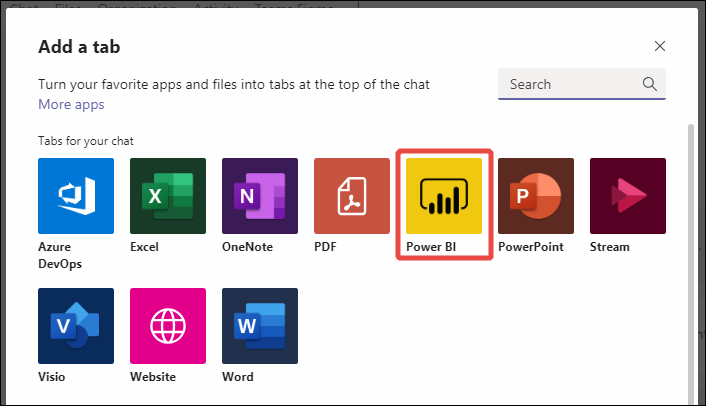

# Raporttien upottaminen Microsoft Teamsissa Power BI -välilehden avulla

Microsoft Teamsin päivitetyllä Power BI ‑välilehden avulla voit helposti upottaa vuorovaikutteisia raportteja Microsoft Teamsin kanaviin ja keskusteluihin. Microsoft Teamsin Power BI ‑välilehden avulla työtoverisi voivat löytää tiimisi käyttämät tiedot helposti ja keskustella niistä tiimin kanavilla.  Kun liität Microsoft Teamsin sanomaruutuun linkin raportteihisi, koontinäyttöihisi ja sovelluksiisi, linkin esikatselu näyttää tietoja niistä. Käyttäjät voivat tavallista helpommin ymmärtää, mihin kohteeseen linkki johtaa.

## Vaatimukset

Jotta **Microsoft Teamsin Power BI -välilehti** toimii, varmista seuraavat asiat:

- Käyttäjillä on Power BI Pro -käyttöoikeus tai raportti sisältyy [Power BI Premium -kapasiteettiin (EM tai P SKU)](../admin/service-premium-what-is.md) Power BI -käyttöoikeudella.
- Microsoft Teamsissa on Power BI -välilehti.
- Käyttäjät ovat kirjautuneet sisään Power BI -palveluun ja aktivoineet Power BI -käyttöoikeutensa raportin käyttämistä varten.
- Käyttäjillä on oltava raportin katseluoikeus.

Jotta **linkin esikatselut** toimivat, varmista lisäksi seuraavat:
- Käyttäjät täyttävät vaatimuksen käyttää Microsoft Teamsin Power BI -välilehteä.
- Käyttäjät ovat kirjautuneet sisään Power BI Bot -palveluun. 

## Upota raportti

Voit upottaa raportin Microsoft Teams -kanavaan tai -keskusteluun seuraavasti.

1. Avaa kanava tai keskustelu Microsoft Teamsissa ja valitse **+** -kuvake.

    

2. Valitse Power BI ‑välilehti.

    

3. Valitse annettujen asetusten avulla raportti työtilasta, kanssasi jaetuista kohteista tai Power BI -sovelluksesta.

    

4. Välilehden nimi päivittyy automaattisesti vastaamaan raportin nimeä, mutta voit halutessasi muuttaa sitä. 

5. Paina **Tallenna**.

## Power BI -välilehden upottamisessa tuetut raportit
Voit upottaa seuraavantyyppisiä raportteja Power BI -välilehteen:

- vuorovaikutteiset ja sivutetut raportit
- omassa työtilassa, uudenlaisissa työtiloissa ja perinteisissä työtiloissa ovat raportit
- Power BI -sovelluksissa olevat raportit.

## Linkin esikatselun hakeminen

Saat linkin esikatselun Power BI -palvelussa olevaa sisältöä varten noudattamalla seuraavia ohjeita.

1. Kopioi linkki raporttiin, koontinäyttöön tai sovellukseen Power BI -palvelussa. Kopioi esimerkiksi URL-osoite selaimen osoiteriviltä.

2. Liitä linkki Microsoft Teamsin sanomaruutuun. Kirjaudu pyydettäessä sisään linkin esikatselupalveluun. Sinun on ehkä odotettava linkin esikatselun latautumista muutama sekunti.

    

3. Linkin perusesikatselu tulee näkyviin onnistuneen sisäänkirjautumisen jälkeen.

    

4. Näytä monipuolinen esikatselukortti valitsemalla laajennuskuvake.

    

5. Monipuolinen esikatselukortti näyttää linkin ja tarvittavat toiminto painikkeet

    

6. Lähetä viesti.

## Raporttien käyttöoikeuksien myöntäminen

Kun raportti upotetaan Microsoft Teamsiin tai kohteen linkki lähetetään, käyttäjät eivät saa automaattisesti raportin tarkasteluoikeuksia. Sinun on [annettava käyttäjille raportin katseluoikeudet Power BI:ssä](service-share-dashboards.md). Tämä on helpompaa, jos käytät Office 365 ‑ryhmää. 

> [!IMPORTANT]
> Katso Power BI -palvelussa, kuka saa nähdä raportin, ja myönnä käyttöoikeudet niille, jotka eivät ole luettelossa.

Voit varmistaa, että kaikki ryhmäsi jäsenet voivat käyttää raportteja, esimerkiksi sijoittamalla raportit yksittäiseen Power BI:n työtilaan ja antamalla tiimin Office 365 -ryhmälle työtilan käyttöoikeudet.

## Linkkien esikatselut 

Linkkien esikatselut tarjotaan Power BI:ssä seuraaville kohteille:
- Raportit
- Koontinäytöt
- Sovellukset

Linkin esikatselupalvelu edellyttää, että käyttäjät kirjautuvat sisään. Kun haluat kirjautua ulos, valitse Power BI -kuvake sanomaruudun alareunassa ja valitse sitten Kirjaudu ulos.

## Aloita keskustelu

Kun lisäät Power BI -raportin välilehden Teamsiin, Teams luo automaattisesti välilehtikeskustelun raportin oheen. 

- Valitse **Näytä välilehtikeskustelu** oikeassa yläkulmassa.

    

    Ensimmäinen kommentti on linkki raporttiin. Kaikki kyseisellä Teams-kanavalla olevat käyttäjät voivat tarkastella raporttia ja keskustella siitä keskustelussa.

    

## Tunnetut ongelmat ja rajoitukset

- Power BI ei tue samoja lokalisoituja kieliä kuin Microsoft Teams. Sen vuoksi et välttämättä näe oikeaa lokalisointia upotetussa raportissa.
- Power BI:n koontinäyttöjä ei voi upottaa Microsoft Teamsin Power BI -välilehteen.
- Käyttäjä, jolla ei ole Power BI:n tai raportin käyttöoikeutta, saa Sisältö ei ole käytettävissä -sanoman.
- Ongelmia saattaa ilmetä, jos käytät Internet Explorer 10:tä. <!--You can look at the [browsers support for Power BI](../consumer/end-user-browsers.md) and for [Office 365](https://products.office.com/office-system-requirements#Browsers-section). -->
- [URL-suodattimia](service-url-filters.md) ei tueta Microsoft Teamsin Power BI -välilehdessä.
- Uusi Power BI -välilehti ei ole käytettävissä kansallisissa pilvipalveluissa. Käytettävissä voi olla vanhempi versio, joka ei tue uutta työtilakokemusta työtilaa tai raportteja Power BI -sovelluksissa. 
- Kun olet tallentanut välilehden, et voi muuttaa välilehden nimeä välilehtiasetuksissa. Voit muuttaa välilehden nimen Nimeä uudelleen ‑toiminnolla.
- Kertakirjautumista ei tueta linkin esikatselupalvelussa.
- Linkin esikatselut eivät toimi kokouskeskusteluissa eivätkä yksityisissä kanavissa.

## Seuraavat vaiheet
- [Koontinäytön jakaminen työtovereille ja muille](service-share-dashboards.md)  
- [Sovelluksen luominen ja jakaminen Power BI:ssä](service-create-distribute-apps.md)  
- [Mikä on Power BI Premium?](../admin/service-premium-what-is.md)

Onko sinulla kysyttävää? [Voit esittää kysymyksiä Power BI -yhteisössä](https://community.powerbi.com/)
