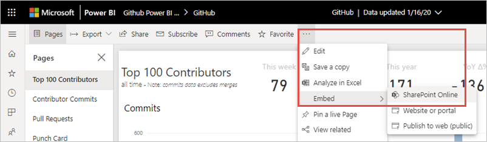
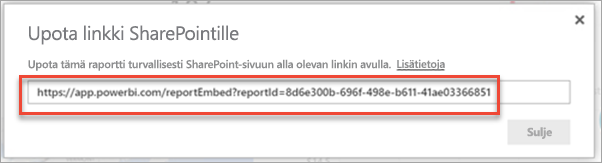
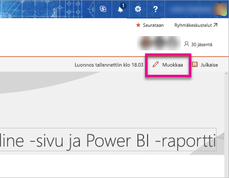
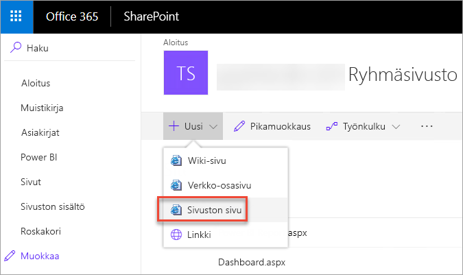
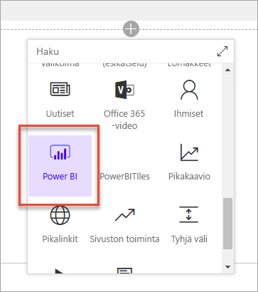
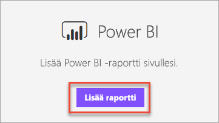
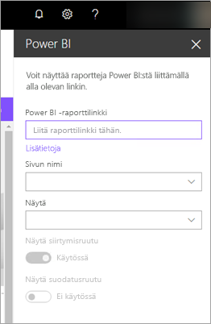
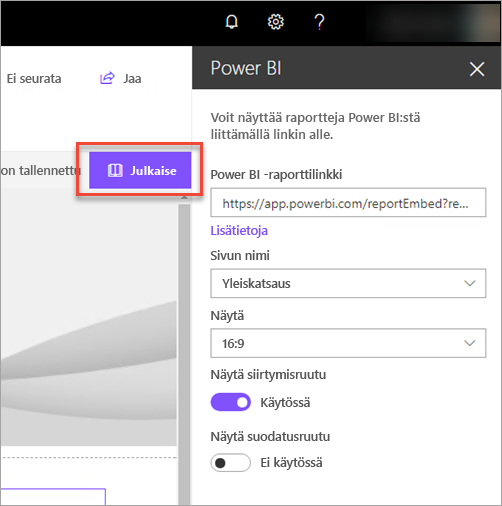
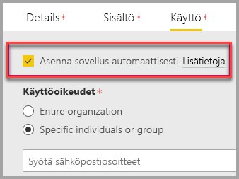
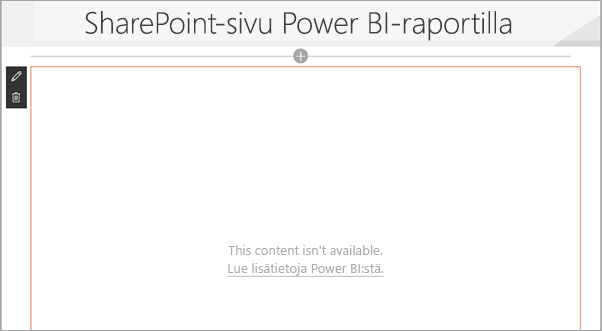

# Raportin WWW-osan upottaminen SharePoint Onlinessa

Power BI:n uuden, SharePoint Onlineen tarkoitetun raportin verkko-osan avulla voit helposti upottaa vuorovaikutteisia Power BI -raportteja SharePoint Onlinen sivuille.

Kun käytät uutta **Upota SharePoint Onlinessa** -asetusta, upotetut raportit ovat täysin suojattuja, jotta voit helposti luoda suojattuja sisäisiä portaaleja.

## Vaatimukset

**Upota SharePoint Onlinessa** -raporttien käyttö edellyttää seuraavia:

* Tarvitset Power BI Pro -käyttöoikeuden tai [Power BI Premium -kapasiteetin (EM tai P SKU)](../admin/service-premium-what-is.md) ja Power BI -käyttöoikeuden.
* Power BI -verkko-osa SharePoint Onlineen edellyttää [moderneja sivuja](https://support.office.com/article/Allow-or-prevent-creation-of-modern-site-pages-by-end-users-c41d9cc8-c5c0-46b4-8b87-ea66abc6e63b).
* Upotetun raportin käyttäminen edellyttää, että käyttäjät kirjautuvat sisään Power BI -palveluun ja aktivoivat Power BI -käyttöoikeutensa.

## Upota raportti
Jos haluat upottaa raporttisi SharePoint Onlineen, sinun täytyy hankkia raportin URL-osoite ja käyttää sitä SharePoint Online Power BI -verkko-osan kanssa.

### Hanki raportin URL-osoite

1. Avaa raportti Power BI:ssä.

2. Valitse avattavasta **Lisää vaihtoehtoja (...)** -valikosta **Upota** > **SharePoint Online**.

    

3. Kopioi raportin URL-osoite valintaikkunasta.

    

### Lisää Power BI -raportti SharePoint Online -sivuun

1. Avaa kohdesivu SharePoint Onlinessa ja valitse **Muokkaa**.

    

    Voit halutessasi luoda uuden modernin sivuston sivun valitsemalla SharePoint Onlinessa **+ Uusi**.

    

2. Valitse avattava **+** -valikko ja valitse sitten **Power BI** -verkko-osa.

    

3. Valitse **Lisää raportti**.

      

4. Liitä aiemmin kopioimasi raportin URL-osoite **Power BI -raporttilinkin** ruutuun. Raportti latautuu automaattisesti.

    

5. Valitse **Julkaise**, jotta muutos näkyy SharePoint Onlinen käyttäjille.

    

## Raporttien käyttöoikeuksien myöntäminen

Kun raportti upotetaan SharePoint Onlineen, käyttäjät eivät saa automaattisesti raportin tarkasteluoikeuksia. Sinun täytyy määrittää ne Power BI:ssä.

> [!IMPORTANT]
> Katso Power BI -palvelussa, kuka saa nähdä raportin, ja myönnä käyttöoikeudet niille, jotka eivät ole luettelossa.

Raportin käyttöoikeuden voi myöntää Power BI:ssä kahdella tavalla. 1\. tapa: Jos luot SharePoint Online -työryhmäsivuston Office 365 -ryhmän avulla, lisää käyttäjä **Power BI -palvelun työtilan** ja **SharePoint-sivun** jäseneksi. Jos haluat lisätietoja, katso, miten voit [hallita työtilaa](service-manage-app-workspace-in-power-bi-and-office-365.md).

2\. tapa: Upota raportti sovellukseen ja se suoraan käyttäjien kanssa.  

1. Laatija, jonka täytyy olla Pro-käyttäjä, luo raportin työtilassa. Jos haluat jakaa *Power BI:n maksuttomien käyttäjien kanssa*, työtila täytyy määrittää *Premium-työtilaksi*.

2. Laatija julkaisee sovelluksen ja sitten asentaa sen. Hänen täytyy asentaa sovellus, jotta se voi käyttää raportin URL-osoitetta, jota käytetään SharePoint Onlineen upottamisessa.

3. Kaikkien loppukäyttäjien on myös nyt asennettava sovellus. Voit myös käyttää **Asenna sovellus automaattisesti** -toimintoa, jonka voit ottaa käyttöön [Power BI -hallintaportaalissa](../admin/service-admin-portal.md). Sen avulla sovellus voidaan esiasentaa loppukäyttäjille.

   

4. Laatija avaa sovelluksen ja siirtyy raporttiin.

5. Laatija kopioi upotetun raportin URL-osoitteen sovelluksen asentamasta raportista. Älä käytä alkuperäisen raportin URL-osoitetta työtilasta.

6. Luo uusi työryhmäsivusto SharePoint Onlinessa.

7. Lisää aiemmin kopioitu raportin URL-osoite Power BI -verkko-osaan.

8. Lisää kaikki loppukäyttäjät ja/tai ryhmät, jotka käyttävät tietoja SharePoint Online -sivulla ja Power BI -sovelluksessa, jonka olet luonut.

    > [!NOTE]
    > **Käyttäjien tai ryhmien on saatava käyttöoikeus sekä SharePoint Online -sivulle että Power BI -sovellukseen, jotta ne näkevät raportin SharePoint-sivulla.**

Loppukäyttäjä voi nyt siirtyä työryhmäsivustolle SharePoint Onlinessa ja tarkastella raportteja sivulla.

## Monimenetelmäinen todentaminen

Jos Power BI -ympäristösi edellyttää kirjautumista monimenetelmäistä todentamista käyttäen, sinua voidaan pyytää kirjautumaan suojauslaitteelta henkilöllisyytesi varmistamiseksi. Näin tapahtuu, jos et kirjautunut SharePoint Onlineen monimenetelmäisellä todentamisella ja Power BI -ympäristösi vaatii suojauslaitetta tilin vahvistamiseksi.

> [!NOTE]
> Power BI ei vielä tue monimenetelmäistä todentamista Azure Active Directory 2.0:lla (käyttäjät saavat virheilmoituksen). Jos käyttäjä kirjautuu uudelleen SharePoint Onlineen suojauslaitetta käyttäen, hän saattaa nähdä raportin.

## Verkko-osan asetukset

Alla on lueteltu asetukset, joita voit muokata Power BI -verkko-osalle SharePoint Onlinessa.

| Ominaisuus | Kuvaus |
| --- | --- |
| Sivun nimi |Määrittää verkko-osan oletussivun. Valitse arvo avattavasta luettelosta. Jos sivuja ei näy, raportissasi on vain yksi sivu tai liittämäsi URL-osoite sisältää sivun nimen. Valitse tietty sivu poistamalla raporttiosa URL-osoitteesta. |
| Näytä |Määrittää, miten raportti sovitetaan SharePoint Online -sivulle. |
| Näytä siirtymisruutu |Näyttää tai piilottaa sivun siirtymisruudun. |
| Näytä suodatusruutu |Näyttää tai piilottaa suodatusruudun. |

## Raportit, joiden lataaminen ei onnistu

Jos raporttisi ei lataudu Power BI -verkko-osaan, saatat saada seuraavan ilmoituksen:

Tähän viestiin on kaksi yleistä syytä.

1. Sinulla ei ole raportin käyttöoikeuksia.
2. Raportti on poistettu.

Ota yhteyttä SharePoint Online -sivun omistajaan ratkaistaksesi ongelman.

## Käyttöoikeudet

Raporttia SharePointissa tarkastelevat käyttäjät tarvitsevat **Power BI Pro -käyttöoikeuden** tai sisällön on oltava työtilassa, joka on **[Power BI Premium -kapasiteetissa (EM- tai P-varastointiyksikkö)](../admin/service-admin-premium-purchase.md)** .

## Tunnetut ongelmat ja rajoitukset

* Virhe: ”Ilmeni virhe, kirjaudu ulos ja uudelleen sisään ja yritä avata tämä sivu uudelleen. Korrelaatiotunnus: määrittämätön, http-vastauksen tila: 400, palvelimen virhekoodi 10001, viesti: Päivitystunnus puuttuu”
  
  Jos saat tämän virheviestin, kokeile alla olevia vianmääritysohjeita.
  
  1. Kirjaudu ulos SharePointista ja kirjaudu uudelleen sisään. Muista sulkea kaikki selainikkunat, ennen kuin kirjaudut uudelleen sisään.

  2. Jos käyttäjätilisi edellyttää monimenetelmäistä todentamista (MFA), kirjaudu sisään SharePointiin monimenetelmäisen todentamisen laitteella (esimerkiksi puhelinsovellus, älykortti ja niin edelleen).
  
  3. Azuren B2B -vieraiden käyttäjätilejä ei tueta. Käyttäjät näkevät Power BI -logon, joka näyttää osan latautuvan, mutta raporttia ei näytetä.

* Power BI ei tue samoja lokalisoituja kieliä kuin SharePoint Online. Sen vuoksi et välttämättä näe oikeaa lokalisointia upotetussa raportissa.

* Ongelmia saattaa ilmetä, jos käytät Internet Explorer 10:tä. <!--You can look at the [browsers support for Power BI](../consumer/end-user-browsers.md) and for [Office 365](https://products.office.com/office-system-requirements#Browsers-section). -->

* Power BI -verkko-osa ei ole käytettävissä [kansallisissa pilvipalveluissa](https://powerbi.microsoft.com/clouds/).

* Perinteistä SharePoint-palvelinta ei tueta tässä verkko-osassa.

* [URL-suodattimia](service-url-filters.md) ei tueta SPO-verkko-osan kanssa.

## Seuraavat vaiheet

* [Modernin sivuston sivujen luomisen salliminen tai estäminen käyttäjille](https://support.office.com/article/Allow-or-prevent-creation-of-modern-site-pages-by-end-users-c41d9cc8-c5c0-46b4-8b87-ea66abc6e63b)  
* [Sovelluksen luominen ja jakaminen Power BI:ssä](service-create-distribute-apps.md)  
* [Koontinäytön jakaminen työtovereille ja muille](service-share-dashboards.md)  
* [Mikä on Power BI Premium?](../admin/service-premium-what-is.md)
* [Raportin upottaminen turvalliseen portaaliin tai sivustoon](service-embed-secure.md)

Onko sinulla kysyttävää? [Voit esittää kysymyksiä Power BI -yhteisössä](https://community.powerbi.com/)
