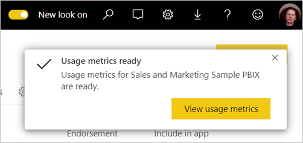
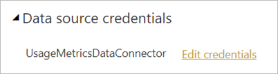

# Käyttötietojen valvonta uudessa työtilakokemuksessa

Kun tiedät, miten sisältöäsi käytetään, voit esitellä vaikutustasi ja priorisoida toimintaasi. Saatat käyttötiedoista esimerkiksi nähdä, että valtava osa organisaatiosta käyttää jotakin raporttiasi päivittäin tai että luomaasi koontinäyttöä ei tarkastella lainkaan. Tällainen palaute on korvaamatonta työpanoksen kohdentamisessa.

Jos luot raportteja moderneissa työtiloissa, voit käyttää parannettuja käyttötietoraportteja, joiden avulla voit selvittää, miten näitä raportteja käytetään koko organisaatiossa ja ketkä niitä käyttävät. Voit myös tunnistaa ylätason suorituskykyongelmia. Modernin työtilan parannetut käyttöraportit korvaavat aiemmin luodut käyttötietoraportit, joista on kerrottu artikkelissa [Power BI:n koontinäyttöjen ja raporttien käyttötietojen valvonta](service-usage-metrics.md).

> [!NOTE]
> Voit hakea käyttötietoraportteja vain Power BI-palvelussa. Jos kuitenkin tallennat käyttötietoraportin tai kiinnität sen koontinäyttöön, voit avata tämän raportin ja käyttää sitä mobiililaitteilla.

## Edellytykset

- Käyttötietodatan suorittamiseen ja käyttämiseen tarvitaan Power BI Pro -käyttöoikeus. Käyttötieto-ominaisuus kuitenkin tallentaa tietoa kaikista käyttäjistä heille määritetyistä käyttöoikeuksista riippumatta.
- Jos haluat käyttää raportin parannettuja käyttötietoja, raportin on oltava modernissa työtilassa ja sinulla on oltava muokkausoikeudet raporttiin.
- Power BI -järjestelmänvalvojan on täytynyt ottaa käyttöön käyttötiedot sisällöntekijöille. Power BI -järjestelmänvalvoja on voinut ottaa käyttöön myös käyttäjäkohtaisten käyttötietojen tietojen keruun. Lue lisää [näiden asetusten käyttöönotosta hallintaportaalissa](../admin/service-admin-portal.md#control-usage-metrics).

## Parannetun käyttötietoraportin luominen ja tarkastelu

Vain käyttäjät, joilla on järjestelmänvalvojan, jäsenen tai osallistujan käyttöoikeudet, voivat tarkastella parannettuja käyttötietoraportteja. Katselijan käyttöoikeudet eivät riitä. Jos olet vähintään osallistuja modernissa työtilassa, jossa raporttisi sijaitsee, voit käyttää seuraavia ohjeita näyttääksesi parannetut käyttötiedot:

1. Avaa työtila, joka sisältää raportin, jonka käyttötietoja haluat analysoida.
2. Avaa raportin pikavalikko työtilan sisältöluettelosta ja valitse **Näytä käyttötietoraportti**. Vaihtoehtoisesti voit ensin avata raportin, sitten avata pikavalikon komentopalkissa ja lopuksi valita **Käyttötiedot**.

    

1. Kun teet tämän ensimmäistä kertaa, Power BI luo käyttötietoraportin ja ilmoittaa, kun se on valmis.

    

1. Tarkastele tuloksia valitsemalla **Näytä käyttötiedot**.
2. Jos teet näin ensimmäistä kertaa, Power BI voi avata vanhan käyttötietoraportin. Jos haluat näyttää parannetun käyttötietoraportin, vaihda oikeassa yläkulmassa oleva Uusi käyttöraportti on poistettu käytöstä -valitsin asentoon **Käytössä**.

    

    > [!NOTE]
    > Näet uuden käyttöraportin valitsimen vain, jos raportti sijaitsee modernissa työtilassa. Vanhat työtilat eivät tarjoa parannettuja käyttötietoraportteja.

## Tietoja parannetusta käyttötietoraportista

Kun näytät parannetun käyttötietoraportin edellä esitettyjä ohjeita noudattamalla, Power BI luo valmiiksi luodun raportin kyseisen sisällön käyttötiedoista viimeisten 30 päivän ajalta. Raportti näyttää samanlaiselta kuin Power BI-raportit, joihin olet jo tutustunut. Voit osittaa tietoja esimerkiksi sen mukaan, miten loppukäyttäjät käyttivät sisältöä tai käytettiinkö sitä verkossa vai mobiilisovelluksella. Sitä mukaa kun raporttisi kehittyvät, kehittyy myös käyttötietoraportti, sillä siihen päivitetään uusia tietoja joka päivä.

> [!NOTE]
> Käyttötietoraportit eivät näy Viimeaikaiset-, Työtilat-, Suosikit- tai muissa sisältöluetteloissa. Niitä ei voi lisätä sovellukseen. Jos kiinnität ruudun käyttötietoraportista koontinäyttöön, et voi lisätä koontinäyttöä sovellukseen.

### Käyttötietoraportin tietojoukko

Parannettu käyttötietoraportti perustuu käyttötietoraportin tietojoukkoon, jonka Power BI luo automaattisesti, kun käynnistät parannetun käyttötietoraportin ensimmäisen kerran. Tämän jälkeen Power BI päivittää tietojoukon päivittäin. Et voi muuttaa päivitysaikataulua, mutta voit päivittää tunnistetiedot, joita Power BI käyttää käyttötietojen päivittämiseen. Tämä saattaa olla tarpeen ajoitettujen päivitysten jatkamiseksi, jos tunnistetiedot ovat vanhentuneet tai jos poistit käyttäjän, joka ensimmäisenä käynnisti käyttötietoraportin työtilassa, jossa tietojoukko sijaitsee.

### Käyttötietoraportin sivut

Parannettu käyttötietoraportti sisältää seuraavat raporttisivut:

- **Raportin käyttö**    Antaa tietoja raportin näkymistä ja raporttien katselijoista, esimerkiksi kuinka monta käyttäjää on tarkastellut raporttia kunakin päivänä.
- **Raportin suorituskyky**    Näyttää tyypilliset raportin avaamisajat eriteltynä käyttötavan ja selaintyyppien mukaan.
- **Usein kysytyt kysymykset**    Sisältää vastauksia usein kysyttyihin kysymyksiin, kuten ”Mikä on ’katselija’ ja mikä on ’tarkastelu’?”.

### Mitkä tiedot raportoidaan?

| **Sivu** | **Mittausarvo** | **Kuvaus** |
| --- | --- | --- |
| Raportin käyttö | Raportin tarkastelut | Raporttitarkastelu tallennetaan aina, kun joku avaa raportin. Ota huomioon, että tarkastelun määritelmä on eri kuin aiemmissa käyttötietoraporteissa. Raporttisivujen muuttamista ei enää pidetä uutena tarkasteluna. |
| Raportin käyttö | Yksittäiset tarkastelijat | Katselija on henkilö, joka avasi raportin vähintään kerran ajanjakson aikana (AAD-käyttäjätilin perusteella). |
| Raportin käyttö | Tarkastelutrendi | Tarkastelutrendi kuvastaa tarkastelumäärän muutoksia ajan kuluessa. Se vertaa valitun ajanjakson ensimmäistä puoliskoa ja toiseen puoliskoon. |
| Raportin käyttö | Päivämääräosittaja | Voit muuttaa ajanjaksoa Raportin käyttö -sivulla, esimerkiksi laskeaksesi viikoittaiset tai kahden viikon trendit. Raportin käyttö -sivun vasemmassa alakulmassa voit valita aikaisimman ja viimeisimmän päivämäärän, jolloin valitun raportin käyttötiedot ovat käytettävissä. |
| Raportin käyttö | Sija | Sija perustuu tarkastelumäärään ja näyttää raportin suosion verrattuna kaikkiin muihin organisaation raportteihin.   |
| Raportin käyttö | Raportin tarkasteluja päivässä | Tarkastelujen kokonaismäärä päivässä. |
| Raportin käyttö | Raportin tarkastelijoita päivässä | Raporttia tarkastelleiden yksittäisten käyttäjien kokonaismäärä AAD-käyttäjätilin perusteella. |
| Raportin käyttö | Jakelumenetelmä | Miten käyttäjät saivat raportin käyttöoikeuden. Perusteisiin kuuluvat esimerkiksi työtilan jäsenyys, jaetun raportin vastaanottaminen tai sovelluksen asentaminen. |
| Raportin käyttö | Käyttöympäristön osittaja | Käytettiinkö raporttia Power BI -palvelun (powerbi.com), Power BI Embeddedin vai mobiililaitteen kautta. |
| Raportin käyttö | Käyttäjät ja raportin tarkastelut | Näyttää luettelon raportin avanneista käyttäjistä tarkastelumäärän mukaan lajiteltuna. |
| Raportin käyttö | Sivut | Jos raportissa on useampia kuin yksi sivu, osita raportti tarkasteltujen sivujen mukaan. Jos näet luettelossa Tyhjä-vaihtoehdon, raporttisivu on lisätty äskettäin (uuden sivun todellinen nimi tulee näkyviin osittajaluetteloon 24 tunnin kuluessa) ja/tai raporttisivuja on poistettu. Tyhjä-arvolla kuvataan tällaiset tilanteet. |
| Raportin suorituskyky | Tyypillinen avautumisaika | Raportin tyypillinen avautumisaika vastaa 50 prosenttia raportin avaamiseen kuluvasta ajasta. Toisin sanoen se on aika, jonka sisällä 50 prosenttia raportin avaamiseen kuuluvista toiminnoista on suoritettu. Raportin suorituskyky -sivulla on raportin tyypilliset avautumisajat eriteltynä käyttötavan ja selaintyyppien mukaan.   |
| Raportin suorituskyky | Avaamisajan trendi | Avaamisajan trendi heijastaa raportin avaamisen suorituskykymuutoksia ajan mittaan. Se vertaa valitun ajanjakson ensimmäisen puoliskon raportin avausaikoja toisen puoliskon avaamisaikoihin. |
| Raportin suorituskyky | Päivämääräosittaja | Voit muuttaa ajanjaksoa Raportin suorituskyky -sivulla, esimerkiksi laskeaksesi viikoittaiset tai kahden viikon trendit. Raportin suorituskyky -sivun vasemmassa alakulmassa voit valita aikaisimman ja viimeisimmän päivämäärän, jolloin valitun raportin käyttötiedot ovat käytettävissä. |
| Raportin suorituskyky | Päivittäinen suorituskyky | Suorituskyky 10:lle, 50:lle ja 90:lle prosentille raportin avaustoiminnoista laskettuna kullekin päivälle. |
| Raportin suorituskyky | Suorituskyky 7 päivän aikana | Suorituskyky 10:lle, 50:lle ja 90:lle prosentille raportin avaustoiminnoista laskettuna kullekin päivälle viimeisen seitsemän päivän aikana. |
| Raportin suorituskyky | Käyttötapa | Ilmoittaa, käytettiinkö raporttia Power BI -palvelun (powerbi.com), Power BI Embeddedin vai mobiililaitteen kautta. |
| Raportin suorituskyky | Selaimet | Ilmoittaa, mitä selainta käyttäjät käyttivät raportin avaamiseen, esimerkiksi Firefox, Edge ja Chrome. |

## Päivitä käyttötietoraportin tunnistetiedot

Ota käyttöön käyttötietoraportin tietojoukko ja päivitä tunnistetiedot noudattamalla seuraavia ohjeita.

1. Avaa työtila, joka sisältää raportin, jonka käyttötietoraportin tietojoukon haluat päivittää.
2. Valitse yläreunan mustalta otsikkoriviltä **Asetukset**-kuvake ja valitse sitten **Asetukset**.

    

3. Vaihda **Tietojoukot**-välilehteen.

1. Valitse käyttötietoraportin tietojoukko. 

    
    
    Jos et ole tietojoukon nykyinen omistaja, sinun on saatava omistajuus, ennen kuin voit päivittää tietolähteen tunnistetiedot. 
    
5. Valitse **Ota haltuun** -painike ja valitse sitten **Ota tietojoukon asetukset haltuun** -valintaikkunasta uudelleen **Ota haltuun**.

1. Valitse **Tietolähteen tunnistetiedot** kohdassa **Muokkaa tunnistetietoja**.

    

2. Valitse **Määritä käyttötietoraportti** -valintaikkunassa **Kirjaudu sisään**.

    

1. Viimeistele kirjautuminen ja huomaa ilmoitus siitä, että tietolähteen päivitys onnistui.

    > [!NOTE]
    > Käyttötietoraportin tietojoukko sisältää käyttötietoja viimeisen 30 päivän ajalta. Uusien käyttötietojen tuominen voi kestää jopa 24 tuntia. Manuaalista päivitystä ei voida käynnistää Power BI -käyttöliittymän kautta.

## Poista käyttötietoraportit käytöstä

Käyttötietoraportit ovat ominaisuus, jonka Power BI:n tai Office 365:n järjestelmänvalvoja voi ottaa käyttöön tai poistaa käytöstä. Järjestelmänvalvojat voivat hallita sitä, millä käyttäjillä on oikeus käyttötietoihin. Ne ovat oletusarvoisesti käytössä organisaation kaikilla käyttäjillä. Lue lisätietoja asetuksista hallintaportaalin artikkelista [Käyttötietojen hallinta](../admin/service-admin-portal.md#control-usage-metrics).

> [!NOTE]
> Vain Power BI -vuokraajan järjestelmänvalvojat voivat nähdä hallintaportaalin ja muokata asetuksia.

## Jätä käyttäjätietoja pois käyttötietoraporteista

Oletusarvoisesti käyttäjäkohtaiset tiedot on otettu käyttöön käyttötiedoille ja sisällön kuluttajan tilitiedot sisältyvät tietoraporttiin. Jos järjestelmänvalvojat eivät halua paljastaa näitä tietoja joillekin tai kaikille käyttäjille, he voivat jättää määritetyn käyttöoikeusryhmän tai koko organisaation käyttäjätiedot pois käyttöraportista poistamalla käytöstä Power BI:n hallintaportaalin vuokraaja-asetuksissa valinnan Käyttäjäkohtaiset tiedot sisällöntekijöille tarkoitetuissa käyttötiedoissa.

1. Laajenna hallintaportaalin **Vuokraaja-asetukset**-välilehden **Valvonta- ja käyttöasetukset** -kohdasta **Käyttäjäkohtaiset tiedot käyttötiedoissa sisällön tekijöille** ja valitse **Ei käytössä**.

2. Valitse halutessasi vaihtoehto **Poista kaikki olemassa olevat käyttäjäkohtaiset tiedot nykyisten käyttömittarien sisällössä** ja valitse **Käytä**.

    

Jos käyttäjätiedot jätetään pois, käyttäjät näkyvät käyttöraportissa Nimettöminä.

Kun käyttötietoja poistetaan koko organisaation käytöstä, järjestelmänvalvojat voivat käyttää Poista kaikki olemassa oleva käyttömittarien sisältö -vaihtoehtoa. Se poistaa kaikki aiemmin luodut raportit ja koontinäytön ruudut, jotka on luotu käyttämällä käyttötietoraportteja. Tämä vaihtoehto poistaa käyttöoikeuden käyttötietoihin kaikilta organisaation käyttäjiltä, jotka tietoja ehkä jo käyttävät. Aiemmin luodun käyttötietosisällön poistamista ei voi peruuttaa.

> [!NOTE]
> Vain Power BI -vuokraajan järjestelmänvalvojat voivat tarkastella hallintaportaalia ja määrittää Käyttäjäkohtaiset tiedot käyttötiedoissa sisällön tekijöille -asetuksen.

## Mukauta käyttötietoraportti

Jos haluat syventyä raportin tietoihin tai luoda omia raporttejasi pohjana olevan tietojoukon perusteella, sinulla on useita vaihtoehtoja:

- **[Luo raportista kopio](#create-a-copy-of-the-usage-report) Power BI -palvelussa.**   Valitse **Tallenna kopio**, jos haluat luoda erillisen käyttötietoraportin esiintymän, jota voit mukauttaa tarpeidesi mukaan.
- **[Muodosta yhteys tietojoukkoon](#create-a-new-usage-report-in-power-bi-desktop) uudella raportilla.**   Jokaisessa työtilassa tietojoukolla on nimi ”Käyttötietoraportti”, kuten edellä osassa [Käyttötietoraportin tietojoukko](#usage-metrics-report-dataset) selitettiin. Voit käyttää Power BI Desktopia mukautettujen käyttötietoraporttien luomiseen pohjana olevan tietojoukon perusteella.
- **[Käytä analysointia Excelissä](#analyze-usage-data-in-excel).**   Voit hyödyntää myös Microsoft Excel 2010 SP1:n tai sitä uudemman version pivot-taulukoita, kaavioita ja osittajan ominaisuuksia Power BI -käyttötietojen analysoimisessa. Lue lisää [Analysoi Excelissä-](service-analyze-in-excel.md) -ominaisuudesta.

### Luo kopio käyttötietoraportista

Kun luot kopion vain luku -tyyppisestä, valmiiksi luodusta käyttöraportista, Power BI luo raportista muokattavan esiintymän. Ensinäkemältä se näyttää samalta. Nyt voit kuitenkin avata raportin muokkausnäkymään, lisätä uusia visualisointeja, suodattimia ja sivuja, muokata tai poistaa aiemmin luotuja visualisointeja ja niin edelleen. Power BI tallentaa uuden raportin nykyiseen työtilaan.

1. Valitse uudesta käyttötietoraportista **Enemmän vaihtoehtoja** -valikko (...) ja valitse sitten **Tallenna kopio**.

    

2. Kirjoita **Tallenna raporttisi** -valintaikkunaan nimi ja valitse sitten **Tallenna**.

    Power BI luo muokattavan Power BI -raportin, joka on tallennettu nykyiseen työtilaan ja avaa kopion raportista. 

3. Valitse **Enemmän asetuksia** -valikko (...) ja valitse sitten **Muokkaa**, jos haluat siirtyä muokkausnäkymään. 

    Voit esimerkiksi muuttaa suodattimia, lisätä uusia sivuja, luoda uusia visualisointeja, muotoilla fontteja ja värejä ja niin edelleen.

1. Uusi raportti on tallennettu Raportit-välilehteen nykyiseen työtilaan ja lisätty Viimeaikaiset-sisältöluetteloon.

    

### Luo uusi käyttöraportti Power BI Desktopissa

Voit luoda uuden käyttöraportin Power BI Desktopissa käyttötietoraportin tietojoukon perusteella. Jos haluat muodostaa yhteyden käyttötietoraportin tietojoukkoon ja luoda oman raportin, sinun on oltava kirjautuneena sisään Power BI -palveluun Power BI Desktopissa. 

1. Avaa Power BI Desktop.

2. Jos et ole kirjautunut sisään Power BI-palveluun, valitse **Tiedosto**-valikosta **Kirjaudu sisään**.

1. Jos haluat muodostaa yhteyden käyttötietoraportin tietojoukkoon, valitse **Aloitus**-valintanauhasta **Nouda tiedot**.

4. Valitse vasemmanpuoleisesta ruudusta **Power Platform** ja valitse sitten **Power BI -tietojoukot** > **Yhdistä**.

    

1. Siirry haluamaasi tietojoukkoon tai kirjoita hakukenttään *käyttötietoraportti*. 

6. Tarkista Työtila-sarakkeesta, että olet valitsemassa oikean tietojoukon, ja valitse sitten **Luo**. 

    

7. Tarkista Power BI Desktopin kenttäluettelo, jonka avulla voit käyttää valitun tietojoukon taulukoita, sarakkeita ja mittareita.

    

1. Nyt voit luoda ja vaihtaa mukautettuja käyttöraportteja, jotka ovat kaikki samasta käyttötietoraportin tietojoukosta.

### Analysoi käyttötietoja Excelissä

Kun muodostat yhteyden Excelin käyttötietoihin, voit luoda pivot-taulukoita, jotka käyttävät esimääritettyjä mittareita. Huomaa, että Excelin pivot-taulukot eivät tue numeeristen kenttien koostamista vetämällä ja pudottamalla yhdistettäessä Power BI -tietojoukkoon.

1. Ensimmäiseksi, jos et ole vielä tehnyt niin, [luo kopio käyttötietoraportista](#create-a-copy-of-the-usage-report). 

2. Avaa uusi käyttötietoraportti, valitse **Enemmän vaihtoehtoja** -valikko (...) ja valitse sitten **Analysoi Excelissä**.

    

1. Jos näet **Tarvitset ensin joitakin Excel-päivityksiä** -valintaikkunan, valitse **Lataa** ja asenna uusimmat päivitykset Power BI -yhteyttä varten tai valitse **Olen jo asentanut nämä päivitykset**.

    

    > [!NOTE]
    > Joissakin organisaatioissa voi olla ryhmäkäytäntösääntöjä, jotka estävät vaadittujen Analysoi Excelissä -päivitysten asentamisen Exceliin. Jos et voi asentaa päivityksiä, ota yhteyttä järjestelmänvalvojaan.

1. Kun selaimen valintaikkuna kysyy, mitä haluat tehdä Käyttötietoraportti.odc-tiedostolla, valitse **Avaa**.

    

1. Power BI käynnistää Excelin. Tarkista .odc-tiedoston nimi ja polku ja valitse sitten **Ota käyttöön**.

    

1. Kun Excel on avattu ja sinulla on tyhjä pivot-taulukko, voit vetää kenttiä Rivit-, Sarakkeet-, Suodattimet-ja Arvot-ruutuihin ja luoda mukautettuja näkymiä käyttötietoihisi.

    

## Käyttötiedot kansallisissa pilvipalveluissa

Power BI on saatavilla erillisissä kansallisissa pilvipalveluissa. Nämä pilvipalveluissa tarjoavat saman tasoisen suojauksen, tietosuojan, yhteensopivuuden ja läpinäkyvyyden kuin Power BI:n yleinen versio, yhdistettynä ainutlaatuisiin paikallisia säädöksiä noudattaviin palveluntarjonta-, tietojen tallennus-, käyttöoikeus- ja hallintamalleihin. Paikallisia säädöksiä noudattavasta ainutlaatuisesta mallista johtuen, käyttötiedot eivät ole saatavilla kansallisissa pilvipalveluissa. Jos haluat lisätietoja, katso [kansalliset pilvipalvelut](https://powerbi.microsoft.com/clouds/).

## Huomioitavat asiat ja rajoitukset

On tärkeää ymmärtää, että parannettuja käyttötietoja ja sen edeltäjiä verrattaessa voi ilmetä eroja. Erityisesti raportin käyttötiedot perustuvat nyt Power BI -palvelusta kerättyihin toimintotietoihin. Käyttötietoraportin aiemmat versiot tukeutuivat asiakastelemetrian tietoihin, jotka eivät aina vastaa palvelusta kerättyjä käyttötietoja. Lisäksi parannettu käyttötietoraportti käyttää eri määritelmää ”tarkastelulle”. Tarkastelu on raportin avaamistapahtuma, joka tallentuu palveluun aina, kun joku avaa raportin. Raporttisivujen muuttamista ei enää pidetä uutena tarkasteluna.

> [!NOTE]
> Koska parannettu käyttötietoraportti perustuu Power BI -palvelusta kerättyihin toimintotietoihin, käyttötiedot vastaavat nyt valvontalokien ja toimintolokien toimintojen koostemääriä. Epävakaista verkkoyhteyksistä, mainosten estäjistä tai muista asiakaspuolen ongelmista johtuva toimintojen ali- tai ylilaskeminen ei enää vinouta katselija- ja tarkastelumääriä.

Edellä mainittujen aiempien ja parannettujen käyttötietoraporttien erojen lisäksi huomioi seuraavat esiversion rajoitukset:

- Koontinäytön käyttötiedot perustuvat edelleen käyttötietoraporttien edelliseen versioon.
- Parannetut käyttötietoraportit ovat käytettävissä vain modernien työtilojen raporteissa. Vanhojen työtilojen raportit tukevat vain käyttötietoraporttien edellistä versiota.
- Raportin suorituskykymittarit perustuvat asiakastelemetrian tietoihin. Tietyntyyppiset tarkastelut eivät sisälly suorituskyvyn mittauksiin. Kun käyttäjä esimerkiksi napsauttaa raportin linkkiä sähköpostiviestissä, tarkastelu otetaan huomioon raportin käytössä mutta suorituskykymittari ei huomioi tapahtumaa.
- Raportin suorituskykymittarit eivät ole käytettävissä sivutetuissa raporteissa. Raportin käyttö -sivun Sivut-välilehti ja Raportin suorituskyky -sivulla olevat kaaviot eivät näytä tällaisten raporttien tietoja.
- Käyttäjän peittäminen ei toimi odotetulla tavalla sisäkkäisiä ryhmiä käytettäessä. Jos organisaatiosi on poistanut Käyttäjäkohtaiset tiedot käyttötiedoissa sisällön tekijöille -valinnan käytöstä Power BI:n hallintaportaalin vuokraaja-asetuksissa, vain ylimmällä tasolla olevat jäsenet peitetään. Alaryhmien jäsenet näkyvät yhä.
- Käyttötietoraportin tietojoukon alustaminen voi kestää muutamia minuutteja. Tällöin näytetään tyhjä käyttötietoraportti, sillä Power BI:n käyttöliittymä ei odota, että päivitys on valmis. Tarkista käyttötietoraportin tietojoukon asetusten päivityshistoria ja varmista, että päivitystoiminto onnistui.
- Käyttötietoraportin tietojoukon alustaminen saattaa epäonnistua päivityksen aikana tapahtuvan aikakatkaisun vuoksi. Lue ratkaisu ongelmaan alla olevasta vianmääritysosiosta.

## Usein kysyttyjä kysymyksiä

Edellä mainittujen huomioitavien asioiden ja rajoitusten lisäksi seuraavat käyttötietoja koskevat kysymykset ja vastaukset voivat olla hyödyllisiä käyttäjille ja järjestelmänvalvojille:

**Kysymys:** En voi käyttää käyttötietoja raportissa.

**Vastaus:** Voit nähdä vain niiden raporttien käyttötiedot, jotka omistat tai joihin sinulla on muokkausoikeudet.

**Kysymys:** Miksi en näe Uusi käyttöraportti on otettu käyttöön -valitsinta olemassa olevan käyttötietoraportin oikeassa yläkulmassa?

**Vastaus:** Parannettu käyttötietoraportti on käytettävissä vain modernien työtilojen raporteissa.

**Kysymys:** Mitä ajanjaksoa raportti koskee?

**Vastaus:** Käyttöraportti perustuu viimeisen 30 päivän toimintatietoihin, lukuun ottamatta senhetkisen päivän toimintoja. Voit tarkentaa ajanjaksoa käyttämällä Raportin käyttö -sivun päivämääräosittajaa, esimerkiksi analysoidaksesi vain edeltävän viikon tietoja.

**Kysymys:** Milloin näen viimeisimmät toimintatiedot?

**Vastaus:** Käyttöraportti sisältää tehtävätiedot viimeisimpään täyteen vuorokauteen saakka UTC-aikavyöhykkeen mukaan. Raportissa näkyvät tiedot riippuvat myös tietojoukon päivitysajasta. Power BI päivittää tietojoukon kerran päivässä.

**Kysymys:** Tiedot eivät näytä olevan ajan tasalla.

**Vastaus:** Ota huomioon, että uusien toimintotietojen päivittyminen käyttöraporttiin voi kestää jopa 24 tuntia.

**Kysymys:** Mikä on käyttötietojen tietolähde?

**Vastaus:** Käyttötietoraportin tietojoukko tuo tietoja Power BI:n sisäisestä käyttötietosäilöstä käyttämällä mukautettua käyttötietojen tietoyhdistintä. Voit päivittää käyttötietojen tietoyhdistimen tunnistetiedot käyttötietoraportin tietojoukon asetussivulla.

**Kysymys:** Miten voin muodostaa yhteyden tietoihin? Tai muuttaa oletusarvoisen raportin?

**Vastaus:** Voit luoda kopion vain luku -tilassa olevasta valmiista käyttöraportista. Raportin kopio muodostaa yhteyden samaan käyttötietoraportin tietojoukkoon ja antaa sinun muokata raportin tietoja.

**Kysymys:** Mikä on ”katselija” ja mikä on ”tarkastelu”?

**Vastaus:** Katselija on henkilö, joka avasi raportin vähintään kerran ajanjakson aikana. Tarkastelu on raportin avaamistapahtuma. Raporttitarkastelu tallennetaan aina, kun joku avaa raportin.

Ota huomioon, että tarkastelun määritelmä on eri kuin aiemmissa käyttötietoraporteissa. Raporttisivujen muuttamista ei enää pidetä uutena tarkasteluna.

**Kysymys:** Miten "tarkastelutrendi" lasketaan?

**Vastaus:** Tarkastelutrendi kuvastaa tarkastelumäärän muutoksia ajan kuluessa. Se vertaa valitun ajanjakson ensimmäistä puoliskoa ja toiseen puoliskoon. Voit muuttaa ajanjaksoa Raportin käyttö -sivulla, esimerkiksi laskeaksesi viikoittaiset tai kahden viikon trendit.

**Kysymys:** Mitä "jakelu" ja "käyttöympäristö" tarkoittavat?

**Vastaus:** Jakelu kertoo, miten katselijat saivat raportin käyttöoikeuden: suoraan jaettuna, työtilan käyttöoikeuden kautta tai sovelluksen kautta.

Käyttöympäristö ilmaisee tekniikan, jota katselija käytti raportin avaamiseen: PowerBI.com, mobiililaite tai Embedded.

**Kysymys:** Miten raportin sijat toimivat?

**Vastaus:** Sija perustuu tarkastelumäärään ja näyttää raportin suosion verrattuna kaikkiin muihin organisaation raportteihin.

**Kysymys:** Mitä ovat "nimeämättömät käyttäjät"?

**Vastaus:** Organisaatiosi voi päättää jättää käyttäjätiedot pois käyttöraportista. Jos käyttäjätiedot jätetään pois, käyttäjät näkyvät käyttöraportissa muodossa Nimetön.

**Kysymys:** Mikä on ”raportin tyypillinen avautumisaika”?

**Vastaus:** Raportin tyypillinen avautumisaika vastaa 50 prosenttia raportin avaamiseen kuluvasta ajasta. Toisin sanoen se on aika, jonka sisällä 50 prosenttia raportin avaamiseen kuuluvista toiminnoista on suoritettu. Raportin suorituskyky -sivulla on raportin tyypilliset avautumisajat eriteltynä käyttötavan ja selaintyyppien mukaan.

**Kysymys:** Miten "avaamisajan trendi" lasketaan?

**Vastaus:** Avaamisajan trendi heijastaa raportin avaamisen suorituskykymuutoksia ajan mittaan. Se vertaa valitun ajanjakson ensimmäisen puoliskon raportin avausaikoja toisen puoliskon avaamisaikoihin. Voit muuttaa ajanjaksoa Raportin suorituskyky -sivulla, esimerkiksi laskeaksesi viikoittaiset tai kahden viikon trendit.

**Kysymys:**  Käyttötietoraportin aiemmassa versiossa on neljä raporttia, mutta parannettu versio näyttää vain kolme.

**Vastaus:**  Parannettu käyttötietoraportti sisältää vain raportteja, jotka on avattu viimeisten 30 päivän aikana, kun taas edellinen versio kattaa viimeiset 90 päivää. Jos raportti ei sisälly parannettuun käyttötietoraporttiin, sitä ei todennäköisesti ole käytetty yli 30 päivään.

## Vianmääritys: Tietojoukon poistaminen

Jos epäilet tietojen yhtenäisyydessä tai päivityksessä olevan ongelmia, aiemmin luodun käyttötietoraportin tietojoukon poistaminen saattaa olla järkevää. Sen jälkeen voit suorittaa Näytä käyttötiedot -toiminnon uudelleen ja luoda uuden tietojoukon, jossa on siihen liittyviä parannettuja käyttötietoraportteja. Toimi seuraavasti.

### Tietojoukon poistaminen

1. Avaa työtila, joka sisältää raportin, jonka käyttötietoraportin tietojoukon haluat nollata.

2. Valitse yläreunan mustalta otsikkoriviltä **Asetukset**-kuvake ja valitse sitten **Asetukset**.

    

3. Vaihda **Tietojoukot**-välilehteen ja valitse käyttötietoraportin tietojoukko. 

    

5. Kopioi työtilan ja tietojoukon tunnukset selaimesi osoiterivin URL-osoitteesta.

    

1. Siirry selaimessa osoitteeseen [https://docs.microsoft.com/rest/api/power-bi/datasets/deletedatasetingroup](https://docs.microsoft.com/rest/api/power-bi/datasets/deletedatasetingroup) ja valitse **Kokeile**-painike.

    

1. Kirjaudu sisään Power BI:hin, liitä työtilan tunnus **groupId**-tekstiruutuun ja tietojoukon tunnus **datasetId**-tekstiruutuun ja valitse **Suorita**. 

    

1. Tarkista **Suorita**-painikkeen alta, että palvelu palauttaa vastauskoodin **200**. Koodi ilmaisee, että tietojoukko ja siihen liittyvät käyttötietoraportit on poistettu onnistuneesti.

    

### Luo uusi käyttötietoraportti

1. Palatessasi Power BI-palveluun näet tietojoukon olevan poissa.

    

2. Jos näet edelleen käyttötietoraportin raporttiluettelossa, päivitä selaimesi.

3. [Luo uusi käyttötietoraportti](#create--view-an-improved-usage-metrics-report).

## Seuraavat vaiheet

[Power BI:n hallinta hallintaportaalissa](../admin/service-admin-portal.md)

Onko sinulla kysyttävää? [Kokeile Power BI -yhteisöä](https://community.powerbi.com/)
