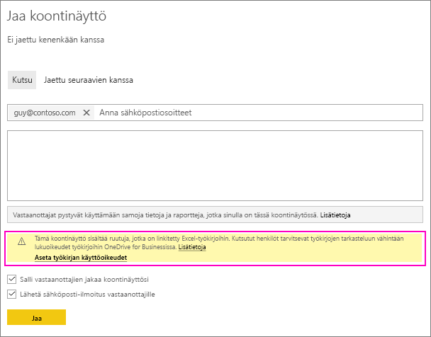
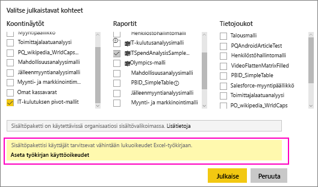

# Jaa Power BI -koontinäyttö, joka on linkitetty Excel-tiedostoon OneDrivessa
Voit Power BI:ssä [muodostaa yhteyden Excel-työkirjoihin OneDrive for Businessissa](../connect-data/service-excel-workbook-files.md) ja kiinnittää ruutuja koontinäyttöihin kyseisestä työkirjasta. Kun jakaa tämän koontinäytön tai luot sisältöpaketin, joka sisältää kyseisen koontinäytön:

* Työtoverisi voivat tarkastella ruutuja tarvitsematta itselleen kyseisen työkirjan käyttöoikeuksia. Voit siis luoda sisältöpaketin ja tiedät, että työtoverisi näkevät OneDrivessa olevasta Excel-työkirjasta luodut ruudut.
* Ruudun napsauttaminen avaa työkirjan Power BI:ssä. Työkirja avautuu vain, jos työtoverillasi on vähintään OneDrive for Businessissa olevan työkirjan [lukuoikeudet](https://support.office.com/article/Share-documents-or-folders-in-Office-365-1fe37332-0f9a-4719-970e-d2578da4941c).

## Työkirjan ruutuja sisältävän koontinäytön jakaminen
Jos haluat jakaa koontinäytön, joka linkittyy takaisin OneDrive for Businessiin tallennettuun Excel-työkirjaan, katso [Jaa koontinäyttö](service-share-dashboards.md). Ero on siinä, että voit muokata linkitetyn Excel-työkirjan käyttöoikeuksia ennen jakamista.

  

1. Anna työtovereidesi sähköpostiosoitteet.
2. Jotta työtoverisi voivat tarkastella Excel-työkirjaa Power BI:ssä, valitse **Aseta työkirjan käyttöoikeudet siirtymällä OneDrive for Businessiin**.
3. Kun olet OneDrivessa, [muokkaa käyttöoikeuksia](https://support.office.com/article/Share-files-and-folders-and-change-permissions-9fcc2f7d-de0c-4cec-93b0-a82024800c07) tarpeen mukaan.
4. Valitse **Jaa**.

>[!NOTE]
>Työtoverisi eivät voi kiinnittää muita ruutuja kyseisestä työkirjasta tai tehdä muutoksia Excel-työkirjaan Power BI:ssä.
> 
> 

## Luo organisaation sisältöpaketti ja koontinäyttö, joka sisältää työkirjan ruutuja
Kun [julkaiset sisältöpaketin](service-organizational-content-pack-create-and-publish.md), annat käyttöoikeuden yksittäisille työtovereille tai ryhmille. Kun julkaiset sisältöpaketin, joka sisältää työkirjalinkkejä, voit muokata linkitetyn Excel-työkirjan käyttöoikeuksia ennen julkaisemista.

1. Anna **Luo sisältöpaketti** -ruudussa sähköpostiosoitteet, anna sisältöpaketin otsikko ja kuvaus ja lataa kuva.
2. Valitse haluamasi koontinäyttö ja/tai raportti, joka on linkitetty Excel-työkirjaan OneDrive for Businessissa.
   
    
3. Valitse **Aseta työkirjan käyttöoikeudet siirtymällä OneDrive for Businessiin**.
4. Kun olet OneDrivessa, [muokkaa käyttöoikeuksia](https://support.office.com/article/Share-files-and-folders-and-change-permissions-9fcc2f7d-de0c-4cec-93b0-a82024800c07) tarpeen mukaan.
5. Valitse **Julkaise**.

## Koontinäytön jakaminen Power BI -työtilasta
Koontinäytön jakaminen Power BI -työtilasta tapahtuu samankaltaisesti kuin koontinäytön jakaminen omasta työtilasta lukuun ottamatta sitä, että tiedostot sijaitsevat Office 365 -työtilasivustossa sen sijaan, että ne olisivat yksityisessä OneDrive for Businessissa. Muokkaa Excel-työkirjan käyttöoikeuksia ennen koontinäytön jakamista työtilan ulkopuolisten henkilöiden kanssa.

## Seuraavat vaiheet
* [Ruudun kiinnittäminen Power BI:n koontinäyttöön Excelistä](../create-reports/service-dashboard-pin-tile-from-excel.md)
* [Power BI -palvelun peruskäsitteitä suunnittelijoille](../fundamentals/service-basic-concepts.md)
* Onko sinulla kysyttävää? [Kokeile Power BI -yhteisöä](https://community.powerbi.com/)
