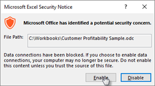

# Opetusohjelma: Power BI:n Analysoi Excelissä ‑toiminnon käyttö aloittaen Excelistä

Organisaatiosi käyttää Power BI:tä tietojen käyttöoikeuksien jakamiseen. Käynnistä Power BI:n Analysoi Excelissä ‑toiminto Excelistä, jotta voit luoda pivot-taulukoita ja pivot-kaavioita Excelissä. Niiden avulla voit tuoda analytiikkaan lisäkontekstia tai nopeuttaa tarvittavien tietojoukkojen etsimistä ja tuomista.

Aloita Power BI ‑tietojoukon käsittely valitsemalla Excelissä ”Analysoi Excelissä”. Sinua neuvotaan tietoja käyttävän pivot-taulukon luomisessa.  

Voit etsiä organisaatiosi jakamia lisätietojoukkoja palaamalla Tietojoukot-sivulle.

Jos kohtaat ongelman, valitse **Ei**-vaihtoehto alla olevan työnkulun kyseisessä vaiheessa ja anna palautetta linkitetyllä kaavakkeella.  

Tässä opetusohjelmassa opit:

> [!div class="checklist"]
> * Lataa ODC-tiedosto Power BI -tietojoukot -sivulta.
> * Salli tietojoukkosi käyttäminen Excelistä.
> * Aloita pivot-taulukoiden, kaavioiden ja laskentataulukoiden luominen tietojoukon avulla

## Edellytykset

Tätä opetusohjelmaa varten tarvitset seuraavat asiat:

* Power BI -tili. Jos et ole rekisteröitynyt Power BI:hin, [rekisteröidy ilmaiseen kokeiluversioon](https://app.powerbi.com/signupredirect?pbi_source=web) ennen aloittamista.

* Varmista, että olet hallitset [Power BI -palvelun käytön aloittaminen](https://docs.microsoft.com/power-bi/service-get-started) -opetusohjelman kaikki vaiheet.

* Tarvitset Power BI Premium -tietojoukon ja Power BI Pro -käyttöoikeuden. Lisätietoja on artikkelissa [Mikä on Power BI Premium?](https://docs.microsoft.com/power-bi/service-premium-what-is).

* Täydellinen luettelo edellytyksistä on [Analysoi Excelissä](https://docs.microsoft.com/power-bi/service-analyze-in-excel#requirements) -artikkelissa.

* Aktiivinen [Microsoft Office E5 -tilaus](https://www.microsoft.com/microsoft-365/business/office-365-enterprise-e5-business-software?activetab=pivot%3aoverviewtab)

## Aloittaminen

Aloita valitsemalla Excelissä pivot-taulukon luominen jaettujen Power BI -tietojen avulla. Siirry Power BI -tietojoukot -sivulle.

Kun käytät Analysoi Excelissä -työnkulkua, näet useita opastavia kehotteita, jotka kertovat kunkin vaiheen onnistuneesta suorittamisesta. Jos kohtaat ongelmia missä tahansa vaiheessa, valitse **Ei** ja anna palautetta kyseisen vaiheen lomakkeella.

## Lataa ja avaa ODC-tiedosto

Valitse tietojoukkosi vastaavasta luettelosta ja siihen liittyvästä työtilasta. Valitse sitten Analysoi Excelissä. Power BI luo ODC-tiedoston ja lataa sen selaimesta tietokoneeseesi.

Kun avaat tiedoston Excelissä, näkyviin tulevat tyhjä pivot-taulukko ja Kentät-luettelo, joka sisältää Power BI -tietojoukosta peräisin olevat taulukot, kentät ja mittarit. Voit luoda pivot-taulukoita ja kaavioita ja analysoida kyseistä tietojoukkoa samaan tapaan kuin paikallista tietojoukkoa Excelissä.

## Tietoyhteyksien käyttöönotto

Sinua saatetaan pyytää määrittämään yhteys luotetuksi, jotta voit analysoida Power BI -tietoja Excelissä. Järjestelmänvalvojat voivat poistaa käytöstä Analysoi Excelissä -toiminnon käyttämisen Analysis Services (AS) -tietokannoissa säilytettävissä paikallisissa tietojoukoissa. Se tapahtuu Power BI -hallintaportaalissa.

## Päivitysten asentaminen ja todentaminen

Kun avaat uuden ODC-tiedoston ensimmäistä kertaa, saatat joutua todentamaan sen Power BI -tililläsi.  Jos kohtaat ongelmia, lue lisätietoja [Analysoi Excelissä](https://docs.microsoft.com/power-bi/service-analyze-in-excel#sign-in-to-power-bi ) -artikkelista tai valitse työnkulun aikana Ei.

## Analysoiminen

Muiden paikallisten työkirjojen tapaan Analysoi Excelissä -toiminnolla voit luoda pivot-taulukoita ja kaavioita, lisätä tietoja sekä luoda erilaisia laskentataulukoita, joissa on näkymiä tietoihisi. Analysoi Excelissä -toiminnon käyttäminen paljastaa kaikki yksityiskohtaiset tiedot jokaiselle käyttäjälle, jolla on tietojoukon käyttöoikeus. Voit tallentaa tämän työkirjan, mutta et voi julkaista sitä, tuoda sitä takaisin Power BI:hin tai jakaa sitä organisaatiosi muiden käyttäjien kanssa. Lisätietoja ja muita käyttötapauksia voit lukea [Analysoi Excelissä](https://docs.microsoft.com/power-bi/service-analyze-in-excel#analyze-away) -artikkelista.

## Puhdista resurssit

Power BI -palvelun ja Tietojoukot-sivun välinen vuorovaikutus tulisi rajata ODC-tiedoston lataamiseen ja työnkulun selaamiseen. Jos sinulla on ongelmia näissä vaiheissa, valitse **Ei** ongelman aiheuttavassa kohdassa ja anna palautetta linkitetyllä lomakkeella. Lomake sisältää linkin lisätietoihin ongelmasta. Palaa Tietojoukot-sivulle ja yritä prosessia uudelleen tai valitse toinen tietojoukko.

## Seuraavat vaiheet

Voit olla kiinnostunut myös seuraavista artikkeleista:

* [Raporttien välillä porautumisen käyttäminen Power BI Desktopissa](https://docs.microsoft.com/power-bi/desktop-cross-report-drill-through)

* [Osittajien käyttäminen Power BI Desktopissa](https://docs.microsoft.com/power-bi/visuals/power-bi-visualization-slicers)
