# Perinteisten työtilojen päivittäminen uusiksi työtiloiksi Power BI:ssä

Tässä artikkelissa kerrotaan, miten voit päivittää perinteisen työtilan uudeksi työtilakokemukseksi tai *siirtää* sen. Voit päivittää minkä tahansa perinteisen työtilan. Uusissa työtiloissa työtilaroolit ovat entistä hajautetummat, joten sisällön käyttöoikeuksia voi hallita paremmin. Päivitettyjen työtilojen hallinta on myös aiempaa joustavampaa, koska työtilat on väljästi yhdistetty alkuperäisiin Office 365 -ryhmiinsä. Lue lisätietoja [uudesta työtilakokemuksesta](service-new-workspaces.md). 

>[!NOTE]
>Työtilapäivitys on nyt käytettävissä julkisena esiversiona. 

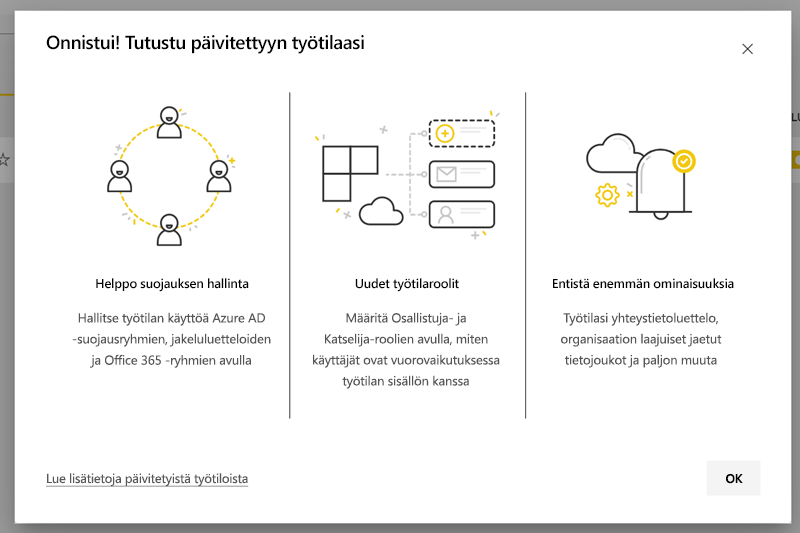

Työtilaan saattaa kuitenkin liittyä muutoksia, joista sinun on syytä olla tietoinen ja joihin kannattaa varautua. Sisältöpaketteja ei esimerkiksi tueta uudessa työtilassa. Tutustu [Päivityksessä huomioitavat asiat ja rajoitukset](#upgrade-considerations-and-limitations) -osioon edempänä tässä artikkelissa.

## Päivittämisen jälkeen tehtävää

Useita asioita kannattaa tehdä päivittämisen *jälkeen*. Niitä kannattaa suunnitella *ennen* päivittämistä:
- Tutustu käyttöoikeusluetteloon ja ymmärrä [päivityksen jälkeiset käyttöoikeudet](#permissions-after-upgrade).
- Tarkista [yhteystietoluettelo](#modify-the-contact-list) ja varmista, että se on määritetty haluamallasi tavalla.
- Tutustu [uuteen työtilakokemukseen](service-new-workspaces.md), ellet ole jo ehtinyt tehdä sitä.

## Perinteisen työtilan päivittäminen

Kuka tahansa työtilan järjestelmänvalvoja voi päivittää työtilan. Perinteisten työtilojen osalta työtilan järjestelmänvalvojan on oltava pohjana olevan Office 365 -ryhmän omistaja. Voit päivittää työtilan seuraavasti.

1. Valitse työtilan sisältöluettelossa **Enemmän vaihtoehtoja** ( **...** ) > **Muokkaa tätä työtilaa**.

    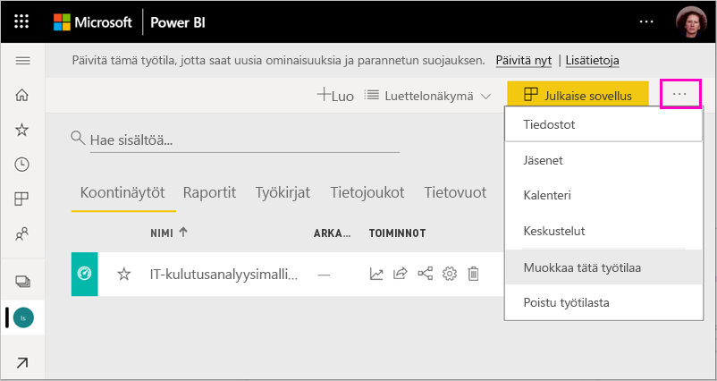

1. Laajenna **Lisäasetukset**-kohta ja valitse **Päivitä nyt**.

    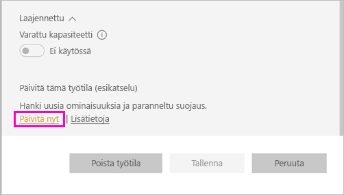

1. Tarkista valintaikkunan tiedot. Valintaikkunassa on varoituksia, jos olet julkaissut tai asentanut sisältöpaketteja työtilaan. Kun olet valmis, valitse **Olen valmis päivittämään tämän työtilan** ja valitse sitten **Päivitä**.

    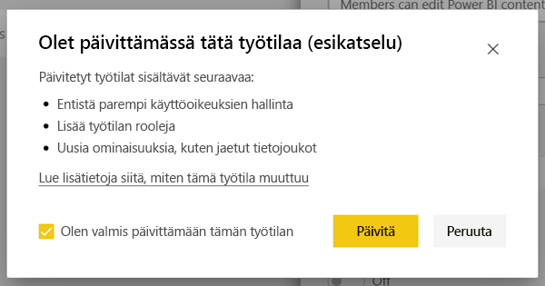

2. Päivityksen aikana näkyvissä on **Päivitetään**-sanoma. Työtilan päivittäminen vie yleensä alle minuutin.

1. Kun päivitys on valmis, näkyviin tulee **Onnistui**-valintaikkuna. Suosittelemme lukemaan [Työn järjestäminen uusiin työtiloihin Power BI:ssä](service-new-workspaces.md) -artikkelin, jotta saat tietää, miten uudet työtilat eroavat perinteisistä työtiloista.

### Vaikutus muihin työtilan käyttäjiin

Suosittelemme päivityksen tekemistä työajan ulkopuolella, kun vain harvat käyttäjät tarkastelevat tai muokkaavat työtilan kohteita.

Työtilaa aktiivisesti käyttävät käyttäjät saavat kehotuksen päivittää selaimensa näkymä. Raporttia muokkaavat käyttäjät voivat tallentaa ennen näkymän päivitystä.

## Päivityksessä huomioitavat asiat ja rajoitukset

- Työtilan URL-osoitteet ja tunnukset, työtilan sisältö ja työtilassa julkaistu sovellus eivät muutu. Työtilaan asennettujen sisältöpakettien sisältö käsitellään erikseen. Lisätietoja on tämän artikkelin kohdassa [Sisältöpaketit päivityksen yhteydessä](#content-packs-during-upgrade).
- Sisältöpaketteja ei tueta uudessa työtilassa. Lue [julkaistuihin sisältöpaketteihin](#published-content-packs) ja [asennettuihin sisältöpaketteihin](#installed-content-packs) liittyvistä osioista lisätietoja siitä, miten niitä käsitellään päivityksen aikana. Suosittelemme, että poistat työtilaan asennetut tai työtilassa julkaistut sisältöpaketit ennen päivitystä.
- Työtilan päivitys Power BI:ssä ei vaikuta perinteisen työtilan Office 365 -ryhmään. Mitkään tiimit, SharePoint-sivustot, postilaatikot tai muut Officen 365:n hallitsemat resurssit eivät muutu. Ne pysyvät ennallaan, kun päivität Power BI -työtilan. Office 365 -ryhmä jatkaa olemassaoloaan entiseen tapaan.
- Työtilan suojaus ei muutu päivityksen jälkeen. Lisätietoja on [Työtilan käyttöoikeudet päivityksen jälkeen](#permissions-after-upgrade) -osiossa.
- Tarvittaessa tarjolla on vaihtoehto **palata käyttämään perinteistä työtilaa**. Tämä vaihtoehto ei kuitenkaan täysin palauta kaikkia työtilan ominaisuuksia päivitystä edeltäviksi. Jos alat käyttää ominaisuuksia, jotka toimivat vain uudessa työtilakokemuksessa, et voi palata takaisin. Paluuvaihtoehto on käytettävissä 30 päivää päivityksen jälkeen.

## Käyttöoikeudet päivityksen jälkeen

Valitse työtilassa sisältöluettelon yllä olevalta valikkoriviltä **Käyttö**-vaihtoehto, niin voit tarkastella käyttöoikeuksia päivityksen jälkeen.

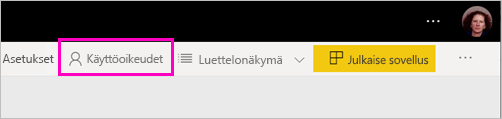

Jokainen Office 365 -ryhmän omistaja lisätään yksitellen päivitetyn työtilan Järjestelmänvalvoja-rooliin. Office 365 -ryhmä puolestaan lisätään johonkin työtilan rooliin. Rooli määräytyy sen mukaan, onko perinteinen työtila *vain luku-* vai *luku ja kirjoitus* -tilassa:

- Jos työtilan asetuksena on **Jäsenet voivat muokata Power BI -sisältöä**, päivityksen jälkeen Office 365 -ryhmä lisätään työtilan käyttöluetteloon **Jäsen**-roolissa.
- Jos työtilan asetuksena on **Jäsenet voivat vain lukea Power BI -sisältöä**, päivityksen jälkeen Office 365 -ryhmä lisätään työtilan käyttöluetteloon **Tarkastelija**-roolissa.

Koska Office 365 -ryhmälle annetaan rooli työtilassa, kaikki päivityksen jälkeen Office 365 -ryhmään lisätyt käyttäjät saavat kyseisen roolin työtilassa. Jos kuitenkin lisäät uusia omistajia Office 365 -ryhmään päivityksen jälkeen, heillä ei ole työtilan Järjestelmänvalvoja-roolia.

### Erot rooleissa ennen päivitystä ja sen jälkeen

Perinteisessä ja uudessa työtilassa on erilaiset työtilan roolit. Uudessa työtilassa voit antaa työtilan rooleja Office 365 -ryhmille, käyttöoikeusryhmille ja jakeluluetteloille.

- **Jäsenet** voivat jakaa yksittäisiä kohteita sekä myöntää käyttöoikeuden koko työtilaan Jäsen-, Osallistuja- tai Tarkastelija-rooleissa
- **Tarkastelijat** voivat vain tarkastella sisältöä; he eivät voi viedä pohjana olevia tietoja eivätkä analysoida Excelissä mitään työtilan tietojoukkoja, ellei heillä ole muodostamisoikeutta.

Kaikilla käyttäjillä, joilla on käyttöoikeus työtilan kohteisiin jakamisen tai sovelluksen käyttöoikeuden myötä, on edelleen käyttöoikeus kyseisiin kohteisiin. Kaikilla, joilla on käyttöoikeus työtilaan, on käyttöoikeus myös työtilasta julkaistuun sovellukseen. Nämä käyttäjät eivät näy sovelluksen käyttöoikeusluettelossa.

Suosittelemme arvioimaan, kannattaako uutta Osallistuja-roolia käyttää. Päivityksen jälkeen voit muuttaa Office 365 -ryhmälle Osallistuja-roolin käyttöoikeusruudussa.

Päivityksen jälkeen voit harkita suojaus- tai Office 365 -ryhmän tai jakeluluettelon luomista työtilan järjestelmänvalvojille sen sijaan, että hallitsisit käyttöoikeuksia määrittämällä rooleja yksittäisille käyttäjille.

Lue lisää [uusien työtilojen rooleista](service-new-workspaces.md#roles-in-the-new-workspaces).

## Käyttöoikeudet päivityksen jälkeen

Järjestelmänvalvoja-, Jäsen- tai Osallistuja-työtilaroolin käyttäjät tarvitsevat työtilan käyttöön Power BI Pro -käyttöoikeuden.

Jos työtila on jaetussa kapasiteetissa, Tarkastelija-työtilaroolin käyttäjät tarvitsevat työtilan käsittelyä varten myös Power BI Pro -käyttöoikeuden. Jos työtila on kuitenkin Premium-kapasiteetissa, Tarkastelija-työtilaroolin käyttäjät eivät tarvitse Pro-käyttöoikeutta työtilan käsittelyyn.

## Muita uuden työtilan ominaisuuksia

Uudessa työtilassa on ominaisuuksia, joita perinteisissä työtiloissa ei ole. Tarjolla on esimerkiksi mahdollisuus määrittää yhteystietoluettelo, joka on erilainen kuin työtilan järjestelmänvalvojilla tai omistajilla. Se on kuitenkin yhteydessä Office 365 -ryhmän SharePoint-asiakirjakirjastoon. 

### Yhteystietoluettelon muokkaaminen

1. Valitse työtilassa sisältöluettelon yllä olevalta valikkoriviltä **Asetukset**-vaihtoehto, niin voit käsitellä työtilan asetuksia.

    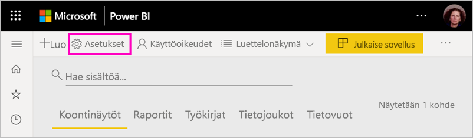

2. **Lisäasetukset**-kohdassa työtilan **Yhteystietoluettelo** on määritetty olemaan se Office 365 -ryhmä, josta työtila päivitettiin. Voit lisätä yhteystietoluetteloon käyttäjiä tai ryhmiä, tai voit siirtää sen työtilan järjestelmänvalvojille.

    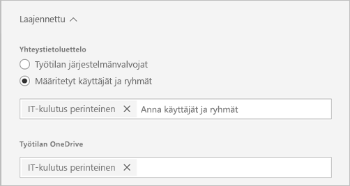

### Työtilan OneDrive 

Päivityksen jälkeen työtilan **OneDrive** on yhdistetty Office 365 -ryhmän SharePoint-tiedostokirjastoon. Tämä tiedostokirjasto näkyy **OneDrive**-vaihtoehtona, kun valitaan **Nouda tiedot > Tiedostot**. Huomaa, että kaikilla työtilan käyttäjillä ei välttämättä ole käyttöoikeutta kyseiseen tiedostokirjastoon, jos he eivät kuulu Office 365 -ryhmään.

## Sisältöpaketit päivityksen yhteydessä

Uusi työtila ei tue sisältöpaketteja. Voit sen sijaan jakaa sisältöä työtilassa käyttämällä sovelluksia ja jaettuja tietojoukkoja. Suosittelemme, että poistat julkaistut tai asennetut sisältöpaketit työtilasta ennen päivitystä. Jos työtilassa on kuitenkin julkaistuja tai asennettuja sisältöpaketteja päivityksen yhteydessä, päivitysprosessi yrittää säilyttää sisällön alla kuvatulla tavalla.  Sisältöpakettia tai sisällön yhteyttä sisältöpakettiin ei voi palauttaa päivityksen jälkeen.

### Julkaistut sisältöpaketit

Työtilassa julkaistut sisältöpaketit poistetaan päivityksen aikana. Niitä ei voi julkaista tai päivittää enää päivityksen jälkeen, vaikka palaisit takaisin perinteiseen työtilaan. Jos muut ovat asentaneet sisältöpakettisi omiin työtiloihinsa, päivityksen jälkeen he näkevät työtiloissaan kopion sisältöpaketin sisällöstä. Lisätietoja on kohdassa **Asennetut sisältöpaketit**.

### Asennetut sisältöpaketit

Kun päivität omaa työtilaasi tai kun joku muu päivittää työtilan, josta sisältöpaketti on julkaistu, asennetuissa sisältöpaketeissa ilmenee tärkeitä muutoksia. Päivityksen jälkeen työtila sisältää kopion sisältöpaketin sisällöstä. Se on yhdistetty alkuperäisen työtilan alkuperäiseen tietojoukkoon.

Siihen liittyy kuitenkin tärkeitä muutoksia:

- Sisältö ei enää päivity, jos sisältöpaketti päivitetään.
- URL-osoitteet ja nimiketunnistimet muuttuvat, joten muiden kanssa jakamasi kirjanmerkit tai linkit on päivitettävä.
- Kaikki mukautukset, joita käyttäjät ovat tehneet alkuperäiseen sisältöpakettiin työtilassasi, menetetään. Mukautuksia ovat tilaukset, ilmoitukset, omat kirjanmerkit, pysyvät suodattimet ja suosikit.
- Uusilla käyttäjillä ei ehkä ole käyttöoikeutta sisältöpaketin sisältämiin tietojoukkoihin. Varmista tietojoukon omistajan kanssa, että työtilan käyttäjillä on tietojen käyttöoikeus.

## Palaa takaisin perinteiseen työtilaan

Osana päivityksen käyttökokemusta voit myös palata perinteiseen työtilaan 30 päivän ajan päivityksen jälkeen. Tämä ominaisuus palauttaa työtilan sisällön liitoksen alkuperäiseen Office 365 -ryhmään. Se on käytettävissä siltä varalta, että organisaatiosi kohtaa vakavia ongelmia uuden työtilan yhteydessä. Ominaisuuteen liittyy kuitenkin rajoituksia. Lue ensin tämän artikkelin osio [Huomioitavaa siirryttäessä takaisin perinteiseen työtilaan](#considerations-for-switching-back-to-classic).

Jotta voit palata takaisin perinteiseen työtilaan, sinun on oltava sen Office 365 -ryhmän omistaja, joka työtilaan liittyi ennen päivitystä. Toimi seuraavasti.

1. Valitse työtilan sisältöluettelossa **Enemmän vaihtoehtoja** ( **...** ) > **Työtilan asetukset**.

    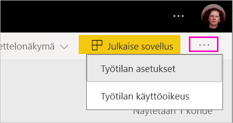

1. Laajenna **Lisäasetukset** ja valitse **Palaa takaisin perinteiseen**. Jos asetus ei ole käytettävissä, katso [Huomioitavaa siirryttäessä takaisin perinteiseen työtilaan](#considerations-for-switching-back-to-classic) -kohta edempänä tässä artikkelissa.

    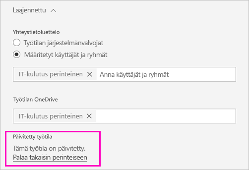

1. Kun olet valmis, valitse **Olen valmis vaihtamaan takaisin perinteiseen** -ruutu ja valitse **Siirry perinteiseen**. Valintaikkunassa saattaa näkyä varoituksia tai estoja. Lue tämän artikkelin [Huomioitavaa siirryttäessä takaisin perinteiseen työtilaan](#considerations-for-switching-back-to-classic) -osio, jos kohtaat tällaisia ongelmia.

    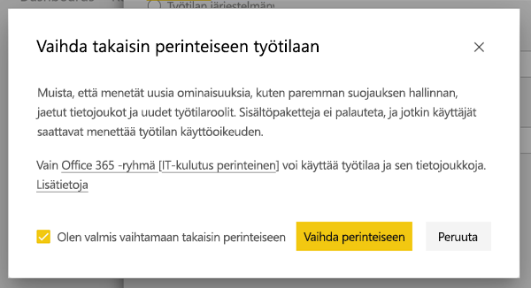

1. Kun vaihto takaisin on suoritettu, näkyviin tulee vahvistusvalintaikkuna.

    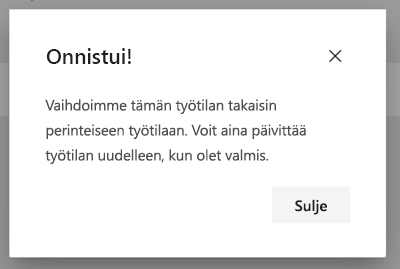

### Huomioitavaa siirryttäessä takaisin perinteiseen työtilaan

Et voi siirtyä takaisin perinteiseen työtilaan, jos jokin seuraavista pitää paikkansa työtilasi suhteen:

- Office 365 -ryhmä poistettiin.
- Päivityksestä on kulunut yli 30 päivää.
- Työtilan tietojoukkoja käytetään muiden työtilojen raportteihin tai koontinäyttöihin. Miten näin voi käydä? Sanotaan, että olet julkaissut työtilastasi sisältöpaketin ennen päivitystä ja joku on asentanut kyseisen sisältöpaketin toisessa työtilassa. Heti päivityksen jälkeen kyseisen sisältöpaketin raportit ja koontinäytöt käyttävät tietojoukkoja.
- Työtila on osa sovelluksen elinkaaren hallinnan putkea.
- Työtilaa käytetään mallisovelluksiin.
- Työtila käyttää suurien mallien ominaisuutta.
- Työtila käyttää uutta käyttömittareiden ominaisuutta.

Kun vaihdat takaisin perinteiseen työtilaan, et palauta alkuperäisen työtilan tarkkaa kopiota. Seuraavat muutokset ilmenevät:

- Työtilan oikeudet määrittää se Office 365 -ryhmä, johon päivitetty työtila oli alunperin liitetty.
  - Kaikista Office 365 -ryhmän järjestelmänvalvojista tulee perinteisen työtilan järjestelmänvalvojia.
  - Kaikista Office 365 -ryhmän jäsenistä tulee perinteisen työtilan jäseniä. Jos perinteinen työtila oli määritetty tilaan **Jäsenet voivat vain lukea Power BI -sisältöä**, tämä asetus palautetaan.
  - Sellaiset käyttäjät tai käyttäjäryhmät, jotka on lisätty työtilaan päivityksen jälkeen (Office 365 -ryhmän ulkopuolelta), menettävät työtilan käyttöoikeuden. Lisää heidät Office 365 -ryhmään, niin he saavat käyttöoikeuden. Huomaa, että Office 365 -ryhmät eivät salli käyttöoikeusryhmien tai jakeluryhmien upottamista jäsenyyteen.
  - Käyttäjillä, jotka ovat saaneet sovelluksen käyttöoikeuden, on edelleen sovelluksen käyttöoikeus.
  - Käyttäjillä, jotka ovat saaneet käyttöoikeuden työtilan kohteisiin jakamisen myötä, on edelleen niiden käyttöoikeus.
- Perinteisessä työtilassa ennen päivitystä julkaistuja sisältöpaketteja ei palauteta.
- Perinteisessä työtilassa ennen päivitystä asennettuja sisältöpaketteja ei palauteta.
- Päivityksen jälkeen käyttäjien työtilassa luomat tilaukset poistetaan. Ennen päivitystä luodut tilaukset jatkavat toimintaansa odotetusti.
- Tietoilmoituksia ei säilytetä. Ne poistetaan.
- Jos olet nimennyt työtilan uudelleen päivityksen jälkeen, työtilan nimi palautetaan vastaamaan Office 365 -ryhmän nimeä.
- Työtilan päivitys ei vaikuta käynnissä oleviin toimintoihin, kuten tietojen päivittämiseen.

## Hallinnoi vuokraajan siirtymistä uusiin työtiloihin 

Jotkin organisaatiot haluavat siirtää useita työtiloja tai kaikki työtilat uuden työtilakokemuksen mukaisiksi. Työtilojen päivitystyökalu keskittyy antamaan työtilojen järjestelmänvalvojille tilaisuuden päivittää. Jos organisaatio haluaa hallita tällaista prosessia, organisaatio voi suorittaa seuraavat vaiheet.

1. Power BI -hallintaportaalin työtilaluettelossa ja vastaavassa ohjelmointirajapinnassa on luettelo kaikista Power BI:n työtiloista. Perinteiset työtilat näytetään luettelossa Ryhmä-tyyppinä.
2. Pyydä yksittäisiä Office 365 -ryhmien omistajia tai Office 365 -järjestelmänvalvojaasi päivittämään työtilat. Jos haluat päivittää työtilan, sinun tulee olla ryhmän omistaja.

Työtilan päivitysominaisuus ei tarjoa työkaluja joukkopäivitykseen tai ohjelmalliseen päivitykseen. Lisäksi organisaatiossasi luodut uudet Office 365 -ryhmät näkyvät jatkossakin Power BI:ssä. 
   
   
## Tunnetut ongelmat

Saatat törmätä useisiin tunnettuihin ongelmiin:
- Käyttäjät saattavat nähdä päivittämisen jälkeen virheilmoituksen, jonka mukaan mallin lataaminen ei onnistu. Tämä ilmoitus näytetään virheellisesti, joten sen voi ohittaa. 
- Joidenkin työtilojen nimet muuttuvat päivityksessä. Kun näin käy, työtilan nimi joko vaihdetaan aiempaan nimeen tai tyhjään. Voit ratkaista ongelman nimeämällä työtilan uudelleen haluamallasi nimellä.
- Kun päivität työtilan, johon oli asennettu sisältöpaketti, saatat nähdä työtilassa uusia koontinäyttöjä, joita ei ollut näkyvissä ennen päivitystä. Näin käy joissain tapauksissa, joissa sisältöpakettia ei ole päivitetty äskettäin. Voit huoletta poistaa nämä koontinäytöt.

## Seuraavat vaiheet

* [Työn järjestäminen uusiin työtilakokemuksiin](service-new-workspaces.md)
* [Uusien työtilojen luominen](service-create-the-new-workspaces.md)
* [Luo perinteisiä työtiloja](service-create-workspaces.md)
* Onko sinulla kysyttävää? [Voit esittää kysymyksiä Power BI -yhteisössä](https://community.powerbi.com/)
