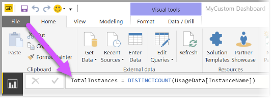

# Azure Consumption Insights -tietoihin yhdistäminen Power BI Desktopissa

Voit yhdistää Power BI Desktopin Azureen ja saada tarkempia tietoja Azuren käytöstä organisaatiossasi. Näiden tietojen avulla voit luoda mukautettuja raportteja ja mittareita, joiden avulla saat entistä paremman käsityksen ja analyysit Azuren käytöstä.

> [!NOTE]
> Microsoft Azure Consumption Insightsia (beeta) tuetaan rajoitetusti. Jos haluat käyttää uusia toimintoja, käytä [Power BI:n Azure Cost Management -liitintä](desktop-connect-azure-cost-management.md).

## Yhteyden muodostaminen Azure Consumption Insightsin avulla

Azure Consumption Insightsin avulla voit muodostaa yhteyden Azure Enterprise Agreement -sopimuksen laskutustileihin.

Tässä osiossa on ohjeita siirrettävien tietojen saamisesta Azure Enterprise -liittimen avulla. Lisäksi *käyttötietosarakkeiden* yhteenveto on saatavilla **ACI** (Azure Consumption Insights) -ohjelmointirajapinnassa.

**Azure Consumption Insights** -liittimen käyttö edellyttää, että sinulla on pääsy Azure-portaalin yritysominaisuuksiin.

**Azure Consumption Insights** -liittimen käyttäminen **Power BI Desktopissa**: 

1. Valitse **Aloitus**-valintanauhasta **Nouda tiedot**.

1. Valitse vasemmalla näkyvistä luokista **Online-palvelut**.  

1. Valitse **Microsoft Azure Consumption Insights (beeta)** . 

1. Valitse **Muodosta yhteys**.

   

   Anna avautuvaan valintaikkunaan oma **Azure-rekisteröintinumerosi**.

   

   * Löydät rekisteröintinumerosi [Azure Enterprise Portalista](https://ea.azure.com) seuraavassa kuvassa näkyvästä sijainnista:

  

   Tämä liitinversio tukee vain yritysrekisteröintejä osoitteesta https://ea.azure.com. Kiinassa tehtyjä rekisteröintejä ei tueta tällä hetkellä.

   Anna seuraavaksi *tiliavaimesi* yhteyden muodostamista varten.

   

   * Löydät rekisteröintiin tarvittavan tiliavaimesi [Azure Enterprise Portalista](https://ea.azure.com).

  

Kun annat *tiliavaimesi* ja valitset **Yhdistä**, näyttöön avautuu **Navigator**, jossa on yhdeksän käytettävissä olevaa taulukkoa:

| Taulukko        | Kuvaus |
|------------- | -------------------------------------------------------------|
| **Budjetit** | Budjettitiedot todellisten kustannusten tai käytön tarkastelemiseksi olemassa oleviin budjettitavoitteisiin verrattuna. |
| **MarketPlace** | Käyttöön perustuvat Azure Marketplace -maksut. |
| **PriceSheets** | Käytettävissä olevat hinnat mittarin mukaan rekisteröintiä varten. |
| **RICharges** | Varattuihin esiintymiin liittyvät maksut viimeisten 24 kuukauden ajalta. |
| **RIRecommendations_Single** | Varatun esiintymän ostosuositukset yhdessä tilauksessa käyttötrendien perusteella viimeisten 7, 30 tai 60 päivän ajalta. |
| **RIRecommendations_Shared** | Varatun esiintymän ostosuositukset käyttötrendien perusteella kaikissa tilauksissa viimeisten 7, 30 tai 60 päivän ajalta. |
| **RIUsage** | Varattujen esiintymien kulutustiedot viimeisen kuukauden ajalta. |
| **Summaries** | Kuukausittainen yhteenveto saldoista, uusista ostoista, Microsoft Azure Marketplacen palvelumaksuista, muutoksista ja ylitysmaksuista. |
| **UsageDetails** | Kulutettujen määrien erittely ja arvioidut rekisteröintimaksut. |

Voit avata esikatselun valitsemalla minkä tahansa taulukon vieressä olevan valintaruudun. Voit valita yhden tai useamman taulukon valitsemalla taulukon nimen vieressä olevan ruudun ja sen jälkeen **Lataa**.

> [!NOTE]
> *Summary* (Yhteenveto)- ja *PriceSheet* (Hinnasto) -taulukot ovat käytettävissä vain rekisteröintitason ohjelmointirajapinta-avaimelle. Lisäksi näiden taulukoiden tiedot sisältävät oletusarvoisesti kuluvan kuukauden käyttöä koskevat *Usage* (Käyttö) -tiedot ja *PriceSheet* (Hinnasto) -tiedot. *Summary* (Yhteenveto)- ja *MarketPlace*-taulukot eivät rajoitu kuluvaan kuukauteen.
>
>

Kun valitset **Lataa**, tiedot ladataan **Power BI Desktopiin**.

Kun valitsemasi tiedot on ladattu, valitsemasi taulukot ja kentät näkyvät **Kentät**-ruudussa.

## Azure Consumption Insightsin käyttö
**Azure Consumption Insights** -liittimen käyttö edellyttää, että sinulla on pääsy Azure-portaalin yritysominaisuuksiin.

Kun olet ladannut tiedot onnistuneesti **Azure Consumption Insights** -liittimen avulla, voit luoda omia mukautettuja mittareita ja sarakkeita käyttämällä **kyselyeditoria**. Voit myös luoda visualisointeja, raportteja ja koontinäyttöjä, joita voit jakaa **Power BI -palvelussa**.

Tyhjän kyselyn avulla voit noutaa mukautetun Azure-mallikyselykokoelman. Voit noutaa sen kahdella tavalla: 

**Power BI Desktopissa**: 

1. Valitse **Aloitus**-valintanauha 
2. Valitse **Nouda tiedot** > **Tyhjä kysely** 

Tai **kyselyeditorissa**: 

1. Napsauta hiiren kakkospainikkeella vasemmanpuoleista **Kyselyt**-ruutua 
2. Valitse avautuvasta valikosta **Uusi kysely > Tyhjä kysely**

Kirjoita **kaavariville**:

    = MicrosoftAzureConsumptionInsights.Contents

Seuraavassa kuvassa näkyy esimerkkikokoelma, joka tulee näkyviin.

Kun käsittelet raportteja ja luot kyselyitä, voit käyttää seuraavia:

* Voit määrittää kuukausien määrän alkaen nykyisestä päivämäärästä käyttämällä *numberOfMonth*-parametria.
  * Käytä arvoa välillä 1–36. Ilmoita kuukausien määrä, jonka haluat tuoda, kuluvasta päivämäärästä alkaen. Suosittelemme enintään 12 kuukauden tietojen noutamista. Tämä rajoituksen ansiosta vältetään Power BI:n kyselyiden tuonnin rajoitukset ja tietomäärän kynnysarvot.
* Voit määrittää historiallisen aikaikkunan kuukausijakson käyttämällä parametreja *startBillingDataWindow* ja *endBillingDataWindow*.
* Älä käytä *numberOfMonth*-parametria yhdessä *startBillingDataWindow*- tai *endBillingDataWindow*-parametrin kanssa

## Siirtyminen Azure Enterprise -liittimestä

Osa asiakkaista on luonut visualisointeja *Azure Enterprise -liittimen (beeta)* avulla. Se korvataan lopulta **Azure Consumption Insights** -liittimellä. Uudessa liittimessä on esimerkiksi seuraavia ominaisuuksia ja parannuksia:

* *taseen yhteenvetoa* ja *Marketplace-ostoksia* varten saatavilla olevat lisätietolähteet
* uudet ja edistykselliset parametrit, kuten *startBillingDataWindow* ja *endBillingDataWindow*
* parempi suorituskyky ja vasteaika.

Seuraavissa vaiheissa näytetään, miten siirrytään **Azure Consumption Insights** -liittimeen. Näissä vaiheissa mukautettujen koontinäyttöjen tai raporttien luomiseen tehty työ säilytetään.

### Vaihe 1: Yhdistä Azureen uuden liittimen avulla
Ensimmäinen vaihe on käyttää **Azure Consumption Insights** -liitintä, mikä on jo kuvattu yksityiskohtaisesti tässä artikkelissa. Valitse tässä vaiheessa **Power BI Desktopin** **Aloitus**-valintanauhasta **Nouda tiedot > Tyhjä kysely**.

### Vaihe 2: Luo kysely laajennetun editorin avulla
Valitse **kyselyeditorin** **Aloitus**-valintanauhan **Kysely**-osasta **Laajennettu editori**. Syötä avautuvaan **Laajennettu editori** -ikkunaan seuraava kysely:

    let    
        enrollmentNumber = "100",
        optionalParameters = [ numberOfMonth = 6, dataType="DetailCharges" ],
        data = MicrosoftAzureConsumptionInsights.Contents(enrollmentNumber, optionalParameters)   
    in     
        data

Sinun on korvattava *enrollmentNumber*-arvo omalla rekisteröintinumerollasi. Löydät numerosi [Azure Enterprise -portaalista](https://ea.azure.com). Parametri *numberOfMonth* tarkoittaa, kuinka monen kuukauden tiedot nykyisestä päivämäärästä taaksepäin haluat. Käytä nykyisestä kuukaudesta arvoa nolla (0).

Kun valitset **Laajennettu editori** -ikkunan **Valmis**-painikkeen, esikatselu päivittyy ja näet taulukossa tiedot määrittämältäsi kuukausiväliltä. Valitse **Sulje ja ota käyttöön** ja palaa.

### Vaihe 3: Siirrä mittarit ja mukautetut sarakkeet uuteen raporttiin
Seuraavaksi on siirrettävä luomasi mukautetut sarakkeet tai mittarit uuteen tietotaulukkoon. Vaiheet ovat seuraavat:

1. Avaa Muistio (tai muu tekstieditori).
2. Valitse mittari, jonka haluat siirtää, kopioi teksti *Kaava*-kentästä ja lisää se Muistioon.

   
3. Muuta *Kysely1*:n nimeksi alkuperäisen tietotaulukon nimi.
4. Jos haluat luoda uusia taulukkomittareita ja mukautettuja sarakkeita, napsauta taulukkoa hiiren kakkospainikkeella ja valitse **Uusi mittari**. Leikkaa ja liitä tallennetut mittarit ja sarakkeet, kunnes kaikki on siirretty.

### Vaihe 4: Linkitä uudelleen suhteita sisältäneet taulukot
Monissa koontinäytöissä on lisäksi taulukoita, joita käytetään hakuun tai suodatukseen, kuten päivämäärätaulukoita tai mukautettuihin projekteihin käytettyjä taulukoita. Näiden suhteiden muodostaminen uudelleen ratkaisee useimmat jäljellä olevat ongelmat. Näin voit tehdä sen.

- Valitse **Power BI Desktopin** **Mallinnus**-välilehdeltä **Suhteiden hallinta**, jolloin näyttöön avautuu ikkuna, jossa voit hallita mallin sisältämiä suhteita. Linkitä taulukot uudelleen tarpeen mukaan.

    

### Vaihe 5: Tarkista visualisoinnit ja säädä kentän muotoilua tarpeen mukaan
Tässä vaiheessa alkuperäisten visualisointiesi, taulukoiden ja yli- ja alirakenteiden pitäisi pääasiassa toimia odotetusti. Vähäinen hienosäätö saattaa kuitenkin olla tarpeen ulkoasun ja tuntuman viimeistelyssä. Silmäile kaikki koontinäytöt ja visualisoinnit läpi varmistaaksesi, että ne näyttävät siltä kuin haluat.

## Azure Consumption and Insights (ACI) -ohjelmointirajapinnan käyttö kulutustietojen saamiseen
Azure tarjoaa myös [**Azure Consumption and Insights (ACI) -ohjelmointirajapinnan**](https://azure.microsoft.com/blog/announcing-general-availability-of-consumption-and-charge-apis-for-enterprise-azure-customers/). Voit luoda omia mukautettuja ratkaisuja ja kerätä, raportoida ja visualisoida Azuren kulutustietoja ACI-ohjelmointirajapinnan avulla.

### Nimien ja käyttötietojen vastaavuudet portaalin, liittimen ja ohjelmointirajapinnan välillä
Azure-portaalin sarakkeet ja tietojen nimet ovat vastaavat ohjelmointirajapinnassa ja liittimessä, mutta ne eivät aina ole identtisiä. Seuraavassa taulukossa on yhteenveto, joka helpottaa tietojen selvittämistä. Taulukko kertoo myös, onko sarake vanhentunut. Lisätiedot ja termien määritelmät ovat [Azure-laskutuksen tietohakemistossa](https://docs.microsoft.com/azure/billing/billing-enterprise-api-usage-detail).

| ACI-liittimen / sisältöpaketin sarakkeen nimi | ACI-ohjelmointirajapinnan sarakkeen nimi | EA-sarakkeen nimi | Vanhentunut / käytössä yhteensopivuuden vuoksi aiempien versioiden kanssa |
| --- | --- | --- | --- |
| AccountName |accountName |Tilin nimi |Ei |
| AccountId |accountId | |Kyllä |
| AcccountOwnerId |accountOwnerEmail |AccountOwnerId |Ei |
| AdditionalInfo |additionalInfo |AdditionalInfo |Ei |
| AdditionalInfold | | |Kyllä |
| Consumed Quantity |consumedQuantity |Consumed Quantity |Ei |
| Consumed Service |consumedService |Consumed Service |Ei |
| ConsumedServiceId |consumedServiceId | |Kyllä |
| Cost |cost |ExtendedCost |Ei |
| Cost Center |costCenter |Cost Center |Ei |
| Päivämäärä |päivämäärä |Päivämäärä |Ei |
| Päivä | |Päivä |Ei |
| DepartmentName |departmentName |Department Name |Ei |
| DepartmentID |departmentId | |Kyllä |
| Instance ID | | |Kyllä |
| InstanceId |instanceId |Instance ID |Ei |
| Sijainti | | |Kyllä |
| Meter Category |meterCategory |Meter Category |Ei |
| Meter ID | | |Kyllä |
| Meter Name |meterName |Meter Name |Ei |
| Meter Region |meterRegion |Meter Region |Ei |
| Meter Sub-Category |meterSubCategory |Meter Sub-Category |Ei |
| MeterId |meterId |Meter ID |Ei |
| Kuukausi | |Kuukausi |Ei |
| Tuote |product |Product |Ei |
| ProductId |productId | |Kyllä |
| Resource Group |resourceGroup |Resource Group |Ei |
| Resource Location |resourceLocation |Resource Location |Ei |
| ResourceGroupId | | |Kyllä |
| ResourceLocationId |resourceLocationId | |Kyllä |
| ResourceRate |ResourceRate |ResourceRate |Ei |
| ServiceAdministratorId |serviceAdministratorId |ServiceAdministratorId |Ei |
| ServiceInfo1 |serviceInfo1 |ServiceInfo1 |Ei |
| ServiceInfo1Id | | |Kyllä |
| ServiceInfo2 |serviceInfo2 |ServiceInfo2 |Ei |
| ServiceInfo2Id | | |Kyllä |
| Store Service Identifier |storeServiceIdentifier |Store Service Identifier |Ei |
| StoreServiceIdentifierId | | |Kyllä |
| Subscription Name |subscriptionName |Subscription Name |Ei |
| Tunnisteet |tags |Tags |Ei |
| TagsId | | |Kyllä |
| Mittayksikkö |unitOfMeasure |Mittayksikkö |Ei |
| Vuosi | |Vuosi |Ei |
| SubscriptionId |subscriptionId |SubscriptionId |Kyllä |
| SubscriptionGuid |subscriptionGuid |SubscriptionGuid |Ei |

## Seuraavat vaiheet

Voit muodostaa yhteyden moniin eri tietolähteisiin Power BI Desktopissa. Katso lisätietoja seuraavista artikkeleista:

* [Azure Cost Management -tietoihin yhdistäminen Power BI Desktopissa](desktop-connect-azure-cost-management.md)
* [Mikä on Power BI Desktop?](../fundamentals/desktop-what-is-desktop.md)
* [Power BI Desktopin tietolähteet](desktop-data-sources.md)
* [Tietojen muotoilu ja yhdistäminen Power BI Desktopissa](desktop-shape-and-combine-data.md)
* [Yhteyden muodostaminen Excel-työkirjoihin Power BI Desktopissa](desktop-connect-excel.md)   
* [Tietojen antaminen suoraan Power BI Desktopiin](desktop-enter-data-directly-into-desktop.md)   
