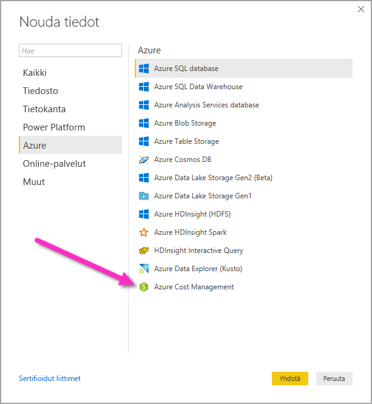
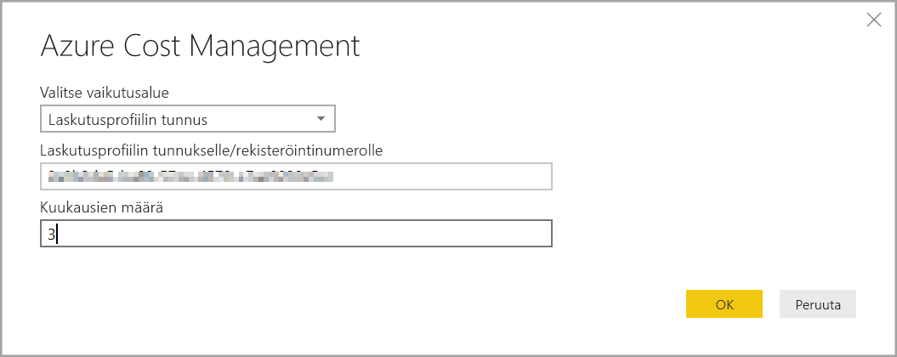
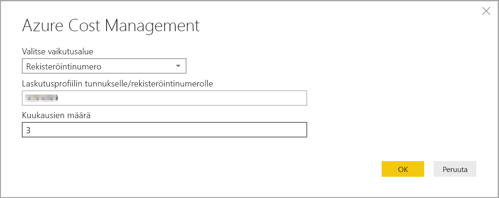
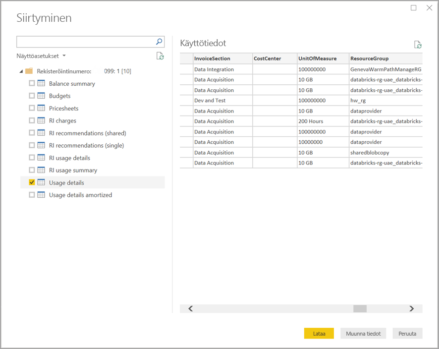

# Visualisointien luominen Azure Cost Management -liittimellä Power BI Desktopissa

Power BI Desktopin Azure Cost Management -liittimellä voit luoda tehokkaita mukautettuja visualisointeja ja raportteja, joilla ymmärrät paremmin Azure-kulujasi. Azure Cost Management -liitin tukee tällä hetkellä asiakkaita, joilla on [Microsoft Customer Agreement](https://azure.microsoft.com/pricing/purchase-options/microsoft-customer-agreement/)- tai [Enterprise Agreement (EA)](https://azure.microsoft.com/pricing/enterprise-agreement/) -sopimus.  

Azure Cost Management -liitin käyttää OAuth 2.0 -todennusta Azuren kanssa ja tunnistaa käyttäjät, jotka käyttävät liitintä. Tässä prosessissa luodut tunnukset ovat käytettävissä määritetyn ajan. Power BI säilyttää tunnuksen seuraavaa kirjautumista varten. OAuth 2.0 on vakioprosessi, joka jatkuu taustalla, millä varmistetaan käyttöoikeuksien turvallinen käsittely. Jos haluat muodostaa yhteyden, sinun täytyy käyttää [yrityksen järjestelmänvalvojan](https://docs.microsoft.com/azure/billing/billing-understand-ea-roles) tiliä (Enterprise Agreement -asiakkaat) tai [laskutustilin omistajan](https://docs.microsoft.com/azure/billing/billing-understand-mca-roles) tiliä (Microsoft Customer Agreement -asiakkaat). 

> [!NOTE]
> Tämä liitin korvaa aiemmin käytössä olleet [ Azure Consumption Insights- ja Azure Cost Management (beeta)](desktop-connect-azure-consumption-insights.md) -liittimet. Kaikki aiemmalla liittimellä luodut raportit täytyy luoda uudelleen tällä liittimellä.

## Yhdistäminen Azure Cost Managementin avulla

Jos haluat käyttää **Azure Cost Management -liitintä** Power BI Desktopissa, toimi seuraavasti:

1.  Valitse **Aloitus**-valintanauhasta **Nouda tiedot**.
2.  Valitse tietoluokkaluettelosta **Azure**.
3.  Valitse **Azure Cost Management**.

    

4. Anna näyttöön avautuvassa valintaikkunassa **laskutusprofiilin tunnus** (**Microsoft Customer Agreement -asiakkaat**) tai **rekisteröitymisnumero** (**Enterprise Agreement -asiakkaat**). 

## Microsoft Customer Agreement -tiliin yhdistäminen 

Jos haluat yhdistää **Microsoft Customer Agreement** -tilillä, voit hakea **laskutusprofiilin tunnuksen** Azure-portaalista:

1.  Siirry [Azure-portaalissa](https://portal.azure.com/)**kustannusten hallinnan ja laskutuksen kohtaan**.
2.  Valitse laskutusprofiilisi. 
3.  Valitse valikosta **Asetukset** ja sivupalkista **Ominaisuudet**.
4.  Kopioi **laskutusprofiilin** **tunnus**. 
5.  Siirry **Valitse vaikutusalue** -kohtaan, valitse **Laskutusprofiilin tunnus** ja liitä siihen edellisessä vaiheessa kopioimasi profiilin tunnus. 
6.  Anna kuukausien määrä ja valitse **OK**.

    

7.  Kirjaudu pyydettäessä sisään Azure-käyttäjätilillä ja -salasanalla. 

## Enterprise Agreement -tiliin yhdistäminen

Jos haluat yhdistää Enterprise Agreement (EA) -tilillä, voit hakea rekisteröitymistunnuksen Azure-portaalista:

1.  Siirry [Azure-portaalissa](https://portal.azure.com/)**kustannusten hallinnan ja laskutuksen kohtaan**.
2.  Valitse laskutustilisi.
3.  Kopioi **Yleiskatsaus**-valikosta **laskutustilin tunnus**.
4.  Siirry **Valitse vaikutusalue** -kohtaan, valitse **Rekisteröitymisnumero** ja liitä siihen edellisessä vaiheessa kopioimasi laskutustilin tunnus. 
5.  Anna kuukausien määrä ja valitse sitten **OK**.

    

6.  Kirjaudu pyydettäessä sisään Azure-käyttäjätilillä ja -salasanalla. 

## Liittimen avulla saatavilla olevat tiedot

Kun todennus onnistuu, näyttöön avautuu **siirtymistoiminnon** ikkuna, joka sisältää seuraavat käytettävissä olevat tietotaulukot:

| **Taulukko** | **Kuvaus** |
| --- | --- |
| **Taseen yhteenveto** | Tämä on Enterprise Agreement (EA) -sopimusten taseen yhteenveto. |
| **Laskutustapahtumat** | Tämä on uusien laskujen, hyvitysostojen ja muiden vastaavien tapahtumaloki. Tämä on saatavilla vain Microsoft Customer Agreement -asiakkaille. |
| **Budjetit** | Budjettitiedot todellisten kustannusten tai käytön tarkastelemiseksi olemassa oleviin budjettitavoitteisiin verrattuna. |
| **Veloitukset** | Tämä on yhteenveto Azuren käytöstä kuukausittain, markkinamaksuista ja erikseen laskutetuista veloituksista. Tämä on saatavilla vain Microsoft Customer Agreement -asiakkaille. |
| **Hyvitysostot** | Tieto kyseisen laskutusprofiilin Azure-hyvitysten ostotiedoista. Tämä on saatavilla vain Microsoft Customer Agreement -asiakkaille. |
| **Hintataulukot** | Nämä ovat valittua laskutusprofiilia tai EA-rekisteröitymistä koskevat hintatiedot. |
| **Varattujen esiintymien veloitukset** | Varattuihin esiintymiin liittyvät maksut viimeisten 24 kuukauden ajalta. |
| **Varattujen esiintymien suositukset (jaetut)** | Varatun esiintymän ostosuositukset kaikissa tilauksissa käyttötrendien perusteella viimeisten 7, 30 tai 60 päivän ajalta. |
| **Varattujen esiintymien suositukset (yksi)** | Varatun esiintymän ostosuositukset yhdessä tilauksessa käyttötrendien perusteella viimeisten 7, 30 tai 60 päivän ajalta. |
| **RI-käyttötiedot** | Varattujen esiintymien kulutustiedot viimeisen kuukauden ajalta. |
| **RI-käyttöyhteenveto** | Tämä on päivittäinen Azure-varausten käyttö prosentteina. |
| **Käyttötiedot** | Tämä on erittely valittua EA-rekisteröitymisen laskutusprofiilin tunnusta koskevista kulutetuista määristä ja arvioidut maksut. |
| **Kuoletetut käyttötiedot** | Tämä on erittely valittua EA-rekisteröitymisen laskutusprofiilin tunnusta koskevista kulutetuista määristä ja arvioidut kuoletetut maksut. |

Voit avata esikatseluvalintaikkuna valitsemalla taulukon. Voit valita yhden tai useamman taulukon valitsemalla taulukon nimen vieressä olevan ruudun ja valitsemalla sitten **Lataa**.

Kun valitset **Lataa**, tiedot ladataan Power BI Desktopiin. 

Kun valitsemasi tiedot on ladattu, valitsemasi taulukot ja kentät näytetään **Kentät**-ruudussa.

## Seuraavat vaiheet

Voit muodostaa yhteyden moniin eri tietolähteisiin Power BI Desktopissa. Katso lisätietoja seuraavista artikkeleista:

* [Mikä on Power BI Desktop?](../fundamentals/desktop-what-is-desktop.md)
* [Power BI Desktopin tietolähteet](desktop-data-sources.md)
* [Tietojen muotoilu ja yhdistäminen Power BI Desktopissa](desktop-shape-and-combine-data.md)
* [Yhteyden muodostaminen Excel-työkirjoihin Power BI Desktopissa](desktop-connect-excel.md)   
* [Tietojen antaminen suoraan Power BI Desktopiin](desktop-enter-data-directly-into-desktop.md)   
