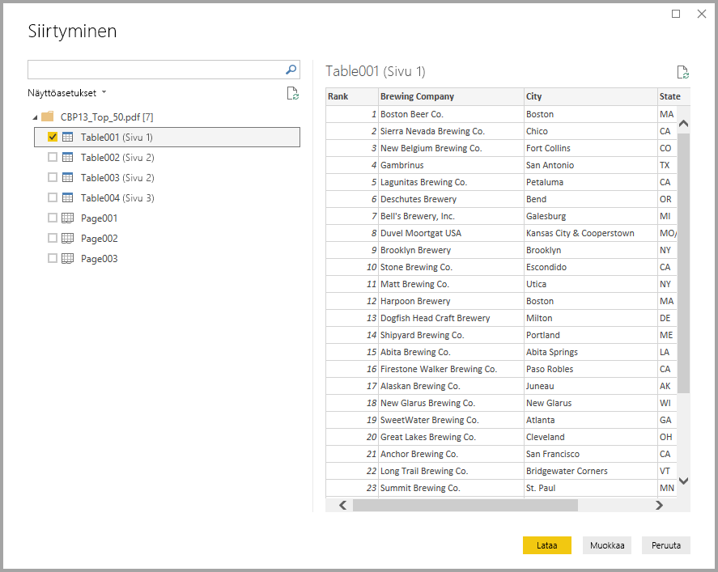
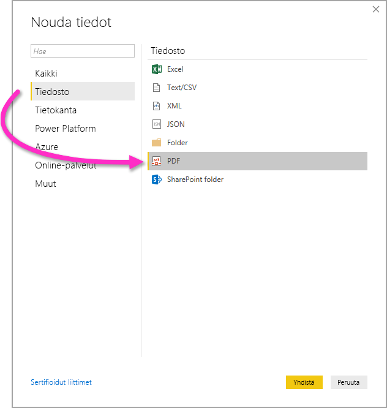

# PDF-tiedostoihin yhdistäminen Power BI Desktopissa
Power BI Desktopissa voi muodostaa yhteyden **PDF-tiedostoon** ja käyttää sen sisältämiä tietoja samaan tapaan kuin muita tietolähteitä käytetään Power BI Desktopissa.

Seuraavissa osioissa kuvataan, miten voit muodostaa yhteyden **PDF-tiedostoon**, valita tiedot ja tuoda ne **Power BI Desktopiin**.

Suosittelemme aina päivittämään **Power BI Desktopin** uusimpaan versioon, jonka saat [Hae Power BI Desktop](../fundamentals/desktop-get-the-desktop.md) -linkistä. 

## PDF-tiedostoon yhdistäminen
Jos haluat muodostaa yhteyden **PDF**-tiedostoon, valitse Power BI Desktopissa **Aloitus**-valintanauhasta **Nouda tiedot**. Valitse vasemmalla näkyvistä luokista **Tiedosto**, jolloin näkyviin tulee **PDF**.

Sinua pyydetään antamaan käytettävän PDF-tiedoston sijainti. Kun olet antanut tiedoston sijainnin ja PDF-tiedosto ladataan, näyttöön avautuu **Siirtymistoiminto**-ikkuna, jossa näet tiedostossa käytettävissä olevat tiedot. Voit valita ikkunasta yhden tai useita elementtejä tuotavaksi **Power BI Desktopiin**.

Kun valitset PDF-tiedostosta löydettyjen elementtien vieressä olevan valintaruudun, ne näkyvät oikeanpuoleisessa ruudussa. Kun olet valmis tuomaan, tuo tiedot **Power BI Desktopiin** napsauttamalla **Lataa** -painiketta.

**Power BI Desktopin** marraskuun 2018 julkaisusta alkaen voit määrittää **aloitussivun** ja **päätössivun** PDF-yhteyden valinnaisina parametreina. Voit myös määrittää nämä parametrit M-kaavan kielellä seuraavassa muodossa:

`Pdf.Tables(File.Contents("c:\sample.pdf"), [StartPage=10, EndPage=11])`

## Seuraavat vaiheet
Power BI Desktopin avulla voit muodostaa yhteyden hyvin monenlaisiin tietoihin. Lisätietoja näistä tietolähteistä saat seuraavista resursseista:

* [Mikä on Power BI Desktop?](../fundamentals/desktop-what-is-desktop.md)
* [Power BI Desktopin tietolähteet](desktop-data-sources.md)
* [Tietojen muotoilu ja yhdistäminen Power BI Desktopissa](desktop-shape-and-combine-data.md)
* [Yhteyden muodostaminen Excel-työkirjoihin Power BI Desktopissa](desktop-connect-excel.md)   
* [Tietojen antaminen suoraan Power BI Desktopiin](desktop-enter-data-directly-into-desktop.md)   
