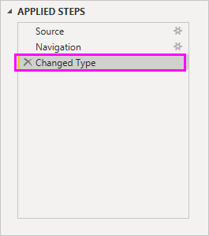

# Yhteyden muodostaminen tietolähteisiin Power BI Desktopissa

Power BI Desktopilla voit helposti muodostaa yhteyden alati laajenevaan tietomaailmaan. Jos sinulla ei ole Power BI Desktopia, voit [ladata](https://go.microsoft.com/fwlink/?LinkID=521662) ja asentaa sen.

Power BI Desktopissa on käytössä *monenlaisia* tietolähteitä. Seuraava kuva näyttää, miten luodaan yhteys tietoihin, valitsemalla **Nouda tiedot** > **Muu** > **Verkko**.

## Esimerkki yhteyden muodostamisesta tietoihin

Tässä esimerkissä muodostamme yhteyden **Web** tietolähteeseen.

Kuvittele olevasi jäämässä eläkkeelle. Haluat asumaan sinne, jossa on paljon aurinkoa, alhaiset verot ja hyvä terveydenhuolto. Tai... ehkä olet tietoanalyytikko ja haluat tietojen auttavan asiakkaita, kuten vaikka auttamalla sadetakkien valmistajaa aloittamaan kampanjan, kun sataa *paljon*.

Joka tapauksessa löydät verkkoresurssin, joka sisältää kiinnostavaa tietoa näistä ja muista aiheista:

[https://www.bankrate.com/finance/retirement/best-places-retire-how-state-ranks.aspx](https://www.bankrate.com/finance/retirement/best-places-retire-how-state-ranks.aspx)

Valitse **Nouda tiedot** > **Muu** > **Verkko**. Anna osoite kohdassa **Verkosta**.

Kun valitset **OK**, Power BI Desktopin *Kysely*-toiminto käynnistyy. Power BI Desktop muodostaa yhteyden verkkoresurssiin, ja **Siirtymistoiminnon** ikkuna palauttaa verkkosivulta löydetyt tulokset. Tässä tapauksessa se löysi taulukon ja yleisen asiakirjan. Meitä kiinnostaa taulukko, joten valitsemme sen luettelosta. **Siirtymistoiminnon** ikkuna näyttää esikatselun.

Tässä vaiheessa voit muokata kyselyä ennen taulukon lataamista valitsemalla ikkunan alareunassa **Muunna tiedot** tai voit ladata taulukon.

Valitse **Muunna tiedot**, jos haluat ladata taulukon ja käynnistää Power Query -editorin. Näyttöön tulee **Kyselyasetukset**-ruutu. Jos sitä ei näy, valitse valintanauhasta **Näytä**, sitten **Kyselyasetukset**, niin saat nähdä **Kyselyasetukset**-ruudun. Se näyttää tältä.

Nämä pisteet ovat numeroiden sijaan tekstiä, vaikka niiden pitää olla lukuja meidän tarkoituksessamme. Ei huolta. Napsauta vain sarakeotsikkoa hiiren kakkospainikkeella ja valitse **Muuta tyyppi** > **Kokonaisluku**, niin saat ne vaihdettua. Valitse useita sarakkeita, valitse ensimmäinen sarake, paina vaihtonäppäin pohjaan, valitse vierekkäisiä sarakkeita ja vaihda sitten kaikki valitut sarakkeet napsauttamalla hiiren kakkospainikkeella jotain valittua sarakeotsikkoa. Paina CTRL, kun valitset sarakkeita, jotka eivät ole vierekkäin.

**Kyselyasetukset**-kohdassa **KÄYTÖSSÄ OLEVAT VAIHEET** kuvastavat tehtyjä muutoksia. Samalla, kun teet muita muutoksia tietoihin, Power Query -editori tallentaa nämä muutokset kohtaan **KÄYTÖSSÄ OLEVAT VAIHEET**, jota voit säätää, järjestää, käyttää uudelleen tai poistaa tarpeen mukaan.

Lisämuutoksia taulukkoon voi tehdä sen jälkeen kun se on ladattu, mutta toistaiseksi tämä riittää. Kun kaikki on valmista, valitse **Sulje ja ota käyttöön** **Aloitus**-valintanauhasta, ja Power BI Desktop ottaa muutokset käyttöön ja sulkee Power Query -editorin.

Kun tietomalli on ladattu, voimme Power BI Desktopin **Raportti**-näkymässä aloittaa visualisointien luomisen vetämällä kentät piirtoalustan.

Tämä on tietysti yksinkertainen malli, joka sisältää vain yhden tietoyhteyden. Useimmissa Power BI Desktop -raporteissa on yhteydet eri tietolähteisiin tarpeidesi mukaan ja niissä on suhteita, jotka tuottavat monipuolisen tietomallin.

## Seuraavat vaiheet
Voit tehdä kaikenlaista Power BI Desktopilla. Saat lisätietoja sen toiminnoista seuraavista resursseista:

* [Mikä on Power BI Desktop?](../fundamentals/desktop-what-is-desktop.md)
* [Tietoja Power Bi Desktopin kyselyeditorin käytöstä](../transform-model/desktop-query-overview.md)
* [Power BI Desktopin tietolähteet](desktop-data-sources.md)
* [Tietojen muotoilu ja yhdistäminen Power BI Desktopissa](desktop-shape-and-combine-data.md)
* [Yleisten kyselytehtävien suorittaminen Power BI Desktopissa](../transform-model/desktop-common-query-tasks.md)   

Haluatko antaa palautetta? Hienoa! Käytä **Lähetä idea** -valikon kohtaa Power BI Desktopissa tai katso [yhteisön palautetta](https://community.powerbi.com/t5/Community-Feedback/bd-p/community-feedback). Odotamme kuulevamme sinusta!

