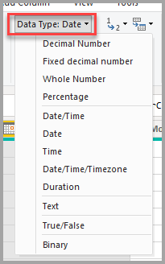

# Tietotyypit Power BI Desktopissa
Tässä artikkelissa kuvataan tietotyypit, joita Power BI Desktop ja Data Analysis Expressions (DAX) tukevat. 

Kun lataat tietoja Power BI Desktopiin, se yrittää muuntaa lähdesarakkeen tietotyypin tietotyypiksi, joka tukee paremmin tehokasta tallentamista, laskutoimituksia ja tietojen visualisointia. Jos esimerkiksi Excelistä tuomassasi arvosarakkeessa ei ole murtolukuarvoja, Power BI Desktop muuntaa koko tietosarakkeen kokonaisluku-tietotyypiksi, joka soveltuu paremmin kokonaislukujen tallentamiseen.

Tämä konsepti on tärkeä, koska joillain DAX-funktioilla on erityisiä tietotyyppivaatimuksia. Monissa tapauksissa DAX muuntaa implisiittisesti tietotyypin puolestasi, mutta on myös joitain tapauksia, joissa se ei tee niin.  Jos esimerkiksi DAX-funktio edellyttää päivämäärä-tietotyyppiä ja sarakkeen tietotyyppi on teksti, DAX-funktio ei toimi oikein.  Tästä syystä oikean tietotyypin saaminen sarakkeelle on tärkeää ja hyödyllistä. Implisiittiset muunnokset kuvataan myöhemmin tässä artikkelissa.

## Sarakkeen tietotyyppien selvittäminen ja määrittäminen
Power BI Desktopissa voit selvittää ja määrittää sarakkeen tietotyypin kyselyeditorissa tai tieto- tai raporttinäkymässä:

**Tietotyypit kyselyeditorissa**

**Tietotyypit tieto- tai raporttinäkymässä**

Kyselyeditorin avattavassa tietotyyppiluettelossa on kaksi tietotyyppiä, joita ei tällä hetkellä ole tieto- tai raporttinäkymässä: **päivämäärä/aika/aikavyöhyke** ja **kesto**. Kun näitä tietotyyppejä sisältävä sarake ladataan malliin ja sitä tarkastellaan tieto- tai raporttinäkymässä, sarakkeen päivämäärä/aika/aikavyöhyke-tietotyyppi muunnetaan päivämääräksi/ajaksi ja kesto-tietotyypin sisältävä sarake muunnetaan desimaaliluvuksi.

**Binaarista** tietotyyppiä ei tueta tällä hetkellä Kyselyeditorin ulkopuolella. Kyselyeditorin sisällä voit käyttää sitä binaaritiedostojen lataamisessa, jos muunnat sen muihin tietotyyppeihin ennen sen lataamista Power BI -malliin. Se on Tietonäkymä- ja Raporttinäkymä-valikoissa yhteensopivuussyistä, mutta jos yrität ladata binaarisarakkeita Power BI -malliin, saattaa ilmetä virheitä.  

### Lukutyypit
Power BI Desktop tukee kolmea lukutyyppiä:

**Desimaaliluku** – edustaa 64-bittistä (kahdeksantavuista) liukulukua. Tämä on yleisin lukutyyppi ja vastaa lukuja sellaisena, kuin yleensä ajattelet niitä.  Vaikka se on suunniteltu käsittelemään murtolukuja sisältäviä arvoja, se käsittelee myös kokonaislukuja.  Desimaalilukutyyppi pystyy käsittelemään negatiivisia arvoja väliltä –1,79E +308 ja –2,23E –308, 0, ja positiivisia arvoja väliltä 2,23E –308 ja 1,79E + 308. Esimerkiksi luvut 34; 34,01 ja 34,000367063 ovat kelvollisia desimaalilukuja. Suurin tarkkuus, joka voidaan esittää desimaalilukutyyppinä, on pituudeltaan 15 numeroa. Desimaalierotin voi olla missä tahansa kohtaa lukua. Desimaalilukutyyppi vastaa sitä, miten Excel tallentaa sen luvut.

**Kiinteällä desimaaliluvulla** – on kiinteä sijainti desimaalierottimelle. Desimaalierottimen oikealla puolella on aina neljä numeroa, ja luvussa voi olla 19 merkitsevää numeroa.  Suurin arvo, jota se voi edustaa, on 922 337 203 685 477,5807 (positiivinen tai negatiivinen).  Kiinteä desimaalilukutyyppi on hyödyllinen tilanteissa, joissa pyöristäminen saattaa aiheuttaa virheitä.  Kun käsittelet useita lukuja, jotka sisältävät pieniä murtolukuarvoja, ne voivat joskus kumuloitua ja tehdä luvusta lievästi epätäsmällisen.  Koska desimaalierottimen oikealla puolella olevat arvot katkaistaan neljännen numeron jälkeen, kiinteän desimaalilukutyypin avulla voit välttää tällaiset virheet.   Jos SQL Server on sinulle tuttu, tämä tietotyyppi vastaa SQL Serverin desimaali-tietotyyppiä (19,4) tai Power Pivotin valuutta-tietotyyppiä. 

**Kokonaisluku** – edustaa 64-bittistä (kahdeksantavuista) kokonaislukuarvoa. Koska kyseessä on kokonaisluku, sillä ei ole numeroita desimaalierottimen oikealla puolella. Siinä voi olla 19 numeroa, ja ne voivat olla positiivisia tai negatiivisia kokonaislukuja väliltä –9 223 372 036 854 775 807 (–2^63+1) ja 9 223 372 036 854 775 806 (2^63–2). Se voi edustaa eri numeeristen tietotyyppien suurinta mahdollista tarkkuutta.  Kuten kiinteän desimaalilukutyypin kohdalla, myös kokonaislukutyypistä voi olla hyötyä tilanteissa, joissa sinun tulee kontrolloida pyöristystä. 

> [!NOTE]
>  Power BI Desktop -tietomalli tukee 64-bittisi kokonaislukuarvoja, mutta suurin numero, jonka visualisoinnit voit turvallisesti ilmaista, on JavaScript rajoitusten vuoksi 9,007,199,254,740,991 (2 ^ 53 - 1). Jos käsittelet tietomallissasi tätä suurempia numeroita, voit pienentää kokoa laskutoimituksien avulla, ennen niiden lisäämistä visualisointiin 
> 
>

### Päivämäärä/aika-tyypit
Power BI Desktop tukee viittä päivämäärä/aika-tietotyyppiä kyselynäkymässä.  Sekä päivämäärä/aika/aikavyöhyke että kesto muunnetaan malliin lataamisen yhteydessä. Power BI Desktop -tietomalli tukee vain päivämäärää/aikaa, mutta se voidaan muotoilla päivämäärinä tai kellonaikoina itsenäisesti. 

**Päivämäärä/kellonaika** – edustaa sekä päivämäärän että kellonajan arvoa.  Kansien alapuolella päivämäärän/ajan arvo tallennetaan desimaalilukutyyppinä.  Näin voit todellisuudessa muuntaa näiden kahden välillä.   Päivämäärän aikaosa tallennetaan murtolukuna 1/300 sekunnin (3,33 ms) kokonaislukukerrannaisiin.  Päivämääriä vuosien 1 900–9 999 välillä tuetaan.

**Päivämäärä** – edustaa vain päivämäärää (ei aikaosaa).  Malliin muunnettaessa päivämäärä on sama kuin päivämäärän/ajan arvo, jonka murtolukuarvo on nolla.

**Aika** – edustaa vain aikaa (ei päivämääräosaa).  Malliin muunnettaessa ajan arvo on sama kuin päivämäärän/ajan arvo, jossa desimaalierottimen vasemmalla puolella ei ole numeroita.

**Päivämäärä/aika/aikavyöhyke** – osoittaa UTC-päivämäärää/-aikaa ja aikavyöhykkeen siirtymää.  Se muunnetaan malliin lataamisen yhteydessä päivämääräksi/ajaksi. Power BI -malli ei säädä aikavyöhykettä käyttäjän sijainnin tai maa-asetuksen perusteella. Jos arvo 09:00 on ladattu malliin Yhdysvalloissa, se näytetään muodossa 09:00, kun raportti avataan tai sitä tarkastellaan. 

**Kesto** – edustaa ajan pituutta. Se muunnetaan malliin lataamisen yhteydessä desimaalilukutyypiksi.  Desimaaliluvun tyyppinä se voidaan lisätä päivämäärä/aika-kenttään tai vähentää siitä oikeilla tuloksilla.  Kuten desimaalilukutyyppiä, voit helposti käyttää sitä visualisoinneissa, jotka näyttävät suuruusluokan.

### Tekstityyppi
**Teksti** – Unicode-merkkitietoja sisältävä merkkijono. Voi olla merkkijono, numero tai päivämäärä, joka on esitetty tekstimuodossa. Merkkijonon enimmäispituus on 268 435 456 Unicode-merkkiä (256 megamerkkiä) tai 536 870 912 tavua.

### Tosi/epätosi-tyyppi
**Tosi/epätosi** – totuusarvo tosi tai epätosi.

### Tyhjät/nolla-arvot-tyyppi
**Tyhjä** – DAX-kaavan tietotyyppi, joka vastaa SQL-kielen tyhjäarvoja ja korvaa ne. Voit luoda tyhjän käyttämällä [TYHJÄ](/dax/blank-function-dax)-funktiota ja testata tyhjät käyttämällä loogista funktiota [ONTYHJÄ](/dax/isblank-function-dax).

### Binaarinen tietotyyppi

Binaaritietotyyppiä voidaan käyttää edustamaan muita binaarimuotoisia tietoja. Kyselyeditorin sisällä voit käyttää sitä binaaritiedostojen lataamisessa, jos muunnat sen muihin tietotyyppeihin ennen sen lataamista Power BI -malliin. Binaarisarakkeita ei tueta Power BI -tietomallissa. Se on Tietonäkymä- ja Raporttinäkymä-valikoissa yhteensopivuussyistä, mutta jos yrität ladata binaarisarakkeita Power BI -malliin, saattaa ilmetä virheitä.

> [!NOTE]
>  Jos binaarisarake on kyselyn vaiheiden tulosteessa, tietojen päivityksen yrittäminen yhdyskäytävän kautta saattaa aiheuttaa virheitä. On suositeltavaa, että poistat kaikki binaarisarakkeet kyselyiden viimeisenä vaiheena.    
> 

### Taulukko-tietotyyppi
DAX käyttää taulukko-tietotyyppiä monissa funktioissa, kuten koostamisissa ja aikatietojen laskutoimituksissa. Jotkin funktiot edellyttävät viittausta taulukkoon. Muut funktiot palauttavat taulukon, jota voidaan käyttää syötteenä muihin funktioihin. Joissakin funktioissa, jotka edellyttävät taulukkoa syötteeksi, voit määrittää lausekkeen, joka antaa taulukkoon arvon. Osa funktioista edellyttää viittausta perustaulukkoon. Lisätietoja tiettyjen funktioiden vaatimuksista saat [DAX Function Reference](/dax/dax-function-reference) -artikkelista.

## Implisiittisen ja eksplisiittisen tietotyypin muuntaminen DAX-kaavoissa
Jokaisella DAX-funktiolla on eritysvaatimuksia, jotka koskevat syötteinä ja tulosteina käytettäviä tietotyyppejä. Osa funktioista vaatii esimerkiksi kokonaislukuja tiettyihin argumentteihin ja päivämääriä toisiin. Osa funktioista taas edellyttää tekstiä tai taulukoita.

Jos argumentiksi määrittämäsi sarake ei ole yhteensopiva funktion vaatiman tietotyypin kanssa, DAX palauttaa monissa tapauksissa virheen. Aina kun mahdollista, DAX yrittää kuitenkin implisiittisesti muuntaa tiedot vaadituksi tietotyypiksi. Esimerkki:

* Voit kirjoittaa päivämäärän merkkijonona, jolloin DAX jäsentää merkkijonon ja yrittää muuntaa sen Windowsin päivämäärän ja kellonajan esitysmuodon mukaiseksi.
* Voit lisätä arvon TOSI + 1 ja saada tulokseksi arvon 2, koska DAX on implisiittisesti muuntanut arvon TOSI numeroksi 1 ja suorittanut yhteenlaskun 1 + 1.
* Jos lisäät arvoja kahteen sarakkeeseen ja toinen arvo on esitetty tekstinä ("12") ja toinen numerona (12), DAX muuttaa merkkijonon implisiittisesti numeroksi ja suorittaa yhteenlaskun saadakseen numeerisen tuloksen. Seuraava lauseke palauttaa arvon 44: = "22" + 22.
* Jos yrität yhdistää kaksi lukua, Excel esittää ne merkkijonoina ja sitten yhdistää ne. Seuraava lauseke palauttaa arvon "1234": = 12 & 34.

### Implisiittisten tietotyyppimuunnosten taulukko
Suoritettavan muunnoksen tyyppi määräytyy operaattorin mukaan. Operaattori muuntaa tarvitsemansa arvot ennen vaaditun toiminnon suorittamista. Seuraavissa taulukoissa on luettelo operaattoreista. Taulukoissa ilmaistaan myös muunto, joka suoritetaan kullekin sarakkeen tietotyypille, kun se yhdistetään risteävän rivin tietotyyppiin.

> [!NOTE]
>  Tekstitietotyypit eivät sisälly seuraaviin taulukoihin. Kun numero esitetään tekstimuodossa, Power BI yrittää joissakin tapauksissa määrittää numeron tietotyypin ja esittää sen numerona.
> 
> 

**Yhteenlasku (+)**

| Operaattori (+) | KOKONAISLUKU | CURRENCY | REAALI | Päivämäärä/kellonaika |
| --- | --- | --- | --- | --- |
| KOKONAISLUKU |KOKONAISLUKU |CURRENCY |REAALI |Päivämäärä/kellonaika |
| CURRENCY |CURRENCY |VALUUTTA |REAALI |Päivämäärä/kellonaika |
| REAALI |REAALI |REAALI |REAALI |Päivämäärä/kellonaika |
| Päivämäärä/kellonaika |Päivämäärä/kellonaika |Päivämäärä/kellonaika |Päivämäärä/kellonaika |Päivämäärä/kellonaika |

Jos esimerkiksi reaalilukua käytetään yhteenlaskussa yhdessä valuuttatietojen kanssa, molemmat arvot muunnetaan REAALI-tietotyypiksi. Palautusarvo on myös REAALI.

**Vähennyslasku (–)**

Seuraavassa taulukossa riviotsikko on vähennettävä (vasen puoli) ja sarakeotsikko on vähentäjä (oikea puoli).

| Operaattori (–) | KOKONAISLUKU | CURRENCY | REAALI | Päivämäärä/kellonaika |
| --- | --- | --- | --- | --- |
| KOKONAISLUKU |KOKONAISLUKU |CURRENCY |REAALI |REAALI |
| CURRENCY |CURRENCY |VALUUTTA |REAALI |REAALI |
| REAALI |REAALI |REAALI |REAALI |REAALI |
| Päivämäärä/kellonaika |Päivämäärä/kellonaika |Päivämäärä/kellonaika |Päivämäärä/kellonaika |Päivämäärä/kellonaika |

Jos esimerkiksi päivämäärää käytetään vähennyslaskussa yhdessä minkä tahansa muun tietotyypin kanssa, molemmat arvot muunnetaan päivämääriksi. Palautusarvo on myös päivämäärä.

> [!NOTE]
>    Tietomallit tukevat myös yksiparametrista operaattoria, – (negatiivinen). Tämä operaattori ei kuitenkaan muuta operandin tietotyyppiä.
> 
> 

**Kertolasku (*)**

| Operaattori (*) | KOKONAISLUKU | CURRENCY | REAALI | Päivämäärä/kellonaika |
| --- | --- | --- | --- | --- |
| KOKONAISLUKU |KOKONAISLUKU |CURRENCY |REAALI |KOKONAISLUKU |
| CURRENCY |VALUUTTA |REAALI |CURRENCY |VALUUTTA |
| REAALI |REAALI |CURRENCY |REAALI |REAALI |

Jos esimerkiksi kokonaislukua käytetään kertolaskussa yhdessä reaaliluvun kanssa, molemmat luvut muunnetaan reaaliluvuiksi. Palautusarvo on myös REAALI.

**Jakolasku (/)**

Seuraavassa taulukossa riviotsikko on osoittaja ja sarakeotsikko on nimittäjä.

| Operaattori (/) (rivi/sarake) | KOKONAISLUKU | CURRENCY | REAALI | Päivämäärä/kellonaika |
| --- | --- | --- | --- | --- |
| KOKONAISLUKU |REAALI |CURRENCY |REAALI |REAALI |
| CURRENCY |VALUUTTA |REAALI |CURRENCY |REAALI |
| REAALI |REAALI |REAALI |REAALI |REAALI |
| Päivämäärä/kellonaika |REAALI |REAALI |REAALI |REAALI |

Jos esimerkiksi kokonaislukua käytetään jakolaskussa yhdessä valuutta-arvon kanssa, molemmat arvot muunnetaan reaaliluvuiksi. Palautusarvo on myös reaaliluku.

### Vertailuoperaattorit
Vertailulausekkeissa totuusarvoja pidetään suurempina kuin merkkijonoarvoja ja merkkijonoarvoja pidetään suurempina kuin numeerisia arvoja tai päivämäärä-/kellonaika-arvoja. Numeroita ja päivämäärä-/kellonaika-arvoja pidetään samanarvoisina. Totuusarvoille tai merkkijonoarvoille ei suoriteta implisiittistä muuntamista. TYHJÄ tai tyhjä arvo muunnetaan arvoksi 0/""/false toisen verratun arvon tietotyypin mukaan.

Seuraavat DAX-lausekkeet kuvaavat tätä toimintoa:

=IF(FALSE()\>"tosi","lauseke on tosi", "lauseke on epätosi"), funktio palauttaa "lauseke on tosi"

=IF("12"\>12,"lauseke on tosi", "lauseke on epätosi"), funktio palauttaa "lauseke on tosi"

=IF("12"=12,"lauseke on tosi", "lauseke on epätosi"), funktio palauttaa "lauseke on epätosi"

Muunnokset suoritetaan implisiittisesti numeerisille tyypeille tai päivämäärä-/kellonaikatyypeille seuraavan taulukon mukaisesti:

| Vertailuoperaattori | KOKONAISLUKU | CURRENCY | REAALI | Päivämäärä/kellonaika |
| --- | --- | --- | --- | --- |
| KOKONAISLUKU |KOKONAISLUKU |CURRENCY |REAALI |REAALI |
| CURRENCY |CURRENCY |VALUUTTA |REAALI |REAALI |
| REAALI |REAALI |REAALI |REAALI |REAALI |
| Päivämäärä/kellonaika |REAALI |REAALI |REAALI |Päivämäärä ja aika |

### Tyhjien, tyhjien merkkijonojen ja nolla-arvojen käsitteleminen
Nolla-arvoa, tyhjää arvoa, tyhjää solua tai puuttuvaa arvoa edustaa DAX-kielessä aina sama uusi arvotyyppi TYHJÄ. Tyhjiä arvoja voi myös luoda TYHJÄ-funktiolla tai testata tyhjät ONTYHJÄ-funktiolla.

Tyhjien käsittelytapa toiminnoissa, kuten yhteenlaskussa ja ketjutuksessa, vaihtelee yksittäisen toiminnon mukaan. Seuraavassa taulukossa on yhteenveto siitä, miten DAX-kaavan ja Microsoft Excel -kaavan tyhjien käsittely eroaa toisistaan.

| Lauseke | DAX | Excel |
| --- | --- | --- |
| TYHJÄ + TYHJÄ |TYHJÄ |0 (nolla) |
| TYHJÄ + 5 |5 |5 |
| TYHJÄ * 5 |TYHJÄ |0 (nolla) |
| 5/TYHJÄ |Ääretön |Virhe |
| 0/TYHJÄ |NaN |Virhe |
| TYHJÄ/TYHJÄ |TYHJÄ |Virhe |
| EPÄTOSI TAI TYHJÄ |EPÄTOSI |EPÄTOSI |
| EPÄTOSI JA TYHJÄ |EPÄTOSI |EPÄTOSI |
| TOSI TAI TYHJÄ |TOSI |TOSI |
| TOSI JA TYHJÄ |EPÄTOSI |TOSI |
| TYHJÄ TAI TYHJÄ |TYHJÄ |Virhe |
| TYHJÄ JA TYHJÄ |TYHJÄ |Virhe |
