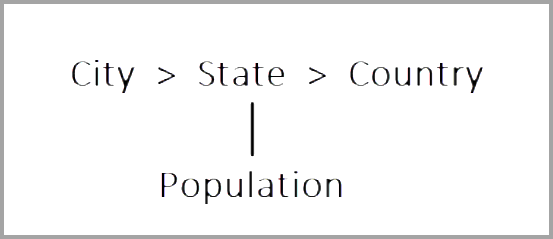

# Power BI:n monidimensiomallien käyttö

Voit muodostaa yhteyden Power BI:n monidimensiomalleihin ja luoda raportteja, jotka visualisoivat kaikenlaisia tietoja mallissa. Monidimensiomalleja käsiteltäessä Power BI soveltaa sääntöjä siitä, miten se käsittelee tietoja sen perusteella, mikä sarake on määritetty *oletusjäseneksi*. 

Kun käsittelet monidimensiomalleja, Power BI käsittelee mallin tietoja sen perusteella, missä **DefaultMember**-määritteen sisältävää saraketta käytetään. *DefaultMember*-määrite on määritetty CSDL:ssä (Conceptual Schema Definition Language) tiettyä saraketta varten monidimensiomallissa. Lisätietoja oletusjäsenestä on sen [määritteen ominaisuuksia koskevassa artikkelissa](https://docs.microsoft.com/sql/analysis-services/multidimensional-models/attribute-properties-define-a-default-member?view=sql-server-2017). DAX-kyselyä suoritettaessa mallissa määritettyä oletusjäsentä sovelletaan automaattisesti.

Tässä artikkelissa kuvataan, miten Power BI toimii eri tilanteissa käsiteltäessä monidimensiomalleja sen perusteella, missä *oletusjäsen* sijaitsee. 

## Suodatinkorttien käsitteleminen

Kun luot suodatinkortin kentässä, jossa on oletusjäsen, oletusjäsenen kentän arvo valitaan automaattisesti suodatinkortissa. Tämän tuloksena kaikki visualisoinnit, joihin suodatinkortti vaikuttaa, säilyttävät oletusmallinsa tietokannassa. Tällaisten suodatinkorttien arvot heijastavat tätä oletusjäsentä.

Jos oletusjäsen poistetaan, arvon valinnan poistaminen tyhjentää sen kaikista visualisoinneista, joihin suodatinkorttia sovelletaan, eivätkä näytetyt arvot heijasta oletusjäsentä.

Kuvitellaan esimerkiksi, että *Valuutta*-sarakkeessa on oletusjäsen, jonka arvoksi on määritetty *USD*:

* Tässä esimerkkitapauksessa, jos kortissa on *Kokonaismyynnit*-sarake, arvossa sovelletaan oletusjäsentä, ja näemme ”USD”-arvoa vastaavat myynnit.
* Jos vedämme *Valuutta*-sarakkeen suodatinkorttiruutuun, näemme *USD*-arvon valittuna oletusarvona. *Kokonaismyynnit*-sarake pysyy samana, koska sovelletaan oletusjäsentä.
* Jos sitä vastoin poistamme *USD*-arvon suodatinkortista, *Valuutta*-sarakkeen oletusjäsen tyhjennetään, ja *Kokonaismyynnit* heijastaa nyt kaikkia valuuttoja.
* Samalla tavoin kun valitsemme toisen arvon suodatinkortissa (oletetaan, että valitsemme *EURO*-arvon) yhdessä oletusjäsenen kanssa, *Kokonaismyynnit* heijastaa suodattimen *valuuttaa arvona {USD, EURO}* .

## Ryhmittelytoiminta

Aina kun ryhmittelet Power BI:ssä visualisoinnin sarakkeessa, jossa on *oletusjäsen*, Power BI tyhjentää tämän sarakkeen *oletusjäsenen* ja sen määritesuhdepolun. Näin varmistetaan, että visualisointi näyttää kaikki arvot pelkkien oletusarvojen sijasta.

## Määritesuhdepolut (ARP-polut)

Määritesuhdepolkujen (ARP-polut) *oletusjäsenet* sisältävät tehokkaita ominaisuuksia, mutta niiden käyttö on hieman monimutkaista. ARP-polkujen ilmaantuessa Power BI noudattaa ARP-polkua ylimääräisten oletusjäsenten tyhjentämiseksi muista sarakkeista. Tällä tavoin voidaan taata yhdenmukainen ja tarkka tietojen käsittely visualisointeja varten.

Tarkastellaan esimerkkiä käytännön selventämiseksi. Oletetaan, että ARP-polkujen määritys on seuraava:

Oletetaan, että seuraavat *oletusjäsenet* määritetään seuraaville sarakkeille:

* Kaupunki > Seattle
* Osavaltio > WA
* Maa > Yhdysvallat
* Asukasluku > Suuri

Tarkastellaan, mitä tapahtuu, kun kutakin näistä sarakkeista käytetään Power BI:ssä. Kun visualisoinnit ryhmitellään seuraaviin sarakkeisiin, saadaan seuraavat tulokset:

* **Kaupunki** – Power BI näyttää kaikki kaupungit tyhjentämällä kaikki **oletusjäsenet** sarakkeille *Kaupunki*, *Osavaltio*, *Maa*, mutta säilyttää **oletusjäsenen** sarakkeelle *Asukasluku*; Power BI tyhjentää koko ARP-polun sarakkeelle *Kaupunki*.
    > [!NOTE]
    > *Asukasluku* ei ole sarakkeen *Kaupunki* ARP-polku vaan se liittyy yksinomaan sarakkeeseen *Osavaltio*, eikä Power BI siten tyhjennä sitä.
* **Osavaltio** – Power BI näyttää kaikki *osavaltiot* tyhjentämällä kaikki **oletusjäsenet** sarakkeille *Kaupunki*, *Osavaltio*, *Maa* ja *Asukasluku*.
* **Kaupunki** – Power BI näyttää kaikki kaupungit tyhjentämällä kaikki **oletusjäsenet** sarakkeille *Kaupunki*, *Osavaltio*, *Maa*, mutta säilyttää **oletusjäsenen** sarakkeelle *Asukasluku*.
* **Kaupunki ja osavaltio** – Power BI tyhjentää kaikki **oletusjäsenet** kaikille sarakkeille.

Visualisoinnissa näytettyjen ryhmien koko ARP-polku tyhjennetään. 

Jos ryhmää ei näytetä visualisoinnissa, mutta se kuuluu toisen ryhmitellyn sarakkeen ARP-polkuun, sovelletaan seuraavaa:

* ARP-polun kaikkia haaroja ei tyhjennetä automaattisesti.
* Tämä ryhmä suodatetaan yhä tämän selvittämättömän **oletusjäsenen** mukaan.

### Osittajat ja suodatinkortit

Kun käsittelet osittajia tai suodatinkortteja, tapahtuu seuraavaa:

* Kun osittajaan tai suodatinkorttiin ladataan tietoja, Power BI ryhmittelee ne sarakkeeseen visualisoinnissa. Näyttö käyttäytyy siten edellisessä osiossa kuvatun mukaisesti.

Koska osittajia ja suodatinkortteja käytetään usein yhdessä muiden visualisointien kanssa, asianomaisten visualisointien **oletusjäsenet** tyhjennetään seuraavan taulukon mukaisesti. 

Käytämme tässä taulukossa samoja esimerkkitietoja, joita käytimme aiemmin tässä artikkelissa:

Seuraavia sääntöjä sovelletaan siihen, miten Power BI käyttäytyy näissä olosuhteissa.

Power BI tyhjentää **oletusjäsenen** tietystä sarakkeesta, jos:

* Power BI ryhmittelee tässä sarakkeessa
* Power BI ryhmittelee sarakkeessa, joka liittyy tähän sarakkeeseen (missä tahansa ARP-polun sijainnissa, ylös tai alas)
* Power BI suodattaa sarakkeessa, joka on ARP-polussa (ylös tai alas)
* Sarakkeella on suodatinkortti, jonka tilana on *KAIKKI*
* Sarakkeella on suodatinkortti, jossa on valittuna joku arvo (Power BI vastaanottaa suodattimen saraketta varten)

Power BI ei tyhjennä **oletusjäsentä** tietystä sarakkeesta, jos:

* Sarakkeessa on suodatinkortti oletustilassa ja Power BI:llä on ryhmittelyjä sen ARP-polun sarakkeessa.
* Sarake on toisen sarakkeen yläpuolella ARP-polussa ja Power BI:llä on suodatinkortti tälle muulle sarakkeelle oletustilassa.

## Seuraavat vaiheet

Tässä artikkelissa kuvataan Power BI:n toimintaa, kun käsittelet oletusjäseniä monidimensiomalleissa. Voit olla kiinnostunut myös seuraavista artikkeleista: 

* [Näytä kohteet, joilla ei ole tietoja Power BI:ssä](../create-reports/desktop-show-items-no-data.md)
* [Power BI Desktopin tietolähteet](desktop-data-sources.md)
