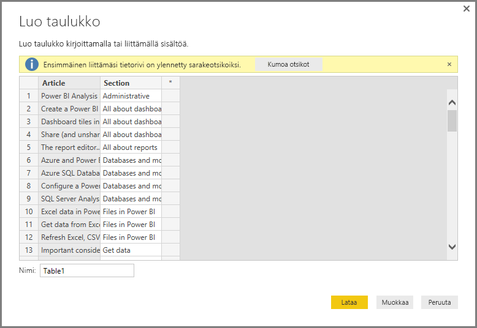
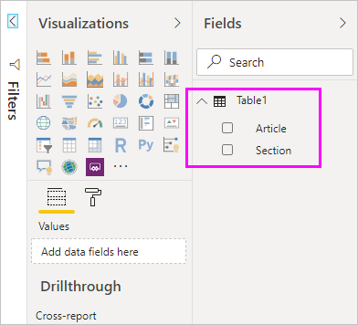

# Tietojen antaminen suoraan Power BI Desktopiin

Power BI Desktopin avulla voit antaa tiedot suoraan ja käyttää kyseisiä tietoja raportteihin ja visualisointeihin. Voit esimerkiksi kopioida osan työkirjasta tai web-sivusta ja sitten liittää sen Power BI Desktopiin.

Jos haluat syöttää tietoja suoraan Power BI Desktopiin uuden taulukon muodossa, valitse **Anna tiedot** **Aloitus**-valintanauhasta.

Power BI Desktop saattaa yrittää tehdä pieniä muunnoksia tietoihin samalla tavalla kuin ladattaessa tietoja mistä tahansa lähteestä. Esimerkiksi seuraavassa tapauksessa se nostanut ensimmäisen tietorivin otsikoihin.

Jos haluat muotoilla kirjoittamiasi tai liittämiäsi tietoja, avaa **kyselyeditori**valitsemalla **Muokkaa**. Voit muotoilla ja muuntaa tietoja ennen niiden tuomista Power BI Desktopiin. Valitse **Lataa**, jos haluat tuoda tiedot sellaisina kuin ne näkyvät.

Kun valitset **Lataa**, Power BI Desktop luo uuden taulukon tiedoista ja tuo sen käytettäväksi **Kentät** -ruutuun. Seuraavassa kuvassa Power BI Desktop näyttää uuden taulukkoni, jonka nimi on *Taulukko1*, sekä kaksi luotua kenttää kyseisen taulukon sisällä.

Siinä kaikki. Näin helppoa on tietojen syöttäminen Power BI Desktopiin.

Olet nyt valmis käyttämään Power BI Desktopissa olevia tietoja. Voit luoda visualisointeja tai raportteja sekä käsitellä mitä tahansa muita tietoja, joihin haluat ehkä yhdistää tai joita haluat tuoda, kuten Excel-työkirjat, tietokannat tai muut tietolähteet.

## Seuraavat vaiheet

Power BI Desktopin avulla voit muodostaa yhteyden hyvin monenlaisiin tietoihin. Lisätietoja näistä tietolähteistä saat seuraavista resursseista:

* [Mikä on Power BI Desktop?](../fundamentals/desktop-what-is-desktop.md)
* [Power BI Desktopin tietolähteet](desktop-data-sources.md)
* [Tietojen muotoilu ja yhdistäminen Power BI Desktopissa](desktop-shape-and-combine-data.md)
* [Yhteyden muodostaminen Excel-työkirjoihin Power BI Desktopissa](desktop-connect-excel.md)
* [CSV-tiedostoihin yhdistäminen Power BI Desktopissa](desktop-connect-csv.md)
