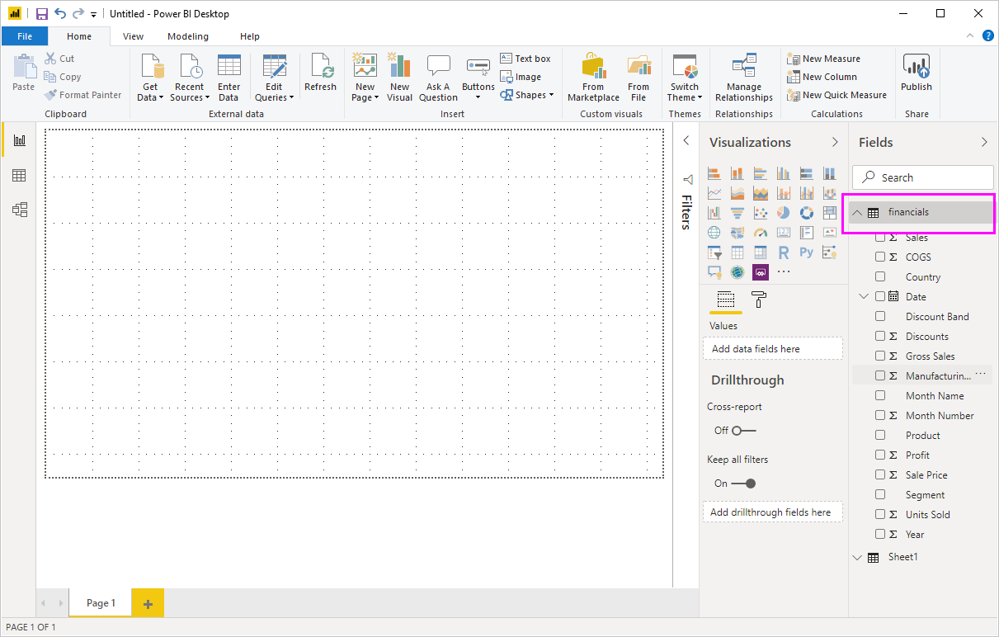

# Pikaopas: Tietoihin yhdistäminen Power BI Desktopissa

Tässä pikaoppaassa muodostat yhteyden tietoihin Power BI Desktopin avulla. Tämä on ensimmäinen vaihe tietomallien ja raporttien luomiseen.

Jos et ole rekisteröitynyt Power BI:hin, [rekisteröidy ilmaiseen kokeiluversioon](https://app.powerbi.com/signupredirect?pbi_source=web) ennen aloittamista.

## Edellytykset

Tarvitset seuraavat resurssit, jotta voit suorittaa tämän artikkelin vaiheet:

* Lataa ja asenna Power BI Desktop, joka on ilmainen paikallisessa tietokoneessa suoritettava sovellus. Voit [ladata Power BI Desktopin](https://powerbi.microsoft.com/desktop) suoraan tai hakea sen [Microsoft Storesta](https://aka.ms/pbidesktopstore).
* [Lataa tämä Excel-mallityökirja](https://go.microsoft.com/fwlink/?LinkID=521962) ja luo kansio nimeltä *C:\PBID-qs*, johon tallennat kyseisen Excel-tiedoston. Tämän pikaoppaan myöhemmissä vaiheissa oletetaan, että ladattu Excel-työkirja sijaitsee kyseisessä paikassa.
* Power BI Desktopin monet tietoliittimet edellyttävät todentamista Internet Explorer 10:llä (tai tätä uudemmalla versiolla).

## Käynnistä Power BI Desktop

Kun olet asentanut Power BI Desktopin, käynnistä se paikallisessa tietokoneessa. Näet Power BI -opetusohjelman. Toimi sen ohjeiden mukaisesti tai sulje valintaikkuna ja aloita tyhjällä pohjalla. Pohja on paikka, jossa luot visualisointeja ja raportteja tiedoistasi.

## tietoihin yhdistäminen

Power BI Desktopilla voit yhdistää moniin erityyppisiin tietoihin. Voit yhdistää perustietolähteisiin, esimerkiksi Microsoft Excel -tiedostoon. Voit yhdistää monenlaisia tietoja sisältäviin verkkopalveluihin, kuten Salesforceen, Microsoft Dynamicsiin, Azure Blob -säilöön ja moniin muihin.

Muodosta yhteys tietoihin valitsemalla **Aloitus**-valintanauhassa **Nouda tiedot**.

Näyttöön avautuu **Nouda tiedot**-ikkuna. Ikkunassa voit valita monista eri tietolähteistä, joihin Power BI Desktop voi muodostaa yhteyden. Tässä pikaoppaassa käytetään Excel-työkirjaa, jonka latasit [Edellytykset](#prerequisites)-kohdassa.

Koska tämä tietolähde on Excel-tiedosto, valitse **Nouda tiedot** -ikkunassa **Excel** ja valitse sitten **Yhdistä**-painike.

Power BI pyytää sinua antamaan Excel-tiedoston sijainnin, jotta siihen voidaan muodostaa yhteys. Ladatun tiedoston nimi on *Talousmalli*. Valitse kyseinen tiedosto ja valitse sitten **Avaa**.

Power BI Desktop lataa työkirjan ja lukee sen sisällön ja näyttää sitten tiedostossa käytettävissä olevat tiedot **siirtymistoiminnon** ikkunassa. Siinä voit valita, mitä tietoja haluat ladata Power BI Desktopiin. Valitse haluamasi taulukot valitsemalla valintaruutu jokaisen tuotavan taulukon vieressä. Tuo molemmat käytettävissä olevat taulukot.

Kun olet tehnyt valintasi, valitse **Lataa** tietojen tuomiseksi Power BI Desktopiin.

## Näytä tiedot Kentät-ruudussa

Kun olet ladannut taulukot, tiedot näkyvät **Kentät**-ruudussa. Voit laajentaa kunkin taulukon valitsemalla sen nimen vieressä olevan nuolen. Seuraavassa kuvassa *rahoitus*-taulukko on laajennettu ja sen kentät ovat näkyvissä.

Siinä kaikki. Olet muodostanut yhteyden tietoihin Power BI Desktopissa ja ladannut ne, joten näet nyt kaikki kyseisissä taulukoissa käytettävissä olevat kentät.

## Seuraavat vaiheet

Kun olet muodostanut yhteyden tietoihin, voit tehdä Power BI Desktopilla monia asioita. Voit esimerkiksi luoda visualisointeja ja raportteja. Lisätietoja saat seuraavista resursseista:

* [Power BI Desktopin käytön aloittaminen](../fundamentals/desktop-getting-started.md)
