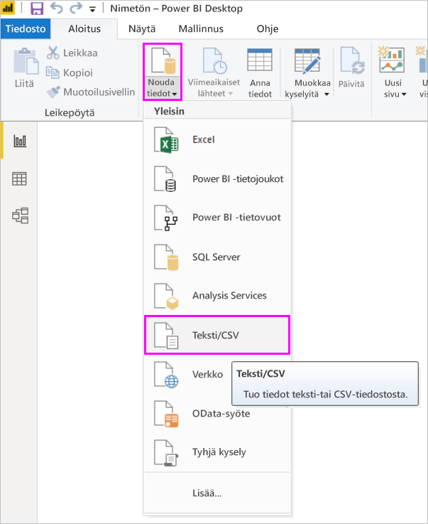
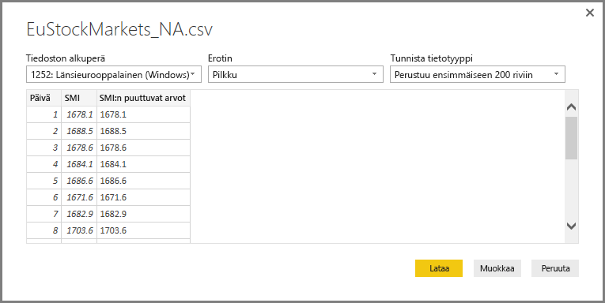
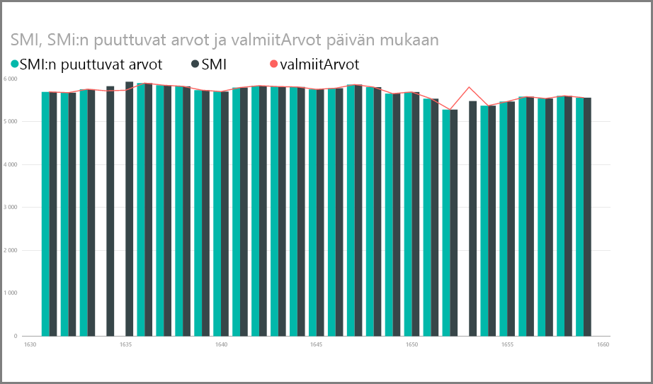
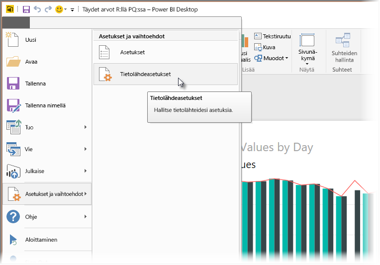
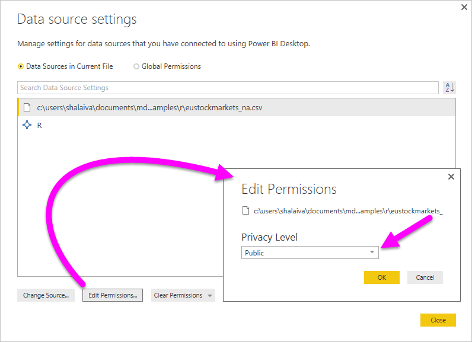

# <a name="use-r-in-power-query-editor"></a>R:n käyttö Power-kyselyeditorissa

[R-kieli](https://mran.microsoft.com/documents/what-is-r) on tehokas ohjelmointikieli, jota monet tilastotieteilijät, datatieteilijät ja tietoanalyytikot käyttävät. Voit käyttää R:ää Power BI Desktopin Power Query -editorissa seuraaviin tarkoituksiin:

* Tietomallien valmistelu.

* Raporttien luominen.

* Tietojen puhdistaminen, edistynyt tietojen muotoilu ja tietojoukkoanalytiikka, jotka sisältävät puuttuvat tiedot, ennusteet, klusteroinnin ja paljon muuta.  

## <a name="install-r"></a>Asenna R

Voit ladata R:n maksutta [Revolution R Open -lataussivulta](https://mran.revolutionanalytics.com/download/) ja [CRAN-säilöstä](https://cran.r-project.org/bin/windows/base/).

## <a name="install-mice"></a>Asenna mice

Edellytyksenä sinun on asennettava [mice-kirjasto](https://www.rdocumentation.org/packages/mice/versions/3.5.0/topics/mice) R-ympäristöösi. Ilman mice-kirjastoa mallikomentosarjan koodi ei toimi oikein. Mice-paketin myötä otetaan käyttöön menetelmä, jonka avulla puuttuvat tiedot käsitellään.

Mice-kirjaston asentaminen:

1. Käynnistä R.exe-ohjelma (esimerkiksi C:\Program Files\Microsoft\R Open\R-3.5.3\bin\R.exe).  

2. Suorita asennuskomento R-kehotteesta:

   ``` 
   install.packages('mice') 
   ```

## <a name="use-r-in-power-query-editor"></a>R:n käyttö Power-kyselyeditorissa

Havainnollistamme R:n käyttöä Power Query -editorissa käyttämällä esimerkkinä osakemarkkinoiden tietojoukkoa, joka on .csv-tiedostossa. Työstämme sitä seuraavien vaiheiden kautta:

1. [Lataa EuStockMarkets_NA.csv-tiedosto](https://download.microsoft.com/download/F/8/A/F8AA9DC9-8545-4AAE-9305-27AD1D01DC03/EuStockMarkets_NA.csv). Muista, mihin tallensit sen.

1. Lataa tiedosto Power BI Desktopiin. Valitse **Aloitus**-välilehdeltä **Nouda tiedot** > **Teksti/CSV**.

   

1. Valitse EuStockMarkets_NA.csv-tiedosto ja valitse sitten **Avaa**. CSV-tiedot näytetään **Teksti/CSV-tiedosto**-valintaruudussa.

   

1. Lataa tiedot tiedostosta valitsemalla **Lataa**. Kun Power BI on ladannut tiedot, uusi taulukko näkyy **Kentät**-ruudussa.

   

1. Jos haluat avata Power Query -editorin, valitse **Aloitus**-valintanauhassa **Muokkaa kyselyitä**.

   

1. Valitse **Muunna**-välilehdeltä **Suorita R-komentosarja**. Näyttöön tulee **Suorita R-komentosarja** -editori. Riveiltä 15 ja 20 puuttuu tietoja, kuten muiltakin rivejä, joita et näe kuvassa. Seuraavissa vaiheissa näytetään, miten R täyttää kyseiset rivit puolestasi.

   

1. Tätä esimerkkiä varten lisää seuraava komentosarjakoodi **Komentosarja**-ruutuun **Suorita R-komentosarja** -ikkunassa. Korvaa *&lt;Oma tiedostopolku&gt;* polulla, joka osoittaa EuStockMarkets_NA.csv-tiedostoon paikallisessa tiedostojärjestelmässäsi, esimerkiksi C:/Käyttäjät/Jari Kantee/Tiedostot/Microsoft/EuStockMarkets_NA.csv.

    ```r
       dataset <- read.csv(file="<Your File Path>/EuStockMarkets_NA.csv", header=TRUE, sep=",")
       library(mice)
       tempData <- mice(dataset,m=1,maxit=50,meth='pmm',seed=100)
       completedData <- complete(tempData,1)
       output <- dataset
       output$completedValues <- completedData$"SMI missing values"
    ```

    > [!NOTE]
    > Saat joutua korvaamaan muuttujan nimeltä *tuloste*, jotta voit luoda oikein uuden tietojoukon, johon suodattimia käytetään.

7. Valitse **OK**. Power Query -editori näyttää tietosuojaa koskevan varoituksen.

   
8. Valitse varoitusviestissä **Jatka**. Määritä esiin tulevassa **Yksityisyystasot**-valintaikkunassa kaikkien tietolähteiden arvoksi **Julkinen**, jotta R-komentosarjat toimivat oikein Power BI -palvelussa. 

   

   Saat lisätietoja tietosuoja-asetuksista ja niiden vaikutuksista katsomalla [Power BI Desktopin yksityisyystasot](../admin/desktop-privacy-levels.md).

 9. Suorita komentosarja valitsemalla **Tallenna**. 

   Huomaa **Kentät**-ruudun uusi sarake **completedValues**. Tästä sarakkeesta puuttuu joitakin tietoelementtejä, kuten rivillä 15 ja 18. Katso seuraavassa kohdassa, miten R käsittelee sen.

   Käyttämällä vain viittä R-komentosarjan riviä Power Query -editori täyttää puuttuvat arvot ennakoivan mallin avulla.

## <a name="create-visuals-from-r-script-data"></a>Visualisointien luominen R-komentosarjatiedoista

Voimme nyt luoda visualisoinnin siitä, miten R-komentosarjakoodi ja mice-kirjasto täydentävät puuttuvat arvot.



Voit tallentaa kaikki valmiit visualisoinnit yhteen Power BI Desktopin .pbix-tiedostoon ja käyttää tietomallia ja sen R-komentosarjoja Power BI -palvelussa.

> [!NOTE]
> Voit [ladata .pbix-tiedoston](https://download.microsoft.com/download/F/8/A/F8AA9DC9-8545-4AAE-9305-27AD1D01DC03/Complete%20Values%20with%20R%20in%20PQ.pbix), jossa kaikki nämä vaiheet on suoritettu.

Kun olet ladannut .pbix-tiedoston Power BI -palveluun, sinun on lisätoimien avulla otettava käyttöön tietojen päivitys ja päivitetyt visualisoinnit:  

* **Ota ajoitettu päivitys käyttöön tietojoukolle**: Ohjeita ajoitetun päivityksen määrittämiseen työkirjalle, jossa on R-komentosarjat sisältävä tietojoukko, on artikkelissa [Ajoitetun päivityksen määrittäminen](refresh-scheduled-refresh.md). Tässä artikkelissa on myös tietoja henkilökohtaisista yhdyskäytävistä.

* **Asenna henkilökohtainen yhdyskäytävä**: Henkilökohtainen yhdyskäytävä täytyy olla asennettuna koneessa, jossa tiedosto ja R sijaitsevat. Power BI -palvelu käyttää työkirjaa ja hahmontaa päivitetyt visualisoinnit uudelleen. Jos haluat lisätietoja, katso [Henkilökohtaisten yhdyskäytävien käyttö Power BI:ssä](service-gateway-personal-mode.md).

## <a name="limitations"></a>Rajoitukset

Kyselyissä, jotka sisältävät Power Query -editorissa luotuja R-komentosarjoja, on joitakin rajoituksia:

* Kaikki R-tietolähteet on määritettävä **julkisiksi**. Myös kaikkien muiden Power Query -editorin kyselyn vaiheiden on oltava julkisia. 

   Siirry tietolähdeasetuksiin Power BI Desktopissa valitsemalla **Tiedosto** > **Asetukset** > **Tietolähdeasetukset**.

   

   Valitse **Tietolähdeasetukset**-valintaikkunassa ainakin yksi tietolähde ja valitse sitten **Muokkaa käyttöoikeuksia**. Aseta **yksityisyystasoksi** **Julkinen**.

     
  
* Jos haluat ajoittaa R-visualisointien tai tietojoukon päivityksen, ota ajoitettu päivitys käyttöön ja asenna henkilökohtainen yhdyskäytävä tietokoneeseen, jossa työkirja ja R ovat. 

Voit tehdä R:llä ja mukautetuilla kyselyillä kaikenlaista. Tutustu tietoihin ja muotoile niitä niin, että ne näkyvät haluamallasi tavalla.

## <a name="next-steps"></a>Seuraavat vaiheet

* [Johdanto R:ään](https://mran.microsoft.com/documents/what-is-r) 

* [Suorita R-komentosarat Power BI Desktopissa](desktop-r-scripts.md) 

* [Ulkoisen R IDE:n käyttö Power BI:n kanssa](desktop-r-ide.md) 

* [Visualisointien luominen R-paketeilla Power BI -palvelussa](service-r-packages-support.md)
