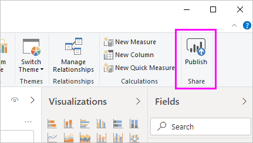
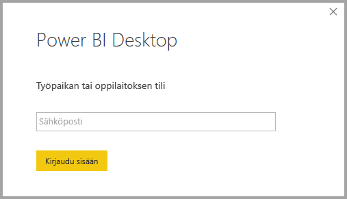
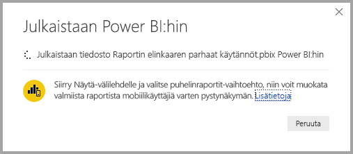
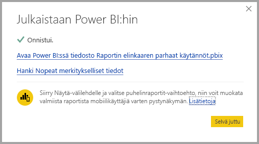

# Tietojoukkoihin yhdistäminen Power BI -palvelussa Power BI Desktopista

Voit muodostaa reaaliaikaisen yhteyden jaettuun tietojoukkoon *Power BI -palvelussa*, ja luoda monia erilaisia raportteja samasta tietojoukosta. Voit luoda täydellisen tietomallin Power BI Desktopissa ja julkaista sen Power BI -palvelussa. Sen jälkeen sinä voit ja muut käyttäjät voivat luoda useita erilaisia raportteja erillisiin *.pbix*-tiedostoihin tästä yleisestä tietomallista, ja tallentaa ne eri työtiloihin. Tätä ominaisuutta kutsutaan *Power BI -palvelun reaaliaikaiseksi yhteydeksi*.

Tästä ominaisuudesta on monenlaista hyötyä, mukaan lukien parhaat käytännöt, joita käsittelemme tässä artikkelissa. Suosittelemme tutustumaan tämän ominaisuuden [huomioitaviin asioihin ja rajoituksiin](#limitations-and-considerations).

## Power BI -palvelun reaaliaikaisen yhteyden käyttö raportin elinkaaren hallintaan

Yksi Power BI:n suosion haaste on raporttien, koontinäyttöjen ja niiden pohjana olevien tietomallien runsaus. Näyttäviä raportteja on helppo luoda Power BI Desktopissa, [julkaista](../create-reports/desktop-upload-desktop-files.md) nämä raportit Power BI -palvelussa ja luoda upeita koontinäyttöjä näistä tietojoukoista. Koska niin monet henkilöt tekevät näin käyttäen usein samoja tai lähes samoja tietojoukkoja, voi olla vaikeaa tietää, mikä raportti perustui mihinkin tietojoukkoon, ja ovatko nämä tietojoukot ajantasaisia. Tähän haasteeseen voidaan vastata Power BI -palvelun reaaliaikaisen yhteyden avulla. Se helpottaa ja yhdenmukaistaa yleisten tietojoukkojen raporttien ja koontinäyttöjen luomista, jakamista ja laajentamista.

### Luo tietojoukko, jota jokainen voi käyttää, ja jaa se

Oletetaan, että Anna on tiimisi yritysanalyytikko. Anna on taitava luomaan hyviä tietomalleja, joita kutsutaan usein tietojoukoiksi. Anna voi luoda tietojoukon ja raportin, ja jakaa sitten tämän raportin Power BI -palvelussa.

Kaikki pitävät Annan raportista ja tietojoukosta. Ja tässä ongelma juuri piilee. Kaikki Annan tiimin jäsenet yrittävät luoda *oman versionsa* tästä tietojoukosta ja jakaa sitten omat raporttinsa tiimin kanssa. Yhtäkkiä tiimin työtilassa voi olla lukuisia raportteja eri tietojoukoista Power BI -palvelussa. Mikä on niistä uusin? Olivatko tietojoukot samat vai vain suurin piirtein samat? Mitkä olivat niiden erot? Power BI -palvelun reaaliaikaisen yhteysominaisuuden ansiosta tilanne saadaan hallintaan. Näemme seuraavassa osiossa, miten muut voivat käyttää Annan julkaisemaa tietojoukkoa omissa raporteissaan ja omissa työtiloissaan. Näin kaikki voivat luoda saman vankan, yhtenäisen ja julkaistun tietojoukon avulla omia yksilöllisiä raporttejaan.

### Yhteyden muodostaminen Power BI -palvelun tietojoukkoon reaaliaikaisen yhteyden avulla

Anna luo raportin ja luo sen pohjana olevan tietojoukon. Anna julkaisee sen sitten Power BI -palvelussa. Raportti näkyy tiimin työtilassa Power BI -palvelussa. Jos Anna tallentaa sen *uuden käyttökokemuksen mukaiseen työtilaan*, hän voi määrittää *muodostamisoikeudet* niin, että kaikki hänen työtilaansa kuuluvat ja sen ulkopuoliset henkilöt voivat nähdä raportin ja käyttää sitä.

Saat lisätietoja uudesta työtilojen käyttökokemuksesta [työtilat](../collaborate-share/service-new-workspaces.md)-kohdasta.

Annan työtilan sisä- ja ulkopuolella olevat muut jäsenet voivat nyt muodostaa reaaliaikaisen yhteyden Annan jaettuun tietomalliin Power BI -palvelun reaaliaikaisen yhteysominaisuuden avulla. He voivat luoda omia yksilöllisiä raporttejaan *alkuperäisestä tietojoukostaan* *omissa uusissa työtilojen käyttökokemuksissaan*.

Näet seuraavassa kuvassa, miten Anna luo yhden Power BI Desktop -raportin ja julkaisee sen yhdessä sen tietomallin kanssa Power BI -palvelussa. Muut voivat sitten muodostaa yhteyden Annan tietomalliin Power BI -palvelun reaaliaikaisen yhteyden avulla ja luoda Annan tietojoukon pohjalta omia yksilöllisiä raporttejaan omissa työtiloissaan.

> [!NOTE]
> Jos tallennat tietojoukon [perinteiseen jaettuun työtilaan](../collaborate-share/service-create-workspaces.md), vain kyseisen työtilan jäsenet voivat luoda tietojoukkoon perustuvia raportteja. Power BI -palvelun reaaliaikaisen yhteyden muodostamiseksi tietojoukkojen, joihin yhteys muodostetaan, on oltava jaetussa työtilassa, jonka jäsen olet.
> 
> 

## Power BI -palvelun reaaliaikaisen yhteyden vaiheittaiset käyttöohjeet

Kun nyt tunnemme Power BI -palvelun reaaliaikaisen yhteyden edut ja sen, miten voimme käyttää sitä parhaana käytäntönä raportin elinkaaren hallintaan, käsittelemme seuraavaksi Annan upeaan raporttiin ja tietojoukkoon liittyviä vaiheita jaetun tietojoukon luomiseksi. Annan Power BI -tiimin jäsenet voivat sitten käyttää sitä.

### Power BI -raportin ja -tietojoukon julkaiseminen

Kun hallitset raportin elinkaarta Power BI -palvelun reaaliaikaisen yhteyden avulla, tarvitset ensinnäkin raportin ja tietojoukon, jota tiimin jäsenet haluavat käyttää. Annan on siten ensin *julkaistava* raporttinsa Power BI Desktopista. Valitse **Julkaise** Power BI Desktopin **Aloitus**-valintanauhasta.

Jos Anna ei ole kirjautunut Power BI -palvelun tiliin, Power BI kehottaa häntä tekemään niin.

Sieltä Anna voi valita työtilan kohteen, johon hänen raporttinsa ja tietojoukkonsa julkaistaan. Muista, että jos Anna tallentaa sen uuden käyttökokemuksen mukaiseen työtilaan, kuka tahansa, jolla on muodostamisoikeudet, voi käyttää kyseistä tietojoukkoa. Muodostamisoikeudet määritetään julkaisemisen jälkeen Power BI -palvelussa. Jos työ tallennetaan perinteiseen työtilaan, vain sellaiset jäsenet, joilla on julkaistun raportin sisältävän työtilan käyttöoikeudet, voivat käyttää sen tietojoukkoa Power BI -palvelun reaaliaikaisen yhteyden avulla.

Julkaisuprosessi käynnistyy ja Power BI Desktop näyttää edistymisen.

Kun prosessi on valmis, Power BI Desktop näyttää onnistumisen ja tarjoaa pari linkkiä, jotta pääset itse raporttiin Power BI -palvelussa, ja linkin raporttia koskeviin merkityksellisiin tietoihin.

Nyt kun raportti tietojoukkoineen on Power BI -palvelussa, voit myös *ylentää* sen. Ylentäminen tarkoittaa, että vakuutat sen olevan laadukas ja luotettava. Voit myös pyytää, että Power BI -vuokraajasi määräävässä asemassa oleva taho *sertifioi* sen. Tietojoukko, jolla on vähintään toinen näistä tuista, näkyy aina luettelossa ylimmäisenä tietojoukkoja hakiessa. Lisätietoja on kohdassa [Tietojoukon ylentäminen](service-datasets-promote.md).

Lopuksi määritetään raportin pohjana olevan tietojoukon muodostamisoikeudet. Muodostamisoikeudet määrittävät, ketkä voivat nähdä tietojoukon ja käyttää sitä. Voit määrittää oikeudet suoraan työtilassa tai jakaessasi sovellusta työtilan kautta. Lisätietoja on artikkelissa [Jaettujen tietojoukkojen muodostamisoikeudet](service-datasets-build-permissions.md).

Katsotaanpa seuraavaksi, miten muut tiimin jäsenet, joilla on käyttöoikeus työtilaan, jossa raportti ja tietojoukko on julkaistu, voivat muodostaa yhteyden tietojoukkoon ja luoda omia raporttejaan.

### Power BI -palvelun reaaliaikaisen yhteyden muodostaminen julkaistuun tietojoukkoon

Jotta voit muodostaa yhteyden julkaistuun raporttiin ja luoda oman raporttisi julkaistun tietojoukon perusteella, valitse **Nouda tiedot** **Aloitus**-valintanauhasta Power BI Desktopissa, valitse**Power Platform** vasemmasta ruudusta ja valitse sitten **Power BI -tietojoukot**.

Jos et ole kirjautunut sisään, Power BI kehottaa sinua kirjautumaan. Kun olet kirjautunut sisään, Power BI näyttää, minkä työtilojen jäsen olet. Voit valita, mikä työtila sisältää tietojoukon, johon haluat muodostaa Power BI -palvelun reaaliaikaisen yhteyden.

Luettelon tietojoukot ovat kaikkien työtilojen jaettuja tietojoukkoja, joiden muodostamisoikeudet sinulla on. Voit etsiä tiettyä tietojoukkoa ja nähdä sen nimen, omistajan, sijaintityötilan ja sen, milloin se on viimeksi päivitetty. Näet myös luettelossa ylimmäisenä joko sertifioitujen tai ylennettyjen tietojoukkojen **TUEN**.

Kun valitset **Luo**, muodostat reaaliaikaisen yhteyden valittuun tietojoukkoon. Power BI Desktop lataa kentät ja niiden arvot, jotka näet Power BI Desktopissa reaaliajassa.

Voit nyt itse ja muut voivat luoda ja jakaa mukautettuja raportteja, kaikki samasta tietojoukosta. Tämän lähestymistavan ansiosta yksi asiantunteva henkilö voi luoda Annan tavoin hyvin muotoillun tietojoukon. Monet tiimin jäsenet voivat käyttää tätä jaettua tietojoukkoa omien raporttiensa luontiin.

## Rajoitukset ja huomioitavat asiat

Power BI -palvelun reaaliaikaisen yhteyden käyttöön liittyy joitakin rajoituksia ja huomioitavia asioita, jotka on hyvä pitää mielessä.

* Vain käyttäjät, joilla on tietojoukon muodostamisoikeudet, voivat muodostaa yhteyden julkaistuun tietojoukkoon Power BI -palvelun reaaliaikaisen yhteyden avulla.
* Maksuttoman version käyttäjät näkevät vain **oman työtilansa** ja Premium-työtilojen tietojoukot.
* Koska tämä on reaaliaikainen yhteys, vasemmalle siirtyminen ja mallinnus on poistettu käytöstä. Voit muodostaa yhteyden vain yhteen tietojoukkoon kussakin raportissa. Tämä toimintatapa on sama kuin yhdistettäessä *SQL Server Analysis Servicesiin*.
* Koska tämä on reaaliaikainen yhteys, rivitason suojaus (RLS) ja muut tällaiset yhteyksien toimintatavat ovat pakotetut. Näin toimitaan myös yhdistettäessä SQL Server Analysis Servicesiin.
* Jos omistaja muuttaa alkuperäistä jaettua *.pbix*-tiedostoa, Power BI -palvelussa jaettava tietojoukko ja raportti korvataan. Kyseiseen tietojoukkoon perustuvia raportteja ei korvata, vaan tietojoukkoon tehdyt muutokset näkyvät raportissa.
* Työtilan jäsenet eivät voi korvata alunperin jaettua raporttia. Jos näin yritetään tehdä, näyttöön tulee varoitus, joka kehottaa sinua nimeämään tiedoston uudelleen ja julkaisemaan sen.
* Jos poistat jaetun tietojoukon Power BI -palvelussa, muut tähän tietojoukkoon perustuvat raportit eivät enää toimi oikein eivätkä niiden visualisoinnit näy.
* Sisältöpakettien tapauksessa sinun on ensin luotava sisältöpaketin kopio ennen kuin käytät sitä *.pbix*-raportin ja tietojoukon jakamiseen Power BI -palveluun.
* Kun sisältöpaketit on kopioitu *Oma organisaatio* -kohdasta, et voi korvata palvelussa luotua raporttia tai raporttia, joka on luotu osana sisältöpaketin kopiointia reaaliaikaisen yhteyden avulla. Jos näin yritetään tehdä, näyttöön tulee varoitus, joka kehottaa sinua nimeämään tiedoston uudelleen ja julkaisemaan sen. Tässä tilanteessa voit vain korvata reaaliaikaisen yhteyden avulla julkaistut raportit.
* Jos poistat jaetun tietojoukon Power BI -palvelussa, et voi enää käyttää kyseistä tietojoukkoa Power BI Desktopista.
* Raportit, jotka jakavat tietojoukon Power BI -palvelussa, eivät tue automaattisia käyttöönottoja Power BI REST -ohjelmointirajapinnan avulla.
