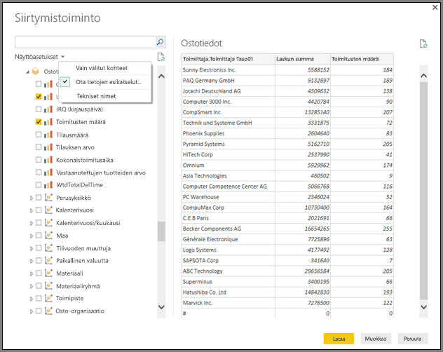
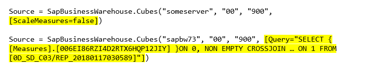

# <a name="use-the-sap-business-warehouse-connector-in-power-bi-desktop"></a>SAP Business Warehouse -yhdistimen käyttö Power BI Desktopissa

Voit nyt käyttää *SAP Business Warehouse (BW)* -tietoja Power BI Desktopilla.

Tietoja siitä, miten SAP-asiakkaat voivat hyötyä yhdistämällä Power BI:n nykyisiin SAP BW -järjestelmiinsä, saat [Power BI:n ja SAP BW:n teknisestä raportista](https://aka.ms/powerbiandsapbw). Saat lisätietoja DirectQueryn käytöstä SAP BW:n kanssa artikkelista [DirectQuery ja SAP Business Warehouse (BW)](desktop-directquery-sap-bw.md).

Power BI Desktopin kesäkuun 2018 julkaisusta (yleisesti käytettävissä lokakuussa 2018) alkaen *SAP BW -yhdistintä* voi käyttää toteutuksessa, joka sisältää merkittäviä parannuksia sekä suorituskykyyn että ominaisuuksiin. Microsoft kehitti *toteutus 2.0* SAP -yhdistimen. Valitse joko SAP BW -yhdistimen versio 1 tai toteutus 2.0 SAP -yhdistin. Seuraavassa kuvataan kunkin version asennus. Yhdistäessäsi Power BI Desktopista SAP BW:hen, voit valita kumman tahansa yhdistimen.

Suosittelemme käyttämään toteutus 2.0 SAP -yhdistintä aina kun se on mahdollista.

## <a name="installation-of-version-1-of-the-sap-bw-connector"></a>SAP BW -yhdistimen version 1 asennus

Suosittelemme käyttämään toteutus 2.0 SAP -yhdistintä aina kun se on mahdollista. Tässä osiossa kuvataan SAP BW -yhdistimen version 1 asennusta.

1. Asenna *SAP NetWeaver* -kirjasto paikalliselle tietokoneelle. Voit saada SAP Netweaver -kirjaston SAP-järjestelmänvalvojaltasi tai suoraan [SAP-ohjelmiston latauskeskuksesta](https://support.sap.com/swdc). Koska SAP-ohjelmiston latauskeskus muuttaa rakennettaan usein, emme voi antaa tarkempia ohjeita kyseisellä sivulla siirtymiseen. SAP NetWeaver -kirjasto sisältyy yleensä myös SAP-asiakastyökalujen asennukseen.

   Voit etsiä uusimman version latauksen sijaintia lausekkeella *SAP Note #1025361*. Varmista, että SAP NetWeaver -kirjaston arkkitehtuuri (32-bittinen tai 64-bittinen) vastaa Power BI Desktop -asennusta. Asenna kaikki tiedostot, jotka sisältyivät *SAP NetWeaver RFC SDK:hen* SAP-huomautuksen mukaan.
2. Valitse Power BI Desktopissa **Nouda tiedot**. **Tietokannan** asetukset sisältävät *SAP Business Warehouse Application Serverin* ja *SAP Business Warehouse Message Serverin*.

   

## <a name="installation-of-implementation-20-sap-connector"></a>Toteutus 2.0 SAP-yhdistimen asennus

SAP-yhdistimen toteutus 2.0 vaatii SAP .NET Connector 3.0:n. Lataaminen edellyttää kelvollisia S-käyttöoikeuksia. Ota yhteyttä SAP Basis -tiimiin saadaksesi SAP .NET Connector 3.0:n.

Voit ladata [SAP .NET Connector 3.0:n](https://support.sap.com/en/product/connectors/msnet.html) SAP-palvelimesta.

Yhdistin on saatavilla 32-bittisenä ja 64-bittisenä versiona. Valitse versio, joka vastaa Power BI Desktop -asennustasi. Nykyisin sivustolla näkyy kaksi versiota .NET 4.0 Frameworkille:

* Microsoft .NET 3.0.22.0. SAP -yhdistin 32-bittiselle (x86) Windowsille zip-tiedostona (6.896 Kt), 1. kesäkuuta 2019
* Microsoft .NET 3.0.22.0. SAP -yhdistin 64-bittiselle (x64) Windowsille zip-tiedostona (7.180 Kt), 1. kesäkuuta 2019

Varmista asennuksen aikana, että valitset **Valinnaiset asennusohjeet** -kohdassa *Asenna kokoonpanot GAC:lle*.


> [!NOTE]
> SAP BW:n ensimmäisen version toteutus edellytti NetWeaver DLL -tiedostoja. Jos käytät SAP-yhdistimen toteutus 2.0:a etkä ensimmäistä versiota, NetWeaver DLL -tiedostoja ei tarvita.

## <a name="version-1-sap-bw-connector-features"></a>SAP BW -yhdistimen version 1 ominaisuudet

Power BI Desktopin SAP BW -yhdistimen versio 1 mahdollistaa tietojen tuomisen *SAP Business Warehouse -palvelimen* kuutioista tai DirectQueryn käytön.

Lisätietoja SAP BW -yhdistimestä ja sen käytöstä DirectQueryn kanssa löytyy artikkelista [DirectQuery ja SAP Business Warehouse (BW)](desktop-directquery-sap-bw.md).

Muodosta yhteys määrittämällä **palvelin**, **järjestelmän numero** ja **asiakastunnus**.


Voit myös määrittää kaksi muuta **lisäasetusta**: **kielikoodi** ja mukautettu **MDX-lauseke**, joka suoritetaan määritetyllä palvelimella.


Jos et määritä MDX-lauseketta, yhteysasetus näyttää palvelimen käytettävissä olevien kuutioiden luettelon. Voit porautua alaspäin ja valita kohteita käytettävissä olevista kuutioista, mukaan lukien dimensiot ja mittayksiköt. Power BI tuo esiin kyselyt ja kuutiot, jotka [Open Analysis Interface -käyttöliittymät](https://help.sap.com/saphelp_nw70/helpdata/en/d9/ed8c3c59021315e10000000a114084/content.htm) ovat paljastaneet.

Kun valitset yhden tai useamman kohteen palvelimelta, Siirtymistoiminto-valintaikkuna luo tulostettavan taulukon esikatselun.


**Siirtymistoiminto**-valintaikkunassa on myös näyttöasetuksia:

* **Näytä vain valitut kohteet**. Oletusarvon mukaan **Siirtymistoiminto** näyttää kaikki kohteet.  Tämä valinta on hyödyllinen, kun vahvistetaan valittujen kohteiden lopullinen joukko. Vaihtoehtoinen tapa tarkastella valittuja kohteita on valita sarakkeiden nimet esikatselualueella.
* **Ota tietojen esikatselut käyttöön**. Tämä arvo on oletusarvo. Näyttää tietojen esikatselut. Tietojen esikatselun ottaminen pois käytöstä vähentää palvelinkutsujen määrää, koska palvelin ei enää pyydä tietoja esikatseluita varten.
* **Tekniset nimet**. SAP BW tukee *teknisten nimien* käsitettä kuution sisältämille objekteille. Tekniset nimet mahdollistavat sen, että kuution omistaja voi näyttää *kutsumanimiä* kuution objekteille pelkästään *fyysisten nimien* sijaan.



Kun olet valinnut kaikki tarvittavat objektit, voit päättää, mitä haluat tehdä seuraavaksi, valitsemalla jonkin seuraavista asetuksista:

* Valitse **Lataa**, jos haluat ladata tulostustaulukon koko rivijoukon Power BI Desktop -tietomalliin. **Raporttinäkymä** avautuu. Voit aloittaa tietojen visualisoinnin tai tehdä lisämuutoksia käyttämällä **tieto-** tai **suhdenäkymiä**.
* Avaa **kyselyeditori**valitsemalla **Muokkaa**. Määritä tietojen muuttamista ja suodattamista koskevat lisäohjeet ennen kaikkien rivijoukkojen tuomista Power BI Desktop -tietomalliin.

Sen lisäksi, että voit tuoda tietoja SAP BW -kuutioista, voit myös tuoda Power BI Desktopiin tietoja laajasta valikoimasta muita tietolähteitä ja yhdistää ne sitten yhdeksi raportiksi. Tämä ominaisuus tarjoaa monia kiinnostavia skenaarioita raportointiin ja analyysiin SAP BW -tietojen lisäksi.

## <a name="using-implementation-20-sap-bw-connector"></a>Toteutus 2.0 SAP BW -yhdistimen käyttäminen

Luo uusi yhteys toteutus 2.0 SAP BW -yhdistimen käyttämiseksi. Luodaksesi uuden yhteyden, toimi seuraavasti:

1. Valitse **Nouda tiedot**. Valitse joko **SAP Business Warehouse -sovelluspalvelin** tai **SAP Business Warehouse -viestipalvelin**, ja muodosta sitten yhteys.

2. Valitse uudessa yhteysvalintaikkunassa toteutus. Valitsemalla **2.0:n** **toteutukselle** seuraavan kuvan mukaisesti voit ottaa käyttöön **suoritustilan**, **erän koon** ja **ominaisuusrakenteet**.

    

3. Valitse **OK**. Tämän jälkeen version 1 SAP BW -yhdistimen käyttökokemus on sama kuin [Version 1 SAP BW -yhdistimen ominaisuudet](#version-1-sap-bw-connector-features) -kohdassa kuvattu.

### <a name="new-options-for-implementation-20"></a>Uudet asetukset toteutus 2.0:lle

Toteutus 2.0 tukee seuraavia asetuksia:

* *ExecutionMode* määrittää palvelimessa tehtävien kyselyiden MDX-käyttöliittymän. Kelvollisia ovat seuraavat asetukset:

  * `SapBusinessWarehouseExecutionMode.BasXml`
  * `SapBusinessWarehouseExecutionMode.BasXmlGzip`
  * `SapBusinessWarehouseExecutionMode.DataStream`

    Oletusarvo on `SapBusinessWarehouseExecutionMode.BasXmlGzip`.

    `SapBusinessWarehouseExecutionMode.BasXmlGzip`-arvon käyttäminen saattaa parantaa suorituskykyä, kun suurten tietojoukkojen käsittelyssä ilmenee viiveitä.

* *BatchSize* määrittää rivien enimmäismäärän, joka noudetaan kerrallaan suoritettaessa MDX-lausetta. Pieni määrä tarkoittaa enemmän kutsuja palvelimella, kun noudetaan tietoja suuresta tietojoukosta. Suuri määrä rivejä saattaa parantaa suorituskykyä, mutta saattaa aiheuttaa muistiongelmia SAP BW -palvelimessa. Oletusarvona on 50000 riviä.

* *EnableStructures* ilmaisee, tunnistetaanko ominaisuusrakenteita. Asetuksen oletusarvo on false. Vaikuttaa valittavissa olevien objektien luetteloon. Ei tueta alkuperäisessä kyselytilassa.

*ScaleMeasures* -asetus on syrjäytetty tässä toteutuksessa. Se käyttäytyy nyt samoin kuin jos *ScaleMeasures* -arvoksi asetetaan false, näyttäen aina skaalaamattomat arvot.

### <a name="additional-improvements-for-implementation-20"></a>Toteutus 2.0:n muut parannukset

Seuraavassa luettelossa kuvataan joitakin muita parannuksia, jotka sisältyvät uuteen toteutukseen:

* Parannettu suorituskyky.
* Kyky hakea tietoja useita miljoonia rivejä ja hienosäätää erän kokoa parametrin kautta.
* Kyky vaihtaa suoritustiloihin.
* Pakatun tilan tuki. Hyödyllinen erityisesti suurten viiveiden on yhteyksien tai suurten tietojoukkojen kanssa.
* Parannettu `Date`-muuttujien tunnistaminen.
* [Kokeellinen] Paljastaa `Date` (ABAP-tyypin DATS) ja `Time` (ABAP-tyypin TIMS) -dimensiot vastaavasti päivämäärinä ja aikoina tekstiarvojen sijaan.
* Parempi poikkeusten hallinta. BAPI-kutsuissa havaitut virheet näytetään.
* Saraketaitto BasXml ja BasXmlGzip -tiloissa. Jos esimerkiksi luotu MDX-kysely palauttaa 40 saraketta, mutta nykyinen valinta tarvitsee vain 10, välitetään tämä pyyntö palvelimelle ja pienempi tietojoukko noudetaan.

### <a name="changing-existing-reports-to-use-implementation-20"></a>Aikaisemmin luotujen raporttien muuttaminen käyttämään toteutus 2.0:a

Aikaisemmin luotujen raporttien muuttaminen käyttämään toteutus 2.0:a on mahdollista vain tuontitilassa. Toimi seuraavasti:

1. Avaa aiemmin luotu raportti, valitse valintanauhasta **Muokkaa kyselyitä** ja valitse sitten päivitettävä SAP Business Warehouse -kysely.

1. Napsauta hiiren kakkospainikkeella kyselyä ja valitse **Laajennettu editori**.

1. Muuta `SapBusinessWarehouse.Cubes`-kutsua **Laajennettu editori** -kohdassa seuraavasti:

    Määritä, sisältääkö kysely jo asetustietueen, kuten seuraavassa esimerkissä:

    

    Jos näin on, lisää `Implementation` 2.0 -asetus ja poista `ScaleMeasures` -asetus, jos se on näkyvissä, seuraavasti:

    

    Jos kysely ei vielä sisällä asetustietuetta, lisää asetustietue. Seuraavalle asetukselle:

    

    Muuta se:

    

Olemme pyrkineet kaikin tavoin varmistamaan, että SAP BW -yhdistimen toteutus 2.0 on yhteensopiva SAP BW -yhdistimen version 1 kanssa. Joitakin eroja saattaa kuitenkin olla eri SAP BW MDX -suoritintilojen käytön vuoksi. Poikkeamia voidaan yrittää ratkaista vaihtamalla eri suoritustilojen välillä.

## <a name="troubleshooting"></a>Vianmääritys

Tämä osio sisältää vianmäärityksen tilanteita (ja ratkaisuja) käytettäessä SAP BW -yhdistintä.

1. SAP BW -yhdistimen numeeriset tiedot palauttavat desimaalipisteitä pilkkujen sijaan. Esimerkiksi 1,000,000 palautetaan muodossa 1.000.000.

   SAP BW -yhdistin palauttaa desimaalitiedot joko desimaalierottimella `,` (pilkku) tai `.` (piste). Määrittääkseen kumpaa SAP BW -yhdistimen tulisi käyttää desimaalierottimena Power BI Desktopin käyttämä ohjain lähettää kutsun `BAPI_USER_GET_DETAIL`. Tämä kutsu palauttaa rakenteen nimeltä `DEFAULTS`. Siinä on kenttä nimeltä `DCPFM`, joka tallentaa *desimaalimuodon merkinnän*. Kentässä on yksi seuraavista arvoista:

   * ' ' (välilyönti) = desimaalierotin on pilkku: N.NNN,NN
   * 'X' = desimaalierotin on piste: N,NNN.NN
   * 'Y' = desimaalierotin on N NNN NNN,NN

   Asiakkaat, jotka ovat ilmoittaneet tästä ongelmasta, havaitsivat, että kutsu `BAPI_USER_GET_DETAIL` epäonnistuu tietyn käyttäjän (käyttäjän, jolla näkyy virheellisiä tietoja) kohdalla ja tuottaa seuraavantapaisen virheviestin:

   ```xml
    You are not authorized to display users in group TI:
        <item>
            <TYPE>E</TYPE>
            <ID>01</ID>
            <NUMBER>512</NUMBER>
            <MESSAGE>You are not authorized to display users in group TI</MESSAGE>
            <LOG_NO/>
            <LOG_MSG_NO>000000</LOG_MSG_NO>
            <MESSAGE_V1>TI</MESSAGE_V1>
            <MESSAGE_V2/>
            <MESSAGE_V3/>
            <MESSAGE_V4/>
            <PARAMETER/>
            <ROW>0</ROW>
            <FIELD>BNAME</FIELD>
            <SYSTEM>CLNTPW1400</SYSTEM>
        </item>
   ```

   Ratkaistakseen tämän vian, käyttäjien tulee pyytää SAP-järjestelmänvalvojaansa antamaan Power BI:ssä käytettävälle SAPBW-käyttäjälle oikeuden suorittaa kutsu `BAPI_USER_GET_DETAIL`. Kannattaa myös tarkistaa, että käyttäjällä on tarvittava `DCPFM`-arvo, joka kuvattiin aikaisemmin tämän vianmäärityksen ratkaisussa.

2. SAP BEx -kyselyiden yhteydet
   
   Voit suorittaa Power BI Desktopilla BEx-kyselyitä ottamalla käyttöön tietyn ominaisuuden seuraavassa kuvassa esitetyn mukaisesti:
   
   
   
3. **Siirtymistoiminto**-ikkuna ei näytä tietojen esikatselua, vaan se antaa *Objektiviittausta ei ole määritetty objektin esiintymään* -virheviestin.
   
   SAP-käyttäjien täytyy hakea metatiedot ja hakea tiedot SAP BW:n InfoProviders-kohteista tietyillä BAPI-funktiomoduuleilla. Näitä moduuleja ovat esimerkiksi seuraavat:

   * BAPI_MDPROVIDER_GET_CATALOGS
   * BAPI_MDPROVIDER_GET_CUBES
   * BAPI_MDPROVIDER_GET_DIMENSIONS
   * BAPI_MDPROVIDER_GET_HIERARCHYS
   * BAPI_MDPROVIDER_GET_LEVELS
   * BAPI_MDPROVIDER_GET_MEASURES
   * BAPI_MDPROVIDER_GET_MEMBERS
   * BAPI_MDPROVIDER_GET_VARIABLES
   * BAPI_IOBJ_GETDETAIL

   Voit ratkaista ongelman varmistamalla, että käyttäjällä on oikeus käyttää erilaisia MDPROVIDER-moduuleita ja `BAPI_IOBJ_GETDETAIL`-moduuleita. Voit tehdä tämän ongelman tai samankaltaisten ongelmien vianmäärityksen ottamalla käyttöön jäljityksen. **Valitse Tiedosto** > **Asetukset ja vaihtoehdot** > **Asetukset**. Valitse **Asetukset**-kohdassa **Diagnostiikka**, ja valitse sitten **Ota jäljitys käyttöön**. Yritä hakea tietoja SAP BW:stä, kun jäljitys on käytössä, ja tutki lisätietoja jäljitystiedostosta.

## <a name="sap-bw-connection-support"></a>SAP BW -yhteyden tuki

Seuraavassa taulukossa esitetään SAP BW:n nykyinen tuki.

|Tuote  |Tila  |Todentaminen  |Liitin  |SNC-kirjasto  |Tuetaan  |
|---------|---------|---------|---------|---------|---------|
|Power BI Desktop     |Mikä tahansa         | Käyttäjä / salasana  | Sovelluspalvelin | –  | Kyllä  |
|Power BI Desktop     |Mikä tahansa         | Windows          | Sovelluspalvelin | sapcrypto + gsskrb5/gx64krb5  | Kyllä  |
|Power BI Desktop     |Mikä tahansa         | Windows tekeytymisen kautta | Sovelluspalvelin | sapcrypto + gsskrb5/gx64krb5  | Kyllä  |
|Power BI Desktop     |Mikä tahansa         | Käyttäjä / salasana        | Viestipalvelin | –  | Kyllä  |
|Power BI Desktop     |Mikä tahansa         | Windows        | Viestipalvelin | sapcrypto + gsskrb5/gx64krb5  | Kyllä  |
|Power BI Desktop     |Mikä tahansa         | Windows tekeytymisen kautta | Viestipalvelin | sapcrypto + gsskrb5/gx64krb5  | Kyllä  |
|Power BI Gateway     |Tuo      | Sama kuin Power BI Desktopilla |         |   |   |
|Power BI Gateway     |DirectQuery | Käyttäjä / salasana        | Sovelluspalvelin | –  | Kyllä  |
|Power BI Gateway     |DirectQuery | Windows tekeytymisen kautta (kiinteä käyttäjä, ei kertakirjautumista) | Sovelluspalvelin | sapcrypto + gsskrb5/gx64krb5  | Kyllä  |
|Power BI Gateway     |DirectQuery | Käytä DirectQuery-kyselyissä kertakirjautumista Kerberoksen kautta | Sovelluspalvelin | sapcrypto + gsskrb5/gx64krb5   | Kyllä  |
|Power BI Gateway     |DirectQuery | Käyttäjä / salasana        | Viestipalvelin | –  | Kyllä  |
|Power BI Gateway     |DirectQuery | Windows tekeytymisen kautta (kiinteä käyttäjä, ei kertakirjautumista) | Viestipalvelin | sapcrypto + gsskrb5/gx64krb5  | Kyllä  |
|Power BI Gateway     |DirectQuery | Käytä DirectQuery-kyselyissä kertakirjautumista Kerberoksen kautta | Viestipalvelin | gsskrb5/gx64krb5  | Ei  |
|Power BI Gateway     |DirectQuery | Käytä DirectQuery-kyselyissä kertakirjautumista Kerberoksen kautta | Viestipalvelin | sapcrypto  | Kyllä  |

## <a name="next-steps"></a>Seuraavat vaiheet

Lisätietoja SAP-tietokannoista ja DirectQuery-kyselystä saat seuraavista lähteistä:

* [DirectQuery ja SAP HANA](desktop-directquery-sap-hana.md)
* [DirectQuery ja SAP Business Warehouse (BW)](desktop-directquery-sap-bw.md)
* [DirectQueryn käyttäminen Power BI:ssä](desktop-directquery-about.md)
* [Power BI -tietolähteet](power-bi-data-sources.md)
* [Power BI ja SAP BW tekninen raportti](https://aka.ms/powerbiandsapbw)
