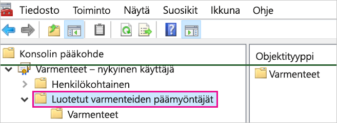
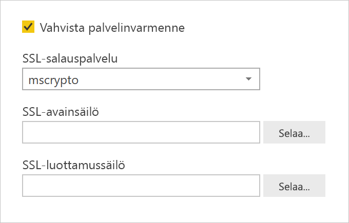
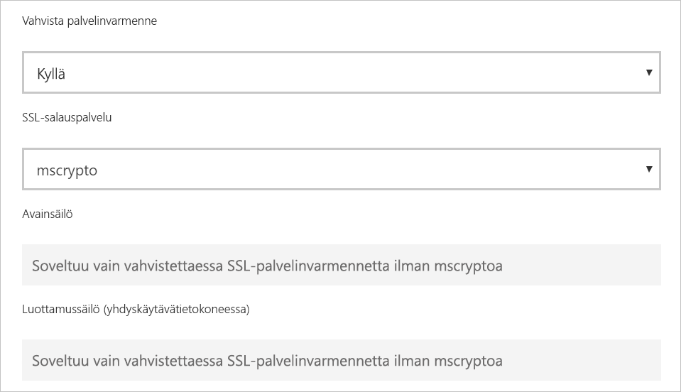

# <a name="enable-encryption-for-sap-hana"></a>Ota SAP HANAn salaus käyttöön

On suositeltavaa salata yhteydet Power BI Desktopista ja Power BI -palvelusta SAP HANA -palvelimeen. Voit ottaa HANA-salauksen käyttöön sekä OpenSSL:n että SAP:n omistaman CommonCryptoLib-kirjaston (tunnettiin aiemmin nimellä sapcrypto) avulla. SAP suosittelee käyttämään CommonCryptoLibiä, mutta salauksen perusominaisuudet ovat käytettävissä kummankin kirjaston kautta.

Tässä artikkelissa annetaan yleiskatsaus OpenSSL-salauksen käyttöönottoon ja viitataan tiettyihin SAP-dokumentaation alueisiin. Päivitämme sisältöä ja linkkejä säännöllisesti, mutta kattavat ohjeet ja tuen saat aina virallisesta SAP-dokumentaatiosta. Jos haluat määrittää salauksen CommonCryptoLibillä OpenSSL:n sijaan, lue artikkeli [TLS- tai SSL-suojauksen määrittäminen SAP HANA 2.0:ssa](https://blogs.sap.com/2018/11/13/how-to-configure-tlsssl-in-sap-hana-2.0/) Ohjeita OpenSSL:stä CommonCryptoLibiin siirtymiseen on huomautuksessa [SAP Note 2093286](https://launchpad.support.sap.com/#/notes/2093286) (s-käyttäjä vaaditaan).

> [!NOTE]
> Tässä artikkelissa kuvatut salauksen asennusvaiheet ovat päällekkäisiä SAML SSO:n asennus-ja määritysvaiheiden kanssa. Valitsitpa HANA-palvelimesi salauspalveluksi sitten OpenSSL:n tai CommonCryptoLibin, varmista, että valintasi on johdonmukainen kaikissa SAML-ja salausmäärityksissä.

SAP HANAn salaus voidaan ottaa käyttöön neljässä vaiheessa OpenSSL-yhteyden avulla. Nämä vaiheet käsitellään seuraavaksi.  Lisätietoja on artikkelissa [SAP HANA Studion ja SAP HANA -palvelimen välisen tietoliikenteen suojaaminen SSL:n kautta](https://blogs.sap.com/2015/09/28/securing-the-communication-between-sap-hana-studio-and-sap-hana-server-through-ssl/).

## <a name="use-openssl"></a>OpenSSL:n käyttö

Varmista, että HANA-palvelimesi on määritetty käyttämään salauspalvelunaan OpenSSL:ää. Korvaa alla olevat puuttuvat polkutiedot HANA-palvelimesi palvelintunnuksella (sid).


## <a name="create-a-certificate-signing-request"></a>Varmenteen allekirjoituspyynnön luominen

Luo X509-varmenteen allekirjoituspyyntö HANA-palvelimelle.

1. Yhdistä SSH-yhteyden avulla \<sid\>adm-käyttäjänä Linux-koneeseen, jossa HANA-palvelin toimii.

1. Siirry kotihakemistoon _/__usr/sap/\<sid\>/home_.

1. Luo piilotettu hakemisto nimeltä _.__ssl_ jos sellaista ei vielä ole olemassa.

1. Suorita seuraava komento:

    ```
    openssl req -newkey rsa:2048 -days 365 -sha256 -keyout Server\_Key.pem -out Server\_Req.pem -nodes
    ```

Tämä komento luo varmenteen allekirjoituspyynnön ja yksityisen avaimen. Kun varmenne on allekirjoitettu, se on voimassa vuoden ajan (ks. -days-parametri). Kun sinulta pyydetään yleistä nimeä (CN), anna sen tietokoneen täydellinen toimialuenimi (FQDN), johon HANA-palvelin on asennettu.

## <a name="get-the-certificate-signed"></a>Hanki varmenteelle allekirjoitus

Hanki varmenteelle sellaisen varmenteen myöntäjän (CA) allekirjoitus, johon HANA-palvelimeen yhdistämiseen käyttämäsi asiakas tai asiakkaat luottavat.

1. Jos sinulla on jo yrityksen luotettu CA (jota edustaa CA\_Cert.pem ja CA\_Key.pem seuraavassa esimerkissä), allekirjoita varmennepyyntö suorittamalla seuraava komento:

    ```
    openssl x509 -req -days 365 -in Server\_Req.pem -sha256 -extfile /etc/ssl/openssl.cnf -extensions usr\_cert -CA CA\_Cert.pem -CAkey CA\_Key.pem -CAcreateserial -out Server\_Cert.pem
    ```

    Jos sinulla ei vielä ole käytettävissä olevaa varmenteiden myöntäjää, voit luoda varmenteiden päämyöntäjän itse noudattamalla ohjeita, jotka on annettu artikkelissa [SAP HANA Studion ja SAP HANA -palvelimen välisen tietoliikenteen suojaaminen SSL:n kautta](https://blogs.sap.com/2015/09/28/securing-the-communication-between-sap-hana-studio-and-sap-hana-server-through-ssl/).

1. Luo HANA Server -varmenneketju yhdistämällä palvelinvarmenne, avain ja varmenteiden myöntäjän varmenne (key.pem-nimi on SAP HANAn käytäntö):

    ```
    cat Server\_Cert.pem Server\_Key.pem CA\_Cert.pem \> key.pem
    ```

1. Luo kopio CA\_Cert.pemistä ja anna sille nimi trust.pem (trust.pem-nimi on SAP HANAn käytäntö):

    ```
    cp CA\_Cert.pem trust.pem
    ```

1. Käynnistä HANA-palvelin uudelleen.

1. Tarkista luottamussuhde asiakkaan ja sen varmenteiden myöntäjän välillä, jota käytit SAP HANA -palvelimen varmenteen allekirjoittamiseen.

    Asiakkaan on luotettava varmenteiden myöntäjään, jota käytetään HANA-palvelimen X509-varmenteen allekirjoittamiseen, ennen kuin asiakkaan tietokoneesta voi muodostaa salatun yhteyden HANA-palvelimeen.

    On erilaisia tapoja varmistaa luottamussuhteen olemassaolo Microsoft Management Consolen (MMC) tai komentorivin avulla. Voit tuoda varmenteiden myöntäjän X509-varmenteen (trust.pem) **Luotettujen varmenteiden päämyöntäjät** -kansioon käyttäjälle, joka muodostaa yhteyden, tai samaan kansioon asiakaskoneelle, jos se on toivottavaa.

    

    Sinun on ensin muunnettava trust.pem .crt-tiedostoksi, ennen kuin voit tuoda varmenteen Luotettujen varmenteiden päämyöntäjät -kansioon, esimerkiksi suorittamalla seuraavan OpenSSL-komennon:

    ```
    openssl x509 -outform der -in your-cert.pem -out your-cert.crt
    ```
    
    Lisätietoja OpenSSL:n käyttämisestä muuntamiseen on [OpenSSL-ohjeissa](https://www.openssl.org/docs/man1.0.2/man3/x509.html).

## <a name="test-the-connection"></a>Testaa yhteyttä

Testaa yhteyttä Power BI Desktopissa-tai Power BI -palvelussa.

1. Varmista Power BI Desktopissa tai Power BI -palvelun **Yhdyskäytävien hallinta**-sivulla, että **Vahvista palvelinvarmenne** on otettu käyttöön, ennen kuin yrität muodostaa yhteyden SAP HANA -palvelimeen. Valitse **SSL-salauspalveluksi** mscrypto, jos olet noudattanut OpenSSL:n asennusvaiheita, tai commoncrypto, jos olet määrittänyt salauspalveluksi kyseisen kirjaston. Jätä SSL-avainsäilö- ja SSL-luottamussäilökentät tyhjiksi.

    - Power BI Desktop

        

    - Power BI -palvelu

        

1. Varmista, että pystyt muodostamaan salatun yhteyden palvelimeen niin, että **Vahvista palvelinvarmenne** -asetus on käytössä, lataamalla tiedot Power BI Desktopiin tai päivittämällä julkaistu raportti Power BI -palvelussa.
