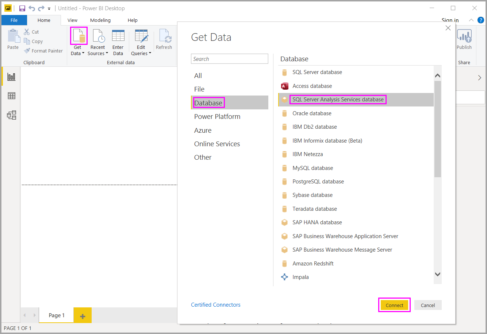

# Yhteyden muodostaminen SSAS-monidimensiomalleihin Power BI Desktopissa

Power BI Desktopin kautta on mahdollista käyttää *SSAS-monidimensiomalleja*, jotka tunnetaan myös lyhenteellä *SSAS MD*.

Jos haluat muodostaa yhteyden SSAS MD ‑tietokantaan, valitse **Nouda tiedot**, valitse **Tietokanta** > **SQL Server Analysis Services -tietokanta** ja valitse sitten **Yhdistä**:

Sekä Power BI -palvelu että Power BI Desktop tukevat SSAS-monidimensiomalleja reaaliaikaisessa yhteystilassa. Voit julkaista ja ladata Power BI -palveluun raportteja, joissa käytetään **SSAS-monidimensiomalleja** reaaliaikaisessa tilassa.

## SSAS MD:n ominaisuudet ja toiminnot

Seuraavissa kappaleissa kuvataan Power BI:n ja SSAS MD:n yhteyksien ominaisuuksia ja toimintoja.

### Monidimensiomallien taulukkomuotoiset metatiedot

Seuraavassa taulukossa esitetään monidimensioisten objektien ja Power BI Desktopin palauttamien taulukkomuotoisten metatietojen väliset vastaavuudet. Power BI tekee kyselyn mallille saadakseen taulukkomuotoisia metatietoja. Power BI Desktop suorittaa palautettujen metatietojen perusteella asianmukaiset DAX-kyselyt SSAS:een, kun luot visualisoinnin (kuten taulukon, matriisin, kaavion tai osittajan).

| Monidimensioinen BISM-objekti | Taulukkomuotoiset metatiedot |
| --- | --- |
| Kuutio |Malli |
| Kuutiodimensio |Taulukko |
| Dimension määritteet (avaimet), nimi |Sarakkeet |
| Mittariryhmä |Taulukko |
| Mittari |Mittari |
| Mittarit ilman niihin liittyvää mittariryhmää |Taulukon sisällä kutsuttavat *mittarit* |
| Mittariryhmän suhde kuution dimensioon |Suhde |
| Perspektiivi |Perspektiivi |
| Suorituskykyilmaisin |Suorituskykyilmaisin |
| Käyttäjien / pää- ja alikohteiden hierarkiat |Hierarkiat |

### Mittarit, mittariryhmät ja suorituskykyilmaisimet

Monidimensioisen kuution mittariryhmät näkyvät taulukkoina, joiden vieressä on **Kentät**-ruudussa sigmamerkki (∑). Lasketut mittarit ilman liitettyä mittariryhmää ryhmitellään taulukkomuotoisissa metatiedoissa erikoistaulukkoon nimeltä *Mittarit*.

Monidimensiomallissa voi yksinkertaistaa monimutkaisia malleja määrittämällä joukon mittareita tai suorituskykyilmaisimia kuutioon, joka sijoitetaan *näyttökansioon*. Power BI tunnistaa taulukkomuotoisissa metatiedoissa näyttökansiot ja näyttää niiden sisällä olevat mittarit ja suorituskykyilmaisimet. Monidimensioisten tietokantojen suorituskykyilmaisimet tukevat seuraavia: *Arvo*, *Tavoite*, *tilagrafiikka* ja *trendigrafiikka*.

### Dimension määritetyyppi

Monidimensiomallit tukevat myös niihin liittyviä dimensiomääritteitä, jotka ovat tiettyä dimension määritetyyppiä. Taulukkomuotoisissa metatiedoissa näytetään esimerkiksi **Paikkatieto**-dimensio, jossa *Kaupunki*-, *Osavaltio tai provinssi*-, *Maa*- ja *Postinumero*-dimensiomääritteisiin on liitetty asianmukaiset paikkatietotyypit. Power BI tunnistaa nämä metatiedot, joten voit luoda niistä karttavisualisointeja. Tunnistat liittyvät tiedot siitä, että elementin vieressä näkyy Power BI:ssä **Kenttä**-ruudussa *kartan* kuvake.

Power BI pystyy myös hahmontamaan kuvia, jos annat sille kuvien URL-osoitteet (Uniform Resource Locator) sisältävän kentän. Voit määrittää nämä kentät *ImageURL*-tyyppeinä SQL Server Data Tools -työkaluissa (tai sitten Power BI:ssä). Sen tyyppitiedot toimitetaan sitten Power BI:lle taulukkomuotoisissa metatiedoissa. Power BI voi sitten hakea nämä kuvat URL-osoitteen perusteella ja näyttää ne visualisoinneissa.

### Pää- ja alikohteiden hierarkiat

Monidimensiomallit tukevat pää- ja alikohteiden hierarkioita, jotka näytetään taulukkomuotoisissa metatiedoissa *hierarkiana*. Kukin pää- ja alikohteen välinen hierarkiataso esitetään taulukkomuotoisissa metatiedoissa piilotettuna sarakkeena. Pää-alikohdedimension avainmääritettä ei näytetä taulukkomuotoisissa metatiedoissa.

### Dimension lasketut jäsenet

Monidimensiomallit tukevat erityyppisten *laskettujen jäsenten* luomista. Yleisimmät laskettujen jäsenten tyypit ovat seuraavat kaksi tyyppiä:

* Määritehierarkioissa olevat lasketut jäsenet, jotka eivät ole kohteen *Kaikki* rinnakkaiskohteita
* Käyttäjähierarkioissa olevat lasketut jäsenet

Monidimensiomallit esittävät *määritehierarkioissa olevat lasketut jäsenet* sarakkeen arvoina. Tämäntyyppisen lasketun jäsenen esittämisessä on huomioitava joitakin lisäominaisuuksia ja -rajoitteita:

* Dimensiomääritteessä voi olla valinnainen *UnknownMember*-ominaisuus.

* Laskettuja jäseniä sisältävä määrite ei voi olla dimension avainmäärite, ellei se ole dimension ainoa määrite.

* Laskettuja jäseniä sisältävä määrite ei voi olla pää-alikohdemäärite.

Käyttäjähierarkioiden laskettuja jäseniä ei näytetä Power BI:ssä. Voit sen sijaan muodostaa yhteyden kuutioon, joka sisältää käyttäjähierarkioissa laskettuja jäseniä. Et kuitenkaan pysty näkemään laskettuja jäseniä, jos ne eivät täytä edellisessä luettelossa mainitsemiamme rajoitteita.

### Suojaus

Monidimensiomallit tukevat dimensio- ja solutason suojausta *roolien* kautta. Kun muodostat Power BI:llä yhteyden kuutioon, sinut todennetaan ja käyttöoikeuksiesi riittävyys arvioidaan. Kun käyttäjällä on käytössä *dimension suojaus*, käyttäjä ei näe Power BI:ssä vastaavan dimension jäseniä. Sen sijaan jos käyttäjälle on määritetty *solun suojauksen* käyttöoikeudet, joiden mukaan tietyt solut ovat rajoitettuja, kyseinen käyttäjä ei voi muodostaa yhteyttä kuutioon käyttämällä Power BI:tä.

## Huomioitavat asiat ja rajoitukset

SSAS MD:n käyttöön liittyy joitakin rajoituksia:

* Vain SQL Server 2014:n Enterprise Edition ja BI Edition tukevat reaaliaikaisia yhteyksiä. Jos käytössä on SQL Serverin vakiojulkaisu, reaaliaikaiset yhteydet edellyttävät SQL Server 2016:ta tai uudempaa versiota.

* *Toiminnot* ja *nimetyt joukot* eivät näy Power BI:ssä. Voit silti muodostaa yhteyden kuutioihin, jotka sisältävät myös toimintoja ja nimettyjä joukkoja, visualisointien ja raporttien luomiseksi.

* Kun Power BI näyttää SSAS-mallin metatiedot, et voi joskus hakea tietoja mallista. Näin voi käydä, jos olet asentanut MSOLAP-palveluntarjoajan 32-bittisen version 64-bittisen version sijasta. 64-bittisen version asentaminen saattaa ratkaista ongelman.

* Et voi luoda *raporttitason* mittareita, kun laadit raporttia, joka on yhteydessä käytössä olevaan SSAS-monidimensiomalliin. Käytettävissä ovat ainoastaan MD-mallissa määritetyt mittarit.

## Power BI Desktopin tukemat SSAS MD:n ominaisuudet

Tässä SSAS MD -versiossa tuetaan seuraavien elementtien käyttöä. Lisätietoja näistä ominaisuuksista on artikkelissa [Monidimensiomallien Power View -toiminnon ymmärtäminen](/sql/analysis-services/multidimensional-models/understanding-power-view-for-multidimensional-models?view=sql-server-2014).

* Oletusjäsenet
* Dimension määritteet
* Dimension määritetyypit
* Dimension lasketut jäsenet, joita koskevat seuraavat ehdot:
  * laskettujen jäsenten on oltava yksittäisiä varsinaisia jäseniä, kun dimensiolla on useampi kuin yksi määrite
  * lasketut jäsenet eivät voi olla dimension avainmäärite, ellei se ole ainoa määrite, ja
  * lasketut jäsenet eivät voi olla pää-alikohdemäärite.
* Dimension suojaus
* Näyttökansiot
* Hierarkiat
* ImageUrl-tyypit
* Suorituskyvyn mittarit
* Suorituskyvyn trendit
* Mittarit (mittariryhmien kanssa tai ilman niitä)
* Mittarit varianttina

## Vianmääritys

Alla luetellaan kaikki tunnetut ongelmat, joita esiintyy muodostettaessa yhteyttä SQL Server Analysis Servicesiin (SSAS).

* **Virhe: Mallirakennetta ei voitu ladata** – Tämä virhe ilmenee yleensä, kun käyttäjä yhdistää Analysis Servicesiin ilman tietokannan/kuution käyttöoikeutta.
