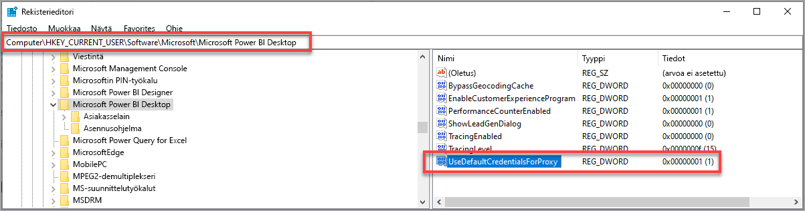

# Power BI Desktopin kirjautumisongelmien vianmääritys
Voit toisinaan kohdata virheitä, kun yrität kirjautua sisään **Power BI Desktopiin**. Kirjautumisongelmiin on kaksi yleistä syitä: **välityspalvelimen todennusvirheet** ja **ei-HTTPS-protokollan URL-osoitteen uudelleenohjausvirheet**. 

Ensimmäinen vaihe voit selvittää, mistä kirjautumisongelma johtuu. Ota yhteyttä järjestelmänvalvojaan ja anna diagnostiikkatiedot, jotta ongelman syy voidaan määrittää. Jäljittämällä kirjautumisongelmiin liittyvien ongelmien syyt järjestelmänvalvojat voivat määrittää, mitkä seuraavista virheistä koskevat sinua. 

Tutustutaan näihin ongelmiin vuorotellen. Tämän artikkelin lopussa on tietoa siitä, miten voit tallentaa vianmäärityksessä auttavan *jäljityksen* Power BI Desktopissa.

## Välityspalvelimen todennus vaaditaan -virhe

Seuraavassa kuvassa näkyy *Välityspalvelimen todennus vaaditaan* -virhe.

Seuraavat *Power BI Desktop* -jäljitystiedostojen poikkeukset koskevat tätä virhettä:

* *Microsoft.PowerBI.Client.Windows.Services.PowerBIWebException*
* *HttpStatusCode: ProxyAuthenticationRequired*

Tämän virheen todennäköisin syy on, että todennukseen käytettävä verkkosi välityspalvelin estää **Power BI Desktopin** lähettämät verkkopyynnöt. 

Jos verkkosi käyttää todennukseen välityspalvelinta, järjestelmänvalvojasi voi korjata tämän ongelman lisäämällä seuraavat toimialueet todennukseen käytettävän välityspalvelimen sallittujen luetteloon:

* app.powerbi.com
* api.powerbi.com
* toimialueet, jonka kuuluvat *. analysis.windows.net -nimitilaan

Jos asiakas kuuluu julkishallinnon pilvipalveluun, ongelma voidaan korjata lisäämällä seuraavat toimialueen todennukseen käytettävän välityspalvelimen sallittujen luetteloon:

* app.powerbigov.us
* api.powerbigov.us
* toimialueet, jotka kuuluvat *. analysis.usgovcloudapi.net -nimitilaan

## URL-uudelleenohjausta ei-HTTPS-protokollaan ei tueta -virhe

Nykyiset **Power BI Desktopin** versiot käyttävät Active Directory Authentication Library (ADAL) -kirjastoa, joka ei salli uudelleenohjausta suojaamattomiin (muihin kuin HTTPS-) URL-osoitteisiin. 

Seuraavat *Power BI Desktop* -jäljitystiedostojen poikkeukset koskevat tätä virhettä:

* *Microsoft.IdentityModel.Clients.ActiveDirectory.AdalServiceException: URL-uudelleenohjausta ei-HTTPS-protokollaan ei tueta verkkonäkymässä* 
* *ErrorCode: non_https_redirect_failed*

Jos saat *ErrorCode: non_https_redirect_failed* -virheilmoituksen, yksi tai useampi uudelleenohjaussivu tai uudelleenohjausketjun palveluntarjoaja ei ole suojattu HTTPS-päätepiste tai että yhden tai useamman uudelleenohjauksen varmenteen myöntäjä ei ole laitteen luotettujen pääkansioiden joukossa. Kaikkien sisäänkirjautumisen uudelleenohjausketjun palveluntarjoajien on käytettävä HTTPS-URL-osoitetta. Ota yhteyttä järjestelmänvalvojaan ja pyydä, että todennussivustoissa käytetään suojattuja URL-osoitteita. 

## Jäljityksen kerääminen Power BI Desktopissa

Voit kerätä jäljityksen **Power BI Desktopissa** seuraavasti:

1. Ota jäljitys käyttöön **Power BI Desktopissa** siirtymällä kohtaan **Tiedosto > Asetukset ja vaihtoehdot > Asetukset** ja valitse sitten **Diagnostiikka** vasemmanpuoleisen ruudun vaihtoehdoista. Valitse avautuvasta ruudusta **Ota jäljitys käyttöön** -kohdan vieressä oleva valintaruutu (ks. kuva). Sinua saatetaan pyytää käynnistämään **Power BI Desktop** uudelleen.
   
   

2. Toista sitten vaiheet, jotka aiheuttivat virhetilanteen. Kun näin tapahtuu, **Power BI Desktop** lisää tapahtumat jäljityslokiin, jota säilytetään paikallisessa tietokoneessa.

3. Siirry paikallisen tietokoneen jäljityskansioon. Voit etsiä kansion valitsemalla linkin **Diagnostiikka**-kohdasta, josta otit jäljityksen käyttöön. Kansio näkyy edellisessä kuvassa muodossa *Avaa kaatumisvedosten/jäljitysten kansio*. Kansio on tavallisesti seuraavassa sijainnissa paikallisessa tietokoneessa:

    `C:\Users/<user name>/AppData/Local/Microsoft/Power BI Desktop/Traces`

Kyseisessä kansiossa voi olla useita jäljitystiedostoja. Lähetä järjestelmänvalvojalle vain viimeisimmät tiedostot virheen tunnistamisen helpottamiseksi. 

## Järjestelmän oletusarvoisten tunnistetietojen käyttö välityspalvelimelle

Power BI Desktopin lähettämissä verkkopyynnöissä ei käytetä verkon välityspalvelimen tunnistetietoja. Power BI Desktop ei välttämättä pysty tekemään verkkopyyntöjä välityspalvelinta käyttävissä verkoissa. 

Maaliskuun 2020 Power BI Desktop -versiosta alkaen järjestelmän- tai verkonvalvojat voivat sallia verkon välityspalvelimen todennukselle oletusarvoisten järjestelmän tunnistetietojen käytön. Järjestelmänvalvojat voivat luoda **UseDefaultCredentialsForProxy**-nimisen rekisterimerkinnän ja määrittää arvoksi yksi (1), jotta oletusarvoisten järjestelmän tunnistetietojen käyttö voidaan mahdollistaa verkon välityspalvelimen todennukselle.

Rekisterimerkintä voidaan sijoittaa jompaankumpaan seuraavista sijainneista:

`[HKEY_LOCAL_MACHINE\SOFTWARE\WOW6432Node\Microsoft\Microsoft Power BI Desktop]`
`[HKEY_LOCAL_MACHINE\SOFTWARE\Microsoft\Microsoft Power BI Desktop]`

Rekisterimerkintää ei tarvitse olla molemmissa sijainneissa.

Kun rekisterimerkintä on luotu (uudelleenkäynnistys voi olla tarpeen), käytetään Internet Explorerissa määritettyjä välityspalvelinasetuksia, kun Power BI Desktop tekee verkkopyyntöjä. 

Kuten minkä tahansa välityspalvelin- tai tunnistetietoasetuksen muuttamisen yhteydessä, tämän rekisterimerkinnän luomisella on vaikutuksia tietoturvaan, joten järjestelmänvalvojien on varmistettava, että he ovat määrittäneet Internet Explorerin välityspalvelimet oikein ennen tämän ominaisuuden ottamista käyttöön.         

### Järjestelmän oletusarvoisten tunnistetietojen käyttämistä koskevat rajoitukset ja huomioitavat seikat

Järjestelmänvalvojien on otettava huomioon erinäiset vaikutukset tietoturvaan ennen tämän ominaisuuden käyttöönottoa. 

Seuraavia suosituksia tulee noudattaa aina, kun tämä ominaisuus otetaan käyttöön asiakkaille:

* Käytä välityspalvelimessa ainoastaan **Neuvottelu**-todennusmallia, jotta varmistetaan, että asiakas käyttää vain Active Directory -verkkoon yhdistettyjä välityspalvelimia. 
* Älä käytä **NTLM-varatoimintoa** tätä ominaisuutta käyttävien asiakkaiden kohdalla.
* Jos käyttäjät eivät ole välityspalvelinta käyttävässä verkossa, kun tämä ominaisuus otetaan käyttöön ja määritetään tässä osiossa olevien suositusten mukaisesti, yhteyden muodostamista välityspalvelimeen ei yritetä ja järjestelmän oletusarvoisia tunnistetietoja ei käytetä.

[Järjestelmän oletusarvoisten tunnistetietojen käyttö välityspalvelimelle](#using-default-system-credentials-for-web-proxy)

