# Opetusohjelma: Analysoi Facebook-tietoja Power BI Desktopin avulla

Tässä opetusohjelmassa opit tuomaan tietoja Facebookista ja käyttämään niitä Power BI Desktopissa. Muodostat yhteyden Power BI:n Facebook-sivulle, tuot sieltä tietoja, teet muunnoksia tuotuihin tietoihin ja käytät tietoja raportin visualisoinneissa.

> [!WARNING]
> Facebook-sovelluksen käyttöoikeuksienrajoitusten vuoksi tässä artikkelissa kuvatut kytkentätoiminnot eivät tällä hetkellä toimi oikein. Teemme yhteistyötä Facebookin kanssa, jotta voimme palauttaa tämän toiminnon käyttöön mahdollisimman pian.

## Yhteyden muodostaminen Facebook-sivulle

Tässä opetusohjelmassa käytetään tietoja [Microsoft Power BI:n Facebook-sivulta](https://www.facebook.com/microsoftbi). Et tarvitse erityisiä tunnistetietoja yhteyden muodostamiseen ja tietojen tuomiseen tältä sivulta henkilökohtaista Facebook-tiliä lukuun ottamatta.

1. Avaa Power BI Desktop ja valitse **Nouda tiedot** **Aloitus**-valintaruudusta tai valitse valintanauhan **Aloitus**-välilehdeltä **Nouda tiedot** ja sitten **Lisää**.
   
2. Valitse **Nouda tiedot** -valintaruudun **Online-palvelut**-ryhmästä **Facebook** ja valitse sitten **Yhdistä**.
   
   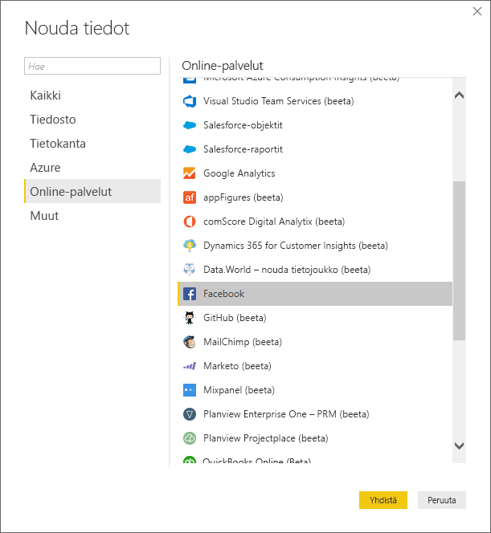
   
   Näyttöön tulee valintaruutu, jossa varoitetaan kolmannen osapuolen palvelun käyttämisen riskeistä.
   
   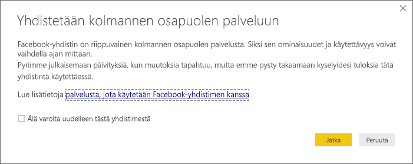
   
3. Valitse **Jatka**. 
   
4. Kirjoita **Facebook**-valintaruudussa sivun nimi **microsoftbi** **käyttäjänimeksi**, valitse **Julkaisut** avattavasta **Yhteys**-luettelosta ja valitse sitten **OK**.
   
   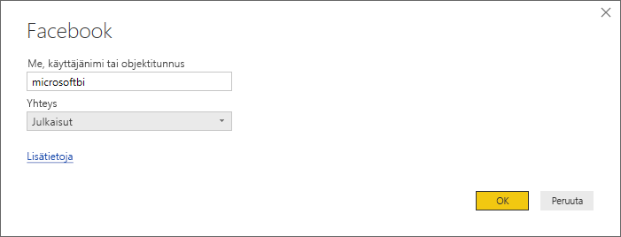
   
5. Tunnistetietoja pyydettäessä kirjaudu sisään Facebook-tilillesi ja salli Power BI:lle tilisi käyttäminen.
   
   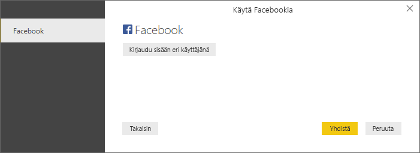

   Kun yhteys on muodostettu Power BI:n Facebook-sivulle, näet esikatselun sivun Julkaisut-tiedoista. 
   
   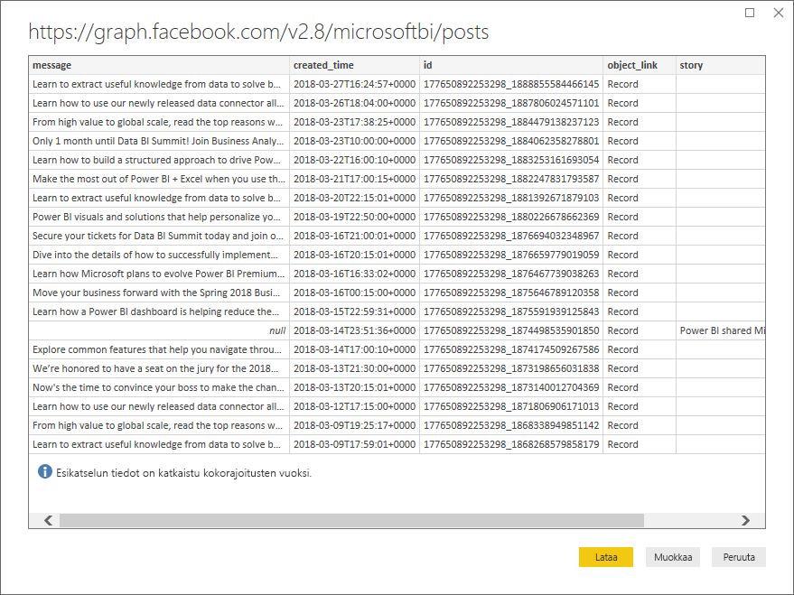
   
## Tuotujen tietojen muokkaaminen ja muuntaminen

Haluat esimerkiksi nähdä ja näyttää, mitkä julkaisut ovat saaneet eniten kommentteja ajan mittaan, mutta huomaat Julkaisut-tietojen esikatselusta, että **created_time**-tietoja on vaikea lukea ja ymmärtää, eikä kommenttitietoja ole. Muotoile ja siisti tiedot, jotta saat niistä kaiken irti. Voit tehdä sen muokkaamalla tietoja Power BI Desktopin Power Query -editorin avulla ennen niiden tuomista Power BI Desktopiin tai tuonnin jälkeen. 

### Päivämäärä/aika-sarakkeen jakaminen

Erota ensin **created_time**-sarakkeen päivämäärä- ja aika-arvot, jotta ne ovat helpommin luettavissa. 

1. Valitse Facebook-tietojen esikatselussa **Muokkaa**. 
   
   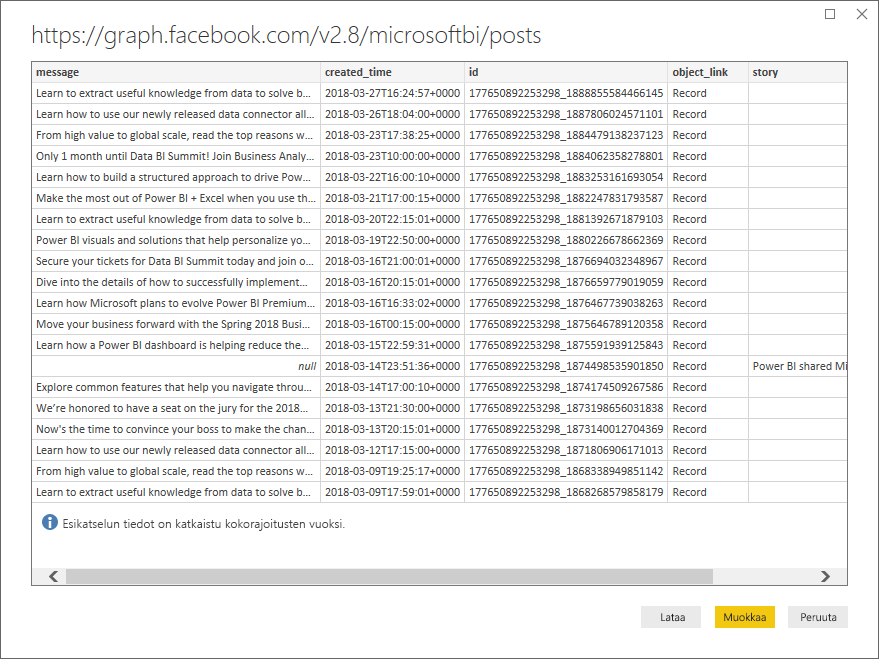
   
   Power BI Desktopin Power Query -editori avautuu uuteen ikkunaan ja näyttää tietojen esikatselun Power BI:n Facebook-sivulta. 
   
   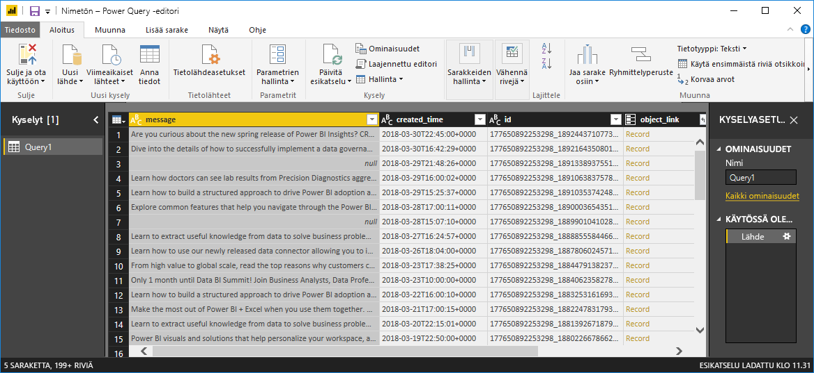
   
2. Valitse **created_time**-sarake. Huomaa, että se on **tekstitietotyyppi**, jonka merkiksi sarakeotsikossa on **ABC**-kuvake. Napsauta otsikkoa hiiren kakkospainikkeella ja valitse avattavasta luettelosta **Jaa sarake osiin** > **erottimen mukaan**. Vaihtoehtoisesti valitse **Jaa sarake osiin** > **erottimen mukaan** valintanauhan **Aloitus**-välilehden **Muunna**-ryhmässä.  
   
   
   
3. Valitse **Jaa sarake osiin erottimen mukaan** -valintaruudun avattavasta luettelosta **Mukautettu**, kirjoita **T** (merkki, joka on **created_time**-arvojen aikaosan alussa) syöttökenttään ja valitse sitten **OK**. 
   
   
   
   Sarake jakautuu kahteen sarakkeeseen, jotka sisältävät merkkijonot ennen *T*-erotinta ja sen jälkeen. Uusille sarakkeille annetaan nimet **created_time.1** ja **created_time.2**. Power BI on havainnut ja muuttanut automaattisesti ensimmäisen sarakkeen tietotyypiksi **Päivämäärä** ja toisen sarakkeen tietotyypiksi **Aika** ja muotoillut päivämäärä- ja aika-arvot helpommin luettaviksi.
   
4. Nimeä nämä kaksi saraketta uudelleen. Valitse **created_time.1**-sarake ja valitse **Nimeä uudelleen** **Mikä tahansa sarake** -ryhmästä valintanauhan **Muunna**-välilehdeltä. Tai kaksoisnapsauta sarakeotsikkoa ja kirjoita uuden sarakkeen nimi **created_date**. Toista **created_time.2**-sarakkeelle ja määritä sen nimeksi **created_time**.
   
   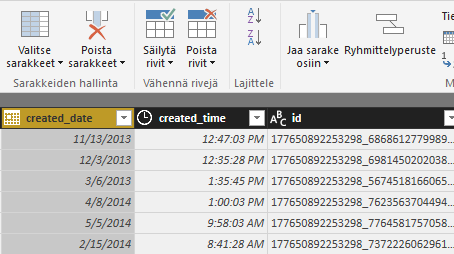
   
### Sisäkkäisen sarakkeen laajentaminen

Nyt kun päivämäärä- ja aikatiedot ovat sellaiset kuin haluat, voit näyttää kommenttitiedot laajentamalla sisäkkäisen sarakkeen. 

1. Valitse **object_link**-sarakkeen yläosassa oleva -kuvake ja avaa **Laajenna/koosta**-valintaruutu. Valitse **connections** ja sitten **OK**. 
   
   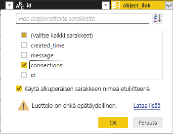
   
   Sarakeotsikoksi muuttuu **object_link.connections**.
2. Valitse -kuvake **object_link.connections**-sarakkeen yläreunasta, valitse **comments** ja sitten **OK**. Sarakeotsikoksi muuttuu **object_link.connections.comments**.
   
3. Valitse -kuvake **object_link.connections.comments**-sarakkeen yläreunasta ja valitse tällä kertaa valintaruudussa **Koosta** eikä **Laajenna**. Valitse **# Count of id** ja valitse sitten **OK**. 
   
   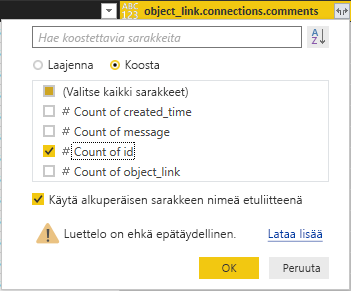
   
   Sarakkeessa näkyy nyt jokaisen viestin kommenttien määrä. 
   
4. Anna **Count of object_link.connections.comments.id** -sarakkeen uudeksi nimeksi **Kommenttien määrä**.
   
5. Valitse **Kommenttien määrä** -sarakeotsikon vieressä oleva alanuoli ja valitse **Lajittele laskevasti**, jolloin näet julkaisut järjestettyinä eniten kommentteja saaneista vähiten kommentteja saaneisiin. 
   
   
   
### Kyselyn vaiheiden tarkistaminen

Kun muotoilet ja muunnat tietoja Power Query -editorissa, kukin vaihe tallennetaan **Power Query -editori**-ikkunan oikealla puolella olevan **Kyselyasetukset**-ruudun **Käytössä olevat vaiheet** -alueelle. Voit palata takaisin **Käytössä olevat vaiheet** -kohtaan, jos haluat nähdä, mitä muutoksia olet tarkalleen tehnyt, ja muokata tai poistaa niitä tai järjestää ne tarvittaessa uudelleen. Ole varovainen muokatessasi näitä vaiheita, koska edeltävien vaiheiden muuttaminen voi rikkoa myöhemmät vaiheet. 

Kun olet ottanut tietojen muunnokset käyttöön, **Käytössä olevat vaiheet** -kohdan pitäisi näyttää seuraavalta:
   
   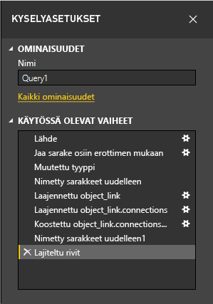
   
   >[!TIP]
   >**Käytössä olevien vaiheiden** pohjana ovat [Power Query M -kaavakielellä](https://docs.microsoft.com/powerquery-m/quick-tour-of-the-power-query-m-formula-language) kirjoitetut kaavat. Voit tarkastella ja muokata kaavoja valitsemalla **Laajennettu editori** valintanauhan **Aloitus**-välilehden **Kysely**-ryhmästä. 

### Muunnettujen tietojen tuominen

Kun olet tyytyväinen tietoihin, valitse **Sulje ja ota käyttöön** > **Sulje ja ota käyttöön** valintanauhan **Aloitus**-välilehdeltä, jolloin tiedot tuodaan Power BI Desktopiin. 
   
   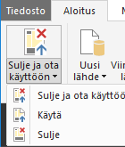
   
   Valintaruudussa näkyy tietojen Power BI Desktop -tietomalliin lataamisen edistyminen. 
   
   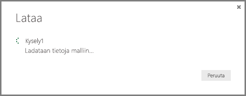
   
   Kun tiedot on ladattu, ne näkyvät **Raportti**-näkymässä uutena kyselynä **Kentät**-ruudussa.
   
   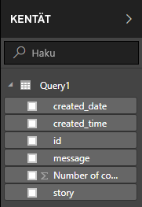
   
## Tietojen käyttäminen raportin visualisoinneissa 

Nyt kun olet tuonut tietoja Facebook-sivulta, voit nopeasti ja helposti saada merkityksellisiä tietoja tiedoistasi visualisointien avulla. Visualisoinnin luominen on helppoa; valitse kenttä tai vedä se **Kentät**-ruudusta raporttipohjaan.

### Palkkikaavion luominen

1. Valitse Power BI Desktopin **Raportti**-näkymässä **viesti** **Kentät**-ruudusta tai vedä se pohjaan. Pohjaan tulee taulukko, jossa näkyvät kaikki kansioviestit. 
   
   
   
2. Kun taulukko on valittuna, valitse myös **Kommenttien määrä** **Kentät**-ruudusta tai vedä se taulukkoon. 
   
3. Valitse **Pinottu palkkikaavio** -kuvake **Visualisoinnit**-ruudusta. Taulukko muuttuu palkkikaavioksi, joka näyttää julkaisukohtaisen kommenttimäärän. 
   
   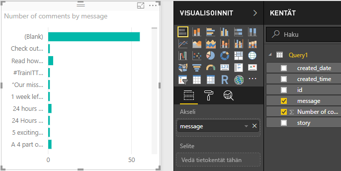
   
4. Valitse **Lisää vaihtoehtoja** (...) visualisoinnin viereistä ja lajittele taulukko sitten laskevaan järjestykseen kommenttien määrän mukaan valitsemalla **Lajitteluperuste** > **Kommenttien määrä**. 

   Huomaa, että useimmat kommentit liittyivät **(Tyhjä)** -arvoisiin viesteihin (nämä viestit ovat voineet olla tarinoita, linkkejä, videoita tai muuta kuin tekstisisältöä). 
   
5. Jos haluat suodattaa tyhjän rivin pois, valitse **viesti on (Kaikki)** **Suodattimet**-ruudusta, valitse kohta **Valitse kaikki** ja sitten  **(Tyhjä)** , jolloin sen valinta poistuu. 

   **Suodattimet**-ruudun merkinnäksi muuttuu **viesti ei ole (Tyhjä)** , ja **(Tyhjä)** rivi katoaa kaavion visualisoinnista.
   
   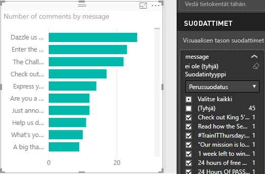
   
### Kaavion muotoileminen

Visualisointi muuttuu kiinnostavammaksi, mutta et näe paljon julkaisun tekstiä kaaviossa. Jos haluat näyttää enemmän julkaisun tekstiä:

1. Muuta kaavion koko mahdollisimman suureksi kaavion visualisoinnissa olevien kahvojen avulla. 
   
2. Kun kaavio on valittuna, valitse **Muotoilu**-kuvake (maalitela) **Visualisoinnit**-ruudusta.
   
3. Valitse **Y-akselin** vieressä oleva alanuoli ja vedä **Enimmäiskoko**-liukusäädin kokonaan oikealle (**50 %** ). 
4. Pienennä **Tekstikoko** arvoon **10 pt**, jotta tekstiä mahtuu enemmän.
   
   
   
   Kaaviossa näkyy nyt enemmän julkaisun sisältöä. 
   
   
   
Kaavion x-akseli (kommenttien määrä) ei näytä tarkkoja arvoja, ja se näyttää katoavan kaavion alareunaan. Käytetään arvopisteiden otsikoita sen sijaan: 

1. Valitse **Muotoilu**-kuvake ja valitse sitten **X-akselin** vieressä oleva liukusäädin ja siirrä se **Ei käytössä** -asentoon. 
   
2. Siirrä **Arvopisteiden otsikot** -liukusäädin asentoon **Käytössä**. 

   Kaaviossa näkyy nyt kunkin julkaisun tarkka kommenttimäärä.
   
   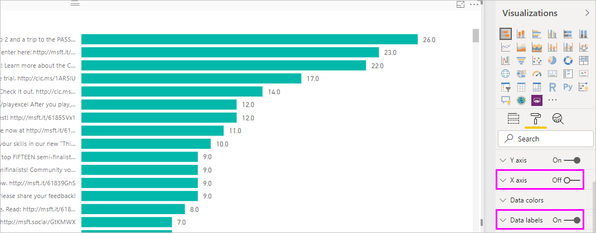
   
### Tietotyypin muokkaaminen

Näyttää paremmalta, mutta kaikissa arvopisteiden otsikoissa näkyy desimaalin tarkkuus **0,0**, joka on häiritsevä ja harhaanjohtava, koska **Julkaisujen määrän** täytyy olla kokonaisluku. Voit korjata sen muuttamalla **Julkaisujen määrä** -sarakkeen tietotyypiksi **Kokonaisluku**:

1. Napsauta hiiren kakkospainikkeella **Kysely1**-kohtaa **Kentät**-ruudussa tai osoita sitä ja valitse **Lisää asetuksia** (...). 

2. Valitse pikavalikosta **Muokkaa kyselyä**. Tai valitse **Muokkaa kyselyitä** > **Muokkaa kyselyitä** **Ulkoiset tiedot** -ryhmästä **Koti** -valintanauhasta. 
   
3. Valitse **Power Query -editori** -ikkunassa **Kommenttien määrä** -sarake ja muuta tietotyyppi jollakin seuraavista tavoista: 
   - Valitse **Kommenttien määrä** -sarakeotsikon vieressä oleva **1.2**-kuvake ja valitse **Kokonaisluku** avattavasta luettelosta
   - Napsauta sarakeotsikkoa hiiren kakkospainikkeella ja valitse sitten **Muuta tyyppi** > **Kokonaisluku**.
   - Valitse **Tietotyyppi: Desimaaliluku** **Aloitus**-välilehden **Muunna**-ryhmästä, tai valitse **Muunna**-välilehden **Mikä tahansa sarake** -ryhmä ja valitse sieltä **Kokonaisluku**.
   
   Sarakeotsikon kuvakkeeksi muuttuu **123** osoittamaan **Kokonaisluku**-tietotyyppiä.
   
   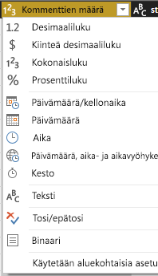
   
3. Ota muutokset käyttöön valitsemalla **Tiedosto** > **Sulje ja ota käyttöön** tai **Tiedosto** > **Ota käyttöön**, jolloin **Power Query -editori** -ikkuna pysyy auki. 

   Kun muutokset ladataan, kaavion arvopisteiden otsikot muuttuvat kokonaisluvuiksi.
   
   
   
### Päivämääräosittajan luominen

Haluat esimerkiksi visualisoida julkaisujen saamien kommenttien määrän ajan kuluessa. Voit luoda osittajavisualisoinnin, jossa kaavion tiedot on suodatettu eri aikaväleihin. 

1. Valitse pohjan tyhjä alue ja valitse sitten **Osittaja**-kuvake **Visualisoinnit**-ruudusta. 

   Näyttöön avautuu tyhjä osittajavisualisointi.
   
   
   
2. Valitse **created_date**-kenttä **Kentät**-ruudusta tai vedä se uuteen osittajaan. 

   Osittaja muuttuu päivämääräalueen liukusäätimeksi kentän **Päivämäärä**-tietotyypin perusteella.
   
   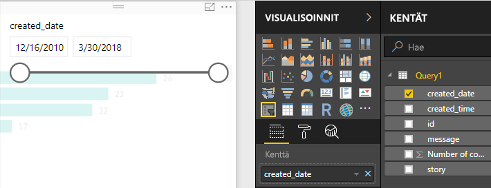
   
3. Valitse eri päivämääräalueet siirtämällä liukusäätimen kahvoja ja huomaa, miten kaavion tiedot suodatetaan vastaavasti. Voit myös valita osittajan päivämääräkentät ja kirjoittaa tietyt päivämäärät tai valita ne kalenteri-ponnahdusikkunasta.
    
   
   
### Visualisointien muotoilu

Anna kaaviolle paremmin kuvaava ja kiinnostava otsikko: 

1. Kun kaavio on valittuna, valitse **Muotoilu**-kuvake **Visualisoinnit**-ruudussa ja laajenna se valitsemalla **Otsikko**-kohdan vieressä oleva alanuoli.

2. Muuta **Otsikkoteksti**-kohtaan **Julkaisukohtaiset kommentit**. 

3. Valitse **Fontin väri** -kohdan alanuolipainike ja valitse sitten vihreä väri vastaamaan visualisoinnin vihreitä palkkeja.

4. Suurenna **Tekstin koko** -arvoksi **10 pt** ja muuta **Fonttiperheeksi** **Segoe (lihavoitu)** .

5. Voit muuttaa visualisointiesi ulkonäköä kokeilemalla muita muotoiluvaihtoehtoja ja -asetuksia. 

   

## Uusien visualisointien luominen

Kuten näet, on helppoa mukauttaa raporttiesi visualisointeja ja esittää tiedot haluamallasi tavalla. Kokeile esimerkiksi luoda tuotujen Facebook-tietojen avulla tämä viivakaavio, joka näyttää kommenttimäärän ajan kuluessa.

Power BI Desktop tarjoaa saumattoman kokemuksen alusta loppuun. Sen avulla voit hakea tietoja laajasta tietolähteiden joukosta ja muotoilla ne analyysitarpeidesi mukaan ja visualisoida tiedot monipuolisilla ja vuorovaikutteisilla tavoilla. Kun raportti on valmis, voit [ladata sen Power BI -palveluun](../create-reports/desktop-upload-desktop-files.md) ja luoda siihen perustuvia koontinäyttöjä, joita voit jakaa muiden Power BI -käyttäjien kanssa.

## Seuraavat vaiheet
* [Lue muita Power BI Desktop -opetusohjelmia](https://go.microsoft.com/fwlink/?LinkID=521937)
* [Katso Power BI Desktop -videoita](https://go.microsoft.com/fwlink/?LinkID=519322)
* [Käy Power BI -keskustelupalstalla](https://go.microsoft.com/fwlink/?LinkID=519326)
* [Lue Power BI -blogia](https://go.microsoft.com/fwlink/?LinkID=519327)
