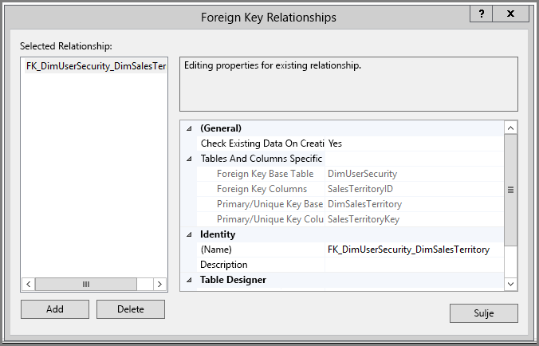
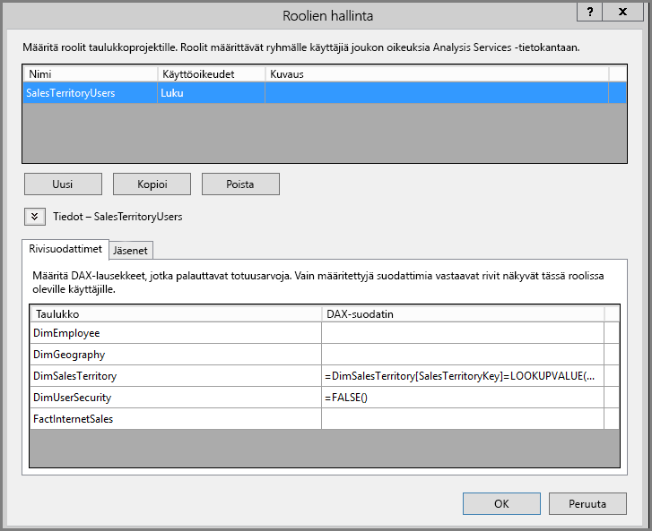
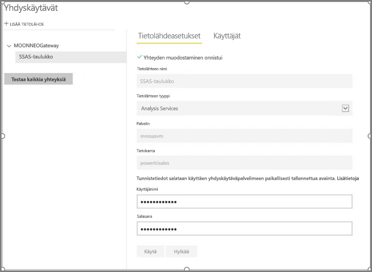
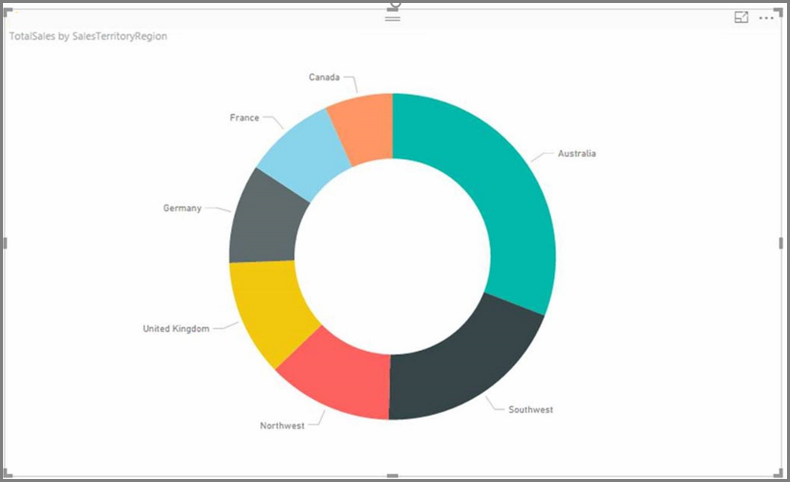

# <a name="implement-row-level-security-in-an-analysis-services-tabular-model"></a>Rivitason suojauksen käyttöönotto Analysis Servicen taulukkomallissa

Tässä opetusohjelmassa näytetään esimerkkitietojoukon avulla, miten voit ottaa käyttöön [**rivitason suojauksen**](../admin/service-admin-rls.md) *Analysis Services -taulukkomallissa* ja käyttää sitä Power BI -raportissa.

* Luo uusi suojaustaulukko [AdventureworksDW2012-tietokannassa](https://github.com/Microsoft/sql-server-samples/releases/tag/adventureworks)
* Kokoa taulukkomalli tarvittavilla fakta- ja dimensiotaulukoilla
* Määritä käyttäjäroolit ja oikeudet
* Ota käyttöön *Analysis Services -taulukkoesiintymän* malli
* Laadi Power BI Desktopin -raportti, jossa näytetään raporttia käsittelevälle käyttäjälle räätälöidyt tiedot
* Ota raportti käyttöön *Power BI -palvelussa*
* Luo raporttiin perustuva uusi koontinäyttö
* jaa koontinäyttö työtovereille

Tämä opetusohjelma edellyttää [AdventureworksDW2012-tietokantaa](https://github.com/Microsoft/sql-server-samples/releases/tag/adventureworks).

## <a name="task-1-create-the-user-security-table-and-define-data-relationship"></a>Tehtävä 1: Käyttäjän tietoturvataulukon luominen ja tietojen yhteyden määrittäminen

Lukuiset artikkelit opastavat rivitason dynaamisen suojauksen määrittämisessä *taulukkomuotoiseen SQL Server Analysis Services (SSAS)* -malliin. Tässä esimerkissä käytämme [Dynaamisen suojauksen toteuttaminen rivisuodattimien avulla](/analysis-services/tutorial-tabular-1200/supplemental-lesson-implement-dynamic-security-by-using-row-filters) -artikkelin ohjeita.

Nämä ohjeet edellyttävät AdventureworksDW2012-relaatiotietokannan käyttöä.

1. Luo `DimUserSecurity`-taulukko AdventureworksDW2012-tietokannassa alla esitetyllä tavalla. Tässä esimerkissä taulukon luomiseen käytetään [SQL Server Management Studiota (SSMS)](/sql/ssms/download-sql-server-management-studio-ssms).

   

1. Kun olet luonut ja tallentanut taulukon, sinun on luotava yhteys `DimUserSecurity`-taulukon `SalesTerritoryID`-sarakkeen ja `DimSalesTerritory`-taulukon `SalesTerritoryKey`-sarakkeen välille alla esitetyllä tavalla.

   Napsauta SSMS:ssä hiiren kakkospainikkeella **DimUserSecurity** ja valitse **Rakenne**. Valitse sitten **Taulukon suunnittelu** > **Suhteet...** . Kun olet valmis, tallenna taulukko.

   

1. Lisää käyttäjiä taulukkoon. Napsauta hiiren kakkospainikkeella **DimUserSecurity** ja valitse **Muokkaa ylintä 200 riviä**. Kun olet lisännyt käyttäjiä, `DimUserSecurity`-taulukon tulee näyttää samalta kuin seuraavassa esimerkissä:

   

   Näet kyseiset käyttäjät myös myöhemmissä tehtävissä.

1. Tee seuraavaksi *sisäliitos* `DimSalesTerritory`-taulukon kanssa. Taulukon avulla näet käyttäjän alueeseen liittyvät tiedot. Tämä SQL-koodi tekee sisäliitoksen. Kuvasta ilmenee, miltä taulukko tulee näyttämään.

    ```sql
    select b.SalesTerritoryCountry, b.SalesTerritoryRegion, a.EmployeeID, a.FirstName, a.LastName, a.UserName from [dbo].[DimUserSecurity] as a join [dbo].[DimSalesTerritory] as b on a.[SalesTerritoryID] = b.[SalesTerritoryKey]
    ```

   Vaiheessa 2 luodun suhteen ansiosta liitetty taulukko näyttää kunkin myyntialueen vastuuhenkilön. Voit esimerkiksi nähdä, että *Rita Santos* on vastuussa *Australian* myyntialueesta.

## <a name="task-2-create-the-tabular-model-with-facts-and-dimension-tables"></a>Tehtävä 2: Kokoa taulukkomalli fakta- ja dimensiotaulukoilla

Kun relaatiotietovarasto on paikallaan, sinun on määritettävä taulukkomalli. Voit luoda mallin [SQL Server Data Tools](/sql/ssdt/sql-server-data-tools) (SSDT) -työkaluilla. Katso lisätiedot [Uuden taulukkomalliprojektin luominen](/sql/analysis-services/lesson-1-create-a-new-tabular-model-project) -artikkelista.

1. Tuo kaikki tarvittavat taulukot malliin alla kuvatulla tavalla.

    

1. Kun olet tuonut tarvittavat taulukot, sinun on määritettävä rooli nimeltä *SalesTerritoryUsers*, jolla on Luku-käyttöoikeudet. Valitse **Malli**-valikko SQL Server Data Tools -työkaluissa ja valitse sitten **Roolit**. Valitse **Roolien hallinta** -kohdasta **Uusi**.

1. Lisää **Roolien hallinta** -kohdan **Jäsenet**-kohtaan käyttäjät, jotka määritit `DimUserSecurity`-taulukossa [tehtävässä 1](#task-1-create-the-user-security-table-and-define-data-relationship).

    

1. Lisää seuraavaksi asianmukaiset funktiot sekä `DimSalesTerritory`- että `DimUserSecurity`-taulukoille alla olevassa **Rivisuodattimet**-välilehdessä näytetyllä tavalla.

    

1. `LOOKUPVALUE`-funktio palauttaa arvot sarakkeelle, jossa Windows-käyttäjänimi on sama kuin `USERNAME`-funktion palauttama käyttäjänimi. Voit sitten rajoittaa kyselyt alueisiin, joissa `LOOKUPVALUE`-funktion palauttamat arvot vastaavat saman tai liittyvän taulukon arvoja. Kirjoita seuraava kaava **DAX-suodattimen** sarakkeeseen:

    ```dax
        =DimSalesTerritory[SalesTerritoryKey]=LOOKUPVALUE(DimUserSecurity[SalesTerritoryID], DimUserSecurity[UserName], USERNAME(), DimUserSecurity[SalesTerritoryID], DimSalesTerritory[SalesTerritoryKey])
    ```

    Tässä kaavassa `LOOKUPVALUE`-funktio palauttaa kaikki arvot `DimUserSecurity[SalesTerritoryID]`-sarakkeelle, jossa `DimUserSecurity[UserName]`-käyttäjänimi on sama kuin nykyinen kirjautuneena oleva Windows-käyttäjänimi, ja `DimUserSecurity[SalesTerritoryID]`-tunnus on sama kuin `DimSalesTerritory[SalesTerritoryKey]`-avain.

    > [!IMPORTANT]
    > DAX-funktiota [USERELATIONSHIP](/dax/userelationship-function-dax) ei tueta rivitason suojausta käytettäessä.

   Myynnin `SalesTerritoryKey`-arvojoukon `LOOKUPVALUE`-funktion palautuksia käytetään sitten rajoittamaan `DimSalesTerritory`-taulukossa näkyviä rivejä. Vain sellaiset rivit näytetään, joissa `SalesTerritoryKey`-arvo sisältyy `LOOKUPVALUE`-funktion palauttamiin tunnuksiin.

1. Lisää `DimUserSecurity`-taulukkoon **DAX-suodattimen** sarakkeeseen seuraava kaava:

    ```dax
        =FALSE()
    ```

    Tämä kaava määrittää, että kaikkien sarakkeiden ratkaisu on `false`. Se tarkoittaa, että `DimUserSecurity`-taulukon sarakkeista ei voi tehdä hakuja.

Seuraavaksi malli käsitellään ja otetaan käyttöön. Katso lisätietoja kohdasta [Käyttöönotto](/sql/analysis-services/lesson-13-deploy).

## <a name="task-3-add-data-sources-within-your-on-premises-data-gateway"></a>Tehtävä 3: Tietolähteiden lisääminen paikallisessa tietoyhdyskäytävässä

Kun taulukkomuotoinen malli on otettu käyttöön ja valmis yleiseen käyttöön, sinun on lisättävä tietolähdeyhteys paikalliseen Analysis Services -taulukkopalvelimeen.

1. Jotta voit antaa Power BI -palvelulle paikallisen analysointipalvelun käyttöoikeudet, [paikallisen tietoyhdyskäytävän](service-gateway-onprem.md) on oltava asennettuna ja määritettynä ympäristöösi.

1. Kun yhdyskäytävä on määritetty oikein, sinun on luotava tietolähdeyhteys *Analysis Services* -palvelun taulukkomuotoisiin esiintymiin. Katso lisätietoja artikkelista [Tietolähteen hallinta – Analysis Services](service-gateway-enterprise-manage-ssas.md).

   

Kun tämä toimenpide on valmis, yhdyskäytävä on määritetty ja valmis käsittelemään paikallista Analysis Services -tietolähdettä.

## <a name="task-4-create-report-based-on-analysis-services-tabular-model-using-power-bi-desktop"></a>Tehtävä 4: Analyysipalveluiden taulukkomalliin perustuvan raportin luominen Power BI Desktopilla

1. Käynnistä Power BI Desktop ja valitse **Nouda tiedot** > **Tietokanta**.

1. Valitse tietolähteiden luettelosta **SQL Server Analysis Services -tietokanta** ja valitse **Yhdistä**.

   

1. Täytä taulukkomuotoisen Analysis Services -esiintymän tiedot ja valitse **Yhdistä reaaliajassa**. Valitse **OK**.
  
   

   Dynaaminen suojaus toimii Power BI:ssä vain reaaliaikaisella yhteydellä.

1. Käyttöön otettu malli on nyt Analysis Services -esiintymässä. Valitse asianmukainen malli ja sitten **OK**.

   Power BI Desktop näyttää nyt kaikki käytettävissä olevat kentät **Kentät**-ruudun oikeanpuoleisessa pohjassa.

1. Valitse **Kentät**-ruudussa olevasta **FactInternetSales**-taulukosta **SalesAmount**-mittari ja **SalesTerritory**-taulukosta **SalesTerritoryRegion**-dimensio.

1. Emme tällä kertaa lisää enempää sarakkeita, jotta raportista ei tule liian monimutkainen. Tiedot esitetään kuvaavammin, kun visualisointi muutetaan **rengaskaavioksi**.

   

1. Kun raportti on valmis, voit julkaista sen suoraan Power BI -portaaliin. Valitse Power BI Desktopin **Aloitus**-valintanauhasta **Julkaise**.

## <a name="task-5-create-and-share-a-dashboard"></a>Tehtävä 5: Koontinäytön luominen ja jakaminen

Olet luonut raportin ja julkaissut sen **Power BI** -palveluun. Nyt voit käyttää edellisissä vaiheissa luotua esimerkkiä mallin suojaustilanteen havainnollistamiseen.

*Myyntipäällikön* roolinsa ansiosta käyttäjä Grace voi nähdä kaikkien eri myyntialueiden tiedot. Grace luo tämän raportin ja julkaisee sen Power BI -palveluun. Tämä raportti luotiin edellisissä tehtävissä.

Kun Grace julkaisee raportin, hän luo seuraavaksi Power BI -palveluun koontinäytön, jonka nimi on tämän raportin perusteella *TabularDynamicSec*. Huomaa, että seuraavassa kuvassa Grace voi nähdä kaikkien myyntialueiden tiedot.

   

Nyt Grace jakaa koontinäytön työtoverilleen Ritalle, joka vastaa Australian alueen myynnistä.

   

Kun Rita kirjautuu sisään Power BI -palveluun ja tarkastelee Gracen luomaa jaettua koontinäyttöä, vain Australian alueen myynnin pitäisi olla näkyvissä.

Onnittelut! Power BI-palvelussa näytetään paikallisessa Analysis Services -taulukkomallissa määritetty dynaaminen rivitason suojaus. Power BI käyttää `EffectiveUserName`-ominaisuutta lähettäessään senhetkisen Power BI -käyttäjän kirjautumistiedot paikalliselle tietolähteelle kyselyiden suorittamiseksi.

## <a name="task-6-understand-what-happens-behind-the-scenes"></a>Tehtävä 6: Taustalla tapahtuvien toimintojen ymmärtäminen

Tässä tehtävässä oletetaan, että [SQL Server Profiler](/sql/tools/sql-server-profiler/sql-server-profiler) on sinulle tuttu, koska sinun on tallennettava SQL Server Profiler -jäljitys paikallisesta, taulukkomuotoisesta SSAS -esiintymästä.

Istunto käynnistetään heti, kun käyttäjä Rita käyttää koontinäyttöä Power BI -palvelussa. Huomaat, että **salesterritoryusers**-rooli astuu heti voimaan. Käytettävä käyttäjänimi on **<EffectiveUserName>rita@contoso.com</EffectiveUserName>**

       <PropertyList><Catalog>DefinedSalesTabular</Catalog><Timeout>600</Timeout><Content>SchemaData</Content><Format>Tabular</Format><AxisFormat>TupleFormat</AxisFormat><BeginRange>-1</BeginRange><EndRange>-1</EndRange><ShowHiddenCubes>false</ShowHiddenCubes><VisualMode>0</VisualMode><DbpropMsmdFlattened2>true</DbpropMsmdFlattened2><SspropInitAppName>PowerBI</SspropInitAppName><SecuredCellValue>0</SecuredCellValue><ImpactAnalysis>false</ImpactAnalysis><SQLQueryMode>Calculated</SQLQueryMode><ClientProcessID>6408</ClientProcessID><Cube>Model</Cube><ReturnCellProperties>true</ReturnCellProperties><CommitTimeout>0</CommitTimeout><ForceCommitTimeout>0</ForceCommitTimeout><ExecutionMode>Execute</ExecutionMode><RealTimeOlap>false</RealTimeOlap><MdxMissingMemberMode>Default</MdxMissingMemberMode><DisablePrefetchFacts>false</DisablePrefetchFacts><UpdateIsolationLevel>2</UpdateIsolationLevel><DbpropMsmdOptimizeResponse>0</DbpropMsmdOptimizeResponse><ResponseEncoding>Default</ResponseEncoding><DirectQueryMode>Default</DirectQueryMode><DbpropMsmdActivityID>4ea2a372-dd2f-4edd-a8ca-1b909b4165b5</DbpropMsmdActivityID><DbpropMsmdRequestID>2313cf77-b881-015d-e6da-eda9846d42db</DbpropMsmdRequestID><LocaleIdentifier>1033</LocaleIdentifier><EffectiveUserName>rita@contoso.com</EffectiveUserName></PropertyList>

Analysis Services muuntaa pyynnön käytettävän käyttäjänimen pyynnön perusteella nykyisiksi `contoso\rita`-tunnistetiedoiksi paikallisen Active Directory -hakemiston kyselyn jälkeen. Kun Analysis Services saa tunnistetiedot, Analysis Services palauttaa tiedot, joita käyttäjällä on oikeus käyttää.

Jos koontinäytössä tapahtuu muuta toimintaa, Analysis Services -taulukkomalliin palautettava erityinen kysely näkyy SQL Profilerissa DAX-kyselynä. Jos esimerkiksi Rita siirtyy koontinäytöstä pohjana olevaan raporttiin, tapahtuu seuraava kysely.

   

Alla näet myös DAX-kyselyn, joka suoritetaan raportin tietojen täyttämiseksi.
   
   ```dax
   EVALUATE
     ROW(
       "SumEmployeeKey", CALCULATE(SUM(Employee[EmployeeKey]))
     )
   
   <PropertyList xmlns="urn:schemas-microsoft-com:xml-analysis">``
             <Catalog>DefinedSalesTabular</Catalog>
             <Cube>Model</Cube>
             <SspropInitAppName>PowerBI</SspropInitAppName>
             <EffectiveUserName>rita@contoso.com</EffectiveUserName>
             <LocaleIdentifier>1033</LocaleIdentifier>
             <ClientProcessID>6408</ClientProcessID>
             <Format>Tabular</Format>
             <Content>SchemaData</Content>
             <Timeout>600</Timeout>
             <DbpropMsmdRequestID>8510d758-f07b-a025-8fb3-a0540189ff79</DbpropMsmdRequestID>
             <DbPropMsmdActivityID>f2dbe8a3-ef51-4d70-a879-5f02a502b2c3</DbPropMsmdActivityID>
             <ReturnCellProperties>true</ReturnCellProperties>
             <DbpropMsmdFlattened2>true</DbpropMsmdFlattened2>
             <DbpropMsmdActivityID>f2dbe8a3-ef51-4d70-a879-5f02a502b2c3</DbpropMsmdActivityID>
           </PropertyList>
   ```

## <a name="considerations"></a>Huomioitavaa

* Paikallinen rivitason suojaus toimii Power BI:ssä vain reaaliaikaisella yhteydellä.

* Malliin käsittelyn jälkeen tehdyt muutokset ovat heti käyttäjien, jotka käsittelevät raporttia reaaliaikaisella yhteydellä, käytettävissä Power BI -palvelussa.
