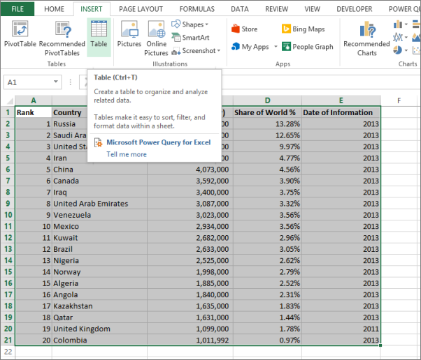

# Virhe: Excel-työkirjasta ei löydy mitään tietoja

>[!NOTE]  
>Tämä artikkeli koskee Excel 2007:ää ja uudempia versioita.

Kun tuot Excel-työkirjan Power BI:hin, saatat nähdä seuraavan virheilmoituksen:

*Virhe: Taulukoksi muotoiltuja tietoja ei löytynyt. Jos haluat tuoda Excelistä Power BI -palveluun, sinun on muotoiltava tiedot taulukkona. Valitse taulukossa kaikki haluamasi tiedot ja paina Ctrl+T-näppäinyhdistelmää.*

## Nopea ratkaisu
1. Muokkaa työkirjaa Excelissä.
2. Valitse tiedot sisältävä solualue. Ensimmäisen rivin tulee sisältää sarakeotsikot (sarakkeiden nimet).
3. Luo taulukko painamalla näppäinyhdistelmää **Ctrl + T**.
4. Tallenna työkirja.
5. Palaa Power BI:hin ja tuo työkirja uudelleen. Jos käytössäsi on Excel 2016 ja olet tallentanut työkirjan OneDrive for Businessiin, valitse Excelissä Tiedosto > Julkaise.

## Tiedot
### Syy
Voit luoda Excelissä solualueesta **taulukon**, mikä helpottaa tietojen lajittelemista, suodattamista ja muotoilemista.

Kun tuot Excel-työkirjan, Power BI etsii taulukot ja tuo ne tietojoukkona. Jos se ei löydä taulukoita, näkyviin tulee tämä virhesanoma.

### Ratkaisu
1. Avaa työkirja Excelissä. 
    >[!NOTE]
    >Tässä olevat kuvat ovat Excel 2013:sta. Jos käytössäsi on jokin muu versio, asiat saattaa näyttää hieman erilaisilta, mutta vaiheet ovat samat.
    
    
2. Valitse tiedot sisältävä solualue. Ensimmäisen rivin tulee sisältää sarakeotsikot (sarakkeiden nimet):
   
    
3. Valitse valintanauhan **LISÄÄ**-välilehdessä **Taulukko**. (Tai paina näppäinyhdistelmää **Ctrl + T**.)
   
    
4. Näet seuraavan valintaikkunan. Varmista, että **Taulukossa on otsikot** on valittuna ja valitse sitten **OK**:
   
    
5. Tietosi on nyt muotoiltu taulukoksi:
   
    
6. Tallenna työkirja.
7. Palaa Power BI:hin. Valitse siirtymisruudun alareunassa Nouda tiedot.
   
    
8. Valitse **Tiedostot**-ruudusta **Nouda**.
   
    
9. Tuo Excel-työkirjasi uudelleen. Tällä kertaa tuonnin pitäisi löytää taulukko ja onnistua.
   
    Jos tuonti ei edelleenkään onnistu, ilmoita asiasta valitsemalla **Yhteisö **Ohje-valikossa:
   
    
