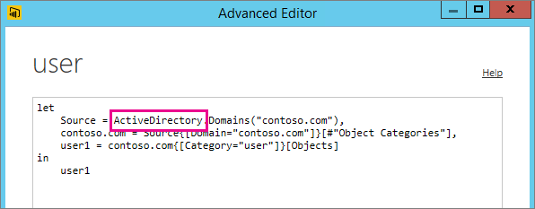

# Tukemattoman tietolähteen vianmääritys päivitystä varten
Näyttöön saattaa tulla virhe, kun yrität määrittää tietojoukkoa ajoitetulle päivitykselle.

        You cannot schedule refresh for this dataset because it gets data from sources that currently don’t support refresh.

Näin tapahtuu, jos käyttämäsi tietolähdettä Power BI Desktopin sisällä ei tue päivityksissä. Sinun on löydettävä tietolähde, jota käytät ja vertailtava sitä tuettujen tietolähteiden luetteloon kohdassa [Power BI -tietojen päivittäminen](refresh-data.md). 

## Tietolähteen löytäminen
Jos et ole varma, mitä tietolähdettä käytettiin, löydät sen seuraavien vaiheiden avulla Power BI Desktop sisällä.  

1. Varmista Power BI Desktopissa, että olet **Raportti** -ruudussa.  
   
2. Valitse **Muokkaa kyselyjä** valintanauhasta.  
   
3. Valitse **Laajennettu editori**.  
   
4. Kirjoita muistiin luettelossa annettu lähteen palvelu.  Tässä esimerkissä palvelu on ActiveDirectory.  
   
5. Vertaa palvelua luetteloon tuetuista tietolähteistä, joka löytyy aiheesta [Power BI- tietolähteet](power-bi-data-sources.md).

> [!NOTE]
> Jos haluat päivittää dynaamisiin tietolähteisiin liittyviä ongelmia, mukaan lukien käsin tehtyjä kyselyjä sisältävät tietolähteet, katso [päivitys ja dynaamiset tietolähteet](refresh-data.md#refresh-and-dynamic-data-sources).

## Seuraavat vaiheet
[Tietojen päivittäminen](refresh-data.md)  
[Power BI -yhdyskäytävä – Personal](service-gateway-personal-mode.md)  
[On-premises data gateway (Paikallinen tietoyhdyskäytävä)](service-gateway-onprem.md)  
[Paikallisen tietoyhdyskäytävän vianmääritys](service-gateway-onprem-tshoot.md)  
[Power BI -yhdyskäytävän vianmääritys – Personal](service-admin-troubleshooting-power-bi-personal-gateway.md)  

Onko sinulla kysyttävää? [Voit esittää kysymyksiä Power BI -yhteisössä](https://community.powerbi.com/)
