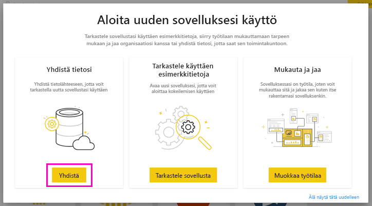
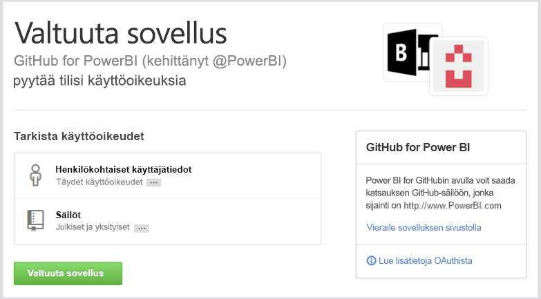
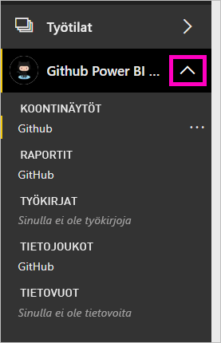
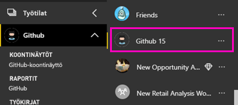
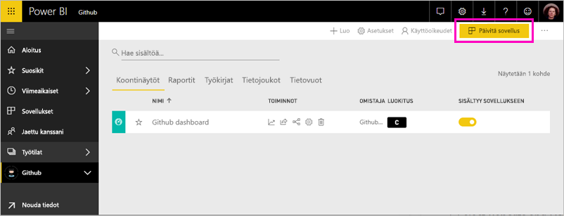
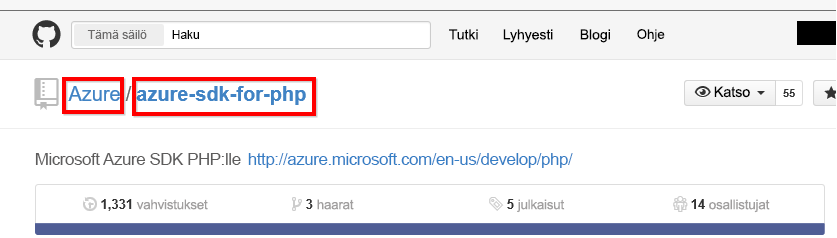

# Yhteyden muodostaminen GitHubin Power BI:n välillä
Tässä artikkelissa kerrotaan tietojen hakemisesta GitHub-tililtäsi Power BI -mallisovelluksella. Malli sovellus luo työtilan, jonka koontinäytön, raporttien ja tietojoukon avulla voit tutkia GitHub-tietojasi. Power BI:n GitHub-sovelluksen avulla saat tietoa GitHub-säiliöstä, osallistumistiedoista, ongelmista, noutopyynnöistä sekä aktiivisista käyttäjistä.

Kun olet asentanut mallisovelluksen, voit muuttaa koontinäyttöä ja raporttia. Sen jälkeen voit jakaa sen sovelluksena työtovereille organisaatiossasi.

Muodosta yhteys [GitHub-mallisovellukseen](https://app.powerbi.com/groups/me/getapps/services/pbi-contentpacks.pbiapps-github) tai lue lisää Power Bi:n [GitHub-integroinnista](https://powerbi.microsoft.com/integrations/github).

Voit myös kokeilla [GitHub-opetusohjelmaa](service-tutorial-connect-to-github.md). Se asentaa Power BI -dokumentaation aidot GitHub-tiedot julkisesta säilöstä.

>[!NOTE]
>Tämä mallisovellus vaatii GitHub-tilin, jotta sinulla on käyttöoikeus säilöön. Lisätietoja vaatimuksista on alla.
>
>Tämä mallisovellus ei tue GitHub Enterprise -sovellusta. 

## Yhteyden muodostaminen
[!INCLUDE [powerbi-service-apps-get-more-apps](../includes/powerbi-service-apps-get-more-apps.md)]
   
3. Valitse **GitHub** \> **Hanki se nyt**.
4. Valitse **Asennetaanko tämä Power BI -sovellus?** -kohdassa **Asenna**.
4. Valitse **Sovellukset**-ruudussa **GitHub**-ruutu.

    

6. Valitse **Aloita uuden sovelluksesi käyttö** -kohdassa **Yhdistä tiedot**.

    

5. Kirjoita säilön nimi ja omistaja. Lisätietoja [näiden parametrien löytämisestä](#FindingParams) on alla.
   
    

5. Anna GitHub -tunnistetietosi (tämä vaihe voidaan ohittaa, jos olet jo kirjautunut sisään selaimellasi). 
6. Valitse **todennusmenetelmäksi** **oAuth2** \> **Kirjaudu sisään**. 
7. Noudata GitHubin todennusnäyttöjä. Myönnä Power BI:n GitHub-mallisovellukselle pääsy GitHub-tietoihin.
   
   
   
    Power BI muodostaa yhteyden GitHubiin ja tietoihisi.  Tiedot päivitetään kerran päivässä. Kun Power BI on tuonut tiedot, näet uuden GitHub-työtilasi sisällön.

## Sovelluksen muokkaaminen ja jakaminen

Olet asentanut GitHub-mallisovelluksen. Tämä tarkoittaa, että olet myös luonut GitHub-työtilan. Työtilassa voit muuttaa raporttia ja koontinäyttöä ja sitten jakaa sitä *sovelluksena* työtovereille organisaatiossasi. 

1. Valitse siirtymisruudussa työtilan nimen vieressä oleva nuoli. Näet, että työtila sisältää koontinäytön ja raportin.

    

8. Valitse uusi [GitHub-koontinäyttö](https://powerbi.microsoft.com/integrations/github).    
    

3. Jos haluat nähdä uuden GitHub-työtilan kaiken sisällön, valitse siirtymispalkissa **Työtilat** > **GitHub**.
 
   

    Tämä näkymä on työtilan sisältöluettelo. Oikeassa yläkulmassa on kohta **Päivitä sovellus**. Kun olet valmis jakamaan sovelluksesi työtovereillesi, aloita siitä. 

    

2. Valitsemalla **Raportit** ja **Tietojoukot** voit tarkastella muita työtilan elementtejä.

    Lue tietoja [sovellusten jakamisesta](../collaborate-share/service-create-distribute-apps.md) työtovereille.

## Sovelluksen sisältö
Seuraavat tiedot ovat käytettävissä GitHubista Power BI:ssä:     

| Taulukon nimi | Kuvaus |
| --- | --- |
| Osallistumiset |Osallistumiset-taulukko laskee lisäyksien kokonaismäärän, poistot ja vahvistaa osallistujan tekemät muutokset, jotka koostetaan viikoittain. Ensimmäiset 100 osallistujaa lasketaan mukaan. |
| Ongelmat |Listaa kaikki valitun säilön ongelmat ja sisältää laskelmia, kuten kokonaisajan ja keskimääräisen ongelman sulkemiseen käytetyn ajan, avoimien ongelmien kokonaismäärän ja suljettujen ongelmien kokonaismäärän. Tämä taulukko on tyhjä, jos säilössä ei ole ongelmia. |
| Noutopyynnöt |Tämä taulukko sisältää kaikki säilöön kohdistetut noutopyynnöt, sekä tiedot siitä, kuka pyynnön on tehnyt. Se sisältää myös laskelmia, kuten montako avointa ja suljettua noutopyyntöä on, sekä niiden kokonaismäärän, miten kauan noutopyynnön toteuttamisessa on kestänyt ja miten kauan noutopyynnön toteuttamisessa on keskimääräisesti kulunut aikaa. Tämä taulukko on tyhjä, jos säilössä ei ole ongelmia. |
| Käyttäjät |Tässä taulukossa on lueteltu valitun säilön GitHub-käyttäjät tai osallistujat, arkistoidut ongelmat tai toteutetut noutopyynnöt. |
| Välitavoitteet |Siinä ovat kaikki valitun säilön välitavoitteet. |
| DateTable |Tämä taulukko sisältää päivämääriä tästä päivästä aikaisempiin vuosiin, joiden avulla voit analysoida GitHub-tietojasi päivämäärän mukaan. |
| ContributionPunchCard |Tätä taulukkoa voidaan käyttää valitun osallistumisreikäkorttina valitulle säilölle. Se näyttää vahvistetut muutokset viikonpäivän ja kellonajan mukaan järjestettyinä. Tätä taulukkoa ei ole yhdistetty muihin mallin taulukoihin. |
| RepoDetails |Tämä taulukko sisältää yksityiskohtaisia tietoja valitusta säilöstä. |

## Järjestelmävaatimukset
* GitHub-tili, jolla on pääsy säilöön.  
* Ensimmäisen sisäänkirjautumisen aikana myönnetyt käyttöoikeudet on Power BI:n GitHub-sovellukseen. Katso lisätietoja käyttöoikeuksien perumisesta alapuolelta.  
* Riittävästi käytettävissä olevia API-ohjelmointirajapintakutsuja tietojen vastaanottamista ja päivittämistä varten.
>[!NOTE]
>Tämä mallisovellus ei tue GitHub Enterprise -sovellusta.

### Power BI:n valtuutuksien poisto
Poistaaksesi Power BI:n valtuutukset ja estääksesi yhteyden GitHub-säilöön voit kumota käyttöoikeudet GitHubissa. Lisätietoja löytyy [GitHubin ohjeesta](https://help.github.com/articles/keeping-your-ssh-keys-and-application-access-tokens-safe/#reviewing-your-authorized-applications-oauth).

## Parametrien löytäminen
Voit määrittää omistajan ja säilön tarkastelemalla säilöä GitHubissa:

Ensimmäisen osan ”Azure” on omistaja ja toisen osan ”azure-sdk-for-php” on säilö itse.  Nämä kaksi asiaa näkyvät myös säilön URL-osoitteessa:

    <https://github.com/Azure/azure-sdk-for-php> .

## Vianmääritys
Voit tarvittaessa varmistaa GitHub-tunnistetietosi.  

1. Avaa GitHubin web-sivusto uudessa ikkunassa ja kirjaudu sisään GitHubiin. Näet, oletko kirjautuneena sisään, GitHub-sivuston oikeasta yläkulmasta.    
2. Siirry GitHubissa säilön URL-osoitteeseen, jota aiot käyttää Power BI:ssä. Esimerkiksi: https://github.com/dotnet/corefx.  
3. Koita seuraavaksi yhdistää GitHubiin Power BI:ssä. Käytä määritä GitHub -valintaikkunassa säilön ja säilön omistajan nimiä samalle säilölle.  

## Seuraavat vaiheet

* [Opetusohjelma: Yhteyden muodostaminen GitHub-säilöön Power BI:llä](service-tutorial-connect-to-github.md)
* [Luo uusia työtiloja Power BI:ssä](../collaborate-share/service-create-the-new-workspaces.md)
* [Asenna ja käytä sovelluksia Power BI:ssä](../consumer/end-user-apps.md)
* [Yhteyden muodostaminen Power BI -sovelluksiin ulkoisille palveluille](service-connect-to-services.md)
* Onko sinulla kysyttävää? [Voit esittää kysymyksiä Power BI -yhteisössä](https://community.powerbi.com/)
