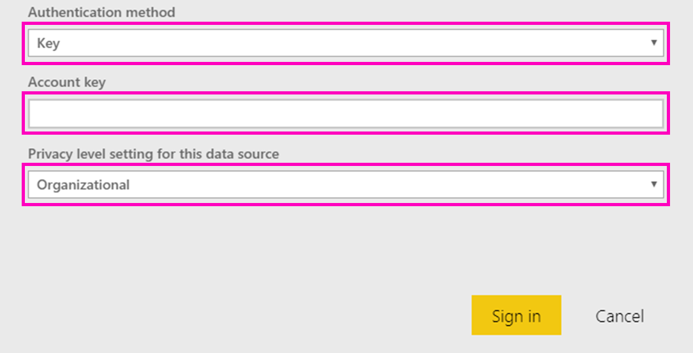

# Microsoft Sustainability Calculatorin yhdistäminen
Hanki merkityksellisiä tietoja IT-infrastruktuurisi hiilidioksidipäästöistä kestävämpien tietojenkäsittelypäätösten tekemiseksi

Microsoft Sustainability Calculator tarjoaa uutta tietoa Azure-palveluihin liittyvistä hiilidioksidi päästöistä. Ne, jotka ovat vastuussa organisaationsa raportoinnista ja kestävästä kehityksestä, voivat nyt mitata kunkin Azure-paketin hiilidioksidivaikutukset sekä tarkastella arvioituja hiilisäästöjä, jotka koskevat kyseisten kuormitusten suorittamista Azuressa ja paikallisissa palvelinkeskuksissa. Näitä tietoja voidaan käyttää Scope 3 -päästöjen kasvihuonekaasujen raportoinnissa. Microsoft Sustainability Calculatorin käyttöoikeus edellyttää vuokraajan tunnusta ja käyttöavainta, jonka saa yleensä käyttöön organisaatiosi Azure-järjestelmänvalvojan kautta.

Tarvitset tietoja Azure Enterprise -portaalista, jotta voit käyttää tätä sovellusta. Yrityksesi järjestelmänvalvojat voivat auttaa sinua hankkimaan nämä tiedot. Lue nämä ohjeet ja hanki tarvittavat tiedot ennen sovelluksen asentamista. 

Tämä liitinversio tukee vain yritysrekisteröintejä osoitteesta [https://ea.azure.com](https://ea.azure.com/). Kiinassa tehtyjä rekisteröintejä ei tueta tällä hetkellä.

## Yhteyden muodostaminen
[!INCLUDE [powerbi-service-apps-get-more-apps](../includes/powerbi-service-apps-get-more-apps.md)]

1. Valitse **Microsoft Sustainability Calculator** \> **Hanki se nyt**.
1. Valitse **Asennetaanko tämä Power BI -sovellus?** -kohdassa **Asenna**.
1. Valitse **Sovellukset**-ruudusta **Microsoft Sustainability Calculator** -ruutu.
1. Valitse **Aloita uuden sovelluksesi käyttö** -kohdassa **Yhdistä tiedot**.

    

1. Anna **yrityksen nimi, käyttäjän rekisteröintinumero** ja **kuukausien määrä sekä \> Kirjaudu sisään.** Lisätietoja [näiden parametrien löytämisestä](#finding-parameters) on alla.

    

1. Jos kyseessä on **todentamismenetelmä**, valitse **avain**ja **tietosuojataso** ja valitse **organisaatio**.
1. Anna **avaimeksi** **käyttöavaimesi ja \> kirjaudu sisään**.

    

1. Tuontiprosessi alkaa automaattisesti. Kun kaikki on valmista, uusi koontinäyttö, raportti ja malli näkyvät **siirtymisruudussa**. Voit tarkastella tuotuja tietoja valitsemalla raportin.

## Parametrien löytäminen

Jos haluat löytää yrityksesi **rekisteröintitunnuksen** ja **käyttöavaimen**, pyydä Azure-järjestelmänvalvojaltasi tarvittavat tiedot. Järjestelmänvalvojasi

1. Kirjautuu [Azure Enterprise -portaaliin](https://ea.azure.com)ja napsauttaa **Hallitse** vasemmasta valintanauhasta ja hankkii **rekisteröintinumero** alla esitetyllä tavalla
2. Napsauttaa [Azure Enterprise -portaalista](https://ea.azure.com)**Raportit** ja sitten API- käyttöavain, kuten alla on esitetty, jotta saat ensisijaisen rekisteröintitilin avaimen

## Sovelluksen käyttäminen

Voit päivittää parametrit milloin tahansa siirtymällä **Tietojoukko**-asetuksiin ja käyttämällä sovelluksen työtilaan liittyviä asetuksia sekä päivittämällä vuokraajan tunnuksen, yrityksen nimen tai tietojen kuukaudet. Kun olet ottanut parametrit käyttöön, valitse **Päivitä**, kun haluat ladata tiedot uudelleen käyttäen uusia parametreja.