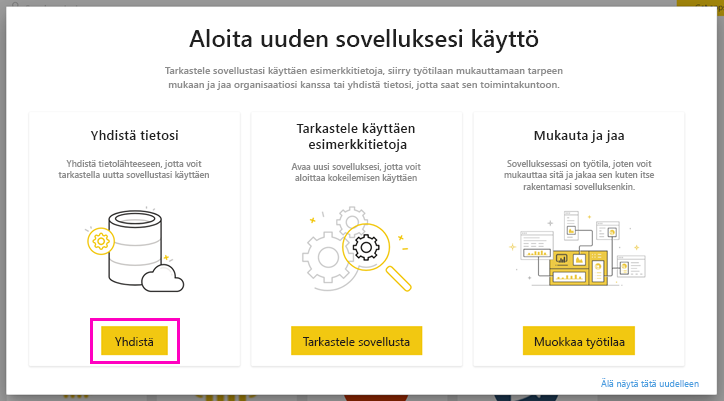
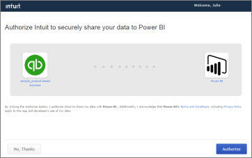

# Yhteyden muodostaminen QuickBooks Onlineen Power BI:llä
Kun muodostat yhteyden QuickBooks Onlinen tietoihin Power BI:stä, saat heti Power BI:n koontinäytön ja Power BI:n raportit, jotka antavat merkityksellisiä tietoja muun muassa yrityksesi kassavirrasta, kannattavuudesta ja asiakkaista. Voit käyttää koontinäyttöä ja raportteja sellaisinaan tai mukauttaa niitä, jotta niissä korostuvat itseäsi eniten kiinnostavat tiedot. Tiedot päivitetään automaattisesti kerran päivässä.

Muodosta yhteys [QuickBooks Online -mallisovellukseen](https://dxt.powerbi.com/getdata/services/quickbooks-online) Power BI:tä varten.

>[!NOTE]
>Jos haluat tuoda QuickBooks Online -tietosi Power BI:hin, sinun on oltava järjestelmänvalvoja QuickBooks Online -tilissäsi ja kirjauduttava sisään järjestelmänvalvojan tilin tunnistetiedoilla. Et voi käyttää tätä liitintä QuickBooks Desktop -ohjelmalla. 

## Yhteyden muodostaminen

[!INCLUDE [powerbi-service-apps-get-more-apps](../includes/powerbi-service-apps-get-more-apps.md)]

3. Valitse **QuickBooks Online** ja valitse sitten **Nouda**.
   
   

4. Valitse **Asennetaanko tämä Power BI -sovellus?** -kohdassa **Asenna**.

    

4. Valitse **Sovellukset**-ruudussa **QuickBooks**-ruutu.

   

6. Valitse **Aloita uuden sovelluksesi käyttö** -kohdassa **Yhdistä tiedot**.

    

4. Valitse todennusmenetelmäksi **oAuth2** ja valitse sitten **Kirjaudu sisään**. 
5. Anna pyydettäessä QuickBooks Onlinen tunnistetietosi ja noudata QuickBooks Onlinen todennusprosessia. Jos olet jo kirjautunut QuickBooks Onlineen selaimessa, tunnistetietoja ei välttämättä pyydetä.
   >[!NOTE]
   >Tarvitset QuickBooks Online -tilisi järjestelmänvalvojan tunnistetiedot.
6. Valitse seuraavassa näytössä yritys, jonka haluat yhdistää Power BI:hin.
   
   

7. Aloita tuontiprosessi valitsemalla seuraavassa ruudussa **Valtuuta**. Tämä prosessi voi kestää muutaman minuutin yrityksen tietojen koon mukaan. 
   
   
   
8. Kun Power BI on tuonut tiedot, QuickBooks -sovelluksen sisältöluettelo tulee näkyviin: uusi koontinäyttö, raportti ja tietojoukko.
9. Aloita etsintäprosessi valitsemalla QuickBooks-koontinäyttö. Power BI on luonut automaattisesti tämän koontinäytön tuotujen tietojen näyttämistä varten.

    

**Mitä seuraavaksi?**

* Kokeile [kysymyksen esittämistä raporttinäkymän yläreunassa olevassa Q&A-ruudussa](../consumer/end-user-q-and-a.md).
* [Muuta koontinäytön ruutuja](../create-reports/service-dashboard-edit-tile.md).
* [Valitse jokin ruutu](../consumer/end-user-tiles.md), jolloin siihen liittyvä raportti avautuu.
* Tietojoukko on ajastettu päivittymään päivittäin, mutta voit muuttaa päivitysaikataulua tai kokeilla tietojoukon päivittämistä **Päivitä nyt** -toiminnolla haluamanasi ajankohtana

## Vianmääritys
**Oho! Havaittiin virhe.**

Jos saat tämän sanoman sen jälkeen kun valitsit **Valtuuta**:

Oho! Havaittiin virhe. Sulje tämä ikkuna ja yritä uudelleen.

Tämä sovellus on jo tilattu toiselle yrityksen käyttäjälle. Voit tehdä muutoksia tähän tilaukseen ottamalla yhteyttä osoitteeseen [järjestelmänvalvojan sähköpostiosoite].

... tämä virhe tarkoittaa, että yrityksesi toinen järjestelmänvalvoja on jo yhdistänyt yrityksen tiedot Power BI:hin. Pyydä, että kyseinen järjestelmänvalvoja jakaa koontinäytön kanssasi. Tällä hetkellä vain yksi järjestelmänvalvojakäyttäjä voi yhdistää tietyn QuickBooks Online -yrityksen tietojoukon Power BI:hin. Kun Power BI on luonut koontinäytön, järjestelmänvalvoja voi jakaa sen useille työtovereilleen samoissa Power BI -vuokraajissa.

**"Tätä sovellusta ei ole määritetty sallimaan yhteyksiä maastasi"**

Power BI tukee tällä hetkellä vain QuickBooks Onlinen Yhdysvaltojen versioita. 

## Seuraavat vaiheet
[Mikä on Power BI?](../fundamentals/power-bi-overview.md)

[Power BI -palvelun peruskäsitteitä suunnittelijoille](../fundamentals/service-basic-concepts.md)
