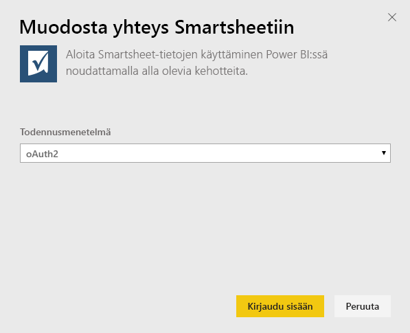
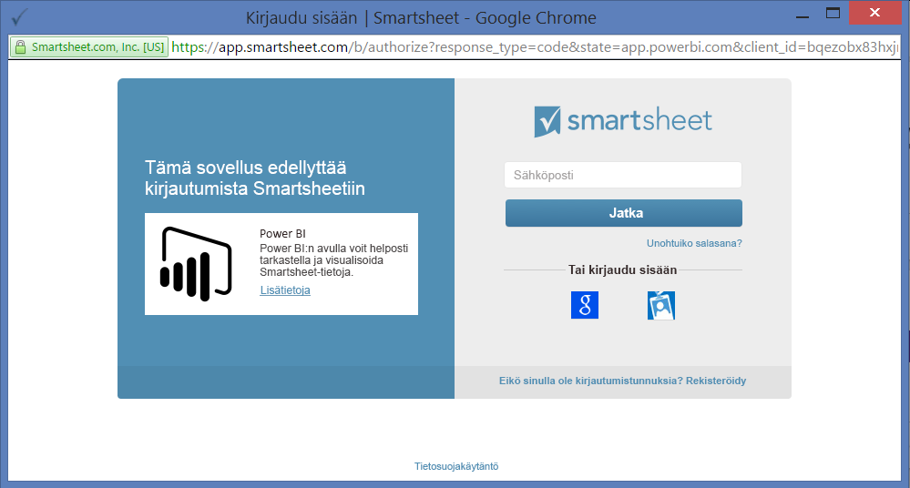
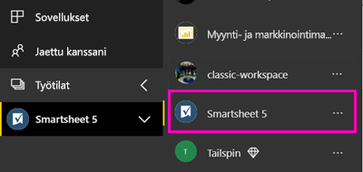

# Yhteyden muodostaminen Smartsheetiin Power BI:llä
Tässä artikkelissa kerrotaan tietojen hakemisesta Smartsheet-tililtäsi Power BI -mallisovelluksella. Smartsheet tarjoaa helpon alustan yhteiskäyttöön ja tiedostojen jakamiseen. Smartsheet-mallisovellus Power BI:lle sisältää koontinäytön, raportteja ja tietojoukon, joka näkyy Smartsheet-tilisi yleiskuvauksessa. Voit käyttää myös [Power BI Desktopia](desktop-connect-to-data.md) yhteyden muodostamiseen tilisi yksittäisiin laskentataulukoihin. 

Kun olet asentanut mallisovelluksen, voit muuttaa koontinäyttöä ja raporttia. Sen jälkeen voit jakaa sen sovelluksena työtovereille organisaatiossasi.

Muodosta yhteys [Smartsheet-mallisovellukseen](https://app.powerbi.com/groups/me/getapps/services/pbi-contentpacks.pbiapps-smartsheet) Power BI:lle.

>[!NOTE]
>Power BI -mallisovelluksen yhdistämisessä ja lataamisessa kannattaa käyttää Smartsheet-järjestelmänvalvojan tiliä, sillä se sisältää lisäoikeuksia.

## Yhteyden muodostaminen

[!INCLUDE [powerbi-service-apps-get-more-apps](../includes/powerbi-service-apps-get-more-apps.md)]

3. Valitse **Smartsheet** \> **Hanki se nyt**.
4. Valitse **Asennetaanko tämä Power BI -sovellus?** -kohdassa **Asenna**.
4. Valitse **Sovellukset**-ruudussa **Smartsheet**-ruutu.

    

6. Valitse **Aloita uuden sovelluksesi käyttö** -kohdassa **Yhdistä tiedot**.

    

4. Valitse todennusmenetelmäksi **oAuth2 \>Kirjaudu sisään**.
   
   Anna pyydettäessä Smartsheetin tunnistetiedot ja noudata todennusprosessia.
   
   
   
   

5. Kun Power BI on tuonut tiedot, Smartsheet-koontinäyttö avautuu.
   
   

## Sovelluksen muokkaaminen ja jakaminen

Olet asentanut Smartsheet-mallisovelluksen. Tämä tarkoittaa, että olet myös luonut Smartsheet-työtilan. Työtilassa voit muuttaa raporttia ja koontinäyttöä ja sitten jakaa sitä *sovelluksena* työtovereille organisaatiossasi. 

1. Jos haluat nähdä uuden Smartsheet-työtilasi sisällön, valitse siirtymisruudussa **Työtilat** > **Smartsheet**. 

    

    Tämä näkymä on työtilan sisältöluettelo. Oikeassa yläkulmassa on kohta **Päivitä sovellus**. Kun olet valmis jakamaan sovelluksesi työtovereillesi, aloita siitä. 

    

2. Valitsemalla **Raportit** ja **Tietojoukot** voit tarkastella muita työtilan elementtejä.

    Lue tietoja [sovellusten jakamisesta](../collaborate-share/service-create-distribute-apps.md) työtovereille.

## Paketin sisältö
Smartsheet-mallisovellus Power BI:lle sisältää yleiskatsauksen Smartsheet-tilistäsi kuten työtiloista, raporteista ja työkirjoista, joita sinulla on, kun niitä esimerkiksi muokataan. Järjestelmänvalvojakäyttäjät näkevät myös tietoja omassa järjestelmässään olevista käyttäjistä, kuten parhaat taulukoiden laatijat.  

Voit käyttää myös [Power BI Desktopin](desktop-connect-to-data.md) Smartsheet-liitintä yhteyden muodostamiseen tiliisi yksittäisiin taulukoihin.  

## Seuraavat vaiheet

* [Luo uusia työtiloja Power BI:ssä](../collaborate-share/service-create-the-new-workspaces.md)
* [Asenna ja käytä sovelluksia Power BI:ssä](../consumer/end-user-apps.md)
* [Yhteyden muodostaminen Power BI -sovelluksiin ulkoisille palveluille](service-connect-to-services.md)
* Onko sinulla kysyttävää? [Voit esittää kysymyksiä Power BI -yhteisössä](https://community.powerbi.com/)