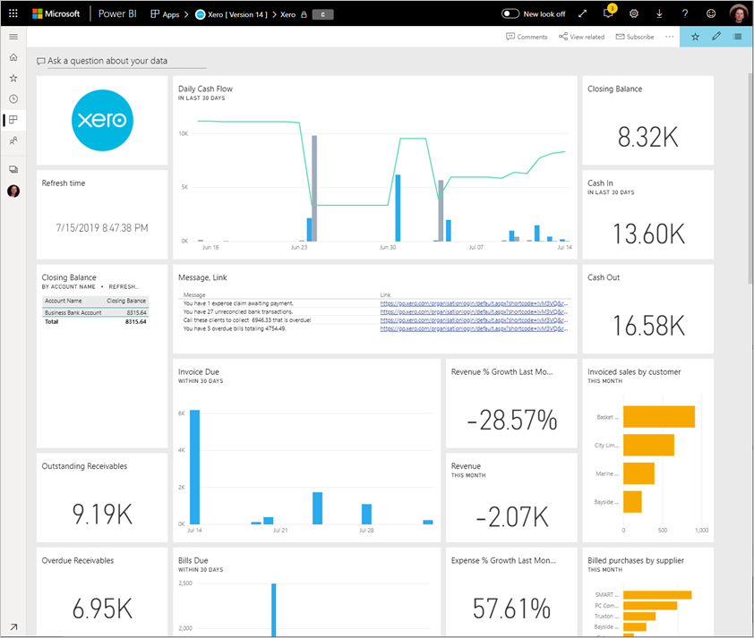

# Yhteyden muodostaminen Xeroon Power BI:n avulla
Xero on helppokäyttöinen verkkokirjanpito-ohjelmisto, joka on suunniteltu erityisesti pienyrityksille. Tämän Power BI -mallisovelluksen avulla voit luoda vaikuttavia visualisointeja Xeron taloustietojen pohjalta. Oletuskoontinäyttö sisältää useita pienyritysten mittareita, kuten käteistilanteen, tuoton vrt. kulut, voiton ja tappion trendin, velallisen maksupäivät ja sijoitetun pääoman tuoton.

Muodosta yhteys Power BI:n [Xero-mallisovellukseen](https://app.powerbi.com/getdata/services/xero) tai lue lisää [Xeron ja Power BI:n](https://help.xero.com/Power-BI) integroinnista.

## Yhteyden muodostaminen

[!INCLUDE [powerbi-service-apps-get-more-apps](../includes/powerbi-service-apps-get-more-apps.md)]

3. Valitse **Xero** \> **Hanki se nyt**.
4. Valitse **Asennetaanko tämä Power BI -sovellus?** -kohdasta **Asenna**.

    

4. Valitse **Sovellukset**-ruudussa **Xero**-ruutu.

   

6. Valitse **Aloita uuden sovelluksesi käyttö** -kohdassa **Yhdistä tiedot**.

    

4. Kirjoita lempinimi Xero-tiliisi liittyvälle organisaatiolle. Mikä tahansa nimi kelpaa. Sen pääasiallinen tarkoitus on auttaa useiden Xero-organisaatioiden parissa toimivia käyttäjiä pitämään eri tilit järjestyksessä. Lisätietoja [parametrien löytämisestä](#FindingParams) on jäljempänä tässä artikkelissa.

    

5. Valitse **todennusmenetelmäksi** **OAuth**. Kirjaudu kehotuksen mukaisesti Xero-tilillesi ja valitse organisaatio, johon haluat muodostaa yhteyden. Kun olet kirjautunut, käynnistä lataus valitsemalla **Kirjaudu sisään**.
   
    
   
    
6. Hyväksymisen jälkeen tuontiprosessi alkaa automaattisesti. Kun kaikki on valmista, uusi koontinäyttö, raportti sekä malli näkyvät siirtymisruudussa. Voit tarkastella tuotuja tietoja valitsemalla raporttinäkymän.
   
     

**Mitä seuraavaksi?**

* Kokeile [kysymyksen esittämistä raporttinäkymän yläreunassa olevassa Q&A-ruudussa](../consumer/end-user-q-and-a.md).
* [Muuta koontinäytön ruutuja](../create-reports/service-dashboard-edit-tile.md).
* [Valitse jokin ruutu](../consumer/end-user-tiles.md), jolloin siihen liittyvä raportti avautuu.
* Tietojoukko on ajastettu päivittymään päivittäin, mutta voit muuttaa päivitysaikataulua tai kokeilla tietojoukon päivittämistä **Päivitä nyt** -toiminnolla haluamanasi ajankohtana

## Paketin sisältö
Mallisovelluksen koontinäyttö sisältää ruutuja ja mittareita eri alueilta sekä vastaavat, lisätietoja sisältävät raportit:  

| Alue | Koontinäytön ruudut | Raportti |
| --- | --- | --- |
| Kassa |Päivittäinen kassavirta  Tulot  Menot  Loppusaldo tilin mukaan  Loppusaldo tänään |Pankkitilit |
| Asiakas |Laskutetut myynnit  Laskutetut myynnit asiakkaan mukaan  Laskutettujen myyntien kasvutrendi  Erääntyvät myyntilaskut  Avoimet saatavat  Erääntyneet saatavat |Asiakas  Varasto |
| Toimittaja |Laskutetut ostot  Laskutettu ostot toimittajan mukaan  Laskutettujen ostojen kasvutrendi   Erääntyvät ostolaskut  Avoimet maksettavat  Erääntyneet maksettavat |Toimittajat  Varasto |
| Varasto |Kuukausittaisen myynnin määrä tuotteen mukaan |Varasto |
| Tulos |Kuukausittainen tulos  Kuluvan tilikauden nettovoitto  Kuluvan kuukauden nettovoitto  Suurimmat kulutilit |Tulos |
| Tase |Vastaavaa yhteensä  Vastattavaa yhteensä  Oma pääoma |Tase |
| Kunto |Current ratio -tunnusluku  Bruttovoitto prosentteina   Pääoman tuottoaste  Vastattavan ja oman pääoman välinen suhde |Kunto  Sanasto ja tekniset huomautukset |

Tietojoukko sisältää myös seuraavat taulukot, joiden avulla raportteja ja koontinäyttöjä voi mukauttaa:  

* Osoitteet  
* Ilmoitukset  
* Tiliotteen päiväsaldo  
* Tiliotteet  
* Yhteystiedot  
* Kululaskut  
* Laskurivinimikkeet  
* Laskut  
* Kohteet  
* Kuukauden loppu  
* Organisaatio  
* Alustava tase  
* Xero-tilit

## Järjestelmävaatimukset
Tarvitset seuraavia rooleja Xero-mallisovelluksen käyttämiseen: ”Standard + Reports” tai ”Advisor”.

## Parametrien löytäminen
Anna organisaatiollesi nimi, jolla sitä voi seurata Power BI:ssä. Yksilöidyn nimen avulla voit muodostaa yhteyden useaan eri organisaatioon. Et voi muodostaa yhteyttä samaan organisaatioon useita kertoja, sillä se vaikuttaa ajoitettuun päivitykseen.   

## Vianmääritys
* Xero-käyttäjillä on oltava seuraavat roolit, jotta he voivat käyttää Power BI:n Xero-mallisovellusta: ”Standard + Reports” tai ”Advisor”. Mallisovellus tarvitsee käyttäjäpohjaisia käyttöoikeuksia voidakseen käyttää raportointitietoja Power BI:n kautta.
* Latauksen aikana koontinäytön ruudut ovat yleisessä lataustilassa. Ne pysyvät siinä, kunnes koko lataus on valmis. Jos saat ilmoituksen, että lataus on suoritettu, mutta ruudut latautuvat yhä, yritä päivittää koontinäytön ruudut käyttämällä koontinäytön oikeassa yläkulmassa olevaa ...-painiketta.
* Jos mallisovelluksen päivitys epäonnistuu, tarkista, oletko muodostanut yhteyden samaan organisaatioon Power BI:ssä useammin kuin kerran. Xero sallii vain yhden aktiivisen yhteyden organisaatioon, ja näyttöön voi tulla virhesanoma, jonka mukaan tunnistetiedot ovat virheelliset, jos muodostat yhteyden samaan kohteeseen useammin kuin kerran.  
* Jos yhteyden muodostamisessa Power BI:n Xero-mallisovellukseen ilmenee ongelmia, kuten virhesanomia tai pitkiä latausaikoja, tyhjennä ensin välimuisti, poista evästeet ja käynnistä selain uudelleen ja muodosta sitten yhteys Power BI:hin uudelleen.  

Muissa ongelmatilanteissa tee palvelupyyntö osoitteessa https://support.powerbi.com, jos ongelma jatkuu.

## Seuraavat vaiheet
[Power BI:n käytön aloittaminen](../fundamentals/service-get-started.md)

[Tietojen noutaminen Power BI:ssä](service-get-data.md)
