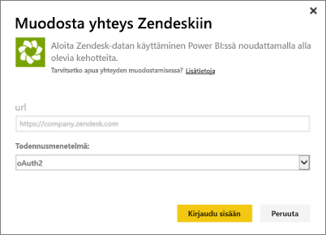

# Zendeskiin yhdistäminen Power BI:n avulla

Tässä artikkelissa kerrotaan tietojen hakemisesta Zendesk-tililtäsi Power BI -mallisovelluksella. Zendesk-sovellus tarjoaa Power BI -koontinäytön ja sarjan Power BI -raportteja, jotka tarjoavat merkityksellisiä tietoja lippujesi määrästä ja agentin suorituskyvystä. Tiedot päivitetään automaattisesti kerran päivässä. 

Kun olet asentanut mallisovelluksen, voit mukauttaa koontinäyttöä ja raporttia niin, että sinulle tärkeimmät tiedot korostetaan. Sen jälkeen voit jakaa sen sovelluksena työtovereille organisaatiossasi.

Muodosta yhteys [Zendesk-mallisovellukseen](https://app.powerbi.com/getdata/services/zendesk) tai lue lisää Power Bi:n [Zendesk-integroinnista](https://powerbi.microsoft.com/integrations/zendesk).

Kun olet asentanut mallisovelluksen, voit muuttaa koontinäyttöä ja raporttia. Sen jälkeen voit jakaa sen sovelluksena työtovereille organisaatiossasi.

>[!NOTE]
>Yhteyden muodostamiseen tarvitaan Zendesk-järjestelmänvalvojan tili. Lisätietoja [vaatimuksista](#system-requirements) on alla.

## Yhteyden muodostaminen

[!INCLUDE [powerbi-service-apps-get-more-apps](../includes/powerbi-service-apps-get-more-apps.md)]

3. Valitse **Zendesk** \> **Hanki se nyt**.
4. Valitse **Asennetaanko tämä Power BI -sovellus?** -kohdassa **Asenna**.
4. Valitse **Sovellukset**-ruudussa **Zendesk**-ruutu.

    

6. Valitse **Aloita uuden sovelluksesi käyttö** -kohdassa **Yhdistä tiedot**.

    

4. Anna tiliisi liitetty URL-osoite. URL-osoite on muodossa **https://company.zendesk.com** . Lisätietoja [näiden parametrien löytämisestä](#finding-parameters) on alla.
   
   

5. Anna pyydettäessä Zendesk-tunnistetiedot.  Valitse todennusmenetelmäksi **oAuth 2** ja valitse **Kirjaudu sisään**. Noudata Zendesk-todennuksen työnkulkua. (Jos olet jo kirjautunut Zendeskiin selaimessa, tunnistetietoja ei välttämättä pyydetä.)
   
   > [!NOTE]
   > Tämä mallisovellus edellyttää, että muodostat yhteyden Zendesk-järjestelmänvalvojan tililtä. 
   > 
   
   
6. Napsauta **Salli** salliaksesi Power BI:lle Zendesk-tilisi käyttöoikeudet.
   
   
7. Aloita tuontiprosessi valitsemalla **Yhdistä**. 
8. Kun Power BI on tuonut tiedot, Zendesk-sovelluksen sisältöluettelo tulee näkyviin: uusi koontinäyttö, raportti ja tietojoukko.
9. Aloita etsintäprosessi valitsemalla koontinäyttö.

    
   
## Sovelluksen muokkaaminen ja jakaminen

Olet asentanut Zendesk-mallisovelluksen. Tämä tarkoittaa, että olet myös luonut Zendesk-työtilan. Työtilassa voit muuttaa raporttia ja koontinäyttöä ja sitten jakaa sitä *sovelluksena* työtovereille organisaatiossasi. 

1. Jos haluat nähdä uuden Zendesk-työtilasi sisällön, valitse siirtymisruudussa **Työtilat** > **Zendesk**. 

    

    Tämä näkymä on työtilan sisältöluettelo. Oikeassa yläkulmassa on kohta **Päivitä sovellus**. Kun olet valmis jakamaan sovelluksesi työtovereillesi, aloita siitä. 

    

2. Valitsemalla **Raportit** ja **Tietojoukot** voit tarkastella muita työtilan elementtejä.

    Lue tietoja [sovellusten jakamisesta](../collaborate-share/service-create-distribute-apps.md) työtovereille.

## Järjestelmävaatimukset
Zendesk-mallisovellus edellyttää Zendesk- järjestelmänvalvojan tiliä. Jos olet agentti tai loppukäyttäjä ja olet kiinnostunut Zendesk-tietojen tarkastelemisesta, lisää ehdotus ja tarkista Zendesk-yhdistin [Power BI Desktopista](desktop-connect-to-data.md).

## Parametrien löytäminen
Zendeskin URL-osoite on sama kuin URL-osoite, jota käytät kirjautuessasi Zendesk-tilillesi. Jos et ole varma Zendesk URL-osoitteesta, voit käyttää Zendesk [kirjautumisapua](https://www.zendesk.com/login/).

## Vianmääritys
Jos sinulla on ongelmia yhteyden kanssa, tarkista Zendeskin URL-osoite ja varmista, että käytät Zendesk-järjestelmänvalvojatiliä.

## Seuraavat vaiheet

* [Luo uusia työtiloja Power BI:ssä](../collaborate-share/service-create-the-new-workspaces.md)
* [Asenna ja käytä sovelluksia Power BI:ssä](../consumer/end-user-apps.md)
* [Yhteyden muodostaminen Power BI -sovelluksiin ulkoisille palveluille](service-connect-to-services.md)
* Onko sinulla kysyttävää? [Voit esittää kysymyksiä Power BI -yhteisössä](https://community.powerbi.com/)
