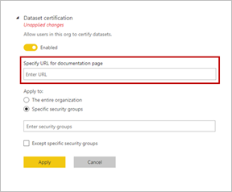

# Tietojoukkojen sertifioiminen (esikatselu)

Organisaatiosi voi sertifioida tietojoukot, jotka ovat virallinen tärkeiden tietojen lähde. Nämä tietojoukot ovat tarjolla näkyvästi, kun raporttien suunnittelijat aloittavat raportin luomisen ja luotettavan tiedon etsinnän. Sertifiointi voi olla erittäin valikoiva prosessi, jolloin vain arvokkaimmat tietojoukot sertifioidaan. Power BI -vuokraajien järjestelmänvalvojilla on uusi asetus, jolla he voivat hallita tarkasti, kuka tietojoukkoja voi sertifioida. Järjestelmänvalvojat voivat näin varmistaa, että tietojoukkojen sertifiointi tuottaa todella luotettavia ja virallisia tietojoukkoja, jotka on suunniteltu käytettäväksi koko organisaatiossa.

Power BI -käyttäjät voivat käyttää monia eri tietojoukkoja, joten yritysten tulee ohjata heitä luotettavien ja laadukkaiden tietojoukkojen pariin. Power BI:ssä on kaksi tapaa tietojoukkojen *tukemiseen*:

- **Ylentäminen**: Tietojoukon omistajat ja muut työtilan käyttäjät voivat ylentää tietojoukkojaan, kun ne ovat valmiita laajaan käyttöön. Lue [Ylennä tietojoukkosi](service-datasets-promote.md), jos haluat lisätietoja. 
- **Sertifiointi**: Tietojoukon omistajat voivat pyytää ylennetyn tietojoukon sertifiointia. Vuokraajan järjestelmänvalvojan **Tietojoukon sertifiointi** -asetuksessa määritetty joukko käyttäjiä päättää, mitkä tietojoukot sertifioidaan. Tietojoukon sertifioineen henkilön nimi näytetään työkaluvihjeessä tietojoukkojen resurssienetsinnän aikana. Voit nähdä sen osoittamalla kohtaa **Sertifioitu**.

## Sertifioi tietojoukko

Vuokraajasi järjestelmänvalvoja voi antaa URL-osoitteen **Lisätietoja**-linkkiin **Tukeminen**-asetussivulla.  Se voi linkittyä sertifiointiprosessiasi koskevaan dokumentaatioon. Jos vuokraajasi järjestelmänvalvoja ei määritä kohdetta **Lisätietoja**-linkille, se yhdistyy oletusarvoisesti tähän artikkeliin.

Tietojoukkojen sertifioijalla on selvästi suuri vastuu. Tarkka harkintaprosessisi alkaa, kun tietojoukon tekijän ottaa sinuun yhteyttä tietojen sertifiointia koskien. Kun olet vakuuttunut, että tietojoukko kannattaa sertifioida, teet tässä esitetyt vaiheet.

1. Tietojoukon omistajan on annettava sinulle jäsenen käyttöoikeudet työtilaan, jossa tietojoukko sijaitsee.
1. Jos vuokraajan järjestelmänvalvoja on nimennyt sinut tietojoukkojen sertifioijaksi, käytettävissäsi on **Sertifioitu**-vaihtoehto tietojoukon **Asetuksien** **Tukeminen**-osiossa. Valitse **Sertifioitu**.
1. Valitse **Käytä**.

Lue lisää siitä, miten vuokraajien järjestelmänvalvojat [hallitsevat tietojoukkojen käyttöä kaikissa työtiloissa](service-datasets-admin-across-workspaces.md).

## Seuraavat vaiheet

* Lue lisätietoja [tietojoukkojen käytöstä eri työtiloissa](service-datasets-across-workspaces.md)
* Onko sinulla kysyttävää? [Voit esittää kysymyksiä Power BI -yhteisössä](https://community.powerbi.com/)
