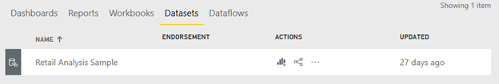

# Eri työtilojen tietojoukkoihin perustuvien raporttien luominen (esikatselu)

Lue, miten voit luoda omissa työtiloissasi raportteja, jotka perustuvat muiden työtilojen tietojoukoille. Jos haluat luoda raportin aiemmin luodun tietojoukon pohjalle, voit aloittaa Power BI Desktop-tai Power BI -palvelusta omassa työtilassasi tai [uudessa työtilakokemuksessa](../collaborate-share/service-create-the-new-workspaces.md).

- Power BI -palvelussa: **Nouda tiedot** > **Julkaistut tietojoukot**.
- Power BI Desktopissa: **Nouda tiedot** > **Power BI -tietojoukot**.

    
   
Kummassakin tapauksessa tietojoukon etsintä alkaa valintaikkunasta **Valitse tietojoukko raportin luomista varten**. Näet kaikki tietojoukot, joita pystyt käyttämään riippumatta siitä, missä ne sijaitsevat:

Huomaa, että ensimmäisessä on merkintä **Ylennetty**. Pääsemme lisäämään merkinnän myöhemmin tässä artikkelissa kohdassa [Etsi tuettu tietojoukko](#find-an-endorsed-dataset).

Luettelossa näkemäsi tietojoukot täyttävät vähintään yhden seuraavista ehdoista:

- Tietojoukko on jossakin uuden työtilakokemuksen työtiloista, ja olet kyseisen työtilan jäsen. Katso [Huomioitavat asiat ja rajoitukset](service-datasets-across-workspaces.md#considerations-and-limitations).
- Sinulla muodostamisen käyttöoikeus tietojoukkoon, joka on uudessa työtilakokemuksen työtilassa.
- Tietojoukko on omassa työtilassasi.

> [!NOTE]
> Jos olet maksuton käyttäjä, näet tietojoukkoja vain omassa työtilassasi tai näet tietojoukkoja, joihin sinulla on muodostamisen käyttöoikeus ja jotka ovat Premium-kapasiteetin työtiloissa.

Kun napsautat kohtaa **Luo**, luot tietojoukkoon reaaliaikaisen yhteyden ja raportin luontikokemus avautuu koko käytettävissä olevan tietojoukon kanssa. Et ole tehnyt kopiota tietojoukosta. Tietojoukko on yhä sen alkuperäisessä sijainnissa. Voit käyttää kaikkia tietojoukon taulukoita ja mittareita omien raporttiesi luomiseen. Tietojoukossa on käytössä rivitason suojauksen (RLS) rajoitukset, joten näet vain tiedot, jotka sinulla on oikeus nähdä RLS-roolisi perusteella.

Voit tallentaa raportin senhetkiseen työtilaan Power BI-palvelussa tai julkaista raportin työtilaan Power BI Desktopista. Power BI luo merkinnän automaattisesti tietojoukkojen luetteloon, jos raportti perustuu työtilan ulkopuolella olevaan tietojoukkoon. Tämän tietojoukon kuvake on eri kuin työtilan tietojoukkojen kuvake: 

Näin työtilan jäsenet voivat päätellä, mitkä raportit ja koontinäytöt käyttävät työtilan ulkopuolella olevia tietojoukkoja. Tapahtuma näyttää tietojoukkoa koskevia tietoja ja valikoituja toimintoja.

## Etsi tuettu tietojoukko

On kahdenlaisia tuettuja tietojoukkoja. Tietojoukon omistajat voivat *ylentää* tietojoukon, jota he suosittelevat sinulle. Lisäksi Power BI -vuokraajan järjestelmänvalvoja voi määrittää organisaatiosi asiantuntijat, jotka voivat *sertifioida* tietojoukkoja kaikkien käyttöön. Sekä ylennetyissä että sertifioiduissa tietojoukoissa on *merkit*, jotka näet sekä etsiessäsi tietojoukkoa että työtilan tietojoukkoluettelossa. Tietojoukon sertifioineen henkilön nimi näytetään työkaluvihjeessä tietojoukkojen resurssienetsinnän aikana. Voit nähdä sen osoittamalla kohtaa **Sertifioitu**.

- Power BI -palvelussa: **Nouda tiedot** > **Julkaistut tietojoukot**.
- Power BI Desktopissa: **Nouda tiedot** > **Power BI -tietojoukot**.

    **Valitse tietojoukko** -valintaikkunassa tuetut tietojoukot ovat oletusarvoisesti luettelossa ylimpänä. 

    

## Seuraavat vaiheet

- [Tietojoukkojen käyttö eri työtiloissa (esikatselu)](service-datasets-across-workspaces.md)
- Onko sinulla kysyttävää? [Voit esittää kysymyksiä Power BI -yhteisössä](https://community.powerbi.com/)
