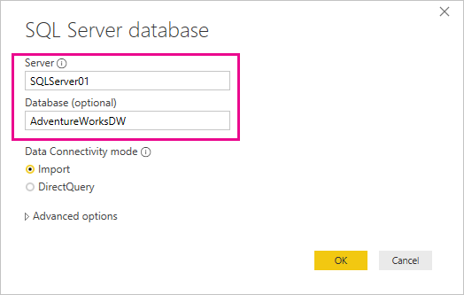
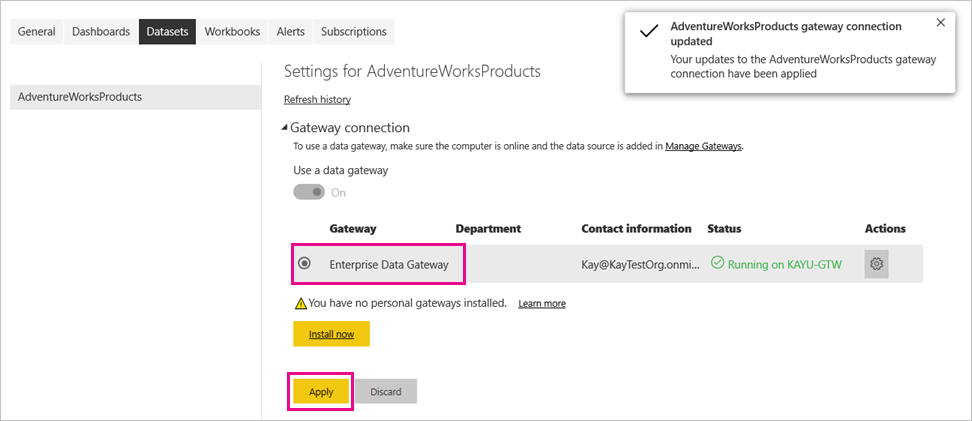
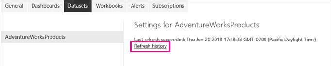

# <a name="refresh-data-from-an-on-premises-sql-server-database"></a>Tietojen päivittäminen paikallisesta SQL Server -tietokannasta

Tässä opetusohjelmassa näytetään, miten voit päivittää Power BI -tietojoukon lähiverkkosi paikallisesta relaatiotietokannasta. Tässä opetusohjelmassa käytetään SQL Server -mallitietokantaa, jota Power BI:n täytyy käyttää paikallisen tietoyhdyskäytävän kautta.

Tässä opetusohjelmassa käyt läpi seuraavat vaiheet:

> [!div class="checklist"]
> * Luo ja julkaise Power BI Desktop (.pbix) -tiedosto, joka tuo tiedot paikallisesta SQL Server -tietokannasta.
> * Määritä tietolähde ja tietojoukkoasetukset Power BI:ssä SQL Server -yhteydellä tietoyhdyskäytävän kautta.
> * Määritä päivitysaikataulu, joka takaa Power BI -tietojoukon ajantasaisuuden.
> * Suorita tietojoukon manuaalinen päivitys.
> * Tarkista päivityshistoriasta aiempien päivitysten tulokset.
> * Tyhjennä resursseja poistamalla tässä opetusohjelmassa luodut artefaktit.

## <a name="prerequisites"></a>Edellytykset

- Jos et ole vielä rekisteröitynyt Power BI -käyttäjäksi, [rekisteröi maksuton Power BI -kokeilujakso](https://app.powerbi.com/signupredirect?pbi_source=web) ennen aloittamista.
- [Asenna Power BI Desktop](https://powerbi.microsoft.com/desktop/) paikalliseen tietokoneeseen.
- [Asenna SQL Server](/sql/database-engine/install-windows/install-sql-server) paikalliseen tietokoneeseen ja palauta [mallitietokanta varmuuskopiosta](https://github.com/Microsoft/sql-server-samples/releases/download/adventureworks/AdventureWorksDW2017.bak). Saat lisätietoja AdventureWorksista ohjeartikkelista [AdventureWorksin asennus ja määritys](/sql/samples/adventureworks-install-configure).
- [Asenna paikallinen tietoyhdyskäytävä](service-gateway-onprem.md) samaan paikalliseen tietokoneeseen kuin SQL Server (hyötykäytössä ne asennettaisiin yleensä eri koneisiin).

> [!NOTE]
> Jos et ole yhdyskäytävän järjestelmänvalvoja ja et halua asentaa yhdyskäytävää itse, ota yhteyttä organisaatiosi yhdyskäytäväjärjestelmänvalvojaan. Hän voi luoda tarvittavan tietolähdemääritelmän, jolla voit yhdistää tietojoukon SQL Server -tietokantaan.

## <a name="create-and-publish-a-power-bi-desktop-file"></a>Power BI Desktop -tiedoston luominen ja julkaiseminen

Seuraavien ohjeiden avulla voit luoda Power BI -perusraportin AdventureWorksDW-mallitietokannan avulla. Julkaise raportti Power BI -palveluun, jotta saat Power BI:hin tietojoukon, jonka voit sitten määrittää ja päivittää myöhemmissä vaiheissa.

1. Napsauta Power BI Desktopin **Aloitus**-välilehdessä **Hae tiedot** \> **SQL Server**.

2. Anna **SQL Server -tietokannan** valintaikkunassa **palvelimen** ja **tietokannan (vapaaehtoinen)** nimet. Varmista, että **tietoyhteystilana** on **Tuo**, ja valitse sitten **OK**.

    

    Tässä opetusohjelmassa ei käytetä **lisäasetuksia**, mutta huomioi, että voit määrittää SQL-lausekkeen ja muita asetuksia, kuten [SQL Serverin vikasietoisuuden](/sql/database-engine/availability-groups/windows/failover-clustering-and-always-on-availability-groups-sql-server) käytön.

    

3. Vahvista **tunnistetietosi** ja valitse sitten **Yhdistä**.

    > [!NOTE]
    > Jos todennus ei onnistu, varmista, että valitsit oikean todennustavan ja että käytät tiliä, jolla on oikeus käyttää tietokantaa. Testiympäristöissä voit käyttää tietokantatodennusta tietyllä käyttäjänimellä ja salasanalla. Hyötykäyttöympäristöissä käytetään yleensä Windows-todennusta. Tutustu [päivityksen vianmääritysohjeisiin](refresh-troubleshooting-refresh-scenarios.md) ja pyydä lisätukea tietokannan järjestelmänvalvojalta.

1. Jos näyttöön avautuu **salaustuen** valintaikkuna, valitse **OK**.

2. Valitse **siirtymistoiminnon** valintaikkunassa **DimProduct**-taulukko ja sitten **Lataa**.

    

3. Valitse **Pinottu pylväskaavio** Power BI Desktopin **Raportti**-näkymän **Visualisoinnit**-ruudusta.

    

4. Kun pylväskaavio on valittuna raporttipohjassa, valitse **Kentät**-ruudun **EnglishProductName**- ja **ListPrice**-kentät.

    

5. Vedä **päättymispäivämäärä** **raporttitason suodattimiin**. Valitse sitten **perussuodatuksen** kohdasta vain **(Tyhjä)** -valintaruutu.

    

    Kaavion pitäisi nyt näyttää seuraavalta.

    

    Ota huomioon, että viisi **Road-250**-tuotetta luetellaan suurimmilla listahinnoilla. Tämä muuttuu, kun päivität tiedot ja raportin myöhemmin tässä opetusohjelmassa.

6. Tallenna raportti nimellä AdventureWorksProducts.pbix.

7. Valitse **Aloitus**-välilehdessä **Julkaise** \> **Oma työtila** \> **Valitse**. Kirjaudu sisään Power BI -palveluun, jos sinua pyydetään tekemään niin.

8. Valitse **Onnistui**-näytöllä **Avaa AdventureWorksProducts.pbix Power BI:ssä**.

    [Julkaise Power BI:hin](./media/service-gateway-sql-tutorial/publish-to-power-bi.png)

## <a name="connect-a-dataset-to-a-sql-server-database"></a>Tietojoukon yhdistäminen SQL Server -tietokantaan

Yhdistit Power BI Desktopissa suoraan paikalliseen SQL Server -tietokantaan, mutta Power BI -palvelu edellyttää tietoyhdyskäytävää, joka toimii siltana pilven ja paikallisen verkkosi välillä. Näiden ohjeiden avulla voit lisätä paikallisen SQL Server -tietokannan tietolähteeksi yhdyskäytävälle ja yhdistää sitten tietojoukon tähän tietolähteeseen.

1. Kirjaudu sisään Power BI:hin. Valitse oikeasta yläkulmasta asetusten hammasrataskuvake ja valitse sitten **Asetukset**.

    

2. Valitse **Tietojoukot**-välilehdestä **AdventureWorksProducts**, jotta voit yhdistää paikalliseen SQL Server -tietokantaan tietoyhdyskäytävän kautta.

3. Laajenna **yhdyskäytäväyhteyden kohta** ja varmista, että ainakin yksi yhdyskäytävä luetellaan. Jos sinulla ei ole yhdyskäytävää, tutustu tämän opetusohjelman [Edellytykset](#prerequisites)-kohtaan. Sieltä löytyy linkki yhdyskäytävän asennus- ja määritysohjeisiin.

    

4. Laajenna **Toiminnot**-kohdan valintapainike, jotta näet tietolähteet, ja valitse sitten **Lisää yhdyskäytävään** -linkki.

    

    > [!NOTE]
    > Jos et ole yhdyskäytävän järjestelmänvalvoja ja et halua asentaa yhdyskäytävää itse, ota yhteyttä organisaatiosi yhdyskäytäväjärjestelmänvalvojaan. Hän voi luoda tarvittavan tietolähdemääritelmän, jolla voit yhdistää tietojoukon SQL Server -tietokantaan.

5. Anna ja vahvista **yhdyskäytävien** hallintasivun **tietolähdeasetusten** välilehdellä alla luetellut tiedot. Valitse tämän jälkeen **Lisää**.

    | Vaihtoehto | Arvo |
    | --- | --- |
    | Tietolähteen nimi | AdventureWorksProducts |
    | Tietolähteen tyyppi | SQL Server |
    | Palvelin | Tämä on SQL Server -esiintymän nimi, esimerkiksi SQLServer01 (tämän on oltava sama kuin Power BI Desktopissa määritetty nimi). |
    | Tietokanta | Tämä on SQL Server -tietokannan nimi, esimerkiksi AdventureWorksDW (tämän on oltava sama kuin Power BI Desktopissa määritetty nimi). |
    | Todentamismenetelmä | Tämä on Windows tai Perus (yleensä Windows). |
    | Käyttäjänimi | Tämä on käyttäjätili, jolla muodostat yhteyden SQL Serveriin. |
    | Salasana | Tämä on sen tilin salasana, jolla muodostat yhteyden SQL Serveriin. |

    

6. Laajenna **Tietojoukot**-välilehden **yhdyskäytäväyhteyden** osio uudelleen. Valitse määrittämäsi tietoyhdyskäytävä, jonka **tilana** on Käynnissä koneessa, johon asensit sen, ja valitse sitten **Käytä**.

    

## <a name="configure-a-refresh-schedule"></a>Päivitysaikataulun määrittäminen

Nyt kun olet yhdistänyt Power BI -tietojoukon SQL Server -tietokantaan paikallisesti tietoyhdyskäytävän kautta, määritä päivitysaikataulu näiden ohjeiden mukaisesti. Tietojoukon säännöllinen päivittäminen auttaa varmistamaan, että raporttisi ja koontinäyttösi sisältävät uusimmat tiedot.

1. Avaa siirtymisruudussa **Oma työtila** \> **Tietojoukot**. Valitse kolme pistettä ( **. . .** ) **AdventureWorksProducts**-tietojoukon kohdalla ja valitse sitten **Ajoita päivitys**.

    > [!NOTE]
    > Muista valita kolme pistettä **AdventureWorksProducts**-tietojoukon kohdalta, ei samannimisen raportin kohdalta. **AdventureWorksProducts**-raportin pikavalikko ei sisällä **Ajoita päivitys** -toimintoa.

2. Määritä **Ajoitettu päivitys** -osion **Pidä tietosi ajan tasalla** -kohdassa päivitysasetus **käyttöön**.

3. Valitse sopiva **päivitystaajuus** (tässä esimerkissä **päivittäin**) ja valitse sitten **Aika**-kohdasta **Lisää uusi aika** ja määritä haluamasi päivitysajankohta (tässä esimerkissä 6.30 ja 18.30).

    

    > [!NOTE]
    > Voit määrittää jopa kahdeksan päivittäistä ajankohtaa, jos tietojoukkosi on jaetussa kapasiteetissa, tai 48 ajankohtaa, jos tietojoukkosi on Power BI Premiumissa.

4. Jätä **Lähetä päivitysvirheiden ilmoitusten sähköpostiviestit minulle** -valintaruutu valituksi ja valitse sitten **Käytä**.

## <a name="perform-an-on-demand-refresh"></a>Manuaalisen päivityksen suorittaminen

Nyt kun olet määrittänyt päivitysaikataulun, Power BI päivittää tietojoukkosi aikataulun mukaisesti 15 minuutin tarkkuudella. Jos haluat päivittää tiedot tätä aiemmin esimerkiksi yhdyskäytävän ja tietolähteen määritteiden testaamista varten, suorita päivitys siirtymisruudun tietojoukko-valikossa olevalla **Päivitä nyt** -toiminnolla. Päivityspyynnöt eivät vaikuta seuraavan ajoitetun päivityksen ajankohtaan, mutta ne kuluttavat päivittäistä päivityskiintiötä (kuten aiemmin mainittiin).

Simuloi nyt toimintoa kokeillaksesi muutos mallitietoihin päivittämällä AdventureWorksDW-tietokannan DimProduct-taulukkoa SQL Server Management Studiolla (SSMS).

```sql

UPDATE [AdventureWorksDW].[dbo].[DimProduct]
SET ListPrice = 5000
WHERE EnglishProductName ='Road-250 Red, 58'

```

Toimi sitten näiden ohjeiden mukaisesti, jotta päivitetyt tiedot lähetetään yhdyskäytäväyhteyden kautta tietojoukkoon ja raportteihin Power BI:ssä.

1. Valitse Power BI -palvelun siirtymisruudusta **Oma työtila** ja laajenna se.

2. Valitse **Tietojoukot**-kohdassa kolme pistettä **(. . .** ) **AdventureWorksProducts**-tietojoukon kohdalla ja valitse sitten **Päivitä nyt**.

    

    Huomaat oikeasta yläkulmasta, että Power BI valmistautuu pyydetyn päivityksen suorittamiseen.

3. Valitse **Oma työtila \> Raportit \> AdventureWorksProducts**. Näet, että tiedot päivittyvät ja että suurimman listahinnan tuote on nyt **Road-250 Red, 58**.

    

## <a name="review-the-refresh-history"></a>Päivityshistorian tarkistaminen

Aiempien päivitysten tulokset kannattaa tarkistaa säännöllisesti päivityshistoriasta. Tietokannan tunnistetiedot ovat saattaneet vanhentua tai yhdyskäytävä on saattanut olla offline-tilassa ajoitetun päivityksen aikana. Näiden ohjeiden avulla voit tarkistaa päivityshistorian mahdollisten ongelmien varalta.

1. Valitse Power BI -käyttöliittymän oikeasta yläkulmasta asetusten hammasrataskuvake ja valitse sitten **Asetukset**.

2. Siirry **tietojoukkojen** näkymään ja valitse tietojoukko, jota haluat tarkastella (esimerkiksi **AdventureWorksProducts**).

3. Avaa **Päivityshistoria**-valintaikkuna valitsemalla **Päivityshistoria**.

    

4. **Ajoitettujen** välilehdestä näet aiemmat ajoitetut ja manuaaliset päivitykset sekä niiden **alkamis-** ja **päättymisajat** sekä **tilan**. Tila on **Suoritettu** merkkinä siitä, että Power BI suoritti päivityksen onnistuneesti. Epäonnistuneista päivityksistä näet virheilmoituksen, josta voit lukea lisätietoja.

    

    > [!NOTE]
    > OneDrive-välilehti koskee vain tietojoukkoja, jotka ovat yhteydessä OneDriveen tai SharePoint Onlineen tallennettuihin Power BI Desktop -tiedostoihin, Excel-työkirjoihin tai CSV-tiedostoihin. Tästä on lisätietoja kohdassa [Tietojen päivittäminen Power BI:ssä](refresh-data.md).

## <a name="clean-up-resources"></a>Resurssien tyhjentäminen

Jos et halua enää käyttää mallitietoja, hylkää tietokanta SQL Server Management Studiossa (SSMS). Jos et halua käyttää SQL Server -tietolähdettä, poista kyseinen tietolähde tietoyhdyskäytävästäsi. Sinun kannattaa harkita myös tietoyhdyskäytävän asennuksen poistamista, jos asensit sen vain tätä opetusohjelmaa varten. Sinun kannattaa poistaa myös AdventureWorksProducts-tietojoukko ja AdventureWorksProducts-raportti, jotka Power BI loi, kun latasit palveluun AdventureWorksProducts.pbix-tiedoston.

## <a name="next-steps"></a>Seuraavat vaiheet

Tässä opetusohjelmassa opit tuomaan tietoja paikallisesta SQL Server -tietokannasta Power BI -tietojoukkoon sekä päivittämään tämän tietojoukon aikataulun mukaisesti tai manuaalisesti pitääksesi tätä tietojoukkoa käyttävät raportit ja koontinäytöt ajan tasalla Power BI:ssä. Nyt voit oppia lisää tietoyhdyskäytävien ja tietolähteiden hallinnasta Power BI:ssä. Sinun kannattaa tutustua ehkä myös Power BI:n tietojen päivittämistä käsittelevään käsitteelliseen artikkeliin.

- [Paikallisen tietoyhdyskäytävän hallitseminen](/data-integration/gateway/service-gateway-manage)
- [Tietolähteen hallinta – tuonti ja ajoitettu päivitys](service-gateway-enterprise-manage-scheduled-refresh.md)
- [Tietojen päivittäminen Power BI:ssä](refresh-data.md)
